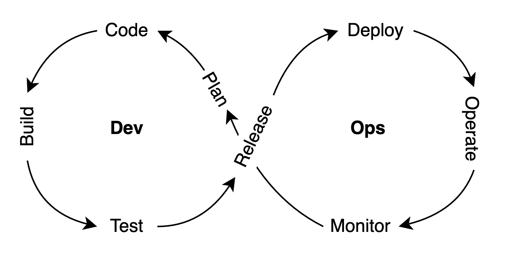
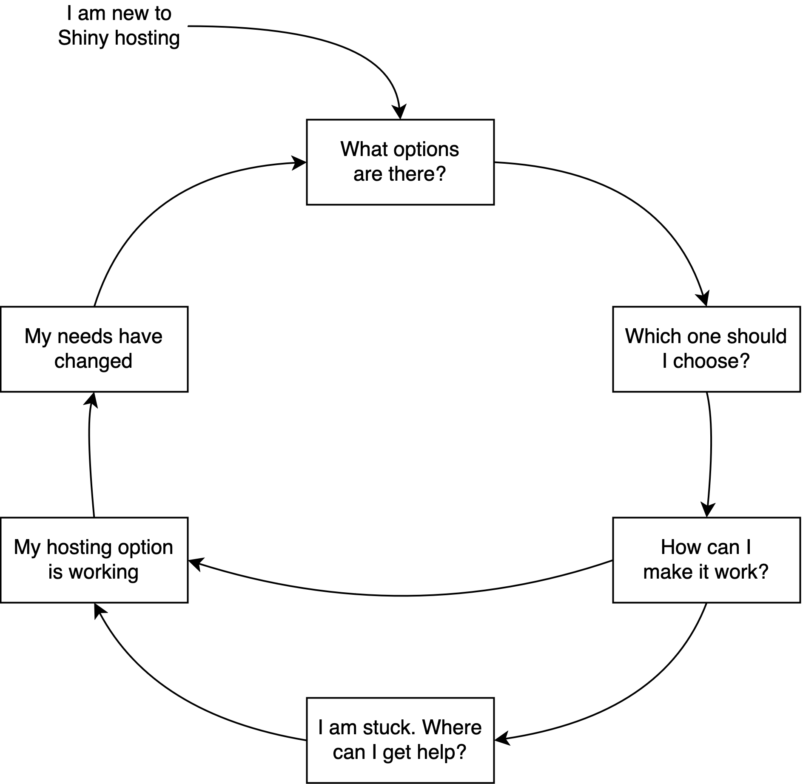

# (PART) Getting Started {-} 

# Background {#part1-background}

As a data professional working with R or Python, you might have a workflow 
that loads and transforms some data. You might have to explore and visualize 
this data, run some analyses and summarize your findings in reports.

You can send the report, or even the data and reproducible scripts to others.
In which case, they will have to be able to load and run you code.
Wouldn't it be easier to deliver your findings as interactive documents
or web applications?

In this chapter, you'll see what Shiny can offer when it comes to 
data-intensive web applications, and you will be familiar with the 
workflow of developing and operating such web applications.

## Data-intensive Apps {#part1-data-intensive-apps}

Data-intensive applications, or data apps\index{Data app} for short, are modern web applications 
that are centered around operations on data. This is different from traditional
websites that focus on providing information for a user. The primary goal of 
data apps is to make data-intensive operations approachable. For non-technical 
users, this might mean simplifying a sophisticated/complex task like processing 
a CSV data file to a PDF report. For technical users, it can offer an intuitive
understanding of complex relationships through interactive visualization, or it 
can help in institutionalizing the workflows that are incorporated in the apps.

The steps involved in simplifying data-intensive operations resemble
more traditional workflows used by analysts through the command line:

1.  Data import (files, databases)
2.  Data transformation (extract--transform--load; ETL)
3.  Summarizing the data (descriptive statistics)
4.  Visualization and exploratory data analysis (EDA)
5.  Repeating these steps for different subsets or slices of the data
    (interactive and reactive)
6.  Saving, storing, or exporting these results (files, databases)

Because these apps allow users to interact with the data, these apps
share some similarities with desktop software applications, like Excel.
But unlike desktop applications, data apps are accessed through the browser. 
This is advantageous as your application is able to run on any device that has 
a web browser like a desktop, tablet, or phone. 

There is also a distinction between our definition of data apps and
general-purpose analytics tools, like Microsoft PowerBI\index{PowerBI} or Tableau\index{Tableau}.
Such tools are primarily used for exploratory purposes, whereas data apps are 
custom built and capable of answering questions in a lot more depth.
This is possible because of all the analytics capabilities of R and Python 
can be called upon in real time. In other words, data apps can be 
exploratory and explanatory at the same time.

## Enter Shiny {#part1-enter-shiny}

If your analytics workflow is built using R or Python,
Shiny is the easiest way to create data science related web applications.
Shiny can also power dynamic documents. As advertized by the `shiny` R
package description [@R-shiny]:

> [Shiny] Makes it incredibly easy to build **interactive** web applications with R. 
> Automatic "**reactive**" binding between inputs and outputs and extensive 
> prebuilt widgets make it possible to build beautiful, **responsive**, and 
> powerful applications with minimal effort. 

In other words, you can turn your data and scripts into a web application
with limited web development skills. Shiny lets you to create a web app without 
knowing HTML\index{HTML}, JavaScript\index{JavaScript} and CSS\index{CSS}. 
But more importantly, it will also let you 
include **reactivity**, so your users can dynamically explore the results.

**Reactivity**\index{Reactivity} is the most important and distinctive feature of Shiny, compared
to similar web application frameworks, like [Streamlit](https://shiny.posit.co/py/docs/comp-streamlit.html)\index{Streamlit},
know mostly in Python. Reactivity is responsible for re-executing parts of the
code when things change as the result of users interacting with the app.
This is possible through reactive bindings between inputs and outputs.

The apps are also **interactive**\index{Interactivity}, which is different from being reactive in
the sense that during interactive behavior, the state of the application
stays the same on the backend, changes are only rendered on the client side
(i.e. in your browser). Think of popups, hover labels, transitions, and 
animations. These behaviors are usually powered by the front-end JavaScript code.

The third feature mentioned in the Shiny R package description is 
**responsiveness**\index{Responsive style system}. It refers to the styling of the rendered web application.
Again, client-side JavaScript and CSS code used by the Shiny user interface
is responsible for the app responding to various device sizes (desktop, tablet, 
phone), or viewports (resizing the window). Size responsive systems allow
the web page to respond to changes according to well thought-out rules
without the interface elements falling apart.

## Application Development {#part1-application-development}

Application development begins with an idea of what you would like your app to do. 
In a first iteration, you will have a proof-of-concept version of
the app that will likely have bugs and need more refinement. It might take 
several iterations of fixing bugs and incorporating
feedback from the users until the data app reaches its final form.
Even after that, you might have to update the data behind the app,
incorporate latest technologies, and provide security updates for the users.
You might not make fundamental changes to the app any more, but you are
still releasing new versions from time to time. 

This also means that you might want to test your changes before releasing 
the new version to your users. App development is usually based on 
accumulating small changes, continuously testing these changes, and 
releasing these changes to the users at a pre-determined cadence, 
depending on the criticality of the changes made to the app. You might 
not wait too long with a security update. However, new features
might get released monthly or yearly.

If you are using Shiny, you are participating in application **development**\index{App development}. 
Shiny is a web application framework that can help with the application 
development process. As a framework, it abstracts most of the complicated code 
needed for user interfaces, leaving you more time to focus on developing data 
features for your data app. Shiny is integral in simplifying the application 
development process for data-intensive apps.

## Application Hosting {#part1-application-hosting}

Once you've developed your Shiny application, you might be wondering how you can 
share the application to your colleagues or a wider audience. This is where the 
concept of application hosting\index{App hosting} comes in.

Hosting an app includes **operations** required for successfully and securely running the
app online, so that the users of the app get access to it without interruption.
It starts with deploying\index{Deployment} the application. What deployment means, is that
a person or an automated process moves some files from one computer to
another and refreshes the hosting server to display the new version of the app.

You might want to monitor\index{Monitoring} the usage of the app, i.e. how many users are
active, when and for how long they are using the app. You should also
monitor resource usage on the hosting server, for example CPU, memory,
and disk space. This kind of visibility into the system and the ability to 
retrieve system and application level logs will be critical in case
something goes wrong.

All these require some up-front investment in learning about and setting
up the systems that you will host you app with. After the resources spent on 
app development and the initial setup, operating costs will be
determined by the kind of setup and hosting that is required for delivering
the value to your users. The user experience also largely depends
on the performance of the servers that the apps are running on, because with 
Shiny most of the computations happen on the server-side -- i.e. on a remote
computer or in the cloud.

Other requirements that are less important include the client's machine 
specifications. Data apps are expected to run on desktops, laptops, tablets, 
and phones via a web browser. This is good news for app developers because data 
apps can be written in different programming languages and still can result in a 
comparable user experience. One might prefer Python or R, others might use
JavaScript. The end result will be very similar: a data app running in
the browser.

This book will help you gain a better understanding of how to host your Shiny 
applications walking you through different solutions that can best fit your 
requirements.

## The DevOps Cycle {#part1-devops-cycle}

DevOps is an important part of application development and hosting.
DevOps\index{DevOps} is a set of practices and tools
that integrates and in most cases automates the work of software development 
(Dev) and information technology (IT) operations (Ops). 

The **Dev** side is concerned with building a better app, while the 
**Ops** side is concerned with providing the best infrastructure to run the app on.
DevOps therefore refers to the collaboration culture between the people on 
both sides to make this process as smooth as possible through the use of 
monitoring and logging to identify and quickly resolve issues.
Figure \@ref(fig:part1-devops-cycle) shows the of DevOps cycle 
as it is often visualized, capturing the development and operations that we 
described in the previous subsections.

```{r part1-devops-cycle, eval=TRUE, echo=FALSE,out.width="100%", fig.pos = "bt", fig.cap="The DevOps cycle."}
if (is_latex_output()) {
    include_graphics("images/01/devops-cycle.pdf")
} else {
    
}
```

DevOps is also often associated with Continuous Integration and Continuous 
Deployment (CI/CD)\index{CI/CD}. CI/CD practices ensure the reliable delivery of frequent 
code changes. It emphasizes the use of automation to reduce human error.
You can view DevOps and CI/CD as two sides of the same coin. CI/CD is
pro-active, and tries to eliminate sources of errors through automation.
DevOps is a broader framework that codifies reactive practices when we
notice deviations from the plan.

Figure \@ref(fig:part1-devops-cycle) might suggest that DevOps is a never
ending cycle, and that changes can only originate from within the cycle.
All of those steps are under the control of the development and operations 
teams. But in reality, we can imagine many factors that can perturb
the ideal system from the outside. These would be factors that we cannot
or do not want to control. This is when things do not go according to plan.

For example, the system being hacked is never a pleasant experience.
Paying ransom, or highjacked servers sending spam emails or mining Bitcoin
is nobody's idea of having fun. Even the biggest cloud providers
can experience outages. These are all events that we can prepare for, but 
cannot control.

Other events throwing the DevOps cycle off the plan might be more benign.
Having too many users is often considered a good kind of problem. But
unexpected surges in usage might lead to unresponsive servers.
Adequate monitoring and alerting can prevent these unfortunate events from happening.
But at some point, the team might be faced with a decision.
How can we support more users? How can we improve user experience by
reducing loading time of the apps?

Adapting to changing needs and circumstances often leads to changes in the
way how the application is hosted. Changes can be incremental, like you
need more CPU or memory for the server. Or it can be more drastic, for example
moving from a hosting platform to self hosting on your own cloud server.

The DevOps cycle illustrates how the development and deployment of an application 
is iterative. Our book presents the hosting of Shiny applications in a similar 
fashion that we coin as the **hosting cycle** described in the next section.

## The Hosting Cycle {#part1-hosting-cycle}

The hosting cycle\index{Hosting cycle} is inspired by the DevOps cycle. It is 
meant to illustrate how the hosting of your Shiny application might take many 
iterations. Let's give an example. You have a Shiny app that you'd like to deploy.
You have read the documentation on the Shiny website and now you are thinking:
_Posit Connect is pricy, Shiny Server has no licensing fee, and both require self 
hosting on my own server or in the cloud. I don't know how to do that.
So I will go with [Shinyapps](https://www.shinyapps.io/). 
It is free to start with, I can deploy my
app with a click of a button from my RStudio Desktop._

Shinyapps\index{Shinyapps} definitely seems like the best option when starting out. 
It is free for the first five apps (with limited hours of app usage).
You host your app in a cloud platform, i.e. on someone else's server, 
that is fully managed. This means less headache for you.
You sign up to Shinyapps, you click the deploy button in RStudio Desktop, 
and a few of minutes later your app opens up in the browser.

Let's take a look at Figure \@ref(fig:part1-hosting-cycle) that illustrates the 
cycle of evaluating the Shiny hosting options from time to time. 
In our example above, we assumed that you are new to Shiny hosting.
You did some research, you made your choice based on some criteria,
e.g. pricing (free) and operational complexity (managed hosting with push 
button publishing).

Now you are at a stage where the option that you picked is working just fine.
This could be the end of the story for hosting your Shiny apps. But more often 
than not, questions will pop into your head as time goes by.

- _I have many active users and I am running out of free app hours on Shinyapps._
- _I want to host more than >5 apps._
- _I want my custom domain with HTTPS._
- _I need better performance and more memory._
- _I need specialized software libraries installed._
- _I need fine grained access control to my apps._

Should you upgrade your Shinyapps subscription? Should you set up your own 
server and try Shiny Server? Should you convince your boss to foot the bill 
and buy Posit Connect for your team? There could also be other options out there.

This is where the contents of this book will help you make a decision. Your 
answer might depend on many factors, or your needs might evolve over time. 
Having an understanding of what it takes to go with certain hosting options
will provide the foundation for that.

```{r part1-hosting-cycle, eval=TRUE, echo=FALSE, fig.pos = "bt", fig.cap="Shiny hosting cycle."}
if (is_latex_output()) {
    include_graphics("images/01/hosting-cycle.pdf")
} else {
    
}
```

Reading this book and trying some of the examples yourself will help you to
build confidence when it comes to evaluating you Shiny hosting needs and
options the next time you arrive to a crossroad.

## Summary

We presented a very generic outline for how the need for a data-intensive
application might arise, and the reasons why Shiny might be the right tool 
for that. You might have your own reasons for picking Shiny and you
might also have your unique circumstances and needs. But the DevOps
principles will likely apply to you too when developing your app.
And the hosting related considerations and options listed in the 
"hosting cycle" section will also apply to you. That is why we think
that by reading this book, you will be able to make an informed decision
regarding your next steps around hosting your Shiny apps.

In the next chapter, we will review important concepts that you might already
be familiar with or at least heard about those concepts. It is very important
to have a working knowledge of these concepts because as you browse the web
or read more advanced materials, you will run into these words without much explanation.
Shiny simplifies web technology for data professionals, but those web technologies
sit under the hood of Shiny's abstraction layer. Hosting directly interfaces
with these fundamentals, so understanding those concepts will help you a lot.
