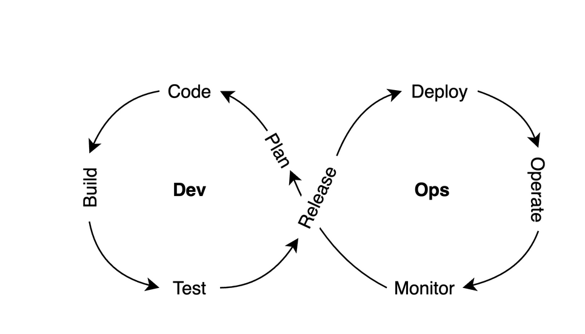
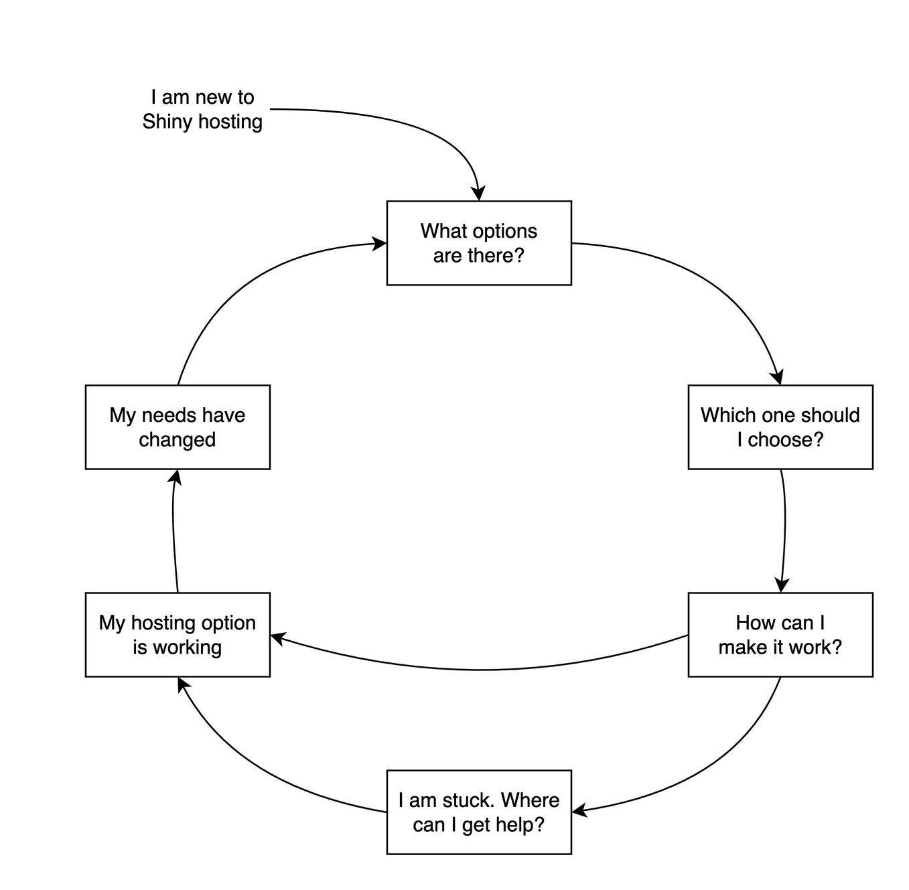

# (PART) Getting Started {-} 

# Background {#part1-background}

::: {.noteblock data-latex=""}
This chapter introduces the concept of data applications and presents Shiny 
as a powerful framework for their development. We delve into the concept 
of application development and hosting, exploring how both concepts fit 
within the development operations (DevOps) cycle. 
Furthermore, we introduce the concept of a hosting cycle, inspired by the DevOps cycle, 
to illustrate the iterative nature of hosting your Shiny application.
:::

As a data professional working with R or Python, you likely have a workflow that 
involves loading and transforming data, exploring and visualizing it, running analyses, 
and summarizing findings in reports. 

You can send these reports, or even the data and reproducible code to others.
However, the data sent might be large, the code might be confidential, or the
recipients of the code and data might not be technically inclined. Furthermore,
changes to code might be continuously made, requiring you to send constant
updates of the code.
Which leads to the question: wouldn't it be easier to deliver your findings as interactive documents
or web applications?

In this chapter, you will discover what Shiny can offer when it comes to 
data-intensive web applications which avoid the pitfalls of sending code and data.
You will also become familiar with the workflow of developing and operating such web applications.

<!--
REVIEW:
- In the opening paragraphs, the case for why you would use shiny is fairly weak and poorly explained. 
  It should explain a little more clearly *why* sending code to people is not always a good idea (eg. they 
  might not be programmers and might be scared of code; it might be difficult to find a way to send them large 
  datasets; the code itself might be confidential; you might code that changes often and you don't want to 
  continuously send them new code)
-->

## Data-intensive Apps {#part1-data-intensive-apps}

Data-intensive applications, or data apps\index{Data app} for short, are modern web applications 
that are centered around operations on data. This is different from traditional
websites that focus on providing information for a user. The primary goal of 
data apps is to make data-intensive operations approachable. For non-technical 
users, this might mean simplifying a sophisticated/complex task like processing 
a CSV data file to a PDF report. For technical users, it can offer an intuitive
understanding of complex relationships through interactive visualization, or it 
can help in institutionalizing the workflows that are incorporated in the apps.

The steps involved in simplifying data-intensive operations resemble
more traditional workflows used by analysts through the command line:

1.  Data import (files, databases)
2.  Data transformation (extract--transform--load; ETL)
3.  Summarizing the data (descriptive statistics)
4.  Visualization and exploratory data analysis (EDA)
5.  Repeating these steps for different subsets or slices of the data
    (interactive and reactive)
6.  Saving, storing, or exporting these results (files, databases)

Because these apps allow users to interact with the data, these apps
share some similarities with desktop software applications, like Excel.
But unlike desktop applications, data apps are accessed through the browser. 
This is advantageous as your application is able to run on any device that has 
a web browser like a desktop, tablet, or phone. 

There is also a distinction between our definition of data apps and
general-purpose analytics tools, like Microsoft PowerBI\index{PowerBI} or Tableau\index{Tableau}.
Such tools are primarily used for exploratory purposes, whereas data apps are 
custom built and capable of answering questions in a lot more depth.
This is possible because of the analytics capabilities of R and Python libraries that 
can be called upon in real time. In other words, data apps can be 
exploratory and explanatory at the same time.

Building data apps from the ground up can be time consuming.
Especially when you would like to integrate interactivity into your application.
Frameworks such as Shiny enable the rapid development of interactive
data apps by abstracting some of the code needed to implement interactive
functionality.

<!--
REVIEW:
- It could be useful to mention what other types of apps are, to understand how data-intensive apps are different and what makes them unique
- It feels like there is a lack of flow between the first few sub-chapters, they don't smoothly transition from one to the next. For example, moving from "Data-intensive Apps" to "Enter Shiny" to "Application Development" feels very abrupt.
-->

## Enter Shiny {#part1-enter-shiny}

If your analytics workflow is built using R or Python,
Shiny is the easiest way to create data science related web applications.
Shiny can also power dynamic documents. As advertised by the `shiny` R
package description [@R-shiny]:

> [Shiny] Makes it incredibly easy to build **interactive** web applications with R. 
> Automatic "**reactive**" binding between inputs and outputs and extensive 
> prebuilt widgets make it possible to build beautiful, **responsive**, and 
> powerful applications with minimal effort. 

In other words, you can turn your data and scripts into a web application
with limited web development skills. Shiny lets you to create a web app without 
knowing HTML\index{HTML}, JavaScript\index{JavaScript} and CSS\index{CSS}.
All that is necessary is some familiarity with R or Python coding. 
But more importantly, it will also let you 
include **reactivity** and **interactivity**, so your users can dynamically explore the results
by changing parameters through a user interface.

**Reactivity**\index{Reactivity} is the defining feature of Shiny, setting it apart
from similar web application frameworks, like [Streamlit](https://shiny.posit.co/py/docs/comp-streamlit.html)\index{Streamlit},
which is primarily used in Python. Reactivity is responsible for re-executing parts of the
code when things change as the result of users interacting with the app.
This is possible through reactive bindings between inputs and outputs. This means
that only the necessary parts of code are re-executed to update the user interface,
making Shiny more efficient than applications that re-run the entire code
to update a user interface.

The apps are also **interactive**\index{Interactivity}, meaning that users can actively engage 
with the page by clicking, typing into inputs, and triggering various actions.
Unlike reactivity, where changes are driven by updates in the backend running R or Python code, 
interactivity focuses on user-driven actions and changes on the client side (i.e. in your browser).
Think of popups, hover labels, transitions, and animations. These behaviors are usually powered by 
the front-end JavaScript code.

The third feature mentioned in the Shiny R package description is 
**responsiveness**\index{Responsive style system}. It refers to the styling of the rendered web application.
Again, client-side JavaScript and CSS code used by the Shiny user interface
is responsible for the app responding to various device sizes (desktop, tablet, 
phone), or viewports (resizing the window). Size responsive systems allow
the web page to respond to changes according to well thought-out rules
without the interface elements falling apart.

Shiny for R and Python offers a new paradigm for developing interactive
data intensive apps by providing a framework that includes **reactivity** for efficiency, 
**interactivity** and **responsiveness** to engage end users.  In Python, a comparable option for 
building reactive web apps is [Dash](https://dash.plotly.com/)\index{Dash} and 
[Streamlit](https://streamlit.io/)\index{Streamlit}. However, no similar alternatives exist for R.

<!--
REVIEW:
- The advantage of reactivity is poorly explained. Saying it "is responsible for re-executing parts of the code when things change" is technically true, but not a useful description. Something along the lines of "responsible for automatically updating all the outputs whenever the user makes any changes to the app" might be more clear. Many people who have experience writing shiny apps still don't actually understand what reactivity is, so it's worth explaining.
- The explanation of "interactive" is incorrect in my opinion. The book explains it in terms of things changing on the client side but not on the server side. I don't agree with that definition, to me "interactive" means that the user is able to *interact* with the page by clicking and typing into inputs on the page.
- Overall, this section should strive to make a point of why Shiny is useful and its advantages over other technologies, but it's extremely short and surface-level. It could benefit from going a little deeper into how/why shiny is better than other frameworks.
- The text at the header of the page, in the top-left corner, looks like it was written manually and does not automatically reflect the current page. In page 19 of the PDF, the header says this page is "1.4 Application Development", but that is actually section 1.3
-->

## Application Development {#part1-application-development}

Application development begins with an idea of what you would like your app to do. 
In a first iteration, you will have a proof-of-concept version of
the app that will likely have bugs and need more refinement. It might take 
several iterations of fixing bugs and incorporating
feedback from the users until the data app reaches its final form.
Even after that, you might have to update the data behind the app,
integrate the latest technologies, and provide security updates for users.
While you may not make major changes to the app itself, you will release
new versions with minor updates from time to time. 

This also means that you might want to test your changes before releasing 
the new version to your users. App development is usually based on 
accumulating small changes, continuously testing these changes, and 
releasing these changes to the users at a predetermined cadence, 
depending on the criticality of the changes made to the app. You might 
not wait too long with a security update. However, new features
might get released monthly or yearly.

If you are using Shiny, you are participating in application **development**\index{App development}. 
Shiny is a web application framework helps with the application 
development process. As a framework, it abstracts most of the complicated code 
needed for user interfaces, leaving you more time to focus on developing data 
features for your data app. Shiny is integral in simplifying the application 
development process for data-intensive apps.

## Application Hosting {#part1-application-hosting}

Once you've developed your Shiny application, you might be wondering how you can 
share the application to your colleagues or a wider audience. This is where the 
concept of application hosting\index{App hosting} comes in.

Hosting an app includes **operations** required for successfully and securely running the
app online, so that the users of the app get access to it without interruption.
It starts with deploying\index{Deployment} the application. Deployment refers to the
process of transferring files from one system to a hosting server, which is then refreshed 
to display a new version of the app. This can be done manually by a person or automated process.

After deployment, you might want to monitor\index{Monitoring} app usage -- tracking metrics 
such as the number of active users, when users access the app, 
and how long users engage with the app. It's important to also
monitor resource usage on the hosting server, including CPU, memory,
and disk space. Having visibility into the system performance and application level logs 
will be critical in case something goes wrong.

All these requirements need some up-front investment in learning about and setting
up the systems that you will host your app with. After the investment spent on 
app development and setup, operating costs will be
determined by the kind of setup and hosting that is required for delivering
the value to your users. Keeping in mind that the user experience is significantly influenced by
the performance of the servers hosting the app, as computations with Shiny happen server-side -- i.e. on a remote
computer independent of a client's local device.

Other requirements that are less important include the client's machine 
specifications. Data apps are expected to run on desktops, laptops, tablets, 
and phones via a web browser. This is good news for app developers because data 
apps can be written in different programming languages and still can result in a 
comparable user experience. One might prefer Python or R, others might use
JavaScript. The end result will be very similar: a data app running in
the browser.

This book will help you gain a better understanding of how to host your Shiny 
applications walking you through different solutions that can best fit your 
requirements.

## The DevOps Cycle {#part1-devops-cycle}

DevOps is an important part of application development and hosting.
DevOps\index{DevOps} is a set of practices and tools
that integrates and in most cases automates the work of software development 
(Dev) and information technology (IT) operations (Ops). 

The **Dev** side is concerned with building a better app, while the 
**Ops** side is concerned with providing the best infrastructure to run the app on.
DevOps therefore refers to the collaboration culture between the people on 
both sides to make this process as smooth as possible through the use of 
monitoring and logging to identify and quickly resolve issues.
Figure \@ref(fig:devops-cycle) shows the of DevOps cycle 
as it is often visualized, capturing the development and operations that we 
described in the previous subsections.

```{r devops-cycle, eval=TRUE, echo=FALSE,out.width="100%", fig.pos = "bt", fig.cap="The DevOps cycle."}
if (is_latex_output()) {
    include_graphics("images/devops-cycle/devops-cycle.pdf")
} else {
    
}
```

DevOps is also often associated with Continuous Integration and Continuous 
Deployment (CI/CD)\index{CI/CD}. CI/CD practices ensure the reliable delivery of frequent 
code changes. It emphasizes the use of automation to reduce human error.
You can view DevOps and CI/CD as two sides of the same coin. CI/CD is
pro-active, and tries to eliminate sources of errors through automation.
DevOps is a broader framework that codifies reactive practices when we
notice deviations from the plan.

Figure \@ref(fig:devops-cycle) might suggest that DevOps is a never
ending cycle, and that changes can only originate from within the cycle.
All of those steps are under the control of the development and operations 
teams. But in reality, we can imagine many factors that can perturb
the ideal system from the outside. These would be factors that we cannot
or do not want to control. This is when things do not go according to plan.

For example, being hacked is never a pleasant experience. Whether it's paying a ransom to 
access your data, dealing with hijacked servers sending spam emails, or unwanted Bitcoin mining,
none of it is anyone's idea of fun. While you may not be hacked, cloud providers
hosting your application can experience outages. These are all events that we can prepare for, but 
remain beyond control.

Other events throwing the DevOps cycle off the plan might be more benign.
Having too many users is often considered a good kind of problem. But
unexpected surges in usage might lead to unresponsive servers.
Adequate monitoring and alerting can prevent these unfortunate events from happening.
But at some point, the team might be faced with a decision.
How can we support more users? How can we improve user experience by
reducing loading time of the apps?

Adapting to changing needs and circumstances often leads to changes in the
way how the application is hosted. Changes can be incremental, like
needing more CPU or memory for the server. Or it can be more drastic, for example,
moving from a hosting platform to self hosting on your own cloud server.

The DevOps cycle illustrates how the development and deployment of an application 
is iterative. Our book presents the hosting of Shiny applications in a similar 
fashion that we coin as the **hosting cycle** described in the next section.

<!--
REVIEW:
- This section feels too high-level and doesn't adequately explain what devops is. Many readers of this book would not be familiar with devops, and it's a very central topic of the book, so it should be given proper background and more examples of what common devops tasks are. Someone who is not familiar with devops will not have a clearer understanding after reading this chapter.
-->

## The Hosting Cycle {#part1-hosting-cycle}

The hosting cycle\index{Hosting cycle} is inspired by the DevOps cycle. It is 
meant to illustrate how the hosting of your Shiny application might take many 
iterations. Let's give an example. You have a Shiny app that you'd like to deploy.
You have read the documentation on the Shiny website and now you are thinking:

> Posit Connect is pricy, Shiny Server has no licensing fee, and both require self 
> hosting on my own server or in the cloud. I don't know how to do that.
> So I will go with [shinyapps.io](https://www.shinyapps.io/). 
> It is free to start with, I can deploy my
> app with a click of a button from my RStudio Desktop.

shinyapps.io\index{shinyapps.io} definitely seems like the best option when starting out. 
It is free for the first five apps (with limited hours of app usage).
You host your app in a cloud platform, i.e. on someone else's server, 
that is fully managed. This means less headache for you.
You sign up to shinyapps.io, you click the deploy button in RStudio Desktop, 
and a few minutes later your app opens up in the browser.

Let's take a look at Figure \@ref(fig:hosting-cycle) that illustrates the 
cycle of evaluating the Shiny hosting options from time to time. 
In our example above, we assumed that you are new to Shiny hosting.
You did some research, you made your choice based on some criteria,
e.g. pricing (free) and operational complexity (managed hosting with push 
button publishing).

Now you are at a stage where the option that you picked is working just fine.
This could be the end of the story for hosting your Shiny apps. But more often 
than not, questions will pop into your head as time goes by.

- _I have many active users and I am running out of free app hours on shinyapps.io._
- _I want to host more than 5 apps._
- _I want my custom domain with HTTPS._
- _I need better performance and more memory._
- _I need specialized software libraries installed._
- _I need fine grained access control to my apps._

Should you upgrade your shinyapps.io subscription? Should you set up your own 
server and try Shiny Server? Should you convince your boss to foot the bill 
and buy Posit Connect for your team? There could also be other options out there.

This is where the contents of this book will help you make a decision. Your 
answer might depend on many factors, or your needs might evolve over time. 
Having an understanding of what it takes to go with certain hosting options
will provide the foundation for that.

```{r hosting-cycle, eval=TRUE, echo=FALSE, fig.pos = "bt", fig.cap="Shiny hosting cycle."}
if (is_latex_output()) {
    include_graphics("images/hosting-cycle/hosting-cycle.pdf")
} else {
    
}
```

Reading this book and trying some of the examples yourself will help you to
build confidence when it comes to evaluating your Shiny hosting needs and
options the next time you arrive at a crossroad.

<!--
REVIEW:
- Using the term "Shinyapps" to refer to "shinyapps.io" is wrong. In all the documentation, the 
  service is referred to as "shinyapps.io", not as "Shinyapps"
-->

## Summary

We presented a very broad overview on how the need for a data-intensive
application might arise, and why Shiny might be the right tool 
for the job. Of course, you might have your own reasons for picking Shiny, 
along unique circumstances and needs. However, DevOps
principles will likely still apply when developing your own application,
and the hosting related considerations listed in Section \@ref(part1-hosting-cycle) 
will still be relevant to you too. Our goal with this book is to equip you 
with the knowledge to make informed decisions about hosting your Shiny applications.

In the next chapter, we will review important concepts that you might already
be familiar with or at least heard about those concepts. It is very important
to have a working knowledge of these concepts because as you browse the web
or read more advanced materials, you will run into these words without much explanation.
Shiny simplifies web technology for data professionals, but those web technologies
sit under the hood of Shiny's abstraction layer. Hosting directly interfaces
with these fundamentals, so understanding those concepts will help you a lot.
