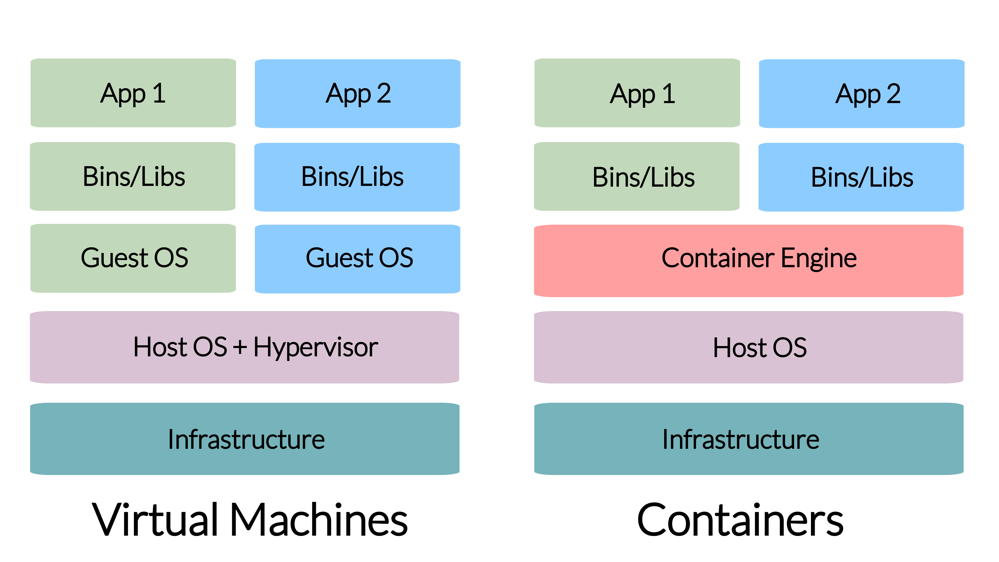

# Hosting Concepts

To better understand this book, you will need to first gain a general understanding about how web applications are hosted. This includes: domains and networking, website technologies, servers, and hosting environments.

Imagine accessing a Shiny application on Internet. At a high level, you visit the application by clicking a link or typing a URL in browser. By visiting the application, the browser performs operations related to domains and networking to serve you the application. The application itself is run in the browser with website technologies. The actual data of the application is hosted on a server that has a hosting environment catered to the Shiny application.

Users accessing a Shiny application primarily remember only the website link, abstracting them from understanding the concepts needed for the application to run on the Internet. This chapter delves into how Shiny applications are hosted to, using accessing a Shiny application as a motivating example.\

By the end of this chapter, you should be able to grasp why an aplication mght not be loading, or why it is taking longer than you have anticipated for an application to load.

<!-- Should we start with an example? We have an app deployed. We click a link or type
in the URL and the app opens. A website, vs a shiny app.
Name server lookup, handshake, certificates, encription, text files coming and going.
Inbetween there might be a proxy, go to a container, host/container port, service
running inside. This can be the opening motivating example. This happens in the
initial 1 second. Then, let's dive in. This will also dictate the ordering of the
topics. -->

## Domains and Networking
To access a Shiny application, it begins with a URL like: <https://analythium.shinyapps.io/covid-19-alberta/>.
FIXME: Add better URL

There is a lot to unpack with this URL. First, there is the **protocol** which is the **https** part. Next is the **domain** which is the **analythium.shinyapps.io**. Finally, there is the **path** part which is **/covid-19-alberta/**.

* The **protocol** specifies how data will be transferred to you. If you use **https**, which is shorthand for "Hypertext Transfer Protocol Secure", it means that you will transfer data securely with encryption. If you use **http** (Hypertext Transfer Protocol), it means that data will transfer data without any encryption.

* The **domain** specifies where data will be transferred from. It is a reference to an IP address (Internet Protocol address) that identifies a computer (server) that is available on the Internet. The domain lets your computer know which computer to request data from.

* The **path** lets you specify what resource you want from the server.

Sometimes, you might see a URL like: <https://analythium.shinyapps.io:443/covid-19-alberta/> which is different from the previous URL we introduced (note the ":443"). This new part specifies a **port**.
FIXME: Add better URL

* The **port** specifies the connection point of a server. There are common ports for different protocols. For example, for "https" it is usually 443. For "http", it is usually 80.

The URL just specifies how a client connects to a server. The actual connection, requires networking between the client and server using TCP/IP (Transmission Control Protocol/Internet Protocol). TCP/IP is a suite of communication protocols to help computers connect with each other with forms a network of computers. 

In the case of the Shiny application, a client computer would **request** data from a server computer and the server sends a **response** with the requested data. This data contains all the necessary information to serve your application. These request/response operations happen everyday on the Internet to provide access to applications like your Bank portal or social media app.

<!--TCP/IP

- What is the Internet, networking <https://do4ds.com/chapters/sec2/2-6-networking.html>
- How do you navigate? URL (protocol, lts, port, path, file, anchor, params), IPv4, IPv6
- localhost, special port (22, 80 443)
- HTTP/HTTPS, TLS, certificates, certificate management <https://do4ds.com/chapters/sec2/2-8-ssl.html>
- websockets <https://medium.com/@pranshu1902/web-sockets-vs-http-a-comprehensive-comparison-with-real-world-examples-8c9ec584af8c>
- ?low ports vs admin access
- DNS, domains, A record CNAME <https://do4ds.com/chapters/sec2/2-7-dns.html>

To access a Shiny application, first you must specify a URL which contains a domain name. A domain name is recognizable string that references an IP address to locate a server.

The Internet is a network that facilitates the connections between your own machine and a server. -->

## Website Technologies
The data that comes from a server is provided in a raw format that needs to be interpreted by a client. In the case of a Shiny application, the data provided is meant to be interpreted by a web browser that serves a website. A website uses many technologies to interpret which commonly includes: HTML (HyperText Markup Language), CSS (Cascading Style Sheets), and JavaScript.

Shiny applications use HTML, CSS, and JavaScript to render a web application. The HTML contains textual information about a website. While the CSS provides styling for a website. The JavaScript enables interactivity for a website by communicating with the Shiny application backend.

The Shiny applciation backend runs on either R or Python and creates the data needed to render the application on a web browser.

## Servers
A server is a computer that runs indefinitely, and is available to serve content to anybody that requests it. Servers can be costly to run and are often shared with other users. To alleviate any concerns of security and resource sharing a server can be shared through a virtual layer.

By using a virtual layer, a virtual private server can be created. This is where a server's resources can be allocated to be used exclusively by a user.

Servers can be offered as either as a IaaS (infrastructure as a service) or PaaS (platform as a service). IaaS provides access to a server without any support. It requires configuration and some server administration knowledge. While PaaS usually abstract direct access to the server by offering tools to help host and manage your application on a platform.

<!-- - What is a server? <https://cloud.google.com/learn/what-is-a-virtual-private-server>
- SaaS/PaaS/IaaS <https://do4ds.com/chapters/sec2/2-1-cloud.html> -->

## Hosting Environments
On servers that are meant to serve web applications, environments are specifically setup to help run web applications.
A lot of consideration of security, compatibility, and optimization goes into hosting environments to ensure that a web application runs as intended.

In terms of security, you must consider firewalls, how data is transmitted, and who can access your app. These considerations may not be known to the end user of your Shiny application, but it is important for you to be aware of when hosting a Shiny application.

In terms of compatibility, virtualization and containers can help make your application run on any platform. Otherwise, you might spend a lot of time installing the right software to run your Shiny application. This also helps make your application scalable by being able to easily deploy on multiple instances of a platform.

In terms of optimization, you must consider how to route your traffic to ensure that your app runs smoothly. Many of the times, there might be high demand for your application. This is where multiple instances of your Shiny application might come in handy, where you are able to distribute the requests for your application.

<!--
- Firewalls, security groups
- Proxies
- VMs, micro VMs, containers, container runtimes
- Containerization (Docker will be in other Part)
- Load balancing (round robin, priority, sticky)
- RBAC -->

FIXME: We will leave pointers to:

- other chapters
- other books/websites

<!--## Container Runtimes

A container runtime is the software that allows containers to run on a computer. Some popular container runtimes include: containerd and Docker Engine.

In this chapter we will focus on using the Docker to get started with containers for your Shiny application. Docker includes all the necessary tools for containerizing an application. -->

## Summary

In this chapter, we have covered the basic concepts needed for understanding the subsequent sections. In short, we have explained at a high level what goes into hosting a Shiny application and how it is served over the Internet.

In the next chapters, you will learn more details about how hosting a Shiny application including more advanced concepts such as:

* Creating a virtual environment for your Shiny application with a container
* Where to host your Shiny Application in the Cloud
* Considerations for making your Shiny Application production ready

<!-- ### Networking (Firewalls)

To secure your server, you will want to control who can connect with the server using firewalls.

To understand firewalls, you will need to understand the concept of ports and IP addresses.

### Proxies and Tunneling

Once you have secured your server with a firewall, you must use proxies or tunneling to connect to your Shiny app via authorized ports.

### Environments (Development/Testing/Staging)

Environments can differ depending on the goal of your deployment.

Environment variables are used to control how a Shiny app should run.

configuration files

### Containers

Containers **bundle** their own software, libraries and configuration
files and are **isolated** from one another. Containers are the
**run-time** environments or **instances** defined by **container
images**.

Containerization help makes an application platform independent by creating virtual environments in a container. To run a specific application, you will need to develop an Image for that platform which is then published on a container registry. The developed Image can be pulled from the registry to run a virtualized container environment for the application. Docker is one of the most popular tools for creating and managing containers for Shiny apps.

### Docker Basics for Shiny Apps

Containers provide portability, consistency, and are used for packaging,
deploying, and running **cloud-native** data science applications.
[Docker](https://www.docker.com/) is the most
popular tool to deliver software in a virtualized container environment.
Docker is well supported in the open source community with Images created for [R](https://github.com/rocker-org/rocker) and [Python](https://hub.docker.com/_/python) environments.
Among the many use cases, Docker is most commonly used to deploy
**reproducible workflows** and to provide isolation for **Shiny apps**.
In this post, we review the basics of working with Docker to lay the
foundation for "dockerizing" data applications coming up in the next
post.

<figure class="kg-card kg-image-card kg-card-hascaption">

<figcaption>Docker architecture / © Analythium</figcaption>
</figure>

### Docker Engine

The Docker Engine is a client-server application that includes a
**server** (a long-running daemon process that listens to API requests,
`dockerd`), an **application programming interface**
([REST](https://en.wikipedia.org/wiki/Representational_state_transfer)
API, specifies the interface that programs can use to talk to the
daemon), and a **command-line interface** (CLI, the client-side,
`docker`).

The CLI uses the REST API to control or interact with the Docker daemon.
The daemon creates and manages **Docker objects**, such as **images**,
**containers**, etc.

### Docker registries

A Docker registry stores Docker **images**. [Docker
Hub](https://hub.docker.com/) is a public
registry and Docker is configured to look for images on Docker Hub by
default. There are many other registries, or users can have their own
private registry.

Container registries host container images that can be used for deployment.

Where does the Docker command line interface (CLI for short) pulls the
images from? The answer is on the last line of the output. `docker.io`
is the URL for a so called **Docker registry**. In this case, it refers
to the default registry, [Docker
Hub](https://hub.docker.com/), applied when
you don't specify a registry URL as part of the pull command.

Docker Hub is a service provided by Docker for finding and sharing
container images.

The registry URL is usually followed by the user or organization ID, the
[repository](https://docs.docker.com/docker-hub/repos/)
name, the image name and the tag:
`<registry>/<user>/<repository>/<image>:<tag>`.

In short, a [Docker
registry](https://docs.docker.com/registry/)
stores Docker **images**. This is where we push images to and pull
images from.

You might think that you only need a registry because you need to pull
your parent images (like Ubuntu, Alpine, `r-base` from the [Rocker
project](https://rocker-project.org/) etc.)
from somewhere. Then you can build your Docker images locally using a
Dockerfile, and run them. Why bother with a registry at all?

You can even use the `docker save` and `docker load` commands to save to
a compressed tar file:

    docker pull alpine:latest

    docker save -o alpine-latest.tar alpine:latest

    ls -sh alpine-latest.tar
    # 11368 alpine-latest.tar

Then take this tar file, copy it to another server and load it:

    docker load --input alpine-latest.tar

now imagine that you are managing more than two servers, or you want to
share the Docker image with others (to use it or to serve as a parent
image). The save/copy/load workflow becomes cumbersome.

In this case, using a registry might be a much better idea. Luckily,
there are many options to choose from, and you can even host your own
registry.

#### Log into a registry

When you work with private registries or private images, you need to log
in with the `docker login` command. For Docker Hub, just type
`docker login`. For  all other registries, type in the registry URL as
well, e.g. `docker login ghcr.io`.

The Docker CLI then will prompt you for your username and password (or
access token).

You can log in programmatically by providing your username and the
password through standard input:

    export CR_PAT=YOUR_TOKEN
    echo $CR_PAT | docker login ghcr.io -u USER --password-stdin

As an alternative, the password can be provided via a file, this
approach won't leave trace of your token in your history:

    cat ~/my_password.txt | docker login -u USER --password-stdin

Use one of these approaches to log into any public or private repository
for which you have credentials. The credentials will be [stored
locally](https://docs.docker.com/engine/reference/commandline/login/#privileged-user-requirement):
in `$HOME/.docker/config.json` on Linux or
`%USERPROFILE%/.docker/config.json` on Windows. After login, there is no
need to re-authenticate until you log out with `docker logout`.

Note that `docker login` requires users to use `sudo` or be `root` in
most cases.

It is always a good idea to use a token instead of your password. Tokens
can have limited scope (i.e. only for pulling images), and can be
revoked at any time without it impacting other areas of your life.

#### Commonly used registries

There are many registries out there besides Docker Hub. Here is a
non-exhaustive list of options.

[GitHub container
registry](https://docs.github.com/en/packages/working-with-a-github-packages-registry/working-with-the-container-registry)
(the `ghcr.io` URL from above) is available as part of GitHub Packages
for free and paid plans, even for private repositories under the free
plan. This registry requires authentication using your GitHub token.

An alternative to GitHub is
[GitLab](https://about.gitlab.com/)
(`registry.gitlab.com`), which has provided [registry
support](https://about.gitlab.com/blog/2016/05/23/gitlab-container-registry/)
for its free (public and private) repositories long before GitHub. The
docs are also much better in my opinion, and the whole experience is
tightly integrated with GitLab's CICD pipelines. This registry also
needs login with a token.

[Heroku comes with a Docker
registry](https://devcenter.heroku.com/articles/container-registry-and-runtime)
(`registry.heroku.com`) where the Docker-based deploys push the images
to.

Of course, every major cloud provider offers a Docker container registry
that is often integrated with their other offerings. Latency should be
minimal due to network proximity to the servers:

-   [Amazon Elastic Container Registry (Amazon
    ECR)](https://aws.amazon.com/ecr/)
-   [Azure Container
    Registry](https://azure.microsoft.com/en-us/services/container-registry/)
-   [Google Container
    Registry](https://cloud.google.com/container-registry)
-   [DigitalOcean Container
    Registry](https://www.digitalocean.com/products/container-registry)

Other common alternatives for container registries, Helm charts, etc.,
include:

-   [JFrog Container
    Registry](https://jfrog.com/container-registry/)
-   [Harbor](https://goharbor.io/)
-   [Scaleway](https://www.scaleway.com/en/container-registry/)

Although these services are called "container registry", but strictly
speaking they store container images.

### Docker images

An image is a **read-only template** with instructions for creating a
Docker **container**. An image can be based on another image with
additional customization on top of this so-called
[**base**](https://docs.docker.com/develop/develop-images/baseimages/)
or a **parent image**.

Many popular images already have installed the necessary libraries and tools for running your application. All you have to do is build on top of the image.

### Docker containers

A container is a **runnable instance** of an image. Users can create,
start, stop a container using the Docker API or CLI. It is also possible
to connect a container to networks or attach storage to it.

By default, a container is **isolated** from other containers and the
host machine. The degree of isolation can be controlled by the user and
depends on whether it is connected to networks, storage, other
containers, or the host machine.

### Dockerfile

Docker builds images by reading the **instructions** from a
`Dockerfile`. A `Dockerfile` is a text document that contains all the
commands to assemble an image using the `docker build` CLI command. You
will learn more about the `Dockerfile` as part of the worked Shiny
example later. 

### VMs vs Containers 

Virtual machines (VMs) virtualize environments at the hardware level while containers create virtualized environments at the software level. 

<figure class="kg-card kg-image-card kg-card-hascaption">

<figcaption>Virtual machines vs. containers / © Analythium</figcaption>
</figure> -->
  
