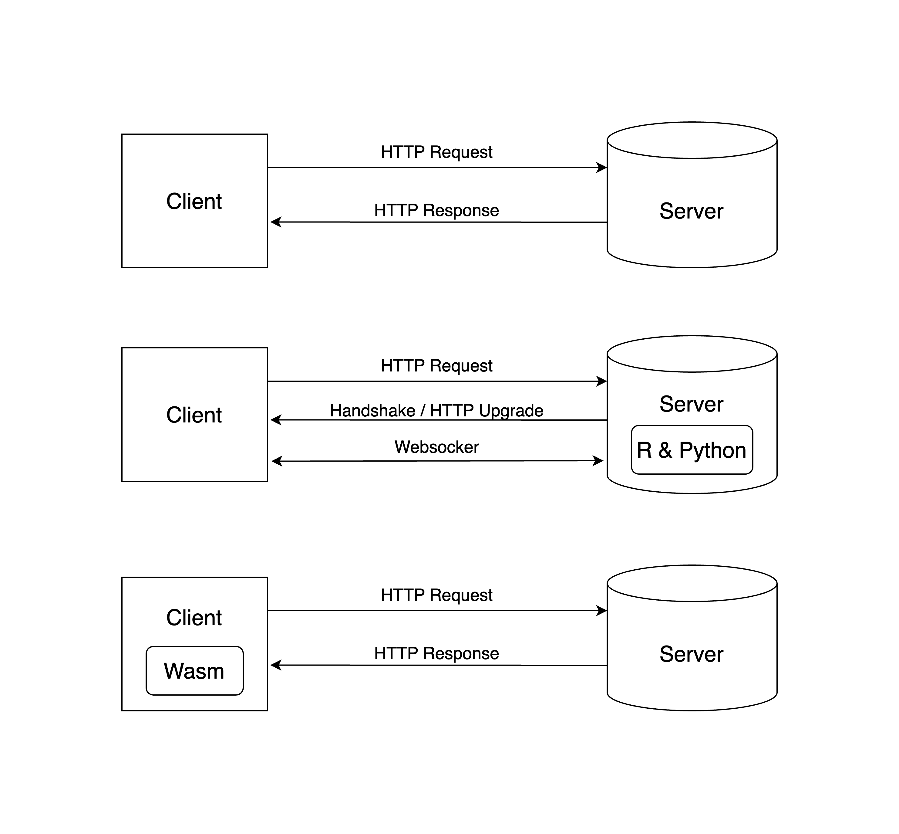
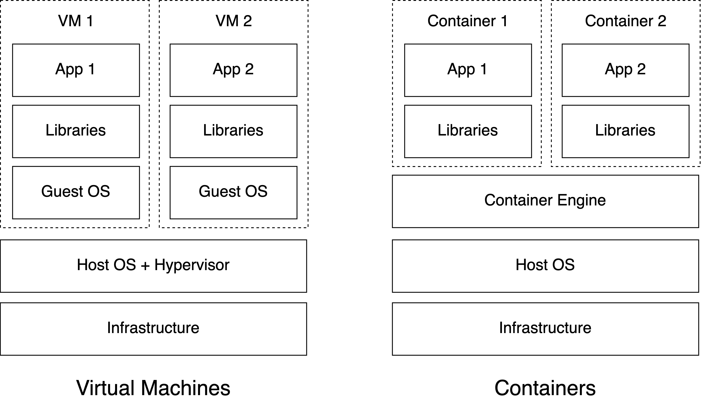

# Hosting Concepts {#part1-hosting-concepts}

To better understand this book, you will need to first gain a general 
understanding about how web applications are hosted. This includes: 
domains and networking, website technologies, servers, and hosting environments.

Imagine accessing a Shiny application on the Internet\index{Internet}. At a high level, you visit 
the application by clicking a link or typing a URL in the browser. By visiting the 
application, the browser performs operations related to domains and networking 
to serve you the application. The application itself is run in the browser with 
website technologies. The actual data of the application is hosted on a server 
that has a hosting environment catered to the Shiny application.

Users accessing a Shiny application primarily remember only the website link, 
abstracting them from understanding the concepts needed for the application to 
run on the Internet. This chapter delves into how Shiny applications are hosted, 
using accessing a Shiny application as a motivating example.

By the end of this chapter, you should be able to grasp why an application might 
not be loading, or why it is taking longer than you have anticipated for the 
application to load.

## Domains and Networking {#part1-domains-and-networking}

To access a Shiny application, it begins with a URL\index{URL}, or universal resource locator, like: 
<https://h10y.github.io/faithful/>.

There is a lot to unpack with this URL. First, there is the **protocol** which 
is the **https** part. The **protocol** specifies how data will be transferred to you. 
If you use **https**, which is shorthand for "Hypertext Transfer Protocol Secure", 
it means that you will transfer data securely with encryption. If you use 
**http** (Hypertext Transfer Protocol), it means that data will be transferred
without any encryption.

Next is the **domain name**\index{Domain name} which is the **h10y.github.io**
where **h10y** is the subdomain of **github.io** and **github** is the subdomain
of the top level domain (TLD) **io**.
The domain name specifies where data will be transferred from. It is a 
reference to an Internet Protocol (IP) address that identifies a 
computer (server) that is available on the Internet. The domain lets your 
computer know which computer to request data from. 

Finally, there is the **path** part which is **/faithful/**.
The path lets you specify what resource you want from the server.

Sometimes, you might see a URL like: 
<https://h10y.github.io:443/faithful/> which is different 
from the previous URL we introduced (note the ":443"). 
This new part specifies a **port**.
The **port**\index{Port} specifies the connection point of a server. There are common 
ports for different protocols. For example, for "https" it is usually 443. 
For "http", it is usually 80.

The URL just specifies how a client connects to a server. The actual connection, 
requires networking between the client and server using TCP/IP (Transmission 
Control Protocol/Internet Protocol). TCP/IP is a suite of communication protocols 
to help computers connect with each other with forms a network of computers. 

In the case of the Shiny application, a client computer (i.e. your laptop) would **request** data 
from a server computer and the server sends a **response** with the requested 
data. This data contains all the necessary information to serve your application. 
These request/response operations happen everyday on the Internet to provide 
access to applications like your Bank portal or social media app.

In this book, you'll see the version 4 of the Internet Protocol addresses (IPv4)
being used. IPv4 addresses can be recognized by a unique combination of numbers and periods, 
e.g. 192.177.17.4. Version (IPv6) addresses can be recognized by having sets of 
decimal and hexadecimal numbers separated by colons. 

There are also a few special-purpose IP addresses that you'll see mentioned in 
the book. The address 127.0.0.1, or the localhost, is a self-reference to the
current device. The 0.0.0.0 address is used as an unspecified address and the 
server will listen to any address on any interface.

## Website Technologies {#part1-web-technologies}

The data that comes from a server is provided in a raw format that needs to be 
interpreted by a client (Fig. \@ref(fig:part1-http-ws-wasm), top).
In the case of a Shiny application, the data provided 
is meant to be interpreted by a web browser that serves a website. A website uses 
many technologies to interpret which commonly includes: HTML (HyperText Markup 
Language)\index{HTML}, CSS (Cascading Style Sheets)\index{CSS}, and JavaScript\index{JavaScript}.

Shiny applications use HTML, CSS, and JavaScript to render a web application. 
The HTML contains textual information about a website. While the CSS provides 
styling for a website. The JavaScript enables interactivity for a website by 
communicating with the Shiny application backend.

The Shiny application backend runs on either R or Python and creates the data 
needed to render the application on a web browser.
A feature of Shiny is the use of websockets\index{Websockets} that enable the client computer
to establish a channel with the server for two-way communication.
This feature is critical in providing the reactivity that make Shiny so well
suited for data related applications (Fig. \@ref(fig:part1-http-ws-wasm), middle).

Computations on the client side are made possible by R or Python
libraries compiled into WebAssembly (Wasm)\index{WebAssembly}
(Fig. \@ref(fig:part1-http-ws-wasm), bottom). This is the technology used by
Shinylive applications that require only static hosting of HTML files and related
"assets", which is how we usually refer to the JavaScript, CSS, and other files
like images etc.

```{r part1-http-ws-wasm, eval=TRUE, echo=FALSE, out.width="100%", fig.pos = "bt", fig.cap="Web technologies from simple HTTP request/response (top), to Websocket connetions (middle), and WebAssempbly (Wasm) based applications (bottom)."}
if (is_latex_output()) {
    include_graphics("images/01/http-ws-wasm.pdf")
} else {
    
}
```

## Servers {#part1-servers}

A server is a computer that runs indefinitely, and is available to serve content 
to anybody that requests it. Servers can be costly to run and are often shared 
with other users. To alleviate any concerns of security and resource sharing a 
server can be shared through a virtual layer.

By using a virtual layer, a virtual private server can be created. This is where 
a server's resources can be allocated to be used exclusively by a user.

Servers can be offered as either as a IaaS (infrastructure as a service) or PaaS 
(platform as a service). IaaS provides access to a server without any support. 
It requires configuration and some server administration knowledge. While PaaS 
usually abstracts direct access to the server by offering tools to help host and 
manage your application on a platform.

Serving static files is much easier that serving dynamic applications.
Static files, as the name implies, will not change. Any modifications to the
data are only made on the client side in memory. In contrast with this,
dynamic applications require constant communication between the client and the 
server. As a result, hosting static files vs. dynamic apps will require
different setups on the server side and will have different resources to
effectively serve the users.

## Hosting Environments {#part1-hosting-environments}

On servers that are meant to serve web applications, environments are 
specifically setup to help run web applications.
A lot of consideration of security, compatibility, and optimization goes into 
hosting environments to ensure that a web application runs as intended.

In terms of security, you must consider firewalls, how data is transmitted, and 
who can access your app. These considerations may not be known to the end user 
of your Shiny application, but it is important for you to be aware of when 
hosting a Shiny application.

In terms of compatibility, virtualization and containers can help make your 
application run on any platform. Otherwise, you might spend a lot of time 
installing the right software to run your Shiny application. This also helps 
make your application scalable by being able to easily deploy on multiple 
instances of a platform.

In terms of optimization, you must consider how to route your traffic to ensure 
that your app runs smoothly. Many times, there might be high demand for 
your application. This is where multiple instances of your Shiny application 
might come in handy, where you are able to distribute the requests for your 
application.

You will see a considerable portion of this book devoted to containers and 
the description of container-based hosting options for Shiny apps.
Containers bundle their own software, libraries and configuration
files and are isolated from one another as shown in Figure \@ref(fig:part1-vm-vs-container)
that shows how hardware level virtualization (VMs) and containers relate 
to each other at a high level.

```{r part1-vm-vs-container, eval=TRUE, echo=FALSE, out.width="100%", fig.pos = "bt", fig.cap="Virtual machines (VMs) virtualize environments at the hardware level while containers create virtualized environments at the software level."}
if (is_latex_output()) {
    include_graphics("images/01/vm-vs-container.pdf")
} else {
    
}
```

FIXME: We will leave pointers to: other chapters/books/websites

## Summary

In this chapter, we have covered the basic concepts needed for understanding the 
subsequent sections. In short, we have explained at a high level what goes into 
hosting a Shiny application and how it is served over the Internet.

In the next chapters, you will learn more details about how hosting a Shiny 
application including more advanced concepts such as:

- Creating a virtual environment for your Shiny application with a container
- Where to host your Shiny Application in the Cloud
- Considerations for making your Shiny Application production ready
