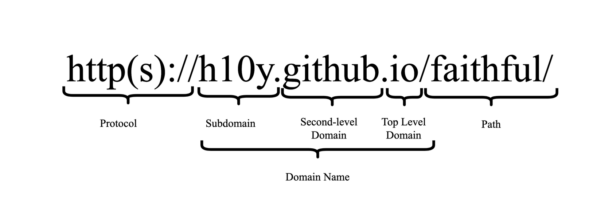
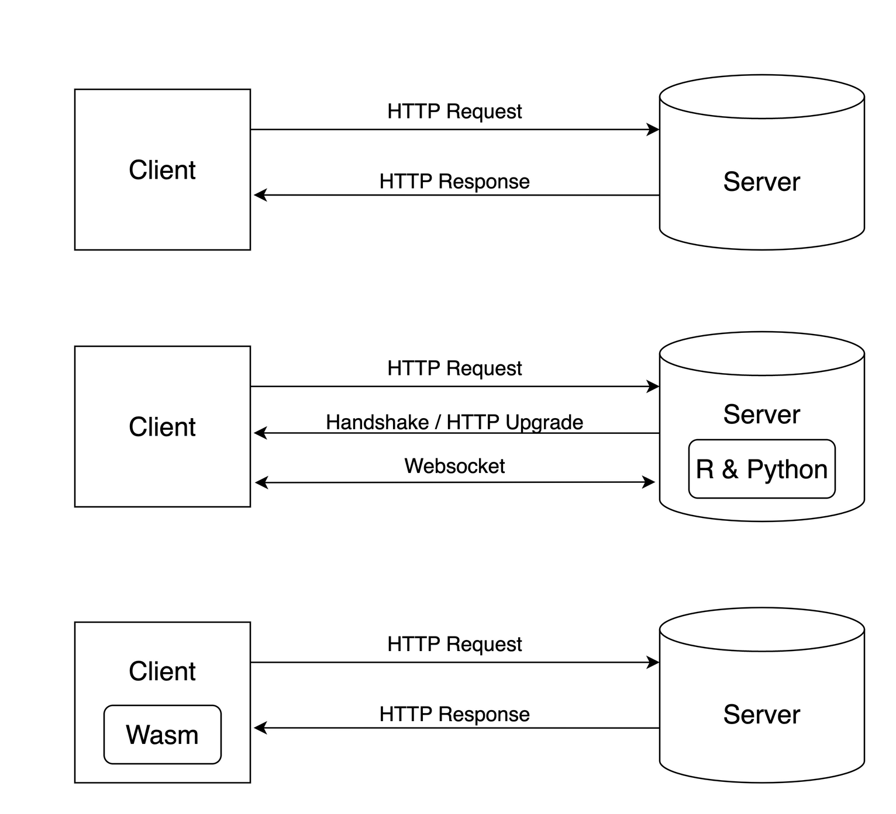
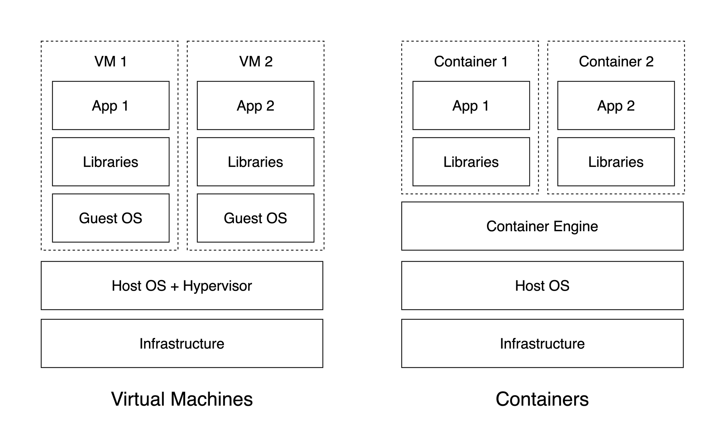

# Hosting Concepts {#part1-hosting-concepts}

::: {.noteblock data-latex=""}
To better understand this book, you will need to first gain a general 
understanding about how web applications are hosted. This includes: 
domains and networking, website technologies, servers, and hosting environments.
It is key to get a general grasp of these concepts as this is how
your Shiny application will be shared and made accessible to others.
:::

Imagine accessing a Shiny application on the Internet\index{Internet}. At a high level, you visit 
the application by clicking a link or typing a URL in the browser. By visiting the 
application, the browser performs operations related to domains and networking 
to serve you the application. The application itself is run in the browser with 
website technologies. The actual data of the application is hosted on a server 
that has a hosting environment catered to the Shiny application.

Users accessing a Shiny application primarily remember only the website link, 
abstracting them from understanding the concepts needed for the application to 
run on the Internet. This chapter delves into how Shiny applications are hosted, 
using accessing a Shiny application as a motivating example.

By the end of this chapter, you should be able to grasp why an application might 
not be loading, or why it is taking longer than you have anticipated for the 
application to load.

## Domains and Networking {#part1-domains-and-networking}

To access a Shiny application, it begins with a URL\index{URL}, or universal resource locator, like: 
<https://h10y.github.io/faithful/> as seen in Figure \@ref(fig:url-domain).

<!-- FIXME: Link to shiny app not static webpage -->

```{r url-domain, eval=TRUE, echo=FALSE,out.width="100%", fig.pos = "bt", fig.cap="Breakdown of URL."}
if (is_latex_output()) {
    include_graphics("images/hosting-concepts/domain.pdf")
} else {
    
}
```

There is a lot to unpack with this URL. First, there is the **protocol** which 
is the **https** part. The **protocol** specifies how data will be transferred to you. 
If you use **https**, which is shorthand for "Hypertext Transfer Protocol Secure", 
it means that you will transfer data securely with encryption. If you use 
**http** (Hypertext Transfer Protocol), it means that data will be transferred
without any encryption. Transferring data
with https is preferred as your web traffic is less likely to be intercepted and read
during transfers.

Next is the **domain name**\index{Domain name} which is the **h10y.github.io**
where **h10y** is the subdomain of **github.io** and **github** is the second-level domain
of the top level domain (TLD) **io**.
The domain name specifies where data will be transferred from. It is a 
reference to an Internet Protocol (IP) address that identifies a 
computer (server) that is available on the Internet. The domain lets your 
computer know which computer to request data from. 

To know which domain name is linked to which IP address, the DNS (domain name system)
is used. When you enter a URL into your browser, your browser makes a DNS query to
resolve the domain to a corresponding IP address, allowing your computer to establish
a connection to the appropriate server over the Internet. We talk more about DNS
in Section \@ref(part3-custom-domains).

Finally, there is the **path** part which is **/faithful/**.
The path lets you specify what resource you want from the server.

Sometimes, you might see a URL like: 
<https://h10y.github.io:443/faithful/> which is different 
from the previous URL we introduced (note the ":443"). 
This new part specifies a **port**.
The **port**\index{Port} specifies the connection point of a server. There are common 
ports for different protocols. For example, for "https" it is usually 443. 
For "http", it is usually 80.

The URL just specifies how a client connects to a server. The actual connection, 
requires networking between the client and server using TCP/IP (Transmission 
Control Protocol/Internet Protocol). TCP/IP is a suite of communication protocols 
to help computers connect with each other and forms a network of computers. 

In the case of the Shiny application, a client computer (e.g. your laptop) would **request** data 
from a server computer and the server sends a **response** with the requested 
data. This data contains all the necessary information to serve your application. 
These request/response operations happen everyday on the Internet to provide 
access to applications like your Bank portal or social media app.

In this book, you will see the version 4 of the Internet Protocol addresses (IPv4)
being used. IPv4 addresses can be recognized by a unique combination of numbers and periods, 
e.g. 192.168.0.1. Version (IPv6) addresses can be recognized by having sets of 
decimal and hexadecimal numbers separated by colons, e.g. 0000:0000:0000:0000:0000:ffff:c0a8:0001. 

There are also a few special-purpose IP addresses that you'll see mentioned in 
the book. The address 127.0.0.1, or the localhost, is a self-reference to the
current device. The 0.0.0.0 address is used as an unspecified address and the 
server will listen to any address on any interface.

<!--
REVIEW:
- First sentence says that accessing a shiny application requires going to a URL such as https://h10y.github.io/faithful/ , but that URL is itself not actually a shiny application. The example here should point to an actual shiny application.
- A figure that shows the different parts of a URL (protocol, domain, path, etc) would be very helpful
- When mentioning http and https as the two common protocols, there is no mention about why https is better. There should be some talk about why encryption is good.
- Show an example of what an IPv6 looks like
- This section is the perfect place to also touch on DNS and how it ties together with IP addresses and domain names. It's strange to not mention DNS here.
-->

## Website Technologies {#part1-web-technologies}

The data that comes from a server is provided in a raw format that needs to be 
interpreted by a client (Fig. \@ref(fig:http-vs-wasm), top). Data is transferred
with HTTP (Hypertext Transfer Protocol), creating a connection to the server
for each data request. 
In the case of a Shiny application, the data provided 
is meant to be interpreted by a web browser that serves a website. A website uses 
many technologies to interpret which commonly includes: HTML (HyperText Markup 
Language)\index{HTML}, CSS (Cascading Style Sheets)\index{CSS}, and JavaScript\index{JavaScript}.

Shiny applications use HTML, CSS, and JavaScript to render a web application. 
The HTML contains textual information about a website. While the CSS provides 
styling for a website. The JavaScript enables interactivity for a website by 
communicating with the Shiny application backend.

The Shiny application backend runs on either R or Python and creates the data 
needed to render the application on a web browser.
A feature of Shiny is the use of websockets\index{Websockets} that enable the client computer
to establish a two-way communication channel with the server.
Websockets are beneficial as your application can simultaneously send and receive data
by opening up a single continuous connection to the server. In comparison,
HTTP requires multiple connections to send and receive data which reduces
overhead traffic for transfers improving data transfer performance.
Websockets are critical in providing the reactivity that make Shiny so well
suited for data related applications (Fig. \@ref(fig:http-vs-wasm), middle).

A special flavour of Shiny, named **Shinylive** (Chapter \@ref(part2-shinylive)) performs 
computations client side. This is made possible by running
R or Python libraries, typically run by a backend server, 
entirely in your browser with WebAssembly (Wasm)\index{WebAssembly}
(Fig. \@ref(fig:http-vs-wasm), bottom). 
Since there are no backend computations, Shinylive only requires no backend and only the 
static hosting of HTML files and related "assets", which is how we usually refer to 
JavaScript, CSS, and other files such as images.

```{r http-vs-wasm, eval=TRUE, echo=FALSE, out.width="100%", fig.pos = "bt", fig.cap="Web technologies from simple HTTP request/response (top), to Websocket connections (middle), and WebAssembly (Wasm) based applications (bottom)."}
if (is_latex_output()) {
    include_graphics("images/http-vs-wasm/http-vs-wasm.pdf")
} else {
    
}
```

<!--
REVIEW:
- All the basic web technologies (html/css/js) are just mentioned in passing, it's almost like just name-dropping them without mentioning how they are relevant in shiny context and how they all fit together
- Web sockets are mentioned in passing, but they are a significant part of shiny, and deserve to be explained a little bit more. A brief comparison of websocket vs http, to explain why it's so useful in shiny, would be good
- The last paragraph is confusing. First of all, it makes me think that webassembly is something used by shiny. Secondly, it does not explain what webassembly is, which is a shame because it's a game-changer. Some more background on wasm would help the reader understand its benefits
- shinylive perhaps deserves its own short section, to explain how it's different from shiny. If not, it should at least be explained in a few more sentences. Currently it's very unclear that it's a different technology than shiny and how it's different.
-->

## Servers {#part1-servers}

A server is a computer that runs indefinitely, and is available to serve content 
to anybody that requests it. It is important to use a server as it provides
dedicated resources independent of your own computer. This means that you
don't need to keep your own computer running continuously and hosting tasks won't
slow down your own computer.

As servers are another computer, it can be costly to run. Therefore server resources
can be shared with other users through a virtual environment. A virtual environment
is an isolated instance of a computer created by allocating hardware resources 
from a single physical server. By using a virtual environment, it allows the creation of a 
virtual private server (VPS) where a server's resources can be allocated to be used 
exclusively by a user. A VPS is one of the most popular options to deploy an application
on a cloud provider that offers computing services without needing hardware physically
present on-premise. In the end, when hosting a Shiny application, there is no
difference when deploying an application to a VPS or physical on-premise server.

Servers can be offered as either as a IaaS (infrastructure as a service) or PaaS 
(platform as a service). IaaS provides access to a server without any support. 
It requires configuration and some server administration knowledge. For example,
a common IaaS provider is AWS EC2 which provides you a VPS without any services.
That means you will have to configure your own networking and resource management
during the deployment of your application.

In comparison, PaaS usually abstracts direct access to the server by offering tools 
to help host and manage your application on a platform. For example, shinyapps.io
enables you to deploy your Shiny application by running a command in the commandline 
for Python or clicking a button in RStudio for R. You do not have to worry about
configuring networking to access your application or worry about how to run your
application on a server.

Serving static files is much easier than serving dynamic applications like Shiny.
Static files, as the name implies, will not change. Any modifications to the
data is only made on the client side in memory. In contrast with this,
dynamic applications require constant communication between the client and the 
server. As a result, hosting static files vs. dynamic apps will require
different setups on the server side and will have different resources to
effectively serve the users.

<!--
REVIEW:
- This section needs a lot of additional content. The definition of a server is extremely basic and skips out on what a server is responsible for. Think about why someone would use a shiny server instead of just running a shiny app from their RStudio Server and sharing that URL. All the reasons to not do that should be explained in what a server does.
- The talk about "virtual layer" is very vague, readers will not understand what a virtual layer or virtual server is. It needs some explanation.
- The comparison between IaaS and PaaS lacks any pros and cons of both. Flexibility and power vs being responsible for security and maintenance. It would also be helpful to mention examples of each one, to make the reader better understand what IaaS and PaaS mean in practical terms
-->

## Hosting Environments {#part1-hosting-environments}

On servers that are meant to serve web applications, **environments** are 
specifically setup to help run web applications. An environment is a special
setup on a server with the necessary dependencies and configurations to host
your application. A lot of consideration of security, compatibility, and optimization 
goes into hosting environments to ensure that a web application runs as intended.

In terms of security, you must consider **firewalls**, how data is transmitted, and 
who can access your app. A firewall is a system that controls who can access
your server. These considerations may not be known to the end user 
of your Shiny application, but it is important for you to be aware of when 
hosting a Shiny application.

In terms of compatibility, **virtualization** and **containers** can help make your 
applications run on any platform. Virtualization refers to allocation of hardware resources 
as virtualized hardware to create an isolated environment. A container also creates an 
isolated environment, but without the virtualized hardware. In other words, virtualization
emulates the hardware, whereas a container directly accesses the hardware.
Without isolated environments, you might spend a lot of time 
installing the right software to run your Shiny application. This also helps 
make your application scalable by being able to easily deploy on multiple 
instances of a platform.

In terms of optimization, you must consider how to route your traffic to ensure 
that your app runs smoothly. Many times, there might be high demand for 
your application. This is where multiple instances of your Shiny application 
might come in handy, where you are able to distribute the requests for your 
application.

You will see a considerable portion of this book devoted to containers and 
the description of container-based hosting options for Shiny apps.
Containers bundle their own software, libraries and configuration
files and are isolated from one another as shown in Figure \@ref(fig:vm-vs-container)
that shows how hardware level virtualization (VMs) and containers relate 
to each other at a high level.

```{r vm-vs-container, eval=TRUE, echo=FALSE, out.width="100%", fig.pos = "bt", fig.cap="Virtual machines (VMs) virtualize environments at the hardware level while containers create virtualized environments at the software level."}
if (is_latex_output()) {
    include_graphics("images/vm-vs-container/vm-vs-container.pdf")
} else {
    
}
```

<!--
REVIEW:
- Many terms are not defined, and readers may not know what they mean. "Environment", "firewalls", "virtualization". "Containers" are mentioned before they're defined, so any user who doesn't know containers will be confused.
-->

## Summary

In this chapter, we have covered the basic concepts needed for understanding the 
subsequent sections. In short, we have explained at a high level what goes into 
hosting a Shiny application and how it is served over the Internet.

In the next chapters, you will learn more details about how hosting a Shiny 
application including more advanced concepts such as:

- Creating a virtual environment for your Shiny application with a container
- Where to host your Shiny Application in the Cloud
- Considerations for making your Shiny Application production ready
