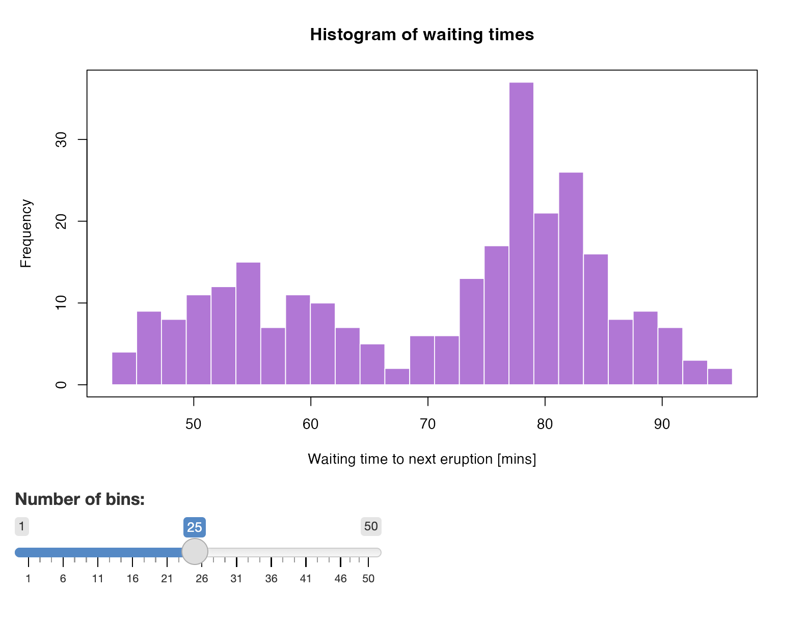
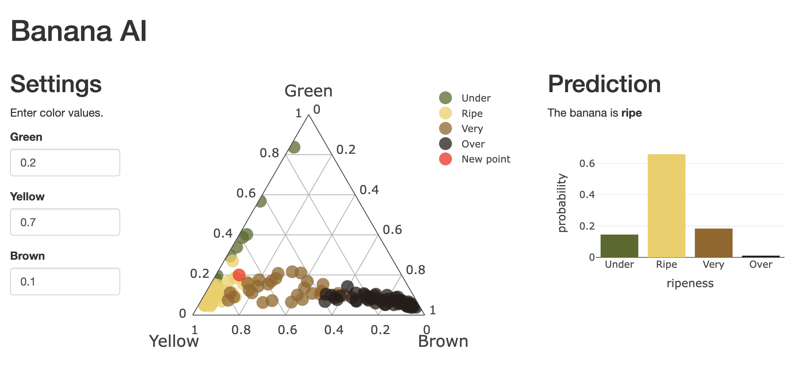
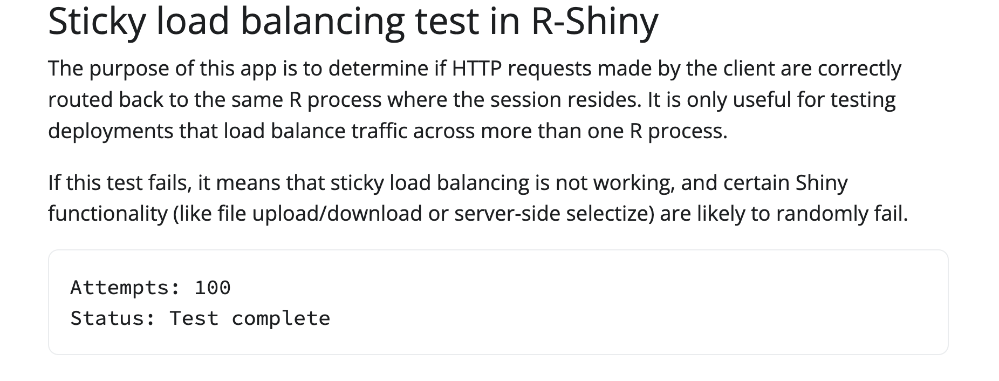

# Shiny Examples {#part1-examples}

::: {.noteblock data-latex=""}
This part introduces example Shiny apps in R and Python
that will be used for hosting examples throughout the book.
:::

Shiny apps come in many different shapes and forms. We will not be able to
represent this vast diversity, but instead we introduce some apps that 
showcase common patterns and fit onto the pages of a
printed book reasonably well.

We will use the following Shiny apps as examples, all are implemented in both R and Python:

- `faithful`: a "Hello Shiny!" app displaying the Old Faithful geyser
  waiting times data as a histogram with a slider that allows to adjust
  the number of bins used in the histogram --- this app demonstrates the
  very basics of reactivity, and it is very short.
- `bananas`: an app that classifies the ripeness of banana fruits based on
  the color composition (green, yellow, brown) --- this app demonstrates
  a more complex use case with dependencies, and the app also relies on a
  machine learning model that predicts based on user input, 
  thus it better reflects real world use cases.
- `lbtest`: an app to test load balancing when scaling Shiny apps to
  multiple instances.

Let's learn about the example apps.

<!--
REVIEW:
- The bananas app feels overly complicated and I'm not sure how it relates to hosting. There's a lot of prose and code to show off a cool machine learning project, but why is this relevant to hosting? Does this app represent any specific hosting challenges? Is there any reason to have this app instead of the simpler Old Faithful as an example for hosting?
- The load balancing app is a good idea because it actually shows a concept that can cause issues while hosting. But the explanation about what it does and how it works is confusing. Even though I understand it, I had to re-read that section a few times in order to try to make sense of it. It would benefit from a better explanation.
-->

## Old Faithful {#part1-example-faithful}

This is the classic "Hello Shiny!" app that you can see in R by trying
`shiny::runExample("01_hello")`. The app displays the Old Faithful geyser
waiting times data as a histogram with a slider that allows to adjust
the number of bins used in the histogram (Fig. \@ref(fig:examples-faithful)). 
The R version of the app was originally written by the Shiny package authors
[@R-shiny].

The "Hello Shiny!" in R has no dependencies other than `shiny`.
The Old Faithful app in Python has more requirements besides `shiny`, 
because the Python standard library does not have the geyser data readily 
available, and you need e.g. `matplotlib` [@Hunter2007] for the histogram. 
We wrote the Python version as a mirror translation of the R version, 
so that you can see the similarities and the differences.

```{r examples-faithful, eval=TRUE, echo=FALSE, out.width="100%", fig.pos = "bt", fig.cap="The `faithful` example Shiny app."}
# use PNG in both the html and latex versions

```

In R, the data set `datasets::faithful` [@R-base] contains waiting time between eruptions and 
the duration of the eruption for the Old Faithful geyser in Yellowstone National 
Park, Wyoming, USA. We got the Python data set from the Seaborn library
`seaborn.load_dataset("geyser")` [@Waskom2021].

The source code for the different builds of the Old Faithful Shiny app is at
<https://github.com/h10y/faithful>. You can download the GitHub repository
as a zip file from GitHub, or clone the repository with
`git clone https://github.com/h10y/faithful.git`.

## Bananas {#part1-example-bananas}

The `bananas` app was born out of a "stuck-in-the-house" COVID-19 project when
one of the authors bought some green bananas at the store and took daily
photographs of each fruit.

The Shiny app consists of a plot showing the colour composition
of the ripening banana fruits (Figure \@ref(fig:examples-bananas)). 
The three numeric inputs on the left hand side of the plot control the position 
of the red dot, which is then used to tell the ripening stage of the
banana represented by the red dot.

```{r examples-bananas, eval=TRUE, echo=FALSE, out.width="100%", fig.pos = "bt", fig.cap="The `bananas` example Shiny app."}

```

The app is more complex than the Faithful example and has more dependencies.
We will use this app to illustrate the management of these dependencies
during deployment and hosting.

See the Appendix for the description of the app.
The source code for the different builds of the Bananas Shiny app is at
<https://github.com/h10y/bananas>. You can download the GitHub repository
as a zip file from GitHub, or clone the repository with
`git clone https://github.com/h10y/bananas.git`.

## Load Balancing Test {#part1-example-lbtest}

Shiny apps can run multiple sessions in the same app instance.
A common problem when scaling the number of replicas for Shiny apps is that
traffic might not be sent to the same session and thus the app might randomly fail.
This app is used to determine if the HTTP requests made by the client are correctly 
routed back to the same R or Python process for the session.

Both the Python and the R version of the app registers a [dynamic route](https://shiny.posit.co/r/reference/shiny/latest/session.html) 
for the client to try to connect to. The JavaScript code on the client side will repeatedly hit the
dynamic route\index{Dynamic route}. The server will send a 200 OK status code only if the client reached
the correct Shiny session, where it originally came from (Fig. \@ref(fig:examples-lbtest)).

```{r examples-lbtest, eval=TRUE, echo=FALSE, out.width="100%", fig.pos = "bt", fig.cap="The `lbtest` example Shiny app."}

```

The original Python app was written by Joe Cheng and is from the `rstudio/py-shiny`
[GitHub repository](https://github.com/rstudio/py-shiny/blob/7ba8f90a44ee25f41aa8c258eceeba6807e0017a/examples/load_balance/app.py). We wrote the R version to mirror the Python
version.

This app will be useful when the deployment includes load balancing\index{Load balancing} between
multiple replicas. For such deployments, session affinity\index{Session affinity} (or sticky sessions) needs to 
be available. This app can be used to test such setups.
If the test fails, it will stop before the counter reaches 100 and will say _Failure!_
If the app succeeds 100 times, you'll see _Test complete_.
The app is not useful for testing a single instance deployment, or with Shinylive,
because these setups won't fail, but you can still try it.

The source code for the different builds of the load balancing test Shiny app is at
<https://github.com/h10y/lbtest>. You can download the GitHub repository
as a zip file from GitHub, or clone the repository with
`git clone https://github.com/h10y/lbtest.git`.

## Summary

This is the end of Part I. We covered all the fundamentals that the rest of the 
book builds upon. In the next part, we'll cover all the technical details of
Shiny hosting that happens on your local machine.

We recommend downloading the example repositories mentioned in this chapter 
to your computer. This way you will be able to follow all the examples
from the following chapters and won't have to copy paste the text from the 
book to files. Visit the GitHub organization `h10y` which stands for
_hostingshiny_ (there are 10 letters between the first _h_ and the last _y_):
<https://github.com/h10y/>.
