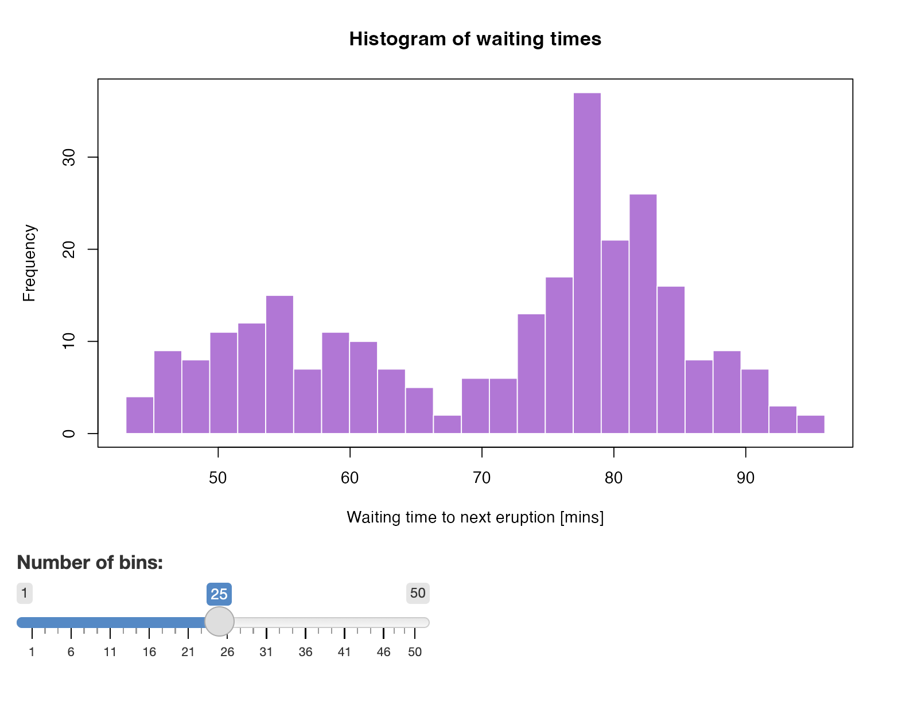

# Examples

Shiny apps come in many different shapes and form. We will not be able to
represent this vast diversity, but instead we wanted some apps that can be
used to showcase common patterns, and that can also fit onto the pages of a
printed book reasonably well.

We will use 3 Shiny apps as examples, all 3 are implemented in both R and Python:

- `faithful`: a "Hello Shiny!" app displaying the Old Faithful geyser
  waiting times data as a histogram with a slider that allows to adjust
  the number of bins used in the histogram --- this app demonstrates the
  very basics of of interactivity, and it is very short.
- `bananas`: an app that classifies the ripeness of banana fruits based on
  the color composition (green, yellow, brown) --- this app demonstrates
  a more complex use case with dependencies, and the app also relies on a
  machine learning model, thus it better reflects real world use cases.
- `lbtest`: an app to test load balancing when scaling Shiny apps to
  multiple instances.

Let's learn about the example apps.

## Old Faithful

This is the classic "Hello Shiny!" app that you can see in R by trying
`shiny::runExample("01_hello")`. The app displays the Old Faithful geyser
waiting times data as a histogram with a slider that allows to adjust
the number of bins used in the histogram (Fig. \@ref(fig:part1-examples-faithful)). 
The R version of the app was originally written by the Shiny package authors
[@R-shiny].

The "Hello Shiny!" in R has no dependencies other than `shiny`.
The Old Faithful app in Python has more requirements besides `shiny`, 
because the Python standard library does not have the geyser data readily 
available, and you need e.g. `matplotlib` [@Hunter2007] for the histogram. 
We wrote the Python version as a mirror translation of the R version, 
so that you can see the similarities and the differences.

```{r part1-examples-faithful, eval=TRUE, echo=FALSE, fig.cap="The `faithful` example Shiny app."}
# use PNG in both the html and latex versions

```

In R, the data set `datasets::faithful` [@R-base] contains waiting time between eruptions and 
the duration of the eruption for the Old Faithful geyser in Yellowstone National 
Park, Wyoming, USA. We got the Python data set from the Seaborn library
`seaborn.load_dataset("geyser")` [@Waskom2021].

The source code for the different builds of the Old Faithful Shiny app is at
<https://github.com/h10y/faithful>. You can download the GitHub repository
az a zip file from GitHub, or clone the repository with
`git clone https://github.com/h10y/faithful.git`.

## Bananas

The `bananas` app was born out of a "stuck-in-the-house" COVID-19 project when
one of the authors bought some green bananas at the store and took daily
photographs of each fruit.
Later, the data set was used as part of workshops. The motivation for the app
is that it follows workflow that is fairly common in all kinds of data science
projects:

1. Have a question to answer: _Is my banana ripe?_
2. Collect data: _Go to the store, buy bananas, set up a ring light and take pictures every day over 3 weeks._
3. Compile the training data: _Classify colour pixels and calculate the relative proportions, score pictures according to ripeness status._
4. Run exploratory data analysis: _Let's explore and visualize the data set._
5. Train a classification model: _Estimate the probability that the banana ripeness given colour composition._
6. Build a "scoring engine": _Given some colour inputs for a new fruit, tell me the probability that the banana is ripe._
6. Build a user interface: _Let a non technical user to do the  data exploration and classification as part of a web application._

### The Bananas Data Set

The data set tracks the ripening colour composition of banana fruits daily over a
3-week period. The full data set can be found in the [GitHub repository](https://github.com/psolymos/bananas)
and R package `bananas` (`install.packages("bananas", repos = "https://psolymos.r-universe.dev")`).
The subset used in the book and the Shiny app constitutes the 6 fruits that were kept at room temperature.

```{r setup_appA, include=FALSE}
options(scipen = 99, digits = 3)
```

The table has the following fields:

- `fruit`: the identifier of the fruit,
- `day`: number between 0 and 20, the number of days since the first set of photographs,
- `ripeness`: the ripeness class of the fruit based in Peter's personal judgement (Under, Ripe, Very, Over),
- `green`, `yellow`, `brown`: colour composition, these 3 values add up to 1 (100%).

The colour composition was determined based on colour mapping the pixel values of 
the banana fruits and converting the pixel based 2-dimensional area to proportions.


```{r eval=FALSE,echo=FALSE}
bananas <- read.csv("data/bananas.csv")
str(bananas)
```

```{r eval=TRUE,echo=FALSE, results='asis'}
if(is_latex_output()){
txt <- '
The colour composition was determined based on colour mapping the pixel values of 
the banana fruits and converting the pixel based 2-dimensional area to proportions
(Table \\@ref(tab:part1-bananas-table)).
'
} else {
txt <- '
The colour composition was determined based on colour mapping the pixel values of 
the banana fruits and converting the pixel based 2-dimensional area to proportions.

The following summary presents the ripeness (U = Under, R = Ripe, V = Very, O = Over)
and the percentage values of green, yellow, brown colours.
'
}
cat(txt)
```

```{r part1-bananas-table, eval=TRUE, echo=FALSE}
x <- read.csv("data/bananas.csv")
if (!is_latex_output()) {
    reactable(x,
        defaultPageSize = 10,
        showPageSizeOptions = TRUE,
        pageSizeOptions = c(10, 30, 60, 120),
        highlight = TRUE,
        searchable = TRUE,
        striped = TRUE)
} else {
    capt <- "A summary of the bananas data set presented as fruits (columns) over the days (rows), each cell showing the ripeness (U = Under, R = Ripe, V = Very, O = Over) and the percentage values of green, yellow, brown colours, respectively."
    z <- matrix("", 20, 6)
    rownames(z) <- sort(unique(x$day))
    colnames(z) <- sort(unique(x$fruit))
    for (i in sort(unique(x$day))) {
        for (j in sort(unique(x$fruit))) {
            ij <- x$day == i & x$fruit == j
            # v <- paste0(x$ripeness[ij], " [G=", round(100*x$green[ij]), 
            #     "|Y=", round(100*x$yellow[ij]), "|B=", round(100*x$brown[ij]), "]")
            v <- paste0(substr(x$ripeness[ij], 1, 1), " (", round(100*x$green[ij]), 
                ", ", round(100*x$yellow[ij]), ", ", round(100*x$brown[ij]), ")")
            z[as.character(i),j] <- v
        }
    }
    rownames(z) <- paste0("Day ", sort(unique(x$day)))
    # https://haozhu233.github.io/kableExtra/awesome_table_in_pdf.pdf
    # x[x$fruit == "fruit_14",] |> 
    z |>
    kbl(booktabs = TRUE,
        longtable = TRUE,
        caption = capt) |>
    kable_styling(
        font_size = 8,
        latex_options = c("repeat_header"))
}
```

Figure \@ref(fig:part1-bananas-time) shows the change in colour composition over
the 3 weeks of the experiment. You can see that the proportion of green colour
went down, parallel to that the yellow colour proportion peaked around day 5.
Yellow started decreasing after that while the proportion of brown started
increasing.

We can also present the same information according to the ripeness classes
(Fig. \@ref(fig:part1-bananas-classes)). You can see that the under-ripe
class is characterized by high green proportion and the absence of brown.
The ripe class is characterized by the highest proportion of yellow.
Very ripe bananas have higher proportion of brown while yellow colour is still
the most common. Over ripe bananas are mostly brown.

```{r part1-bananas-time, eval=TRUE, echo=FALSE, fig.cap="Colour composition of the bananas over time."}
x <- read.csv("data/bananas.csv")
x$ripeness <- factor(x$ripeness, c("Under", "Ripe", "Very", "Over"))

ggplot(
    data = data.frame(
        prop = c(x$green, x$yellow, x$brown),
        Colours = rep(c("green", "yellow", "brown"), each = nrow(x)),
        day = x$day),
    mapping = aes(
        x = jitter(day, 0.5),
        y = prop,
        group = Colours,
        color = Colours)) +
    geom_point(alpha = 0.75) +
    geom_smooth(
        method = 'loess', 
        formula = 'y ~ x',
        se = FALSE) +
    scale_color_manual(
        values = c(
            green = "#576a26", 
            yellow = "#eece5a", 
            brown = "#5c361f")) +
    ylim(0, 1) +
    xlab("Days") +
    ylab("Proportion") +
    # theme_minimal()
    # theme_classic()
    theme_linedraw()
```

```{r part1-bananas-classes, eval=TRUE, echo=FALSE, fig.cap="Colour composition of the bananas by ripeness class."}
ggplot(
    data = data.frame(
        prop = c(x$green, x$yellow, x$brown),
        Colours = factor(
            rep(c("green", "yellow", "brown"), each = nrow(x)),
            c("green", "yellow", "brown")),
        ripeness = x$ripeness),
    mapping = aes(
        x = ripeness,
        y = prop,
        # group = Colours,
        fill = Colours)) +
    geom_boxplot() +
    # coord_flip() +
    # facet_wrap(vars(Colours)) +
    scale_fill_manual(
        values = c(
            green = "#576a26", 
            yellow = "#eece5a", 
            brown = "#5c361f")) +
    xlab("Ripeness") +
    ylim(0, 1) +
    ylab("Proportion") +
    # theme_minimal()
    # theme_classic()
    theme_linedraw()
```

### Model Training

We chose Support Vector Machines (SVM) to model a multi-level response variable
(under, ripe, very, over) as a function of the green, yellow, and brown colours.

We used the `e1071` package [@R-e107] in R, and the SVM model's prediction accuracy was 90.8%.
We saved the trained model object as an R binary `.rds` file:

```R
library(e1071)

# Read the bananas data
x <- read.csv("bananas.csv")
x$ripeness <- factor(x$ripeness, c("Under", "Ripe", "Very", "Over"))

# Multinomial classification with Support Vector Machines
m <- svm(ripeness ~ green + yellow + brown,
  data = x,
  probability = TRUE
)

# Two-way table to test prediction accuracy
table(x$ripeness, predict(m))
sum(diag(table(x$ripeness, predict(m)))) / nrow(x)

# Predict ripeness class
predict(m, data.frame(green = 1, yellow = 0, brown = 0), 
  probability = TRUE)
predict(m, data.frame(green = 0, yellow = 1, brown = 0), 
  probability = TRUE)
predict(m, data.frame(green = 0, yellow = 0, brown = 1), 
  probability = TRUE)
predict(m, data.frame(green = 0.1, yellow = 0.2, brown = 0.7), 
  probability = TRUE)

# Save the model object
saveRDS(m, "bananas-svm.rds")
```

We can fit a similar SVM model in Python using scikit-learn (`sklearn`) [@scikit-learn]:

```python
import pandas as pd
from joblib import dump
from sklearn import svm

# Global
x = pd.read_csv('bananas.csv')

# Train SVM
x.loc[x.ripeness == 'Under', 'target'] = 0
x.loc[x.ripeness == 'Ripe', 'target'] = 1
x.loc[x.ripeness == 'Very', 'target'] = 2
x.loc[x.ripeness == 'Over', 'target'] = 3
data_X = x[['green', 'yellow', 'brown']].to_numpy()
data_y = x.target.values
svm_model = svm.SVC(probability = True)
svm_model.fit(data_X, data_y)

#' Predict ripeness class
svm_model.predict_proba([[1, 0, 0]])
svm_model.predict_proba([[0, 1, 0]])
svm_model.predict_proba([[0, 0, 1]])
svm_model.predict_proba([[0.1, 0.2, 0.7]])

# Write model object to file
dump(svm_model, 'bananas-svm.joblib')
```

### The Shiny App

The Shiny app consists of a ternary plot showing the daily colour composition
of each banana fruit, alongside the new point to be classified (in red),
as shown in Figure \@ref(fig:part1-examples-bananas). The three numeric inputs
on the left hand side of the plot control the position of the red dot.
The classification results based on these inputs are shown on the right hand side
of the ternary plot. You can see probabilities of under-ripe, ripe, very ripe, and
over-ripe classes, and the class with highest probability is assigned as a label.

```{r part1-examples-bananas, eval=TRUE, echo=FALSE, fig.cap="The `bananas` example Shiny app."}
include_graphics("images/01/example-bananas.png")
```

The source code for the different builds of the Bananas Shiny app is at
<https://github.com/h10y/bananas>. You can download the GitHub repository
az a zip file from GitHub, or clone the repository with
`git clone https://github.com/h10y/bananas.git`.

## Load Balancing Test

Shiny apps can run multiple sessions in the same app instance.
A common problem when scaling the number of replicas for shiny apps is that
traffic might not be sent to the same session and thus the app might randomly fail.
This app is used to determine if the HTTP requests made by the client are correctly 
routed back to the same R or Python process for the session.

Both the Python and the R version of the app registers a [dynamic route](https://shiny.posit.co/r/reference/shiny/latest/session.html) 
for the client to try to connect to. The JavaScript code on the client side will repeatedly hit the
dynamic route. The server will send a 200 OK status code only if the client reached
the correct Shiny session, where it originally came from (Fig. \@ref(fig:part1-examples-lbtest)).

```{r part1-examples-lbtest, eval=TRUE, echo=FALSE, fig.cap="The `lbtest` example Shiny app."}
include_graphics("images/01/example-lbtest.png")
```

The original Python app was written by Joe Cheng and is from the `rstudio/py-shiny`
[GitHub repository](https://github.com/rstudio/py-shiny/blob/7ba8f90a44ee25f41aa8c258eceeba6807e0017a/examples/load_balance/app.py). We wrote the R version to mirror the Python
version.

This app will be useful when the deployment includes load balancing between
multiple replicas. For such deployments, session affinity (or sticky sessions) needs to 
be available. This app can be used to test such setups.
If the test fails, it will stop before the counter reaches 100 and will say _Failure!_
If the app succeeds 100 times, you'll see _Test complete_.
The app is not useful for testing a single instance deployment, or with Shinylive,
because these setups won't fail, but you can still try it.

The source code for the different builds of the load balancing test Shiny app is at
<https://github.com/h10y/lbtest>. You can download the GitHub repository
az a zip file from GitHub, or clone the repository with
`git clone https://github.com/h10y/lbtest.git`.

## Summary

This is the end of Part I. We covered all the fundamentals that the rest of the 
book builds upon. In the next part, we'll cover all the technical details of
Shiny hosting that happens on your local machine.

We recommend getting the example repositories mentioned in this chapter 
available on your computer. This way you will be able to follow all the examples
from the following chapters and won't have to copy paste the text from the 
book to files. Visit the GitHub organization `h10y` which stands for
_hostingshiny_ (there are 10 letters between the first _h_ and the last _y_):
<https://github.com/h10y>.
