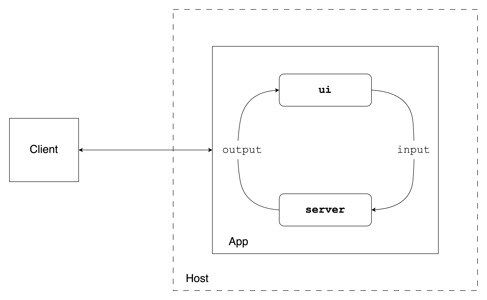

# (PART) Shiny Apps {-} 

# Developing Shiny Apps 

Shiny apps can be written in two languages, R and Python. These 2 programming 
languages are commonly used for data analysis.
R is an interpreted computer language for statistical computing and graphics. 
Likewise, Python is an interpreted general programming language that is often 
used for data science. Both R and Python run on a wide variety of operating 
systems including Windows, MacOS, and Linux.

In this first chapter, we will cover getting started with developing in Shiny 
using R and Python environments. We discuss the tools commonly used for these 
programming languages and provide instructions on how to run our example Shiny 
application projects in an integrated development environment (IDE). Then we'll 
review some of the easiest ways of sharing and deploying Shiny apps.

## Creating a Shiny App

A Shiny app is made up of the user interface (UI) and the 
server function. The UI and the server can be written in pure R or Python, 
but it can also incorporate JavaScript, CSS, or HTML code.

The app is served to the client (app user) through a host (Internet
Protocol or IP address) and port number. The server then keeps a
websocket connection open to receive requests. The Shiny session behind the app 
will make sure this request translates into the desired interactivity and sends 
back the response, usually an updated object, like a plot or a table
(Fig. \@ref(fig:part2-shiny-app-architecture)).

```{r part2-shiny-app-architecture, eval=TRUE, echo=FALSE, fig.cap="Simplified Shiny app architecture."}
if (is_latex_output()) {
    include_graphics("images/02/shiny-app-architecture.pdf")
} else {
    
}

```

The Old Faithful (`faithful`) app is a relatively simple example that is concise enough to 
demonstrate the structure of Shiny apps with the basics of reactivity.
It draws a histogram based on the Old Faithful geyser waiting times.
The number of bins in the histogram can be changed by the user with a slider.

The source code for the different builds of the Old Faithful Shiny app is at
<https://github.com/h10y/faithful>. You can download the GitHub repository
az a zip file from GitHub, or clone the repository with
`git clone https://github.com/h10y/faithful.git`.

To run this app in R, create a folder called `r-shiny` with a new file called 
`app.R` inside the folder. Put this inside the file:

```R
# r-shiny/app.R
library(shiny)

x <- faithful$waiting

app_ui <- fixedPage(
  title = "Old Faithful",
  h2("Old Faithful"),
  plotOutput(outputId = "histogram"),
  sliderInput(
    inputId = "n",
    label = "Number of bins:",
    min = 1,
    max = 50,
    value = 25,
    ticks = TRUE
  )
)

server <- function(input, output, session) {
  output$histogram <- renderPlot(
    alt = "Histogram of waiting times",
    {
      hist(
        x,
        breaks = seq(min(x), max(x),
          length.out = input$n + 1
        ),
        freq = TRUE,
        col = "#BB74DB",
        border = "white",
        main = "Histogram of waiting times",
        xlab = "Waiting time to next eruption [mins]",
        ylab = "Frequency"
      )
      box()
    }
  )
}

shinyApp(ui = app_ui, server = server)
```

For the Python version, create a new file called `app.py` inside the `py-shiny` 
folder and put this inside the file:

```python
# py-shiny/app.py
import seaborn as sns
import matplotlib.pyplot as plt
from shiny import App, render, ui

faithful = sns.load_dataset("geyser")
x = faithful.waiting

app_ui = ui.page_fixed(
    ui.panel_title("Old Faithful"),
    ui.output_plot(id = "histogram"),
    ui.input_slider(
            id="n", 
            label="Number of bins:", 
            min=1, 
            max=50, 
            value=25,
            ticks=True
    ),
)

def server(input, output, session):
    @render.plot(alt="Histogram of waiting times")
    def histogram():
        plt.hist(
            x, 
            bins = input.n(), 
            density=False, 
            color="#BB74DB",
            edgecolor="white")
        plt.title("Histogram of waiting times")
        plt.xlabel("Waiting time to next eruption [mins]")
        plt.ylabel("Frequency")

app = App(ui = app_ui, server = server)
```

Besides Shiny, you'll need to have the `seaborn` and `matplotlib` libraries 
installed for the geyser data set and the histogram. R has these functions as 
part of the base distribution, so no additional installation is needed. 
Install Python dependencies from the `requirements.txt` file with 
`pip install -r py-shiny/requirements.txt`. Here are the contents of 
the `requirements.txt` file:

```text
# py-shiny/requirements.txt
shiny>=0.10.2
matplotlib
seaborn
```

You have probably noticed the similarities between the R and Python versions.
Both started with loading/importing libraries and defining a globally available
that contained the Old Faithful geyser waiting times. The files then defined
the user interface (`app_ui`) and the `server` function. At the end,
we defined the Shiny app as `shinyApp(ui = app_ui, server = server)` and
`App(ui = app_ui, server = server)`.
Now let us explore the user interface and the server function.

### The User Interface

The user interface (UI) object controls the layout and appearance of the 
Shiny app. The UI in R is defined as and object called `app_ui`:

```R
app_ui <- fixedPage(
  title = "Old Faithful",
  h2("Old Faithful"),
  plotOutput(outputId = "histogram"),
  sliderInput(
    inputId = "n",
    label = "Number of bins:",
    min = 1,
    max = 50,
    value = 25,
    ticks = TRUE
  )
)
```

The `fixedPage()` function renders the main Shiny interface, a 
plot output is nested inside of it alongside the range slider input. The
slider with the ID `"n"` controls the number of bins in the histogram 
(ranging between 1 and 50, initial value set to 25). The plot with ID
`"histogram"` will show the distribution of the waiting times.

If we print the `app_ui` object, we get the following (slightly edited) HTML 
output where you can see how the attributes from the R code translate to
arguments in the HTML version:

```html
<div class="container">
  <h2>
    Old Faithful
  </h2>
  <div id="histogram">
  </div>
  <div class="form-group shiny-input-container">
    <label 
      class="control-label" 
      id="n-label" 
      for="n">
      Number of bins:
    </label>
    <input 
      class="js-range-slider" 
      id="n" 
      data-min="1" 
      data-max="50" 
      data-from="25" 
      data-step="1" 
      data-grid="true"/>
  </div>
</div>
```

You can see the container, and the plot and the slider nested inside.
This is going to be added to the body of the HTML page rendered by
Shiny. The final HTML page will also contain all the JavaScript and CSS
dependencies required to make the app interactive and styled properly.

The Python UI uses the `ui` object imported from `shiny`. The setup is very 
similar to the R setup, but naming conventions are slightly different 
(`fixedPage` vs. `page_fixed`, `plotOutput` vs. `output_plot` and
`sliderInput` vs. `input_slider`).

```python
app_ui = ui.page_fixed(
    ui.panel_title("Old Faithful"),
    ui.output_plot(id = "histogram"),
    ui.input_slider(
            id="n", 
            label="Number of bins:", 
            min=1, 
            max=50, 
            value=25,
            ticks=True
    ),
)
```

Printing the `app_ui` in Python gives the following (slightly edited) HTML output:

```html
<html>
  <head>
  </head>
  <body>
    <div class="container">
      <h2>
        Old Faithful
      </h2>
      <div id="histogram">
      </div>
      <div class="form-group shiny-input-container">
        <label 
          class="control-label" 
          id="n-label" for="n">
          Number of bins:
        </label>
        <input 
          class="js-range-slider" 
          id="n" 
          data-min="1" 
          data-max="50" 
          data-from="25" 
          data-step="1" 
          data-grid="true"/>
      </div>
    </div>
  </body>
</html>
```

The only difference relative to the R output is that you can see the `<html>`,
`<head>` and `<body>` tags. Shiny will inject elements into the HTML head later.

### The Server Function

The server function contains the instructions for the reactivity needed
for the Shiny app. The server function takes two arguments: `input` and
`output` (sometimes also `session`). These reactive objects are created
by Shiny and passed to the server function.

`input` is used to pass the control values, in this case, `input$n`,
the number of histogram bins:

```R
server <- function(input, output, session) {
  output$histogram <- renderPlot(
    alt = "Histogram of waiting times",
    {
      hist(
        x,
        breaks = seq(min(x), max(x),
          length.out = input$n + 1
        ),
        freq = TRUE,
        col = "#BB74DB",
        border = "white",
        main = "Histogram of waiting times",
        xlab = "Waiting time to next eruption [mins]",
        ylab = "Frequency"
      )
      box()
    }
  )
}
```

The `output` object contains the reactive output objects, in our case the
rendered plot. `input` and `output` together describe the state of the
app. Changes in `input` (`input$n` here) will invalidate reactive objects that 
reference these reactive dependencies 
and cause the relevant render functions (`renderPlot()` here) to re-execute.

We can see some differences in the Python version.
Shiny for Python uses decorators (e.g. `@render`) instead of 
render functions and inputs are invoked as `input.n()`.
(See the [Framework Comparisons](https://shiny.posit.co/py/docs/comp-r-shiny.html) 
section of the Shiny for Python documentation for a detailed overview of 
R vs. Python similarities and differences.)

FIXME: KALVIN please explain here the decorators etc. as needed.

```python
def server(input, output, session):
    @render.plot(alt="Histogram of waiting times")
    def histogram():
        plt.hist(
            x, 
            bins = input.n(), 
            density=False, 
            color="#BB74DB",
            edgecolor="white")
        plt.title("Histogram of waiting times")
        plt.xlabel("Waiting time to next eruption [mins]")
        plt.ylabel("Frequency")
```

The server function is called once for each Shiny session. 
A new session with a new websocket connection is created every time a web 
browser connects to the Shiny application.

### Shiny Express

Python for Shiny has two different syntax options, Shiny Core that you saw 
in the previous sections, and [Shiny Express](https://shiny.posit.co/py/docs/express-vs-core.html).
Shiny Core drew inspiration from the original Shiny for R framework, 
but is _not_ a literal port of Shiny for R.
Shiny Expressed was introduced quite recently, and is focused on making it 
easier for beginners to use Shiny, and might feel more natural to Python users.

Shiny Core offers the separation between the UI and the server components, 
making it easier to organize code for larger Shiny apps.
The server function declaration also helps separating code that should only 
run at startup vs. for the sessions.
In Shiny Express, all of the code in the app file is executed for each session.

There is only one Shiny syntax option in R.

## Organizing Shiny Apps

The previously presented `faithful` app is organized as a single file.
The file contained all the globally scoped declarations at the top,
the definition of the UI object and the server function, and ended
with the Shiny app object. As Shiny apps grow from demo examples to full on 
data science projects, the increased complexity will necessitate the 
organization of the code. You can organize the code into multiple files,
or even as a package. Let's see the most common patterns.

### Single file

When Shiny is organized in a single file, the convention is to name it `app.R`.
This way your IDE (RStudio or VS Code) will recognize that it is a Shiny app.
Apart from this convenience, the file can be named anything, e.g. `faithful_app.R`.
The single file follows the following structure:

```R
# Load libraries
library(shiny)

# Define global variables
x <- [...]

# Define the UI
app_ui <- [...]

# Define the server
server <- function(input, output, session) {
    [...]
}

# Assemble the Shiny app
shinyApp(ui = app_ui, server = server)
```

At the end of the file, we define the Shiny app using `shinyApp()`.
To run the app in R, we either have to source the `app.R` or provide the
file name as an argument to the `runApp()` function, e.g.
`runApp("<app-directory>/app.R")`.

The Python version takes a very similar form as a single file, usually named 
as `app.py`.

```python
# Load libraries
from shiny import App, render, ui
[...]

# Define global variables
x = [...]

# Define the UI
app_ui = [...]

# Define the server
def server(input, output, session):
    [...]

# Assemble the Shiny app
app = App(ui = app_ui, server = server)
```

You can run the Python Shiny app in your IDE or by using the `shiny run` command
in the terminal, `shiny run --reload --launch-browser <app-directory>/app.py`.
This will launch the app in the browser and the server will watch for changes
in the app source code and rerender.

The libraries and global variables will be accessible for all the Shiny sessions
by sourcing the app file when you start the Shiny app.
Variables defined inside the server functions will be defined for each
session. This way, one user's changes of the slider won't affect the other
user's experience. However, if one user changes the globally defined
variables (i.e. using the `<<-` assignment operator), those changes will be
visible in every user's session.

### Multiple Files

If your app is a bit more complex, you might have multiple files in
the same directory. By convention, the directory contains at least 
a `server.R` file and `ui.R` file.

Sometimes, there is a third file called 
`global.R`. The `global.R` file is used to load packages, data sets, 
set variables, or define functions that are available globally.

The directory can also have a `www` folder inside that can store
assets (files, images, icons). Another folder is called `R` that can
hold R scripts that are sourced before the app starts up.
This is usually the place to put helper functions and Shiny modules, 
which are also functions.
If you prefer, you can use the `source()` function to explicitly source
files as part of the `global.R` script. Just don't put these files in the
`R` folder to avoid sourcing them twice.

The `bananas` app is organized into multiple files. Here is how the folder
structure looks like for the R version of the app:

```bash
bananas/r-shiny
├── R
│   └── functions.R
├── bananas-svm.rds
├── bananas.csv
├── dependencies.json
├── global.R
├── server.R
└── ui.R
```

The `global.R` file looks like this:

```R
# bananas/r-shiny/global.R
library(shiny)
library(plotly)
library(e1071)

x <- read.csv("bananas.csv")
x$ripeness <- factor(x$ripeness, c("Under", "Ripe", "Very", "Over"))

m <- readRDS("bananas-svm.rds")
```

Apart from loading libraries, we read in a CSV file, set factor levels so that
those print in a meaningful order instead of alphabetical. Finally, we load 
the model we trained earlier. There is also the file `functions.R` in the `R`
folder that gets source automatically.

It is important to note, that functions defined inside the files of the `R` 
folder, or anything the you `source()` (e.g. `source("R/functions.R")`) will 
be added to the global environment. If you want a sourced file to have
local scope, you can include that for example inside your server function as 
`source("functions.R", local = TRUE)`.

To run this app, you can click the Run App button the the IDE
or use `runApp("<app-directory>")`. As long as the directory contains
the `server.R` and the `ui.R` files.

The choice between single vs. multiple files comes down to personal
preference and the complexity of the Shiny app. You might start
with a single file, but as the file gets larger, you might decide to
save the pieces into their own files.
However, keeping Shiny apps in their own folder is generally a good idea
irrespective of having single or multiple files in the folder. This way, 
changing your mind later won't affect how you run the app. You can just
use the same `runApp("<app-directory>")` command, if you follow these 
basic naming conventions.

We can also split the Python version of the `bananas` app into multiple files.

```bash
bananas/py-shiny
├── app.py
├── bananas-svm.joblib
├── bananas.csv
├── functions.py
└── requirements.txt
```

Sourcing files in Python works slight differently in Python. It is not like
adding scripts inline as you saw for R. But rather it follows the same
namespace pattern as importing from libraries.

These are the first few lines of the `app.py` file:

```python
# bananas/py-shiny/app.py
from shiny import App, render, reactive, ui
from functions import *
[...]
```

We import objects from `shiny`, then import everything from the `functions.py`
file. We define plotting helper functions in this file. But we also have to 
import libraries used inside `functions.py` within the scope of that file:

FIXME: KALVIN please clarify this to be clear for python users

```python
# bananas/py-shiny/app.py
import plotly.graph_objects as go
[...]
```

To run a Python Shiny app that is in multiple files, you still need to
specify the file that has the Shiny app object defined that you want to run,
`shiny run <app-directory>/app.py`. Or if the file is called `app.py` and the
app object is called `app`, you can use `shiny run` from the current
working directory.

As Shiny for Python apps become more widespread in the future, we will see
many different patterns emerge with best practices for organizing files.

### Shiny App with Nested Files Structure

Your app can grow more complex over time, and you might find that the 
of the multiple-file structure described above to be limiting.
You might have Shiny modules inside Shiny modules. Such a setup might lend itself
to a hierarchical file structure.

If this is the case, you can use the [Rhino Shiny framework](https://github.com/Appsilon/rhino) 
and the `rhino` R package [@R-rhino]. This Shiny framework was inspired by
importing and scoping conventions of the Python and JavaScript languages.
Rhino enforces strong conventions using a nested file structure and modularized 
R code. Rhino also uses the `box` package [@R-box] that defines a hierarchical 
and composable module system for R.

Here is the directory structure for the Rhino version of the `faithful` app:

```bash
faithful/r-rhino
├── app
│   ├── main.R
│   └── static
│       └── favicon.ico
├── app.R
├── config.yml
├── dependencies.R
└── rhino.yml
```

The `app/static` folder serves a similar purpose to the `www` folder.
The R code itself is ins the `app.R` folder, specifically the `app/main.R` file.
You can see how the import statement is structured at the beginning, and how a
Shiny module is used for the `ui` and `server`:

```R
box::use(
  shiny[fixedPage, moduleServer, NS, plotOutput, sliderInput, 
    renderPlot, h2],
  graphics[hist, box],
  datasets[faithful],
)

x <- faithful$waiting

#' @export
ui <- function(id) {
  ns <- NS(id)
  fixedPage(
    [...]
  )
}

#' @export
server <- function(id) {
  moduleServer(id, function(input, output, session) {
    output$histogram <- renderPlot(
      [...]
    )
  })
}
```

To run this app, you can call `shiny::runApp()`, the `app.R` file contains a 
single line calling `rhino::app()` which creates the Shiny app object.

The developers of the framework also released a very similar
Python implementation called [Tapyr](https://github.com/Appsilon/tapyr-template).

### Programmatic Cases

In R, if you want to run the Shiny app as part of another function, you
can supply a _list_ with `ui` and `server` components (i.e.
`runApp(list(ui = ui, server = server))`) or a Shiny _app object_
created by the `shinyApp()` function (i.e.
`runApp(shinyApp(ui, server))`).

Note that when `shinyApp()` is used at the R console, the Shiny app object
is automatically passed to the `print()` function, or more specifically, to the
`shiny:::print.shiny.appobj` function, which runs the app with `runApp()`.
If `shinyApp()` is called in the middle of a function, the value will not
be passed to the print method and the app will not be run. That is why you have
to run the app using `runApp()`. For example, we can write the following
function where `app_ui` and `server` are defined above as part of the
single-file `faithful` Shiny app. The `...` passes possible other arguments
to `runApp` such as the `host` or `port`.

```R
run_app <- function(...) {
  runApp(
    shinyApp(
      ui = app_ui,
      server = server
    ),
    ...
  )
}
```

Start the app by typing `run_app()` into the console.

### Shiny App as an R Package

Extension packages are the fundamental building blocks of the R ecosystem.
Apps can be hosted on the Comprehensive R Archive Network (CRAN), on GitHub, etc.
The tooling around R packages makes checking and testing these packages easy.
If you have R installed, you can run `R CMD check <package-name>` to test your
package that might include a `tests` folder with unit tests.

Including Shiny apps in R packages is quite commonplace nowadays. These 
apps might aid data visualization, or simplify calculations for not-so-technical
users. Sometimes the Shiny app is not the main feature of a package, but rather it is
more like an extension or a demo. In such cases, you might decide
to put the Shiny app into the `inst` folder of the package. This will make
the app available after installation, but the app's code will skip any checks.

A consequence is that some dependencies of the app might not be available,
because that is not verified during standard checks. At the time of installation, 
the contents of the `inst` folder will be copied to the package's root folder.
Therefore, such an app can be started as e.g. 
`shiny::runApp(system.file("app", package = "faithful"))`.
This means that there is a package called `faithful`, and in the `inst/app` folder
you can find the Shiny app. 
FIXME: add here link to the r-package version of the faithful example

```bash
# faithful
├── DESCRIPTION
├── LICENSE
├── NAMESPACE
├── R
│   └── run_app.R
├── inst
│   └── app
│       ├── global.R
│       ├── server.R
│       ├── ui.R
│       └── www
│           └── favicon.ico
└── man
    └── run_app.Rd
```

We will not teach you how to write an R package. For that, see R's official
documentation about [_Writing R Extensions_](https://cran.r-project.org/doc/FAQ/R-exts.html),
or @rpkg-book. The most important parts of the R package are the functions
inside the `R` folder and the `DESCRIPTION` file, that describes the dependencies
of the package:

```text
Package: faithful
Version: 0.0.1
Title: Old Faithful Shiny App
Author: Peter Solymos
Maintainer: Peter Solymos <[...]>
Description: Old Faithful Shiny app.
Imports: shiny
License: MIT + file LICENSE
Encoding: UTF-8
RoxygenNote: 7.3.1
```

The `inst` folder contains the Shiny app, the `man` folder
has the help page for our `run_app` function. The `run_app.R` file has the
following content:

```R
#' Run the Shiny App
#'
#' @param ... Arguments passed to `shiny::runApp()`.
#' @export
run_app <- function(...) {
  shiny::runApp(system.file("app", package = "faithful"), ...)
}
```

The `#'` style comments are used to add the documentation next to the function
definition, which describes how other parameters can be passed to the 
`shiny::runApp` function. The `@export` tag signifies that the `run_app` function
should be added to the `NAMESPACE` file by the `roxygen2` package [@R-roxygen2].

Calling `R CMD build faithful` will build the `faithful_0.0.1.tar.gz` source file.
You can install this package using `install.packages("faithful_0.0.1.tar.gz", repos = NULL)` from R
or you can use the R command line utility: `R CMD INSTALL faithful_0.0.1.tar.gz`.
Once the package is installed, you can call `faithful::run_app()` to start the
Old Faithful example.

If you want to include the app as part of the package's functions, place it in the
package's `R` folder. In this case, `shiny` and all other packages will have to
be mentioned in the package's `DESCRIPTION` file, that describes the dependencies,
as packages that the package imports from. 

Best practices can be found out there, both about [writing R packages](https://r-pkgs.org/)
[@rpkg-book], and about engineering Shiny apps using [@Fay2021].
You can not only test the underlying functions as part of the package, but you
can apply Shiny specific testing tools, like `shinytest2` [@R-shinytest2].

An R package provides a structure to follow, and everything becomes
a function. Including Shiny apps in R packages this way is much safer, and this 
is the approach that some of the most widely used Shiny development frameworks 
took. These are the `golem` [@R-golem], and the `leprechaun` [@R-leprechaun]
packages.

#### Golem

The use and benefits of the Golem framework are described in the book
_Engineering Production-Grade Shiny Apps_ by @Fay2021.
Golem is an opinionated framework for building a production-ready Shiny 
apps by providing a series of tools doe developing you app, with an emphasis on
writing Shiny modules.

A Golem app is contained inside an R package.
You'll have to know how to build a package, but this is the price to pay for
having a mature and trusted tools for testing your package from every aspect.
Let's review how the Golem structure compares to the previous setup.
We will call this app `faithfulGolem`:

```bash
# faithfulGolem
├── DESCRIPTION
├── LICENSE
├── NAMESPACE
├── R
│   ├── app_config.R
│   ├── app_server.R
│   ├── app_ui.R
│   ├── mod_histogram.R
│   └── run_app.R
├── dev
│   ├── 01_start.R
│   ├── 02_dev.R
│   ├── 03_deploy.R
│   └── run_dev.R
├── inst
│   ├── app
│   │   └── www
│   │       └── favicon.ico
│   └── golem-config.yml
└── man
    └── run_app.Rd
```

The most important difference is that we see the UI and server added to the
`R` folder as functions, instead of plain script files in the `inst` folder.
The `dev` folder contains development related boilerplate code and 
functions to use when testing the package without the need to reinstall after
every tiny change you make to the Shiny app or the R package in general.
The `inst` folder has the static content for the app with the `www` folder
inside.

The `DESCRIPTION` file looks like this:

```text
Package: faithfulGolem
Title: Old Faithful Shiny App
Version: 0.0.1
Author: Peter Solymos
Maintainer: Peter Solymos <[...]>
Description: Old Faithful Shiny app.
License: MIT + file LICENSE
Imports: 
    config (>= 0.3.2),
    golem (>= 0.4.1),
    shiny (>= 1.8.1.1)
Encoding: UTF-8
RoxygenNote: 7.3.1
```

Notice that the `config` and `golem` packages are now part of the list of
dependencies with the package versions explicitly mentioned to avoid possible
backwards compatibility issues.

Let's take a look at the UI and server functions. The `app_ui` function
returns the UI as a tags list object. You might notice that we use a module UI
function here:

```R
app_ui <- function(request) {
  tagList(
    # Leave this function for adding external resources
    golem_add_external_resources(),
    # Your application UI logic
    fixedPage(
      title = "Old Faithful",
      h2("Old Faithful"),
      mod_histogram_ui("histogram_1")
    )
  )
}
```

The `app_server` function loads the Old Faithful data set and calls the 
histogram module's server function that uses the same `"histogram_1"` 
identified as the module UI function, plus it also takes the data set as
an argument too:

```R
app_server <- function(input, output, session) {
  x <- datasets::faithful$waiting
  mod_histogram_server("histogram_1", x)
}
```

So what does this module look like? That is what you can find in the 
`R/mod_histogram.R` file that defines the `mod_histogram_ui` and 
`mod_histogram_server` functions:

```R
mod_histogram_ui <- function(id) {
  ns <- NS(id)
  tagList(
    plotOutput(outputId = ns("histogram")),
    sliderInput(
      inputId = ns("n"),
      label = "Number of bins:",
      min = 1,
      max = 50,
      value = 25,
      ticks = TRUE
    )
  )
}

mod_histogram_server <- function(id, x) {
  moduleServer(id, function(input, output, session) {
    ns <- session$ns
    output$histogram <- renderPlot(
      alt = "Histogram of waiting times",
      {
        graphics::hist(
          x,
          breaks = seq(min(x), max(x),
            length.out = input$n + 1
          ),
          freq = TRUE,
          col = "#BB74DB",
          border = "white",
          main = "Histogram of waiting times",
          xlab = "Waiting time to next eruption [mins]",
          ylab = "Frequency"
        )
        graphics::box()
      }
    )
  })
}
```

After building, checking, and installing the `faithfulGolem` R package,
you'll be able to start the Shiny app by calling `faithfulGolem::run_app()` from R.

FIXME: mention where to find the code for faithfulGolem.

#### Leprechaun

The `leprechaun` R package [@R-leprechaun] uses a similar philosophy to 
creating  Shiny applications as packages. It comes with a full set of
functions that help you with modules, custom CSS, and JavaScript files.
When using this package, you will notice that `leprechaun` does not become
a dependency in the `DESCRIPTION` file, unlike in the case of `golem`.
Apart from this and some organization choices, the two packages and 
the workflow provided by them are very similar. Choose that helps you more
in terms of your app's specific needs.

Say we name the the R package containing the Old Faithful example as
`faithfulLeprechaun`. The main functions that are defined should be already
familiar:

```R
# R/ui.R
ui <- function(req) {
  fixedPage(
    [...]
  )
}

# R/server.R
server <- function(input, output, session) {
  x <- datasets::faithful$waiting
  output$histogram <- renderPlot(
    [...]
  )
}

# R/run.R
run <- function(...) {
  shinyApp(
    ui = ui,
    server = server,
    ...
  )
}
```

After the package is installed, the way to run the app is to call 
the `faithfulLeprechaun::run()` function.

FIXME: mention where to find the code for faithfulLeprechaun.

