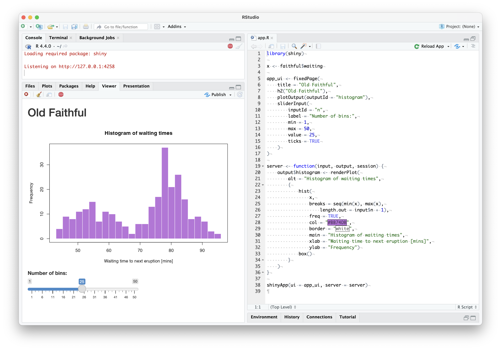

## Running Shiny Apps Locally

When you are developing your app locally, you likely want to rin the app to
check the look and see the changes that you've made.
In the previous chapter we already used some of the commands needed to
run the code. Let's review the different ways of running Shiny for R and Python 
apps locally.

Running your app locally is necessary for testing. Of course testing goes way 
beyond just opening up the app in the browser. We will not cover best practices
for testing your app. If you are interested, you can read about R package based
development in @Fay2021 or check out the documentation for the 
`shinytest2` R package [@R-shinytest2]. For testing related the Python version,
see the [Tapyr](https://github.com/Appsilon/tapyr-template) project
that used [`pytest`](https://docs.pytest.org/) and 
[`playwright`](https://playwright.dev/python/docs/running-tests) 
for validation and testing.

### R
When the app is in a single R file, you should name it `app.R`
just like we did previously for the `faithful` example.
If you have multiple files, make sure that you have the `server.R` and `ui.R`
files in the same directory. If you are using other frameworks, an `app.R`
file usually serves as an _entrypoint_ that your IDE will recognize. 
This way, you can run it easily inside of the RStudio IDE 
(Fig. \@ref(fig:part2-rstudio-r)) or VS Code with the Shiny extension 
(Fig. \@ref(fig:part2-vscode-r)) by pushing the "▷ Run App" button. 
Clicking on button would run the app in either a simple browser window
tab inside your IDE, or in a separate browser window, depending on your settings.

Besides the app showing up in the browser, you can also see some messages
appearing in your R console or terminal for Python.
If you inspect the console output, you should see something like this:

```text
Running Shiny app
-----------------
shiny::runApp("r-shiny/app.R", port = 52938)

Loading required package: shiny
shiny devmode - Turning on shiny autoreload. To disable, 
call `options(shiny.autoreload = FALSE)`
This message is displayed once every 8 hours.

Listening on http://127.0.0.1:52938
```

What does this mean? Pushing the Run App button led to running the
`runApp()` command. This started a web server on localhost (`127.0.0.1`) 
listening on port `52938` (your port number might be different). 
If you visit the `http://127.0.0.1:52938` address in your
browser, you should see the Shiny app with the slider and the histogram.
(Stop the app by closing the app window in RStudio or using CTRL+C).

Running the app this way will allow you to keep the server running while
making changes to the app source code. Your changes will trigger a reload
so you can immediately see the results.
You can disable this behavior by turning off the auto-reload option
with `options(shiny.autoreload = FALSE)`.

```{r part2-rstudio-r, eval=TRUE, echo=FALSE, fig.pos = "bt", fig.cap="Running an R Shiny app in the RStudio IDE."}
# use PNG for both

```

```{r part2-vscode-r, eval=TRUE, echo=FALSE, fig.pos = "bt", fig.cap="Running an R Shiny app in the VS Code IDE with the Shiny extension."}
# use PNG for both

```

The `runApp()` function can take different types of arguments to run the
same app. What you saw above was serving the app from the single file. 
If you name the single file something else, e.g.
`my-app.R`, you can provide the path to a single file as
`runApp("<app-directory>/my-app.R")`.

You can start the Shiny app from the terminal using the command
`R -q -e 'runApp("<app-directory>/my-app.R")'` where the `-q` flag means to
suppress the usual opening message, and `-e` instructs R to execute the
expression following it. You can also specify the 
port number as argument, e.g. `R -q -e 'runApp(..., path = 8080)'` will
start the web server on port `8080`.

Running these lines will start the Shiny server locally that you can visit in the browser.
To be precise, the `shinyApp()` R function returns the app object which is
run either by implicitly calling the `print()` method on it when running
in the R console. You can also pass the app object to the `runApp()`
function (you can stop the server by CTRL+C).

```text
R -q -e 'shiny::runApp("r", port = 8080)'

> shiny::runApp("r", port = 8080)
Loading required package: shiny

Listening on http://127.0.0.1:8080
```

This pattern might be unusual for you if you are using R mostly in interactive 
mode through an IDE. You will see this pattern in the next chapters when we call 
R from the terminal shell. This is how we can start the web server process in
non-interactive mode.

### Python

You can run the Python app from the RStudio IDE 
(Fig. \@ref(fig:part2-rstudio-py)) or VS Code  
(Fig. \@ref(fig:part2-vscode-py)) by pushing the same "▷ Run App" button.
You'll see something like this in your console with localhost and
a randomly picked and available port number (`52938`).

```text
python -m shiny run --port 52938 --reload [...] py-shiny/app.py

INFO: Will watch for changes in these directories: ['py-shiny']
INFO: Uvicorn running on http://127.0.0.1:52938 (Press CTRL+C to quit)
INFO: Started reloader process [85924] using WatchFiles
INFO: Started server process [85926]
INFO: Waiting for application startup.
INFO: Application startup complete.
INFO: 127.0.0.1:56050 - "GET [...] HTTP/1.1" 200 OK
INFO: ('127.0.0.1', 56053) - "WebSocket /websocket/" [accepted]
INFO: connection open
```

Running the Shiny app in Python relies on the [Uvicorn](https://www.uvicorn.org/) 
web server library that can handle websocket connections.

```{r part2-rstudio-py, eval=TRUE, echo=FALSE, fig.pos = "bt", fig.cap="Running a Python Shiny app in the RSudio IDE."}
# use PNG for both

```

```{r part2-vscode-py, eval=TRUE, echo=FALSE, fig.pos = "bt", fig.cap="Running a Python Shiny app in the VS Code IDE with the Shiny extension."}
# use PNG for both

```

The other port number (`56053`) is for the websocket connection
created for the session. If you open another browser window
pointing to `http://127.0.0.1:52938`, you'll see another websocket
connection opening for the new session:

```text
# Opening another browser tab
INFO: 127.0.0.1:56194 - "GET / HTTP/1.1" 200 OK
INFO: ('127.0.0.1', 56196) - "WebSocket /websocket/" [accepted]
```

Use `App(app_ui, server, debug=False)` to suppress the messages.

From the terminal, you can run the single app file from the terminal with
`shiny run --port 8080 <app-directory>/app.py` on port `8080`.
If you change the output of the `App()` statement from the default 
`app = App(...)` to `faithful_app = App(...)`,
you have to define the app as well not just the file:
`shiny run <app-directory>/app.py:faithful_app`. If the file is called `app.py`
and the app object is called `app`, you can omit the file name and use
`shiny run`, in this case `app.py:app` is assumed in the current working directory.

Trying to run both the R and Python version on the same port at the same time 
will not be possible. If you want to run both, use different port numbers, e.g. 
`8080` and `8081`.

The `shiny run` command starts the app. You can use the `--launch-browser` flag 
to automatically launch the app in a web browser.
The `--reload` flag means that the Python process restarts and the browser 
reloads when you make and save changes to the `python/app.py` file 
(use CTRL+C to stop the process).

### The Shiny App Lifecycle

The traditional way of serving Shiny apps involves a server that runs an 
R or Python process, and each client connects to this server and keeps an open 
websocket connection as long as they are using the application.
Let's take a closer look at this to better understand what is happening under
the hood.

Shiny for R relies on the `httpuv` [@R-httpuv] package to handle connections.
Whenever a new user connects to the Shiny app a new session is started
and communication between the client and the user session will be happening
through the websocket connection. The websocket allows two-way communication
which is the basis of Shiny's reactivity. The JavaScript code on the client
side can communicate the the R process via this connection.

In Python, the connections are handled by [Uvicorn](https://www.uvicorn.org/),
and the messages -- as we saw before -- reveal the port numbers used for
the different user sessions.

Why is this important? Because user sessions having their own ports is the 
basis for isolating these sessions from one another. Users will not be able
so access data from another session, unless data is leaked through the global
environment (which should be avoided).

The Shiny app life cycle can be described as follows
(Fig. \@ref(fig:part2-shiny-lifecycle)):

- Server start: after calling `runApp()` in R or `shiny run` for Python, the 
  `httpuv` or Uvicorn server is started and is now listening on a random of 
  a pre-defined port (e.g. `8080`).
- Server ready: the application code is sourced including loading the required
  libraries, data sets, everything from the global scope; if users try to connect
  to the app before it is ready they will see an error message.
- Client connects to the app via the port over HTTP protocol.
- New session created: the backend server (`httpuv` or Uvicorn) starts a user 
  session and runs the server function inside that session; a websocket 
  connection is created for two-way communication.
- Client-server communication happening while the user is using the app:
  the server sends the rendered HTML content to the client, including the
  JavaScript code that will communicate with the server to send and receive
  data through the websocket connection.
- When the client detects that the websocket connection is lost, 
  it will try to reconnect to the server.
- After a certain amount if inactivity, or in the case of disconnected client,
  the websocket connection and the user session will get terminated
  and the client browser will "gray out".

You can find more information about the Shiny app life cycle in @Granjon2022
and @coene2021javascript.

```{r part2-shiny-lifecycle, eval=TRUE, echo=FALSE,out.width="80%", fig.cap="The Shiny app life cycle with websocket connection."}
if (is_latex_output()) {
    include_graphics("images/02/shiny-app-websocket.pdf")
} else {
    
}
```

For Shinylive applications, the lifecycle does not include a websocket 
connection, and relies purely on HTTP(S) between the client and the server.
The server will only send the requested resources to the client, and it will not
do any other work. It will just "serve" these static files.
The client browser will do the heavy lifting by rendering the HTML and
running the Web Assembly binary that will take care of the reactivity.
Such an application will not time out until the browser tab is closed.

## Sharing the Shiny App Code

The source code for the app can be shared with collaborators,
clients, and users. They can run the app themselves if they are savvy
enough. When the audiences of a Shiny app are R or Python users, 
it makes sense to share the app as a Gist, a GitHub repository, or a zip file. 
However, sharing Shiny apps, this leaves installing dependencies up to the user.
You can email the files or the link to your users, you can even send a 
USB drive or a CD ROM in the mail.

The `shiny` R package comes with a few useful functions that makes sharing
your apps with technical users a bit easier. You can use the `runUrl()`,
`runGitHub()`, and `runGist()` functions to run app from specific URLs,
GitHub repositories, and Gists, respectively. `runUrl()` can be pointed at
R files or compressed files, such as `.zip`.

Another option is distributing your R Shiny app as an R package.
This option takes care of dependency management. You can install the R
package from different sources, like GitHub, and you can also have it
hosted on CRAN. However, the recipients will have to be able to install the 
package from source, which implies familiarity with R and package management.
Sharing the app source code is a low effort option on your part, 
but might be a high effort option for the ones you are sharing your app with.

## Summary

We reviewed all the different ways of how Shiny apps can be organized during 
development, from standalone R and Python applications to being 
part of dynamic documents. We also reviewed options for sharing your app's code 
with others. Sharing the app source code has several issues when you are sharing
it with non-technical users. First off, they will have to have an R or Python 
runtime environment. Second, they will have to have all the right 
dependencies installed, sometimes with specific versions of the libraries.

As you will see in the next chapter, sharing the app as a Docker image
is also an option. This might help with having a runtime environment and
managing dependencies, but again, your users will need to understand and use 
Docker and that can be often too much to ask for.
So the real reason we are talking about Docker is that it can help you host the
app.
