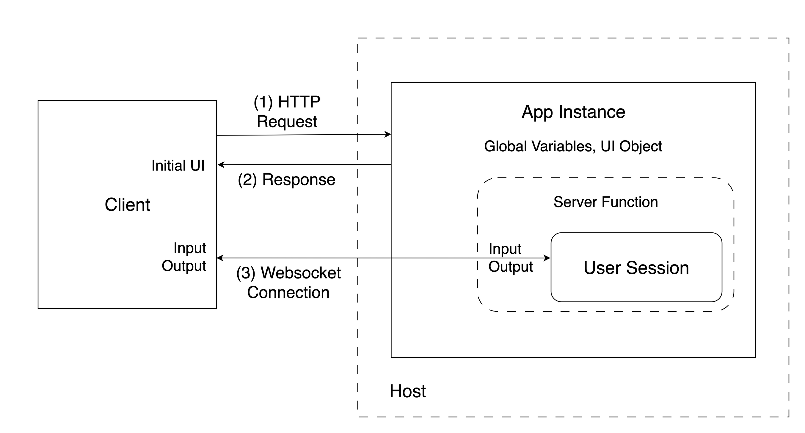

# (PART) Shiny Apps {-} 

# Developing Shiny Apps {#part2-developing-shiny-apps}

::: {.noteblock data-latex=""}
Prior chapters have covered setting up the computing environment with the
right tools for your journey to host and share Shiny applications.
In this chapter, we will cover getting started with developing in Shiny 
using R and Python environments. We discuss the tools commonly used for these 
programming languages and provide instructions on how to run our example Shiny 
application projects in an integrated development environment (IDE). Then we'll 
review some of the easiest ways of sharing the Shiny apps.

If you already have your Shiny app up and running, you may wish to skip to
Chapter \@ref(part2-sharing-shiny-code) to get started with learning how
to distribute your Shiny app.
:::

Shiny apps can be written in two languages, R\index{R} and Python\index{Python}. 
These 2 programming languages are commonly used for data analysis.
R is an interpreted language for statistical computing and graphics. 
Likewise, Python is an interpreted general programming language that is often 
used for data science. Both R and Python run on a wide variety of operating 
systems including Windows, Mac OS X, and Linux.

## Creating a Shiny App {#part2-creating-a-shiny-app}

A Shiny app is made up of the user interface (UI) and the 
server function. The UI and the server can be written in pure R or Python, 
but it can also incorporate JavaScript, CSS, HTML, or Markdown code.

The app is served to the client (app user) through a host (Internet
Protocol or IP address) and port number. The server then keeps a
websocket connection open to receive requests. The Shiny session behind the app 
will make sure this request translates into the desired interactivity and sends 
back the response, usually an updated object, like a plot or a table
(Fig. \@ref(fig:shiny-app-websocket)).

```{r shiny-app-websocket, eval=TRUE, echo=FALSE, fig.pos = "bt", fig.cap="Shiny app architecture life cycle; the HTTP request initiates the user session and a websocket connection is established between the client and the host."}
if (is_latex_output()) {
    include_graphics("images/shiny-app-websocket/shiny-app-websocket.pdf")
} else {
    
}
```

The Old Faithful app is a relatively simple example that is concise enough to 
demonstrate the structure of Shiny apps with the basics of reactivity.
It draws a histogram based on the Old Faithful geyser waiting times in the Yellowstone National Park.
The number of bins in the histogram can be changed by the user with a slider.

The source code for the different builds of the Old Faithful Shiny app is at
<https://github.com/h10y/faithful/>. You can download the GitHub repository
as a zip file from GitHub, or clone the repository with
`git clone https://github.com/h10y/faithful.git`. The repository should be 
inside the `faithful` folder. We'll refer to the files inside the folder
using relative paths. You can either open these files, or follow the
instructions for creating the folders and files fresh.

### R
An R app is based around a UI object and a server function.
First we explain how to run a basic app consisting of a UI object
and server function, followed
by explaining the UI object and server function.

#### Running in R {.unnumbered #part2-running-r-app}

To run this app in R, create a folder called `r-shiny` with a new file called 
`app.R` inside the folder. Put this inside the file:

```R
# r-shiny/app.R
library(shiny)

x <- faithful$waiting

app_ui <- fixedPage(
  title = "Old Faithful",
  h2("Old Faithful"),
  plotOutput(outputId = "histogram"),
  sliderInput(
    inputId = "n",
    label = "Number of bins:",
    min = 1,
    max = 50,
    value = 25,
    ticks = TRUE
  )
)

server <- function(input, output, session) {
  output$histogram <- renderPlot(
    alt = "Histogram of waiting times",
    {
      hist(
        x,
        breaks = seq(min(x), max(x),
          length.out = input$n + 1
        ),
        freq = TRUE,
        col = "#BB74DB",
        border = "white",
        main = "Histogram of waiting times",
        xlab = "Waiting time to next eruption [mins]",
        ylab = "Frequency"
      )
      box()
    }
  )
}

shinyApp(ui = app_ui, server = server)
```

#### Shiny R User Interface {.unnumbered #part2-ui-r}

The user interface (UI) object controls the layout and appearance of the 
Shiny app.

The UI in R is defined as and object called `app_ui`:

```R
app_ui <- fixedPage(
  title = "Old Faithful",
  h2("Old Faithful"),
  plotOutput(outputId = "histogram"),
  sliderInput(
    inputId = "n",
    label = "Number of bins:",
    min = 1,
    max = 50,
    value = 25,
    ticks = TRUE
  )
)
```

The `fixedPage()` function renders the main Shiny interface, a 
plot output is nested inside of it alongside the range slider input. The
slider with the ID `"n"` controls the number of bins in the histogram 
(ranging between 1 and 50, initial value set to 25). The plot with ID
`"histogram"` will show the distribution of the waiting times.

If we print the `app_ui` object, we get the following (slightly edited) HTML 
output where you can see how the attributes from the R code translate to
arguments in the HTML version:

```html
<div class="container">
  <h2>
    Old Faithful
  </h2>
  <div id="histogram">
  </div>
  <div class="form-group shiny-input-container">
    <label 
      class="control-label" 
      id="n-label" 
      for="n">
      Number of bins:
    </label>
    <input 
      class="js-range-slider" 
      id="n" 
      data-min="1" 
      data-max="50" 
      data-from="25" 
      data-step="1" 
      data-grid="true"/>
  </div>
</div>
```

The `<div>` HTML\index{HTML} tag stands for division, and most opening tags are followed
by a closing tag, i.e. `</div>`. HTML defines a nested structure.
You can see the outermost division with the container class.
The second level header, the plot and the slider are nested inside this outermost division.

This HTML snippet is going to be added to the body of the HTML page rendered by
Shiny. The final HTML page will also contain all the JavaScript and CSS
dependencies required to make the app interactive and styled properly.

#### R Server Function {.unnumbered #part2-server-function-r}

The server function\index{Server function} contains the instructions for the reactivity needed
for the Shiny app. The server function takes mainly two arguments: `input` and
`output`. Sometimes the server function also takes `session`. These reactive objects are created
by Shiny and passed to the server function.

`input` is used to pass the control values, in this case, `input$n`,
the number of histogram bins:

```R
server <- function(input, output, session) {
  output$histogram <- renderPlot(
    alt = "Histogram of waiting times",
    {
      hist(
        x,
        breaks = seq(min(x), max(x),
          length.out = input$n + 1
        ),
        freq = TRUE,
        col = "#BB74DB",
        border = "white",
        main = "Histogram of waiting times",
        xlab = "Waiting time to next eruption [mins]",
        ylab = "Frequency"
      )
      box()
    }
  )
}
```

The `output` object contains the reactive output objects, in our case the
rendered plot. `input` and `output` together describe the state of the
app. Changes in `input` (`input$n` here) will invalidate reactive objects that 
reference these reactive dependencies 
and cause the relevant render functions (`renderPlot()` here) to re-execute.

### Python
In Python, a basic Shiny application consists of two key components: 
a user interface (UI) object and a server function that handles user input and output.
The architecture of a Python Shiny application is similar to an R Shiny application that
also has a UI object and server function.

This section explains how a basic Python Shiny application works using the Old Faithful app. 
We start by demonstrating how to set up the application. After that, we will explore the 
UI object and the server function next.

#### Running in Python {.unnumbered #part2-running-python-app}

In the `py-shiny` folder of the Old Faithful app, you will see a file called
called `app.py` with the following code:

```python
# py-shiny/app.py
import seaborn as sns
import matplotlib.pyplot as plt
from shiny import App, render, ui

faithful = sns.load_dataset("geyser")
x = faithful.waiting

app_ui = ui.page_fixed(
    ui.panel_title("Old Faithful"),
    ui.output_plot(id = "histogram"),
    ui.input_slider(
            id="n", 
            label="Number of bins:", 
            min=1, 
            max=50, 
            value=25,
            ticks=True
    ),
)

def server(input, output, session):
    @render.plot(alt="Histogram of waiting times")
    def histogram():
        plt.hist(
            x, 
            bins = input.n(), 
            density=False, 
            color="#BB74DB",
            edgecolor="white")
        plt.title("Histogram of waiting times")
        plt.xlabel("Waiting time to next eruption [mins]")
        plt.ylabel("Frequency")

app = App(ui = app_ui, server = server)
```

As well, inside the `py-shiny` folder, there is a file named `requirements.txt` which contains 
the Python dependencies needed to run the application.
To install the Python dependencies from the `requirements.txt` file, run one from inside the `py-shiny`
folder: `pip install -r requirements.txt` which installs the `shiny` package
as a framework for the app, `seaborn` library to load the dataset, and the `matplotlib` library 
installed to visualize the geyser data set with a histogram.

Here are the contents of the `requirements.txt` file containing the dependencies we need:

```text
# py-shiny/requirements.txt
shiny>=0.10.2
matplotlib
seaborn
```

Once all the dependencies are installed, you can run the from inside the folder the command
`shiny run --reload --port 8080` and visit `http://localhost:8080` to view the app.

<!-- You have probably noticed the similarities between the R and Python versions. 
Both begin by loading/importing libraries and defining a globally available 
variable that contains the Old Faithful geyser waiting times. The files then define
the user interface\index{User interface} (`app_ui`) and the `server` function\index{Server function}. At the end,
the Shiny app is defined as `shinyApp(ui = app_ui, server = server)` and
`App(ui = app_ui, server = server)`.
Now let us explore the user interface and the server function. -->

In the next 2 sections, we will explore the user interface and server function.

#### Shiny Python User Interface {.unnumbered #part2-ui-py}

The Python UI uses the `ui` object imported from `shiny`.
Each of its properties ie the snake case naming convention
(e.g. `page_fixed`, `output_plot`, and 
`input_slider`).

Below is the code of the `ui` object taken from `app.py` of the Old Faithful app.

```python
app_ui = ui.page_fixed(
    ui.panel_title("Old Faithful"),
    ui.output_plot(id = "histogram"),
    ui.input_slider(
            id="n", 
            label="Number of bins:", 
            min=1, 
            max=50, 
            value=25,
            ticks=True
    ),
)
```

Printing the `app_ui` in Python gives the following (slightly edited) HTML output:

```html
<html>
  <head>
  </head>
  <body>
    <div class="container">
      <h2>
        Old Faithful
      </h2>
      <div id="histogram">
      </div>
      <div class="form-group shiny-input-container">
        <label 
          class="control-label" 
          id="n-label" for="n">
          Number of bins:
        </label>
        <input 
          class="js-range-slider" 
          id="n" 
          data-min="1" 
          data-max="50" 
          data-from="25" 
          data-step="1" 
          data-grid="true"/>
      </div>
    </div>
  </body>
</html>
```

As you can see, the attributes from the Python code translate to HTML element blocks.
You can see how `ui.panel_title("Old Faithful")` becomes `Old Faithful` 
enclosed into `h2` tags.
You can also see how `ui.output_plot(id = "histogram")` becomes a `div` element
with the id `histogram`. At runtime, Shiny will use the `div` element
with the id `histogram` to render a plot.
In Python all of these element blocks are enclosed within a `<html>` and `<body>`
tag so that it can be recognized and rendered by the web browser.

#### Python Server Function {.unnumbered #part2-server-function-python}

The server function\index{Server function} manages the reactivity for the
front end of the Shiny app. The server function takes mainly two arguments: `input` and
`output`. Sometimes the server function also takes `session`. 
These reactive objects are created by Shiny and passed to the server function.

The server function\index{Server function} is responsible for managing the reactivity of the 
Shiny app's front end. It primarily accepts two arguments: `input` and `output`, although 
it may also include a `session` argument in cases when you would like to access data in a session. 
These reactive objects are generated by Shiny and are subsequently 
passed to the server function for processing.

<!-- Shiny for Python uses decorators\index{Decorator} (e.g. `@render`) to render elements
and inputs are invoked as `input.n()`. -->

Below is the code for the server taken from `app.py` of the Old Faithful app. 

```python
def server(input, output, session):
    @render.plot(alt="Histogram of waiting times")
    def histogram():
        plt.hist(
            x, 
            bins = input.n(), 
            density=False, 
            color="#BB74DB",
            edgecolor="white")
        plt.title("Histogram of waiting times")
        plt.xlabel("Waiting time to next eruption [mins]")
        plt.ylabel("Frequency")
```

The `input` object stores reactive values. For example, `input.n()` means that 
when a reactive value `input.n()` is changed, a reactive function that uses 
`input.n()` will be triggered to rerender. The reactive function for `input.n()` 
in the Python code is `histogram` which is made reactive with the `render.plot` 
Python decorator.

Python decorators are a design pattern to modify a function by wrapping a 
function into another function. For example, the `@render.plot` decorator is a 
function that wraps the `histogram` function making it a reactive expression. 
The `histogram` function creates a plot, and the `@render.plot` attempts to 
retrieve the created plot by the `histogram` and renders it as `histogram` 
to the `output` object that can be called by a Shiny `ui` object. The use of 
the `output` object is similar to R, where reactive output objects such as 
`histogram` are stored.

In short, like R Shiny, `input` and `output` together describe the state of the
app. When changes are made to an `input`, their corresponding reactive 
expressions are re-executed and their results are stored in the `output` object.

Finally, `session`\index{Session, Shiny} refers to a connection made by a client to the Shiny 
application. A new session with a new websocket connection is created every time 
a web browser connects to the Shiny application. It should be noted that code 
outside the `server` function runs once per application startup and not per user 
session.

#### Python Shiny Express {.unnumbered #part2-shiny-express}

Python for Shiny has two different syntax options, Shiny Core\index{Shiny Core} that you saw 
in the previous sections, and [Shiny Express](https://shiny.posit.co/py/docs/express-vs-core.html)\index{Shiny Express}.
Shiny Core drew inspiration from the original Shiny for R framework, 
but is _not_ a literal port of Shiny for R.
Shiny Express was introduced quite recently, and is focused on making it 
easier for beginners to use Shiny, and might feel more natural to Python users.

Shiny Core offers the separation between the UI and the server components, 
making it easier to organize code for larger Shiny apps.
The server function declaration also helps separating code that should only 
run at startup vs. for each session.
In Shiny Express, all of the code in the app file is executed for each session.

There is only one Shiny syntax option in R.

## The Shiny App Lifecycle {#part2-shiny-lifecycle}

<!-- 
FIXME: Explain why understanding this is important in terms of hosting

FIXME: Outline the distinction between Shiny and Shinylive again

FIXME: Explaining scaling and loadbalancing with connections 
-->

The traditional way of serving Shiny apps involves a server that runs an 
R or Python process, and each client connects to this server and keeps an open 
websocket connection during an application's session.
Understanding sessions is important to know when deploying your application
as you may need to manage different user sessions that request
different reactive functions to run and you don't want it to leak
into other user sessions.
Let's take a closer look at this to better understand what is happening under
the hood.

### Connections

Shiny for R relies on the `httpuv` [@R-httpuv] package to handle connections.
Whenever a new user connects to the Shiny app a new session is started
and communication between the client and the user session will be happening
through the websocket connection. The websocket allows two-way communication
which is the basis of Shiny's reactivity. The JavaScript code on the client
side can communicate with the R process via this connection.

In Python, the connections are handled by [Uvicorn](https://www.uvicorn.org/),
and the messages -- as we saw before -- reveal the port numbers used for
the different user sessions.

### Sessions

Why is this important? Because user sessions having their own ports is the 
basis for isolating these sessions from one another. Users will not be able
so access data from another session, unless data is leaked through the global
environment (which should be avoided).

### Connections + Sessions

The Shiny app life cycle\index{Shiny lifecycle} can be described as follows
(Fig. \@ref(fig:shiny-app-websocket)):

- Server start: after calling `runApp()` in R or `shiny run` for Python, the 
  `httpuv` or Uvicorn server is started and is now listening on a random or 
  a pre-defined port (e.g. `8080`).
- Server ready: the application code is sourced including loading the required
  libraries, data sets, everything from the global scope; if users try to connect
  to the app before it is ready they will see an error message.
- Client connects to the app via the port over HTTP protocol.
- New session created: the backend server (`httpuv` or Uvicorn) starts a user 
  session and runs the server function inside that session; a websocket 
  connection is created for two-way communication.
- Client-server communication happening while the user is using the app:
  the server sends the rendered HTML content to the client, including the
  JavaScript code that will communicate with the server to send and receive
  data through the websocket connection.
- When the client detects that the websocket connection is lost, 
  it will try to reconnect to the server.
- After a certain amount if inactivity, or in the case of disconnected client,
  the websocket connection and the user session will get terminated
  and the client browser will "gray out".

You can find more information about the Shiny app life cycle in @Granjon2022
and @coene2021javascript.

### Shinylive

For Shinylive\index{Shinylive} applications, the lifecycle does not include a websocket 
connection, and relies purely on HTTP(S) between the client and the server.
The server will only send the requested resources to the client, and it will not
do any other work. It will just "serve" these static files.
The client browser will do the heavy lifting by rendering the HTML and
running the Web Assembly binary that will take care of the reactivity.
Such an application will not time out until the browser tab is closed.

<!-- 
  Look into bundling packages so that Shinylive can load faster:
  https://stackoverflow.com/questions/77436572/is-it-possible-to-pre-install-packages-to-shinylive-app -->

<!--
REVIEW:
- Figure 5.1 (shiny-app-architecture) is confusing to me. I would generally 
  associate the UI with the client, not with the host. I get what the diagram 
  is trying to convey, but it doesn't make sense to me. -- FIXED
- It's unclear whether the reader is expected to already know how to write 
  shiny apps or not. I was under the impression that the reader should definitely 
  know shiny, but reading through 5.1 makes it sound like the reader is assumed 
  to have 0 shiny knowledge.
- There seems to be too much focus on the very basics of shiny, and not enough 
  on the parts that are more relevant to hosting. For example, there is a brief 
  mention of the superassignment operator, and because this is actually a big 
  cause of issues when hosting apps, it should be discussed a little more in 
  depth and explained why it can cause problems when hosting but not when 
  developing locally.
- I would mention that this is a very brief introduction to writing shiny apps, 
  and it should not be considered a thorough tutorial, and that the reader is 
  expected to know this content and much more before reading this book
- One concept that's very relevant to hosting is sessions - the fact that the 
  code outside the server runs once, and each server function runs once per user, 
  and the "session" variable in it contains information about the current user. 
  I would expand on these concepts because of their significance to hosting and 
  many shiny beginners don't usually think of this when writing apps locally.
-->


## Organizing Shiny Apps {#part2-organizing-shiny-apps}

The previously presented `faithful` app is organized as a single file.
The file contained all the globally scoped declarations at the top,
the definition of the UI object and the server function, and ended
with the Shiny app object. As Shiny apps grow from demo examples to full on 
data science projects, the increased complexity will necessitate the 
organization of the code. You can organize the code into multiple files,
or even as a package. Let's see the most common patterns.

<!--
REVIEW:
- The convention to name a single-file app as "app.R" is not just a convention for convenience - 
  it's also a requirement for some services. For example, Shiny Server automatically recognizes app.R 
  but not other files. So it's incorrect to say that it's just for convenience and for the IDE.
- Whenever there are a few paragraphs or code chunks that are relevant to only R or only python, 
  I would try to find a way to visualize distinguish them, to make it easy for the reader to know which 
  sections they can skip if they're a R/python user. For example, as an R user, I would naturally find 
  myself skipping every paragraph that seems to be python-specific, but it's a lot of mental work to do that 
  for every paragraph and every code chunk manually
- There is no clear distinction in the motivation between "Multiple Files" and "Shiny App with Nested File Structure". 
  The "Multiple Files" approach also talked about nested folders, so you'll need to be more clear about why {rhino} 
  can be useful
- The section that talks about using "runApp()" to run an app inside a function does not make it clear that "runApp()" 
  **is** the function to call. The current phrasing says that you can pass a list with ui and server, and in 
  the example it says to use "runApp()", but it's just an example. It doesn't explicitly say that runApp() is
  the function to use.
- When discussing including an app inside a package, you mention that the user might decide to place the app 
  in the "inst/" folder. But there should also be a discussion about being able to place the app 
  in the "R/" folder, and why you might choose one over the other.
- When discussing including an app inside a package, make it clear that {golem} and {leprechaun} are two frameworks to 
  facilitate building a shiny package, but they are not necessary, and you can DIY, especially for non complex apps
- A note on formatting: I would avoid ever breaking up a word inside inline code over multipple lines. 
  For example, on page 82 of the PDF, there is inline code that speels "rmark-" on one line and continues on 
  the next, which can be confusing to whether the dash should be included in the code
- When introducing shinylive as a shiny solution, you should include some of the reasons why someone might 
  choose shinylive, and also discuss some pitfalls (doesn't support all packages)
-->

### R

#### Single file {.unnumbered #part2-organizing-shiny-single-file}

When Shiny is organized in a single file, the convention is to name it `app.R`.
This way your IDE (RStudio or VS Code) will recognize that it is a Shiny app.
Apart from this convenience, the file can be named anything, e.g. `faithful_app.R`.
The single file follows the following structure:

```R
# Load libraries
library(shiny)

# Define global variables
x <- [...]

# Define the UI
app_ui <- [...]

# Define the server
server <- function(input, output, session) {
    [...]
}

# Assemble the Shiny app
shinyApp(ui = app_ui, server = server)
```

At the end of the file, we define the Shiny app using `shinyApp()`.
To run the app in R, we either have to source the `app.R` or provide the
file name as an argument to the `runApp()` function, e.g.
`runApp("r-shiny/app.R")`.

#### Multiple Files {-}

If your app is a bit more complex, you might have multiple files in
the same directory. By convention, the directory contains at least 
a `server.R` file and `ui.R` file.

Sometimes, there is a third file called 
`global.R`. The `global.R` file is used to load packages, data sets, 
set variables, or define functions that are available globally.

The directory can also have a `www` folder inside that can store
assets (files, images, icons). Another folder is called `R` that can
hold R scripts that are sourced before the app starts up.
This is usually the place to put helper functions and Shiny modules, 
which are also functions.
If you prefer, you can use the `source()` function to explicitly source
files as part of the `global.R` script. Just don't put these files in the
`R` folder to avoid sourcing them twice.

The Bananas Shiny app is organized into multiple files. 
The source code for the different builds of the Bananas app is at
<https://github.com/h10y/bananas/>. Download or clone the GitHub repository with
`git clone https://github.com/h10y/bananas.git`. The repository should be 
inside the `bananas` folder.

<!--
Use faithful here? only mention other apps???
-->

Here is how the folder structure looks like for the R version of the Bananas app:

```bash
bananas/r-shiny
├── R
│   └── functions.R
├── bananas-svm.rds
├── bananas.csv
├── dependencies.json
├── global.R
├── server.R
└── ui.R
```

The `global.R` file looks like this:

```R
# bananas/r-shiny/global.R
library(shiny)
library(plotly)
library(e1071)

x <- read.csv("bananas.csv")
x$ripeness <- factor(x$ripeness, c("Under", "Ripe", "Very", "Over"))

m <- readRDS("bananas-svm.rds")
```

Apart from loading libraries, we read in a CSV file, set factor levels so that
those print in a meaningful order instead of alphabetical. Finally, we load 
the trained model object. There is also the file `functions.R` in the `R` 
folder that gets sourced automatically.

It is important to note, that functions defined inside the files of the `R` 
folder, or anything that you `source()` (e.g. `source("R/functions.R")`) will 
be added to the global environment. If you want a sourced file to have
local scope, you can include that for example inside your server function as 
`source("functions.R", local = TRUE)`.

To run this app, you can click the Run App button the the IDE
or use `runApp("<app-directory>")` as long as the directory contains
the `server.R` and the `ui.R` files.

The choice between single vs. multiple files comes down to personal
preference and the complexity of the Shiny app. You might start
with a single file, but as the file gets larger, you might decide to
save the pieces into their own files.

Keeping Shiny apps in their own folder is generally a good idea
irrespective of having single or multiple files in the folder. This way, 
changing your mind later won't affect how you run the app. You can just
use the same `runApp("<app-directory>")` command, if you follow these 
basic naming conventions.

#### Shiny App with Nested File Structure {.unnumbered #part2-organizing-shiny-rhino}

Your app can grow more complex over time, and you might find
the multiple-file structure described above to be limiting.
You might have Shiny modules inside Shiny modules. Such a setup might lend itself
to a hierarchical file structure.

If this is the case, you can use the [Rhino Shiny framework](https://github.com/Appsilon/rhino)\index{Rhino}
and the `rhino` R package [@R-rhino]. This Shiny framework was inspired by
importing and scoping conventions of the Python and JavaScript languages.
Rhino enforces strong conventions using a nested file structure and modularized 
R code. Rhino also uses the `box` package [@R-box] that defines a hierarchical 
and composable module system for R.

Here is the directory structure for the Rhino version of the Faithful app
from inside the Faithful GitHub repository's `r-rhino` folder:

```bash
r-rhino
├── app
│   ├── main.R
│   └── static
│       └── favicon.ico
├── app.R
├── config.yml
├── dependencies.R
└── rhino.yml
```

The `app/static` folder serves a similar purpose to the `www` folder.
The R code itself is in the `app.R` folder, specifically the `app/main.R` file.
You can see how the import statement is structured at the beginning, and how a
Shiny module is used for the `ui` and `server`:

```R
box::use(
  shiny[fixedPage, moduleServer, NS, plotOutput, sliderInput, 
    renderPlot, h2],
  graphics[hist, box],
  datasets[faithful],
)

x <- faithful$waiting

#' @export
ui <- function(id) {
  ns <- NS(id)
  fixedPage(
    [...]
  )
}

#' @export
server <- function(id) {
  moduleServer(id, function(input, output, session) {
    output$histogram <- renderPlot(
      [...]
    )
  })
}
```

To run this app, you can call `shiny::runApp()`, the `app.R` file contains a 
single line calling `rhino::app()` which creates the Shiny app object.

The developers of the framework also released a very similar
Python implementation called [Tapyr](https://github.com/Appsilon/tapyr-template)\index{Tapyr}.

#### Programmatic Cases {.unnumbered #part2-organizing-shiny-programmatic-cases}

In R, if you want to run the Shiny app as part of another function, you
can supply a _list_ with `ui` and `server` components (i.e.
`runApp(list(ui = app_ui, server = server))`) or a Shiny _app object_
created by the `shinyApp()` function (i.e.
`runApp(shinyApp(ui, server))`).

Note that when `shinyApp()` is used at the R console, the Shiny app object
is automatically passed to the `print()` function, or more specifically, to the
`shiny:::print.shiny.appobj` function, which runs the app with `runApp()`.
If `shinyApp()` is called in the middle of a function, the value will not
be passed to the print method and the app will not be run. That is why you have
to run the app using `runApp()`. For example, we can write the following
function where `app_ui` and `server` are defined above as part of the
single-file `faithful` Shiny app. The `...` passes possible other arguments
to `runApp` such as the `host` or `port` that we will discuss later.

```R
run_app <- function(...) {
  runApp(
    shinyApp(
      ui = app_ui,
      server = server
    ),
    ...
  )
}
```

Start the app by typing `run_app()` into the console.

#### Shiny App as an R Package {.unnumbered #part2-organizing-shiny-r-package}

Extension packages are the fundamental building blocks of the R ecosystem.
Apps can be hosted on the Comprehensive R Archive Network (CRAN), on GitHub, etc.
The tooling around R packages makes checking and testing these packages easy.
If you have R installed, you can run `R CMD check <package-name>` to test your
package that might include a `tests` folder with unit tests.

Including Shiny apps in R packages is quite commonplace nowadays. These 
apps might aid data visualization, or simplify calculations for not-so-technical
users. Sometimes the Shiny app is not the main feature of a package, but rather it is
more like an extension or a demo. In such cases, you might decide
to put the Shiny app into the `inst` folder of the package. This will make
the app available after installation, but the app's code will skip any checks.

A consequence is that some dependencies of the app might not be available,
because that is not verified during standard checks. At the time of installation, 
the contents of the `inst` folder will be copied to the package's root folder.
Therefore, such an app can be started as e.g. 
`shiny::runApp(system.file("app", package = "faithful"))`.
This means that there is a package called `faithful`, and in the `inst/app` folder
you can find the Shiny app.

The `r-package` folder of the Faithful repository contains an R package\index{R package} called
`faithful`. This is the folder structure of the package:

```bash
faithful
├── DESCRIPTION
├── LICENSE
├── NAMESPACE
├── R
│   └── run_app.R
├── inst
│   └── app
│       ├── global.R
│       ├── server.R
│       ├── ui.R
│       └── www
│           └── favicon.ico
└── man
    └── run_app.Rd
```

We will not teach you how to write an R package. For that, see R's official
documentation about [_Writing R Extensions_](https://cran.r-project.org/doc/FAQ/R-exts.html),
or @rpkg-book. The most important parts of the R package are the functions
inside the `R` folder and the `DESCRIPTION` file, that describes the dependencies
of the package:

```text
Package: faithful
Version: 0.0.1
Title: Old Faithful Shiny App
Author: Peter Solymos
Maintainer: Peter Solymos <[...]>
Description: Old Faithful Shiny app.
Imports: shiny
License: MIT + file LICENSE
Encoding: UTF-8
RoxygenNote: 7.3.1
```

The `inst` folder contains the Shiny app, the `man` folder
has the help page for our `run_app` function. The `run_app.R` file has the
following content:

```R
#' Run the Shiny App
#'
#' @param ... Arguments passed to `shiny::runApp()`.
#' @export
run_app <- function(...) {
  shiny::runApp(system.file("app", package = "faithful"), ...)
}
```

The `#'` style comments are used to add the documentation next to the function
definition, which describes how other parameters can be passed to the 
`shiny::runApp` function. The `@export` tag signifies that the `run_app` function
should be added to the `NAMESPACE` file by the `roxygen2` package [@R-roxygen2].

Calling `R CMD build faithful` from inside the `r-package` folder will build the `faithful_0.0.1.tar.gz` source file.
You can install this package using `install.packages("faithful_0.0.1.tar.gz", repos = NULL)` from R
or you can use the R command line utility: `R CMD INSTALL faithful_0.0.1.tar.gz`.
Once the package is installed, you can call `faithful::run_app()` to start the
Old Faithful example.

If you want to include the app as part of the package's functions, place it in the
package's `R` folder. In this case, `shiny` and all other packages will have to
be mentioned in the package's `DESCRIPTION` file, that describes the dependencies,
as packages that the package imports from. 

Best practices can be found about [writing R packages](https://r-pkgs.org/)
[@rpkg-book] and about engineering Shiny apps using [@Fay2021].
You can not only test the underlying functions as part of the package, but you
can apply Shiny specific testing tools, like `shinytest2` [@R-shinytest2].

An R package provides a structure to follow, and everything becomes
a function. Including Shiny apps in R packages this way is much safer, and this 
is the approach that some of the most widely used Shiny development frameworks 
took. These are the `golem` [@R-golem], and the `leprechaun` [@R-leprechaun]
packages.

#### Golem {.unnumbered #part2-organizing-shiny-golem}

The use and benefits of the Golem\index{Golem} framework are described in the book
_Engineering Production-Grade Shiny Apps_ by @Fay2021.
Golem is an opinionated framework for building a production-ready Shiny 
apps by providing a series of tools for developing your app, with an emphasis on
writing Shiny modules.

A Golem app is contained inside an R package.
You'll have to know how to build a package, but this is the price to pay for
having mature and trusted tools for testing your package from every aspect.
Let's review how the Golem structure compares to the previous setup.
Look for the package inside the `r-golem` folder of the Faithful GitHub repository.
We will call this R package `faithfulGolem`:

```bash
# faithfulGolem
├── DESCRIPTION
├── LICENSE
├── NAMESPACE
├── R
│   ├── app_config.R
│   ├── app_server.R
│   ├── app_ui.R
│   ├── mod_histogram.R
│   └── run_app.R
├── dev
│   ├── 01_start.R
│   ├── 02_dev.R
│   ├── 03_deploy.R
│   └── run_dev.R
├── inst
│   ├── app
│   │   └── www
│   │       └── favicon.ico
│   └── golem-config.yml
└── man
    └── run_app.Rd
```

The most important difference is that we see the UI and server added to the
`R` folder as functions, instead of plain script files in the `inst` folder.
The `dev` folder contains development related boilerplate code and 
functions to use when testing the package without the need to reinstall after
every tiny change you make to the Shiny app or to the R package in general.
The `inst` folder has the static content for the app with the `www` folder
inside.

The `DESCRIPTION` file looks like this:

```text
Package: faithfulGolem
Title: Old Faithful Shiny App
Version: 0.0.1
Author: Peter Solymos
Maintainer: Peter Solymos <[...]>
Description: Old Faithful Shiny app.
License: MIT + file LICENSE
Imports: 
    config (>= 0.3.2),
    golem (>= 0.4.1),
    shiny (>= 1.8.1.1)
Encoding: UTF-8
RoxygenNote: 7.3.1
```

Notice that the `config` and `golem` packages are now part of the list of
dependencies with the package versions explicitly mentioned to avoid possible
backwards compatibility issues.

Let's take a look at the UI and server functions. The `app_ui` function
returns the UI as a tags list object. You might notice that we use a module UI
function here:

```R
app_ui <- function(request) {
  tagList(
    # Leave this function for adding external resources
    golem_add_external_resources(),
    # Your application UI logic
    fixedPage(
      title = "Old Faithful",
      h2("Old Faithful"),
      mod_histogram_ui("histogram_1")
    )
  )
}
```

The `app_server` function loads the Old Faithful data set and calls the 
histogram module's server function that uses the same `"histogram_1"` 
identified as the module UI function, plus it also takes the data set as
an argument too:

```R
app_server <- function(input, output, session) {
  x <- datasets::faithful$waiting
  mod_histogram_server("histogram_1", x)
}
```

So what does this module look like? That is what you can find in the 
`R/mod_histogram.R` file that defines the `mod_histogram_ui` and 
`mod_histogram_server` functions:

```R
mod_histogram_ui <- function(id) {
  ns <- NS(id)
  tagList(
    plotOutput(outputId = ns("histogram")),
    sliderInput(
      inputId = ns("n"),
      label = "Number of bins:",
      min = 1,
      max = 50,
      value = 25,
      ticks = TRUE
    )
  )
}

mod_histogram_server <- function(id, x) {
  moduleServer(id, function(input, output, session) {
    ns <- session$ns
    output$histogram <- renderPlot(
      alt = "Histogram of waiting times",
      {
        graphics::hist(
          x,
          breaks = seq(min(x), max(x),
            length.out = input$n + 1
          ),
          freq = TRUE,
          col = "#BB74DB",
          border = "white",
          main = "Histogram of waiting times",
          xlab = "Waiting time to next eruption [mins]",
          ylab = "Frequency"
        )
        graphics::box()
      }
    )
  })
}
```

After building, checking, and installing the `faithfulGolem` R package,
you'll be able to start the Shiny app by calling `faithfulGolem::run_app()` from R.

#### Leprechaun {.unnumbered #part2-organizing-shiny-leprechaun}

The `leprechaun`\index{Leprechaun} R package [@R-leprechaun] uses a similar philosophy to 
creating  Shiny applications as packages. It comes with a full set of
functions that help you with modules, custom CSS, and JavaScript files.
When using this package, you will notice that `leprechaun` does not become
a dependency in the `DESCRIPTION` file, unlike in the case of `golem`.
Apart from this and some organization choices, the two packages and 
the workflows provided by them are very similar. Choose that helps you more
in terms of your app's specific needs.

Say we name the the R package containing the Old Faithful example as
`faithfulLeprechaun`. This folder is inside the `r-leprechaun` folder of the
Faithful repository. The main functions that are defined should be already
familiar:

```R
# R/ui.R
ui <- function(req) {
  fixedPage(
    [...]
  )
}

# R/server.R
server <- function(input, output, session) {
  x <- datasets::faithful$waiting
  output$histogram <- renderPlot(
    [...]
  )
}

# R/run.R
run <- function(...) {
  shinyApp(
    ui = ui,
    server = server,
    ...
  )
}
```

After the package is installed, the way to run the app is to call 
the `faithfulLeprechaun::run()` function.

### Python

#### Single file {-}

The Python version takes a very similar form as a single file, usually named 
as `app.py`.

```python
# Load libraries
from shiny import App, render, ui
[...]

# Define global variables
x = [...]

# Define the UI
app_ui = [...]

# Define the server
def server(input, output, session):
    [...]

# Assemble the Shiny app
app = App(ui = app_ui, server = server)
```

You can run the Python Shiny app in your IDE or by using the `shiny run` command
in the terminal, `shiny run --reload --launch-browser py-shiny/app.py`.
This will launch the app in the browser and the server will watch for changes
in the app source code and rerender.

The libraries and global variables will be accessible for all the Shiny sessions
by sourcing the app file when you start the Shiny app.
Variables defined inside the server functions will be defined for each
session. This way, one user's changes of the slider won't affect the other
user's experience. However, if one user changes the globally defined
variables (i.e. using the `<<-` assignment operator in R), those changes will be
visible in every user's session.

#### Multiple Files {.unnumbered #part2-organizing-shiny-multiple-files}

The Python version of the Bananas app is also split into multiple files:

```bash
bananas/py-shiny
├── app.py
├── bananas-svm.joblib
├── bananas.csv
├── functions.py
└── requirements.txt
```

Separating files works slightly differently in Python. Instead of sourcing scripts 
inline like you saw for R, you must import the objects and variables from 
separated files similar to importing from libraries as Python considers a `.py` 
file as a "module".  

These are the first few lines of the `app.py` file:

```py
# bananas/py-shiny/app.py
from shiny import App, render, reactive, ui
import functions
[...]
```

We import objects from `shiny`, then import everything from the `functions.py`
file into the `functions` namespace which is used to define plotting helper functions. 

To call anything that appeared in the `functions.py` in `app.py`, we prepend `functions.` to any functions or objects in `functions.py`:

```py
# bananas/py-shiny/app.py
[...]
    ternary = functions.go.FigureWidget(
        data=[
            functions.trace_fun(
                x[x.ripeness == "Under"], "#576a26", "Under"
            ),
            functions.trace_fun(
                x[x.ripeness == "Ripe"], "#eece5a", "Ripe"
            ),
            functions.trace_fun(
                x[x.ripeness == "Very"], "#966521", "Very"
            ),
            functions.trace_fun(
                x[x.ripeness == "Over"], "#261d19", "Over"
            ),
            functions.trace_fun(pd.DataFrame([{
[...]
```

To run a Python Shiny app that is in multiple files, you still need to
specify the file that has the Shiny app object defined that you want to run,
`shiny run <app-directory>/app.py`. Or if the file is called `app.py` and the
app object is called `app`, you can use `shiny run` from the current
working directory.

As Shiny for Python apps become more widespread in the future, we will see
many different patterns emerge with best practices for organizing files.

## Shinylive {#part2-shinylive}

Using [Shinylive](https://shiny.posit.co/py/docs/shinylive.html)\index{Shinylive}, you can run 
Shiny applications entirely in a web browser, i.e. on the client side, without 
the need for a separate server running in R or Python. This is achieved by 
R or Python running in the browser. The Python implementation of Shinylive uses 
[WebAssembly (Wasm)](https://webassembly.org/) and [Pyodide](https://pyodide.org/). 
Wasm is a binary format for compiled programs that can run in a web browser, 
whereas Pyodide is a port of Python and many Python packages compiled to Wasm.

The Shinylive version of the Old Faithful example can be viewed at
<https://h10y.github.io/faithful/>. 

### Python Shinylive {#part2-shinylive-python}

We will create Python Shinylive version of the Faithful app following 
the [`posit-dev/py-shinylive`](https://github.com/posit-dev/py-shinylive) GitHub repository.
First, export the app inside the `py-shiny` folder with the single-file app
and put the Shinylive version in the `py-shinylive` folder:

```bash
shinylive export py-shiny py-shinylive
```

The Shiny live version will consist of **static** files, which means that we can 
copy these files to any static hosting site (like GitHub Pages), 
and a browser will be able to display the contents irrespective of the 
underlying operating system, and without the need to have a Python available.

Can we view the output locally? If you double click on the `index.html` sitting
in the `py-shinylive` folder, you will most likely get an error in the browser.
To read the error you have to find the **developer tools**\index{Developer tools} (often opened by 
pressing F12 on your keyboard) and check the error messages. You will see 
something like this:

```text
Cross-Origin Request Blocked: The Same Origin Policy disallows reading 
the remote resource at file:///[...]/shinylive/shinylive.js. 
(Reason: CORS request not http).
```

For security reasons, browsers restrict cross-origin HTTP requests initiated from scripts.
But what is this cross-origin resource sharing\index{CORS} ([CORS](https://developer.mozilla.org/en-US/docs/Web/HTTP/CORS))?
If you load the HTML file (like our `index.html`) from a source, the default CORS
behavior will expect any other files, like images, or JavaScript/CSS scripts
to have the same origin. By origin we mean the domain and subdomain.

Now the problem here is that you are viewing a local version of the files,
which will set the protocol part of the URIs to be `file://` instead of
`http://` as indicated in the message. Although the folder following the
file protocol is the same, but this is considered as having opaque origins
by most browsers and therefore will be disallowed.

If you want to view the files locally, you do it through a local server. 
That way all files are served from the same scheme and domain (`localhost`) 
and have the same origin. Start the server as:

```bash
python3 -m http.server --directory py-shinylive
```

Now visit `http://localhost:8000/` in your browser, and the CORS error should
be gone (port 8000 is the default port for `http.server`).

### R Shinylive {#part2-shinylive-r}

Shinylive for R uses similar technology built on WebAssembly using the 
[WebR](https://docs.r-wasm.org/webr/latest/) R package.
Here is how to create an R Shinylive version of the Faithful app 
following the [`posit-dev/r-shinylive`](https://github.com/posit-dev/r-shinylive/) 
GitHub repository using the interactive R console:

```R
shinylive::export("r-shiny", "r-shinylive")
httpuv::runStaticServer("r-shinylive")
```

The first line compiles the Shiny app that is inside the `r-shiny` folder into 
the Shinylive version in the `r-shinylive` folder.
The second command will start the server and open the page in the browser.
You will see a random port used on localhost, e.g. `http://127.0.0.1:7446`.

## Dynamic Documents {#part2-dynamic-documents}

Dynamic documents stem from the _literate programming_\index{Literate programming} paradigm [@Knuth1992],
where natural language (like English) is interspersed with computer code snippets.
Nowadays, dynamic documents are used to create technical reports, slide decks
for presentations, and books, like the one you are reading.

Markdown is a common plain-text format for such dynamic documents, because it 
can be compiled into many different formats using [Pandoc](https://pandoc.org/).
R Markdown builds upon previous literate programming examples, e.g. Sweave
that mixes R and \LaTeX [@Leisch2002], and the flexibility provided by
Pandoc and the markdown format.

R Markdown contains chunks of embedded R (or other) code between opening 
and closing triple backticks. Underneath, you can find the 
`rmarkdown` [@R-rmarkdown] and `knitr` [@R-knitr] R packages at work.
A more recent iteration of this idea is [Quarto](https://quarto.org/).
Quarto is an open-source scientific and technical publishing system
that can include code chunks in many different formats frequently used by
data scientists, e.g. R, Python, Julia, Observable.

Both R Markdown and Quarto let you to use Shiny inside the documents
to build lightweight apps without worrying too much about a user interface.
Such interactive HTML documents cannot provide the same flexibility for
designing your apps as a standard Shiny app would, but it works wonders for
simpler use cases. Let's review how you can use Shiny in R Markdown (`.Rmd`)
and Quarto (`.qmd`) documents. Check the examples for the Faithful app
at <https://github.com/h10y/faithful>.

### R Markdown {#part2-r-markdown}

Markdown\index{Markdown} files usually begin with a _header_ that defines metadata for the 
document, like the title, the author, etc. The header is between
triple dashes (`---`) and is written in YAML format (YAML stands for
YAML Ain't Markup Language).

We'd like to include the Old Faithful example in an R Markdown\index{R Markdown} document.
So we created a file called `index.Rmd`. Look for the file inside the `rmd-shiny`
folder of the Faithful repository.
In the YAML header we need to specify an output format that produces
HTML, e.g. `html_document`, and the runtime to be set to `shiny`\index{Shiny runtime}:

```{r eval=TRUE,echo=FALSE,results="asis"}
cat(c('    ---',
'title: "Old Faithful"',
'output: html_document',
'runtime: shiny',
'---'), sep="\n    ")
```

The first code chunk would contain the data set definition and a `knitr` option 
to set the echo to false (do not print the code) 
so we don't have to set it for every chunk:

```{r eval=TRUE,echo=FALSE,results="asis"}
cat(c('    ```{r include=FALSE}',
'knitr::opts_chunk$set(echo = FALSE)',
'x <- faithful$waiting',
'```'), sep="\n    ")
```

Next comes a code chunk with the slider widget:

```{r eval=TRUE,echo=FALSE,results="asis"}
cat(c('    ```{r}',
'sliderInput(',
'  inputId = "n",',
'  label = "Number of bins:",',
'  min = 1,',
'  max = 50,',
'  value = 25,',
'  ticks = TRUE',
')',
'```'), sep="\n    ")
```

Finally, we render the plot output:

```{r eval=TRUE,echo=FALSE,results="asis"}
cat(c('    ```{r}',
'renderPlot(',
'  alt = "Histogram of waiting times",',
'  {',
'    hist(',
'      x,',
'      breaks = seq(min(x), max(x), length.out = input$n + 1),',
'      freq = TRUE,',
'      col = "#BB74DB",',
'      border = "white",',
'      main = "Histogram of waiting times",',
'      xlab = "Waiting time to next eruption [mins]",',
'      ylab = "Frequency"',
'    )',
'    box()',
'  }',
')',
'```'), sep="\n    ")
```

The output format can be any format that creates an HTML file. So for example,
you can use `ioslides_presentation` to create a slideshow with Shiny widgets
and interactivity. But because Shiny is involved, you need a server to run the 
document.

To render and run the document and the app inside it you can use
`rmarkdown::run("index.Rmd")` from inside the `rmd-shiny` folder. As a result, the `rmarkdown` package will
extract the code chunks to create a server definition and uses the
`index.html` output file to stitch in the reactive elements.

When you start the document, you will notice that it always renders the document
at startup. Not only that, but it also requires a full document render for each 
end user's browser session when deployed.
This startup time for the users can be reduced if we render the HTML only once.
Running expensive data import and manipulation tasks only once would also greatly 
help the startup times. The runtime for this is called `shinyrmd` 
(or its alias, `shiny_prerendered`)\index{Prerendered Shiny runtime}:

```{r eval=TRUE,echo=FALSE,results="asis"}
cat(c('    ---',
'title: "Old Faithful"',
'output: flexdashboard::flex_dashboard',
'runtime: shinyrmd',
'---'), sep="\n    ")
```

We'll use the `flexdashboard` [@R-flexdashboard] package to give the document
more of a dashboard look and feel. This R Markdown version of the Faithful app
is inside the `rmd-prerendered` folder of the repository.

The execution of pre-rendered Shiny documents is divided into two 
execution contexts, the **rendering** of the user interface and data,
and the **serving** of the document to the users.

To indicate the rendering context, you can use `context="render"` chunk option,
but this can be omitted because this is the default context for all R code chunks.
The `"render"` is analogous to the `ui.R` file.
For the first chunk, we define `context="setup"` to mark code that 
is shared between the UI and the server. This is analogous to the `global.R`
file.

```{r eval=TRUE,echo=FALSE,results="asis"}
cat(c('    ```{r context="setup",include=FALSE}',
'knitr::opts_chunk$set(echo = FALSE)',
'x <- faithful$waiting',
'```'), sep="\n    ")
```

We put the slider widget in the sidebar using the `"render"` context:

```{r eval=TRUE,echo=FALSE,results="asis"}
cat(c('    Column {.sidebar}',
'-------------------------------------------------------------',
'',
'```{r context="render"}',
'sliderInput(',
'  inputId = "n",',
'  label = "Number of bins:",',
'  min = 1,',
'  max = 50,',
'  value = 25,',
'  ticks = TRUE',
')',
'```'), sep="\n    ")
```

The plot output element goes into the main panel, still as part of the `"render"` 
context:

```{r eval=TRUE,echo=FALSE,results="asis"}
cat(c('    Column',
'-------------------------------------------------------------',
'',
'```{r context="render"}',
'plotOutput("histogram")',
'```'), sep="\n    ")
```

Finally, we define the `"server"` context for the reactive output.
This code is run when the interactive document is served and this is the 
same code that we would put into the `server.R` file:

```{r eval=TRUE,echo=FALSE,results="asis"}
cat(c('    ```{r context="server"}',
'output$histogram <- renderPlot(',
'  alt = "Histogram of waiting times",',
'  {',
'    hist(',
'      x,',
'      breaks = seq(min(x), max(x), length.out = input$n + 1),',
'      freq = TRUE,',
'      col = "#BB74DB",',
'      border = "white",',
'      main = "Histogram of waiting times",',
'      xlab = "Waiting time to next eruption [mins]",',
'      ylab = "Frequency"',
'    )',
'    box()',
'  }',
')',
'```'), sep="\n    ")
```

The `"render"` and `"server"` contexts are run in separate R sessions.
The first one is run when rendering happens, the second one is run many times,
once for each user. A consequence of this **context separation** is that you cannot 
access variables created in "render" chunks within "server" chunks, and the 
other way around.

To render the document, we use `rmarkdown::render("index.Rmd")`,
then use `rmarkdown::run("index.Rmd")` to run the dashboard from inside the 
`rmd-prerendered` folder. Set the `RMARKDOWN_RUN_PRERENDER` environment variable 
to `0` to prevent any pre-rendering from happening, e.g. with 
`Sys.setenv(RMARKDOWN_RUN_PRERENDER=0)`.

You can include Python code chunks in your R Markdown documents. Python code is
evaluated using the `reticulate` package [@R-reticulate].
But you cannot include Shiny for Python in R Markdown. For that, you have Quarto.

#### Quarto with R {.unnumbered #part2-quarto-with-r}

Quarto\index{Quarto} is very similar to R Markdown in many respects. You can think of it as a
generalized version of R Markdown that natively supports different programming
languages to run code chunks. You will find the YAML header familiar.
To use the Shiny runtime, we define `server: shiny`. The `format: html`
means to produce HTML output. The `execute` part refers to global options,
`echo: false` means that we don't want to code to be echoed into 
the document. 

The basic Quarto example for the Faithful example in R is inside the 
`quarto-r-shiny` folder. Let's start with the following header information in a file 
called `index.qmd`:

```{r eval=TRUE,echo=FALSE,results="asis"}
cat(c('    ---',
'title: "Old Faithful"',
'execute:',
'  echo: false',
'format: html',
'server: shiny',
'---'), sep="\n    ")
```

The language is specified after the triple backticks, here `{r}` means R.
What is different from R Markdown is that chunk options are defined as
special comments prefaced with `#|` at the top of the code block
instead of following the language declaration inside the curly brackets.

UI elements belong to the render context, which is something we do not have
to specify:

```{r eval=TRUE,echo=FALSE,results="asis"}
cat(c('    ```{r}',
'plotOutput("histogram")',
'sliderInput(',
'  inputId = "n",',
'  label = "Number of bins:",',
'  min = 1,',
'  max = 50,',
'  value = 25,',
'  ticks = TRUE',
')',
'```'), sep="\n    ")
```

The `server-start` context will share code and data across multiple user sessions.
It will execute when the document is first run and will not re-execute for 
every new user. This is like our `global.R` file.

```{r eval=TRUE,echo=FALSE,results="asis"}
cat(c('    ```{r}',
'#| context: server-start',
'x <- faithful$waiting',
'```'), sep="\n    ")
```

We can set the context to `server` for the next chunk:

```{r eval=TRUE,echo=FALSE,results="asis"}
cat(c('    ```{r}',
'#| context: server',
'output$histogram <- renderPlot(',
'  alt = "Histogram of waiting times",',
'  {',
'    hist(',
'      x,',
'      breaks = seq(min(x), max(x), length.out = input$n + 1),',
'      freq = TRUE,',
'      col = "#BB74DB",',
'      border = "white",',
'      main = "Histogram of waiting times",',
'      xlab = "Waiting time to next eruption [mins]",',
'      ylab = "Frequency"',
'    )',
'    box()',
'  }',
')',
'```'), sep="\n    ")
```

To render and serve this document we have to use the command
`quarto serve index.qmd` from inside the folder. Pre-rendering our document to speed up startup
times for the users is really straightforward. We do not have to change
the server type. We only have to first render the document with 
`quarto render index.qmd`. Then we can serve it with a flag that will tell
Quarto not to render it again: `quarto serve index.qmd --no-render`.

If you wanted to split the `.qmd` file into multiple files corresponding to
the evaluation contexts, you can have the header and the UI definition in
the `index.qmd` file. Put the code for the `server-start` context into the
`global.R` file. The `server.R` file should return the server function:

```R
# server.R
function(input, output, session) {
  output$histogram <- renderPlot(
    alt = "Histogram of waiting times",
    {
      hist(
        x,
        breaks = seq(min(x), max(x), length.out = input$n + 1),
        freq = TRUE,
        col = "#BB74DB",
        border = "white",
        main = "Histogram of waiting times",
        xlab = "Waiting time to next eruption [mins]",
        ylab = "Frequency"
      )
      box()
    }
  )
}
```

Find this Quarto example inside the `quarto-r-shiny-multifile` folder.

### Quarto with Python {#part2-quarto-with-python}

The Python version or our Quarto-based Shiny app is very similar to the R version.
No change in the header. The code chunks will have `{python}`
defined instead of `{r}`, and of course you have to copy the Python code
inside the chunks. See the `quarto-py-shiny` folder of the Faithful repository.

```{r eval=TRUE,echo=FALSE,results="asis"}
cat(c('    ---',
'title: "Old Faithful"',
'execute:',
'  echo: false',
'format: html',
'server: shiny',
'---'), sep="\n    ")
```

The next chunk contains the setup and loads libraries:

```{r eval=TRUE,echo=FALSE,results="asis"}
cat(c('    ```{python}',
'import seaborn as sns',
'import matplotlib.pyplot as plt',
'from shiny import App, render, ui',
'',
'faithful = sns.load_dataset("geyser")',
'x = faithful.waiting',
'```'), sep="\n    ")
```

The UI elements, like the slider input control, come next:

```{r eval=TRUE,echo=FALSE,results="asis"}
cat(c('    ```{python}',
'ui.input_slider(',
'        id="n",',
'        label="Number of bins:",',
'        min=1,',
'        max=50,',
'        value=25,',
'        ticks=True)',
'```'), sep="\n    ")
```

Finally, the rendered plot:

```{r eval=TRUE,echo=FALSE,results="asis"}
cat(c('    ```{python}',
'@render.plot(alt="Histogram of waiting times")',
'def histogram():',
'    plt.hist(',
'        x,',
'        bins = input.n(),', 
'        density=False, ',
'        color="#BB74DB",',
'        edgecolor="white")',
'    plt.title("Histogram of waiting times")',
'    plt.xlabel("Waiting time to next eruption [mins]")',
'    plt.ylabel("Frequency")',
'```'), sep="\n    ")
```

Rendering and serving the Python document is the same that you used for the R version:
`quarto serve index.qmd` will do both, so for a pre rendered version, use
`quarto render index.qmd` first and then serve with the `--no-render` flag.

<!-- FIXME: consider adding/mentioning Quarto Dashboards https://quarto.org/docs/dashboards/ -->

## Summary

We have reviewed all the different ways of how Shiny apps can be organized during 
development, from standalone R and Python applications to being 
part of dynamic documents. 