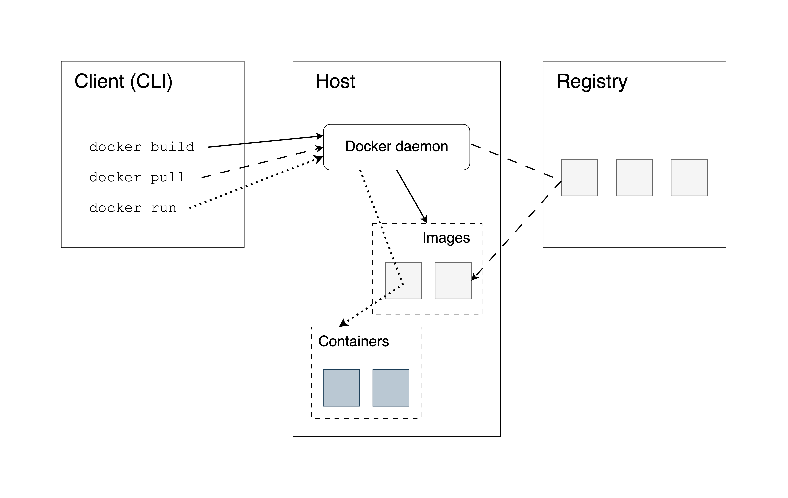

# Containerizing Shiny Apps {#containerizing-shiny-apps}

Containerization is a topic that is of increasing interest to data 
scientists and is a key feature for being able to cover the R and Python 
aspects of Shiny hosting in parallel. Once the container image is built, 
deployment and hosting become independent of the language that the app was 
written in. Tooling around this task has made huge advances over the past two 
years, and thanks to this, the topic is now accessible to a wider audience.

Containerization enables you to separate your applications from
your infrastructure so you can deliver software faster.
Containerization help makes an application platform independent by creating 
virtual environments in a container. To run a specific application, you will 
need to develop an _image_ for that platform which is then published on a 
_container registry_. The developed Image can be pulled from the registry to 
run a virtualized container environment for the application. 

Docker is one of the most popular tools for creating and managing containers 
for Shiny apps. This chapter will outline the needed concepts for containerizing 
your shiny application.


Learning Docker seems daunting at first, but it is an incredibly
powerful piece of technology once you get the hang of it. It is also the
building block of the modern web.

Docker is not the only tooling for containerizing applications. 
Docker's licensing model has recently changed and can require a paid license for 
commercial use. Therefore, there are alternatives of the Docker engine such as 
using [Podman](https://podman.io/). 
However, Podman is much more technical to use than Docker.

All the general advantages of containerized applications apply to Shiny
apps. Docker provides isolation to applications. Images are immutable:
once build they cannot be changed, and if the app is working, it will
work the same in the future. Another important consideration is scaling.
Shiny apps are single-threaded, but running multiple instances of the
same image can serve many users at the same time. Let's dive into the
details of how to achieve this.

## Docker Concepts

Containers provide portability, consistency, and are used for packaging,
deploying, and running cloud-native data science applications.
[Docker](https://www.docker.com/) is the most
popular virtualization environment to deliver software in containers.
DOcker is also well supported for Python and R.
Among the many use cases, Docker is most commonly used to deploy
reproducible workflows and to provide isolation for Shiny apps.

Containers bundle their own software, libraries and configuration
files and are isolated from one another. Containers are the
run-time environments or instances defined by container
images. Let's review the most important concepts. 
Figure \@ref(fig:part2-docker-architecture) illustrates
how all the Docker-related concepts all fit together.

```{r part2-docker-architecture, eval=TRUE, echo=FALSE,out.width="80%", fig.cap="The Shiny app life cycle with websocket connection."}
if (is_latex_output()) {
    include_graphics("images/02/docker-architecture.pdf")
} else {
    
}
```

You as the user, will use the command line as the _client_ to the Docker Engine 
which exists on a _host_ machine. The Docker Engine interfaces with the 
_container registry_ to pull the necessary _images_ for building a local copy of 
an image on the host for running an instance of a container.

### Docker Engine

The Docker Engine is a client-server application that includes a
server (a long-running daemon process called `dockerd` that listens to API 
requests), an _application programming interface_
(REST API) that specifies the interface that programs can use to talk to the
daemon process, and a _command-line interface_ (CLI) that is the client-side
of Docker.

The CLI uses the REST API to control or interact with the Docker daemon.
The daemon creates and manages Docker objects, such as images,
containers, volumes, networks, etc.

### Container Registries

A Docker registry stores Docker images. [Docker Hub](https://hub.docker.com/) 
is a public registry and Docker is configured to look for images on Docker Hub by
default. There are many other registries, or users can have their own
private registries. You will see some examples later.
Strictly speaking, container registries are for images and not containers.

### Images

An image is a read-only template with instructions for creating a
Docker container. You can view an image as a set of compressed files and 
metadata describing how these files -- also called image layers -- fit together.

An image can be based on another image with additional customization on top of 
this so-called _base_ or a _parent_ image. A base images is an images created 
from scratch, whereas a parent image is just another image that serves as the 
foundation for a new image. You might see base image used for both situations 
when reading tutorials. Don't get confused, the Docker lingo has a few 
inconsistencies that we just have to accept and move on.

### The Dockerfile

Docker builds images by reading the instructions from a file called
`Dockerfile`. A Dockerfile is a text document that contains all the
commands to assemble an image using the `docker build` CLI command. You
will learn more about the `Dockerfile` as part of the worked Shiny
examples later.

### Containers

A container is a runnable instance of an image. Users can create,
start, stop a container using the Docker API or CLI. It is also possible
to connect a container to networks or attach storage to it.

By default, a container is isolated from other containers and the
host machine. The degree of isolation can be controlled by the user and
depends on whether it is connected to networks, storage, other
containers, or the host machine.

### The Docker Command Line

The most common Docker CLI commands are:

- `docker login`: log into a Docker registry,
- `docker pull`: pull an image from a registry,
- `docker build`: build a Docker image based on a `Dockerfile`,
- `docker push`: push a locally built image to a Docker registry,
- `docker run`: run a command in a new container based on an image.

You will learn more about these commands in the subsequent sections.

## Working with Existing Images

Let's learn how to work with an existing image. Such an image is stored
in a container registry where we can pull it from if we know its name.

### Image Names and Tags

Image names follow the pattern `<host>/<path>:<tag>`. 
The optional `<host>` name specifies where the image is located.
If you don't specify a host name, the commands will use Docker's public registry
`docker.io`, aka the Docker Hub. 

The `<path>` can be an "official" image, like `ubuntu`.
The `<tag>` is a human-readable identifier that is often a specific version of 
an image. If not specified, the `latest` tag will be used.
So `ubuntu` as an image name will be identical to `docker.io/ubuntu:latest`.

It is important to note that the `latest` tag only means "latest" in the sense
of the last image that was tagged as `latest` or was untagged. If you use
a different tag, like `v1`, the image with the `latest` tag will not get
updated as well. So don't let this tag fool you. It is strongly recommended
in production to always explicitly use a tag that is _not_ `latest` but
a specific version.

The path is usually more structured and consists of slash-separated components.
It often looks like `<namespace>/<repository>` where the namespace 
specifies the user account or organization to which the image belongs to.
The base R image maintained by the [Rocker](https://rocker-project.org/) project
is names as `rocker/r-base` where `rocker` is the organization namespace,
`r-base` is the repository.

Another example is the R version of the Old Faithful 
example has the image name `ghcr.io/h10y/faithful/r-shiny:latest` which means:

- `ghcr.io` is the GitHub Container Registry host name,
- `h10y` is the GitHub organization,
- `faithful` is the GitHub repository,
- `r-shiny` is the Shiny app build,
- `latest` is the version tag.

### Pulling an Image

You can use the `docker pull <image-name>` command to pull an image from
a public registry. For example `docker pull ubuntu:24.04` will pull the 
24.04 version of the "official" Ubuntu image from the Docker Hub.
`docker pull rocker/r-base:4.4.1` will pull the image with R version 4.1.1.
Pull the R Shiny version of the Old Faithful as:

```bash
docker pull ghcr.io/h10y/faithful/r-shiny

# Using default tag: latest
# latest: Pulling from h10y/faithful/r-shiny
# Digest: sha256:12e[...]4ea
```

You can see from the messages that the `latest` tag was applied because
we did not specify the tag. We can also see the SHA256 digest, that is
a unique and immutable identifier. The name can change, or multiple names can
refer to the same image (i.e. a set of layers and their manifest). But the
image digest will be the same. To "pin" the exact version, you can use the 
`<image-name>@sha256:12e[...]4ea` pattern:

```bash
docker pull ghcr.io/h10y/faithful/r-shiny@sha256:12e[...]4ea
```

To pull all images from a repository, you can use the `--all-tags` flag:

```bash
docker image pull --all-tags ghcr.io/h10y/faithful/r-shiny
```

This will pull not only the `latest`, but also the image tagged as `main`
named after the Git branch. Use the `docker images` command to list the
images.

### Docker Login

You don't need to authenticate for public images, but in
case you are trying to pull a private image from a private repository, you 
need to log into the container registry. Suck private repositories are common
and are available on Docker Hub, the GitHub or GitLab container registries.
More on the different container registries later.

To log in to the GitHub container registry, use:

```bash
docker login ghcr.io
```

This command will ask for our credentials interactively. If you want,
you can provide your username and password. But it is usually
recommended to use an access token instead of your
password because the token can have more restricted scopes, i.e. only used to
(read) access the container registry which is a lot more secure.
You can also set expiry dates and can revoke these tokens any time.

Let's say that you saved your PAT in a file `~/my_password.txt` in the
root of your home folder (`~`). You can pass the PAT value to the 
`docker login` command via the standard input as:

```bash
cat ~/my_password.txt | docker login \
    --username <username> \
    --password-stdin
```

where `<username>` is your GitHub username.

### Running a Container

The next command is `docker run` which runs a command in a new container.
It pulls the image if needed before starting the container.

Try the following command. It will pull the latest image for the Python build
of the Old Faithful example app, then it will start a new container:

```bash
docker run -p 8080:3838 ghcr.io/h10y/faithful/py-shiny
```

The `-p` is a shorthand for `--publish`, that instructs Docker to
publish a container's port to the host port. In our example, 3838 is the
container's port which is mapped to port 8080 of the host machine. As a
result, you can visit `http://127.0.0.1:8080` in your browser to see the 
Python Shiny app. Hit CTRL+C to stop the container. We will learn about
container ports in a bit, but in essence just a channel that the
information is sent back and forth.

## Building a New Image

So far you saw how to use the basic Docker commands to
pull and run images. Now you'll build a Docker image by recreating the
Old Faithful Shiny app that we worked with before.

In our examples, we will use the following setup: a file named `Dockerfile` 
sits next to a folder names `app`, and the Shiny app files like
`app.R` or `app.py` are in this folder. This setup is convenient
because we can copy all the files from teh `app` folder without
having to worry about copying files that should not be there.

```bash
├── Dockerfile
└── app
    └── ...
```

### R for Shiny

FIXME: Link here the repo and folder.

For our R Shiny example this is what is inside the `Dockerfile`:

```dockerfile
FROM rocker/r2u:24.04

RUN R -q -e "install.packages('shiny')"

RUN groupadd app && useradd -g app app
WORKDIR /home/app

COPY app .

RUN chown app:app -R /home/app
USER app
EXPOSE 3838

CMD ["R", "-e", "shiny::runApp(host='0.0.0.0', port=3838)"]
```

We will explain the `Dockerfile` commands in the next section.
For now, you can use the `docker build` command to build the image from the
`Dockerfile`. You will have to be in the same directory as the `Dockerfile`,
this place is what we'll call as the build context. This is what the `.` at the
end of the command stands for:

```bash
docker build -t r-shiny:v1 .
```

The context here specifies the current directory (`.`), but it can be
any relative or absolute filepath. Files and directories inside the 
context directory are available to the builder, so it can load them when needed.
You can use a `.dockerignore` file to list files and directories that should
be ignored within the build context. It is similar to the `.gitignore` file.

The instructions are taken from the `Dockerfile` at the root of the build
context. If you want to specify a different file, do so by providing the
path to the file using the `-f` (or `--file`) option as `docker build -f Dockerfile2 .`.

The `-t` argument (same as `--tag`) is followed by the image name 
(`r-shiny-test`) and the tag (`v1`). If you do not specify the image 
name/tag at image build (i.e. `docker build .`), Docker will not tag the image 
but it will have an image ID that you can use later to tag the image with
`docker tag <image-id> r-shiny-test:v1`.

You can apply multiple tags as:

```bash
docker build -t r-shiny:v1 -t r-shiny:latest .
```

### Buildx and BuildKit

While the builder is running, you'll see lots of messages printed
as Docker goes through the instructions from the `Dockerfile`.
Newer Docker Desktop version use `buildx`, which brings extended build 
capabilities with BuildKit, such as 

As of Docker Engine 23.0 and Docker Desktop 4.19, Buildx is the default build 
client and user interface. Buildx brings extended build capabilities with 
BuildKit. BuildKit is the server that handles the build execution, e.g.
it communicates with registries, instructs the Docker Engine and accesses
the local file system. You can enable the use of BuildKit on older Docker 
systems by setting the environment variable `DOCKER_BUILDKIT=1`.

The Buildx output is nicer and it provides you with timings for every step
of your `Dockerfile`:

```{r eval=TRUE,echo=FALSE,size='footnotesize'}
cat(c("[+] Building 32.4s (12/12) FINISHED",
" => [internal] load build definition from Dockerfile                    0.0s",
" => => transferring dockerfile: 282B                                    0.0s",
" => [internal] load metadata for docker.io/rocker/r2u:24.04             1.2s",
" => [auth] rocker/r2u:pull token for registry-1.docker.io               0.0s",
" => [internal] load .dockerignore                                       0.0s",
" => => transferring context: 2B                                         0.0s",
" => [1/6] FROM docker.io/rocker/r2u:24.04@sha256:f327[...]dd73          9.2s",
" => => resolve docker.io/rocker/r2u:24.04@sha256:f327[...]dd73          0.0s",
"[...]",
" => [internal] load build context                                       0.0s",
" => => transferring context: 845B                                       0.0s",
" => [2/6] RUN groupadd app && useradd -g app app                        0.7s",
" => [3/6] RUN R -q -e \"install.packages('shiny')\"                      20.9s",
" => [4/6] WORKDIR /home/app                                             0.0s",
" => [5/6] COPY app .                                                    0.0s",
" => [6/6] RUN chown app:app -R /home/app                                0.1s",
" => exporting to image                                                  0.3s",
" => => exporting layers                                                 0.3s",
" => => writing image sha256:4d10[...]bab7                               0.0s",
" => => naming to docker.io/library/r-shiny:v1                           0.0s"), sep="\n")
```

Sometimes you want to inspect the output and do not only want the collapsed 
output. Add the `--progress=plain` to the build command to see all the 
output. This comes handy when you want to troubleshoot.

BuildKit also offers other nice features, for example setting the target 
platform(s) for the build via the `--platform` option.
The default value is the platform of the BuildKit daemon where the build runs,
i.e. your laptop of a server. This can be important for Mac OS X users
on Apple Silicone (M1 and above), because the default ARM64 build will
have poor performance or might fail on other platforms on AMD64 machines. 
Use the `--platform=linux/arm64` to build the image for AMD64 architecture.
You can also build for multiple architectures at once with
`docker build --platform linux/amd64,linux/arm64 .`.

### Inspecting the Image

The output of the build is an image that has a SHA256 hash that can be used
as a unique identifier. The image is made up of image layers. These layers are
created by the instructions from the `Dockerfile`. If you run the build command 
again you will notice that instead of 32 seconds, it will take almost no time 
to build the image. This is because the layers are cached by default and Docker 
smartly evaluates which instructions and files have changed since the last
build. Sometimes the cache gets tangled, or you just want to make sure that
the error is not a caching issue. In this case use the `--no-cache` flag
with `docker build`.

You can use the `docker history r-shiny:v1` command to see how the image was 
built and you can see the sizes for every layer. Intermediate layers
have a size of 0B and these do not contribute to the overall image size.
The layers created 2 hours ago are the layers we created, the layers
created 2 weeks ago are the layers from the parent image `rocker/r2u:24.04`,
whereas the layers created 2 months ago are the official `ubuntu:24.04` image 
layers that form the parent image of the `rocker/r2u:24.04` one:

```{r eval=TRUE,echo=FALSE,size='footnotesize'}
cat(c("IMAGE          CREATED        CREATED BY                                  SIZE",
"4d[...]52   2 hours ago    CMD [\"R\" \"-e\" \"shiny::runApp(host='0.0.0.0',   0B",
"<missing>   2 hours ago    EXPOSE map[3838/tcp:{}]                        0B",
"<missing>   2 hours ago    USER app                                       0B",
"<missing>   2 hours ago    RUN /bin/sh -c chown app:app -R /home/app #    780B",
"<missing>   2 hours ago    COPY app . # buildkit                          780B",
"<missing>   2 hours ago    WORKDIR /home/app                              0B",
"<missing>   2 hours ago    RUN /bin/sh -c R -q -e \"install.packages('sh   109MB",
"<missing>   2 hours ago    RUN /bin/sh -c groupadd app && useradd -g ap   5.14kB",
"<missing>   2 weeks ago    RUN /bin/sh -c apt-get update         && apt   642MB",
"<missing>   2 weeks ago    ENV TZ=UTC                                     0B",
"<missing>   2 weeks ago    ENV DEBIAN_FRONTEND=noninteractive             0B",
"<missing>   2 weeks ago    ENV LANG=en_US.UTF-8                           0B",
"<missing>   2 weeks ago    ENV LC_ALL=en_US.UTF-8                         0B",
"<missing>   2 weeks ago    RUN /bin/sh -c useradd -s /bin/bash -m docke   81.6MB",
"<missing>   2 weeks ago    LABEL org.label-schema.license=GPL-2.0 org.l   0B",
"<missing>   2 months ago   /bin/sh -c #(nop)  CMD [\"/bin/bash\"]           0B",
"<missing>   2 months ago   /bin/sh -c #(nop)  ADD file:ac9d5a9d5b9b1217   76.2MB",
"<missing>   2 months ago   /bin/sh -c #(nop)  LABEL org.opencontainers.   0B",
"<missing>   2 months ago   /bin/sh -c #(nop)  LABEL org.opencontainers.   0B",
"<missing>   2 months ago   /bin/sh -c #(nop)  ARG LAUNCHPAD_BUILD_ARCH    0B",
"<missing>   2 months ago   /bin/sh -c #(nop)  ARG RELEASE                 0B"), sep="\n")
```

The `docker inspect r-shiny:v1` returns a long JSON output that is the 
metadata of the image. It also has the SHA256 hash of the image.
Here is the greatly stripped output:

```{r eval=TRUE,echo=FALSE,size='footnotesize'}
cat(c("[",
"    {",
"        \"Id\": \"sha256:4d10[...]bab7\",",
"        \"RepoTags\": [\"r-shiny:v1\"],",
"        \"Created\": \"2024-07-05T04:59:01.123398172Z\",",
"        \"Config\": {",
"            \"User\": \"app\",",
"            \"ExposedPorts\": {\"3838/tcp\": {}},",
"            \"Cmd\": [\"R\",\"-e\",",
"                \"shiny::runApp(host='0.0.0.0', port=3838)\"],",
"            \"Volumes\": null,",
"            \"WorkingDir\": \"/home/app\",",
"            \"Entrypoint\": null,",
"        },",
"        \"Architecture\": \"amd64\",",
"        \"Os\": \"linux\",",
"        \"Size\": 909132976,",
"        \"Metadata\": {",
"            \"LastTagTime\": \"2024-07-05T06:20:22.2764725Z\"",
"        }",
"    }",
"]"), sep="\n")
```

Once the docker image is built, you can run the container to
make sure the app is working as expected:

```bash
docker run -p 8080:3838 r-shiny:v1
```

### R for Python

FIXME: provide link to this example.
The `Dockerfile` for the Python version looks like this:

```dockerfile
FROM python:3.9

COPY app/requirements.txt .
RUN pip install --no-cache-dir --upgrade -r requirements.txt

RUN groupadd app && useradd -g app app
WORKDIR /home/app

COPY app .

RUN chown app:app -R /home/app
USER app
EXPOSE 3838

RUN mkdir .config
ENV MPLCONFIGDIR=/home/app/.config
ENV HOME=/home/app

CMD ["uvicorn", "app:app", "--host", "0.0.0.0", "--port", "3838"]
```

Again, we'll explain each line shortly. To build anc check the Docker image,
use the following commands:

```bash
export DOCKER_DEFAULT_PLATFORM=linux/amd64

docker build -t py-shiny:v1 .

docker run -p 8080:3838 py-shiny:v1
```

The `DOCKER_DEFAULT_PLATFORM` environment variable is not strictly necessary,
but it can save you some headaches on Mac OS X when the platform for parent 
images is not matching the local ARM64 architecture of your Apple Silicone.

## Managing Objects

There are a few commands that you need to know to manage your Docker objects,
such as images and containers, in the absence of the Docker Desktop interface.
This will pay off later when you have no such luxuries on a server.

### Images

To list the Docker images, use the `docker images` command. It will give you
a quick summary of the images:

```bash
REPOSITORY   TAG       IMAGE ID       CREATED             SIZE
py-shiny     v1        ed11a2980c07   5 seconds ago       1.24GB
r-shiny      v1        4d10f42d6a52   About an hour ago   909MB
```

Size is the space taken up by the image and all its parent images.

You can filter the output, for example `docker images --filter=reference="py-*"`
will give you images whose name starts with `py-`, whereas
`docker images --filter=reference="*:v1"` will list images that are tagged with
`v1`.

Use the `docker rmi <image-name>` to remove an image.

The `docker system df` command will give you a concise summary of disk usage 
by the Docker daemon including images, containers, and volumes:

```bash
TYPE            TOTAL     ACTIVE    SIZE      RECLAIMABLE
Images          2         1         1.457GB   1.355GB (98%)
Containers      1         1         0B        0B
Local Volumes   0         0         0B        0B
Build Cache     117       0         3.005GB   3.005GB
```
 

### Containers

Try the `docker ps` command which lists the containers. If you have a container
running, you will see it listed with status `Up`. If you stopped all the containers
by exiting with CTRL+C, you will not see any running containers listed. 
To see the stopped but not removed containers, use the `docker ps -a` command:

```bash
CONTAINER ID   IMAGE        COMMAND                    CREATED        [...]
3d91a5a2a47f   r-shiny:v1   "R -e 'shiny::runApp..."   3 minutes ago  [...]
3d91a5a2a47f   r-shiny:v1   "R -e 'shiny::runApp..."   53 minutes ago [...]
```

Sometimes you need to be able to manage containers because the kill signal
is not properly relayed to the container when using CTRL+C. This happens when
the `CMD` instruction is provided in shell form 
(i.e. `CMD R -e "shiny::runApp()"` instead of `CMD ["R", "-e", "shiny::runApp()"]`).
The shell form runs as a child process of `/bin/sh -c` (default `ENTRYPOINT`), 
and the executable does not receive Unix signals.

If this happens, you need to find a way to stop the container.
The following commands help you manage the containers:

- `docker container stop <container-id>`: gracefully stop a running container 
  (wait for the process to stop),
- `docker container start <container-id>`: start a stopped container,
- `docker container restart <container-id>`: restart a container,
- `docker container rm <container-id>`; remove a container,
- `docker container kill <container-id>`: kill a container (abruptly terminate 
  the entry point process).

`docker container rm --force <container-id>` will remove running containers too.
You can make sure the container is removed after CTRL+C if you add the `--rm` 
option to automatically remove the container when it exits.

If you build images during development while keeping the image name and tag the
same you will end up with "dangling" images that are untagged and are not used
any longer. Dangling images can accumulate over time and fill up the
available space that Docker Desktop is allocating for images.
Use `docker system prune` to clean up these dangling images.
The command `docker system prune --all` will remove all unused images and containers.

The Docker Desktop uses a finite amount of disk space that can fill up.
Do the cleanup or go to the Docker Desktop settings and under Resources you 
should be able to change the virtual disk limit.
You can check the RAM, CPU, and disk usage by looking at the bottom of the
Docker Desktop window.

## Sharing Images

As we saw, Docker images are just compressed files linked by metadata.
You should be able to copy these files and move them around.
The `docker save` command lets you save an image to a compressed tar file:

```bash
docker pull r-shiny:v1

docker save -o r-shiny-v1.tar r-shiny:v1
```

Next, you take this tar file, copy it to another server and load it with:

```bash
docker load --input r-shiny-v1.tar
```

Now imagine that you are managing more than two machines, or you want to share 
the Docker image with others so that they can use it or to serve as a parent image. 
The save/copy/load workflow becomes cumbersome quickly.
In this case, using a registry might be a much better idea. There are 
many options to choose from, and you can even host your own registry.

### Pushing Images

Let's tag the `r-shiny` image so that it has a host defined:

```bash
docker tag r-shiny:v1 ghcr.io/h10y/faithful/r-shiny:latest
```

Now we can push the locally built Docker image to a container registry:

```bash
docker push ghcr.io/h10y/faithful/r-shiny:latest
```

Note that this command will not work on your machine because you do not
have write access to the `ghcr.io/h10y/faithful` repository.
You need to create an image tag that would let you push for example 
to your own personal Docker Hub account.

The image tag should start with the registry name unless you are pushing
to Docker Hub. When the image tag is not specified, Docker will treat
the new image as `:latest` automatically.

### Docker Registries

A Docker registry stores Docker images. This is where we push images to and pull
images from. [Docker Hub](https://hub.docker.com/) 
is a public registry and Docker is configured to look for images on Docker Hub by
default. Docker Hub is a service provided by Docker for finding and sharing
container images. The canonical host name for Docker Hub is `docker.io`. This 
is the default registry when you don't specify a registry host as part of the 
image name. 

There are many other registries out there besides Docker Hub. Here is a
non-exhaustive list of options.

The GitHub Container Registry (GHCR) is available as part of GitHub Packages
for free and paid plans, even for private repositories under the free
plan. This registry requires no authentication for public images, otherwise
you have to authenticate using your GitHub token. The visibility of the
images inherits the repository visibility but can be change by the owner.
The host name for GHCR is `ghcr.io`.

An alternative to GitHub is GitLab (host name `registry.gitlab.com`), 
that has provided registry support for its free (public and private) repositories 
long before GitHub. The registry is tightly integrated with GitLab's CICD 
pipelines. This registry also needs login with a token ofr private images.

Heroku is a platform provider and it also comes with a Docker
registry (host name is `registry.heroku.com`) where the Docker-based deployments
push the images to.

Of course, every major cloud provider offers a Docker container registry
that is often integrated with their other offerings. Latency should be
minimal due to network proximity to the servers:

- Amazon Elastic Container Registry
- Azure Container Registry
- Google Container Registry
- DigitalOcean Container Registry

Other common alternatives for container registries include the JFrog Container
Registry, Harbor, and Scaleway.

Although these services are called "container registry", but strictly
speaking they store container images.

### Log In to a Registry

When you work with private registries or private images, you need to log
in with the `docker login` command. For Docker Hub, just type
`docker login`. For all other registries, type in the registry URL as
well, e.g. `docker login ghcr.io`.

The Docker CLI then will prompt you for your username and password (or
access token).

You can log in programmatically by providing your username and the
password through standard input from a file:

```bash
cat ~/my_password.txt | docker login -u USER --password-stdin
```

The `my_password.txt` in this example is is a simple text file with the token
inside and it can be found in the root of your home folder (`~`). Change the
file path and file name as needed.

You can also use an environment variable to store your token value
that you can pass to the login command as:

```bash
  export TOKEN=<your-token-value>
echo $TOKEN | docker login ghcr.io -u USER --password-stdin
```

Notice the white space before the `export` statement, use double spaces so that
the command after the spaces will not be saved in your shell history.
The history allows you to recall previous commands by pushing the up arrow
key. The shell history is really just a text file, so copy pasting secrets
into the terminal will leave a trace. Use this trick for sensitive information.

With one of these approaches you can log into any public or private repository
for which you have credentials. The credentials will be stored
locally in `$HOME/.docker/config.json` on Linux and Mac or in
`%USERPROFILE%/.docker/config.json` on Windows. After login, there is no
need to re-authenticate until you log out with `docker logout`.

It is always a good idea to use a token instead of your password. Tokens
can have limited scope (i.e. only for pulling images), and can be
revoked at any time without it impacting other areas of your life.

Note that `docker login` requires users to use `sudo` or be the `root` user.

### Local Registry

You might not want the Docker images to leave your computer because you need an
air gapped environment, or you are setting up a registry within your
virtual private network (VPN). In these situations, you can host your own
container registry.

If you want a registry hosted on your machine, just pull the registry image. 
The next command will pull the registry image, and run the similarly named 
container in the background on port 5000:

```bash
docker run -d \
  -p 5000:5000 \
  --restart=always \
  --name registry \
  registry:2
```

Giving a container a name makes it easier to remove the container later, this
way you don't have to find the container ID. The restart policy always restarts 
the container if it stops, but not when it is manually stopped.
The `-d` flag will start the container in a background process, so you get back
the shell prompt, and you will not see the container log messages.

Tag an image with the host name of your local registry, `localhost:5000`, and 
push the image:

```bash
docker tag r-shiny:v1 localhost:5000/r-shiny:v1

docker push localhost:5000/r-shiny:v1
```

To test if it worked, remove the images from your local Docker system.
If you use the `-f` flag and specify the image ID then the `docker rmi`
command untags and removes all images that match that ID (get the image ID
from `docker images`):

```bash
docker rmi -f <image_id>
```

Now you can pull the image from your local registry:

```bash
docker pull localhost:5000/r-shiny:v1
```

The next command stops and removes the registry container. It is a daemonized
(background) process, so CTRL+C won't work. The `-v` option makes sure to remove 
anonymous volumes associated with the container which is often used to mount a 
volumes from your hard drive into the container where the images are stored:

```bash
docker container stop registry && \
  docker container rm -v registry
```

If you want your registry to be accessed over a public network, then you need to 
think about security and access control. You'll have to set up transport 
layer security (TLS) for HTTPS and user authentication, which are advanced topics
and we recommend using a commercial container registry that we listed above
and use private repositories to control access to your images.

## The Dockerfile

It is time to review the Dockerfiles line by line and learn about each of the
different types of instructions and their uses.
We organize the sections according to functional steps based on the Dockerfiles 
for our R and Python apps. The full Dockerfile reference can be found at
<https://docs.docker.com/reference/dockerfile/>.

### The Parent Image

The `FROM` instruction initializes a new build stage and sets the base
(`FROM SCRATCH`) or parent image (e.g. `FROM ubuntu:24.04`).
For the R version we used the `FROM rocker/r2u:24.04` and for the Python version
we used `FROM python:3.9`. We will review the different parent images and
how to use multiple parent images in the same Dockerfil as part of a 
multi-stage build later.

### Metadata

The `LABEL` instruction is optional, it adds metadata to an image, e.g.
who to contact in case of issues or questions:

```dockerfile
LABEL maintainer="USER <user@example.com>"
```

We'll talk more about labels as part of continuous integration and continuous
delivery (CICD).

### Dependencies

We often use the `RUN` instruction to install dependencies and use other
shell commands to set permissions to files, etc.
`RUN` executes a command in a new layer on top of the current 
image. We used the `RUN R -q -e "install.packages('shiny')"` to install
the `shiny` R package, whereas the Python version used the
`requirements.txt` alongside the `pip` command as:

```dockerfile
COPY app/requirements.txt .
RUN pip install --no-cache-dir --upgrade -r requirements.txt
```

We also used `RUN` to add a user called `app` to a Linux user group called `app`.
This is needed because you do not want to run containers as the `root` user in 
production. Running the container with root privileges allows unrestricted 
use which is to be avoided. Although you can find lots of examples on the 
Internet where the container is run as root, this is generally considered bad 
practice. This is how we created the non-root user:

```dockerfile
RUN groupadd app && useradd -g app app
```

### Directories and Files

Next we changed the working directory to `/home/app` that is he home folder
of the non-privileged `app` user:

```dockerfile
WORKDIR /home/app
```

The `WORKDIR` instruction sets the working directory for any 
`RUN`, `CMD`, `ENTRYPOINT`, `COPY` and `ADD` instructions that follow it in the 
`Dockerfile`.

The `COPY` instruction copies new files or directories from the source
and adds them to the file system of the container at the destination path.

```dockerfile
COPY app .
```

The source here is the `app` folder inside the Docker build context.
The contents of the folder, including the Shiny app files, are copied.
The destination path `.` refers to the current work directory defined previously,
in this case, the `/home/app` folder.

Use an alternative format if the paths contain whitespace:
`COPY ["dir with space", "."]`. 

You would almost always use `COPY` in your Dockerfile, but a very similar
instruction is `ADD`. `ADD` allows the source to be a URL, a Git
repository, or a compressed file.

Wildcards, such as `*` for multiple characters and `?` for single character,
are supported in `COPY` and `ADD` instructions. For example
`COPY app/*.py .` will copy only the Python scripts and nothing else.

Normally when the source does not exist `docker build` exits with an error.
An interesting feature of wildcards is that the build does not error
if there are no matching results. For example `COPY *renv.lock .` will copy 
the `renv.lock` file if it exists, but the build won't stop if it does not.

The owner of the files and directories at the destination is the root user.
If you want to set the user and the group so that the non-root user will
be able to access these resources you can use the optional `--chown` flag
that stands for change owner:

```dockerfile
COPY --chown app:app app .
```

Here the `--chown app:app` sets the user and the group values to `app`.
This is equivalent to the following combination of `COPY` and `RUN`:

```dockerfile
COPY app .
RUN chown app:app -R /home/app
```

Similarly, use the `--chmod` flag to define read/write/execute permissions.

### Switching User

The `USER` instruction sets the user name to use as the default user for 
the `ENTRYPOINT` and `CMD` commands. We used `USER app` to switch to the
non-root `app` user.

### Expose a Port

The `EXPOSE` instruction defines the port that Docker container listens on 
at runtime. We chose port 3838 with the `EXPOSE 3838` instruction.
This is the container port that we connect to using the 
`docker run -p 8080:3838 <image-name>` command.

You can pick any port, but remember that exposing a lower port number, like 
80 (the standard HTTP port) will require elevated privileges.
In general, we recommend using port numbers 1024 and above. Using lower
ports will result in failures with a non-root user, such as our `app` user.

### Variables

The `ENV` instruction sets the default values for environment variables.
We set two variables for the Python app to allow configs to be written
for `matplotlib` by the `app` user:

```dockerfile
ENV MPLCONFIGDIR=/home/app/.config
ENV HOME=/home/app
```

These environment variables will be part of the final image, so do not use it
to add secrets to the image at build time. Such environment variables should be
added at runtime, e.g. with `docker run --env TOKEN=<token-value> <image-name>`
or using a file as `docker run --env-file .env <image-name>` which will
read the variables from the `.env` file.

The `ARG` instruction defines a variable that users can pass at build-time.
For example, adding `ARG GITHUB_PAT` to the Dockerfile
would allow you to use the `remotes::install_github()` function to install
R an package from a private GitHub repository. You can provide the toke
value to `docker build` as:

```bash
  export GITHUB_PAT=<your-token>
docker build -t <image-tag> --build-arg="GITHUB_PAT=${GITHUB_PAT}" .
```

The token value will not be available in the container at runtime.

### Executable and Command

We got to the end of the Dockerfile. This is where we define the 
_process_ that is executed inside the container at run time via the
`ENTRYPOINT` instruction. This is often omitted. In that case, the default
executable is set to `/bin/sh -c` that is the shell executable. 
Shell is a basic command-line interpreter and the `-c`
flag indicates that the shell will read the commands to execute from a string.
This string is provided through the `CMD` instruction.
For example we can add `CMD uvicorn app:app --host 0.0.0.0 --port 3838`
is the default set of arguments supplied to the `ENTRYPOINT` process
to start the Python Shiny app.

The `RUN`, `CMD`, and `ENTRYPOINT` instructions have two possible forms.
The shell form is used mostly with the `RUN` instruction because it allows
useful shell features like piping output and chaining commands.
The shell form is written without square brackets and for the 
R Shiny app would look like this:

```dockerfile
CMD R -e "shiny::runApp(host='0.0.0.0', port=3838)"
```

This command will execute as child processes of the shell, and as such,
signals like CTRL+C will not be forwarded to the child process by the shell.
This is why it is recommended to use the so called "exec" form for `CMD` and 
`ENTRYPOINT` instructions. The "exec" form that is written between square
brackets. Here it is for the R version:

```dockerfile
CMD ["R", "-e", "shiny::runApp(host='0.0.0.0', port=3838)"]
```

And for the Python version:

```dockerfile
CMD ["uvicorn", "app:app", "--host", "0.0.0.0", "--port", "3838"]
```

When we discussed local hosting of the Shiny apps we did not review all the 
possible arguments for the R and Python commands.
Two options here beg for introduction.
The `host` defines the IP address that the app listens on. The default host
value is `127.0.0.1` (also known as `localhost` or loopback address). 
If we leave the host at its default value, we will not be able to access the 
container from outside because localhost can only be accessed from the same 
address. This is the reason we need to set it to `0.0.0.0` which can be accessed
from outside of the container.

The other important argument os the TCP port that the application is listening
on. If the prot is not provided for the R Shiny command, Shiny will pick a
random port number. We obviously do not want to guess this port, so we need to
set it. The 3838 port number is the same as the number we exposed via the
`EXPOSE 3838` instruction.

It is possible to use an environment variable for the port number
and substitute it in the `CMD` command:


```dockerfile
ENV PORT=3838
CMD ["R", "-e", "shiny::runApp(host='0.0.0.0', port=$PORT)"]
```

This way the default value is set to 3838, but you can override it at runtime
as `docker run --env PORT=5000 <image-name>`.
