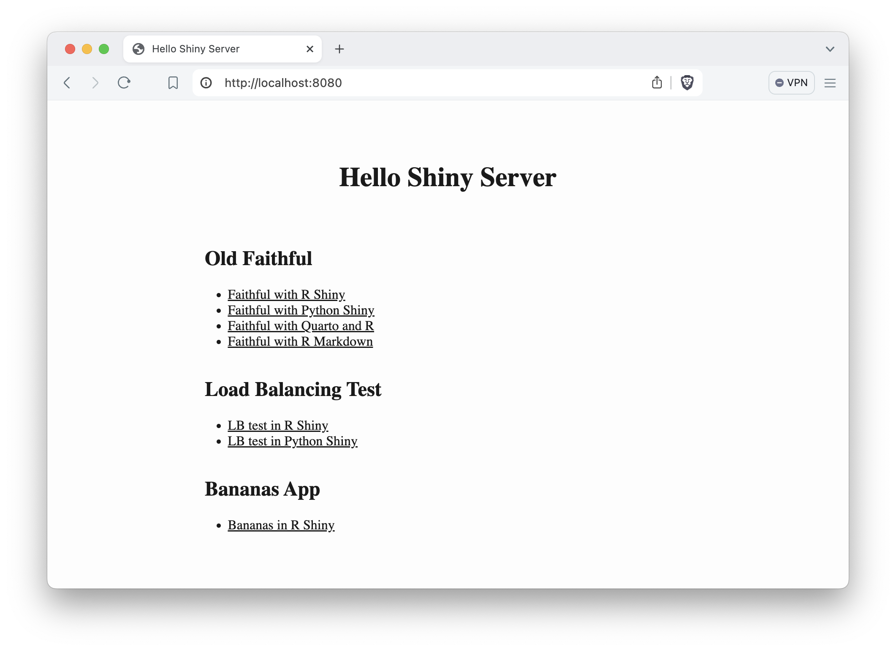
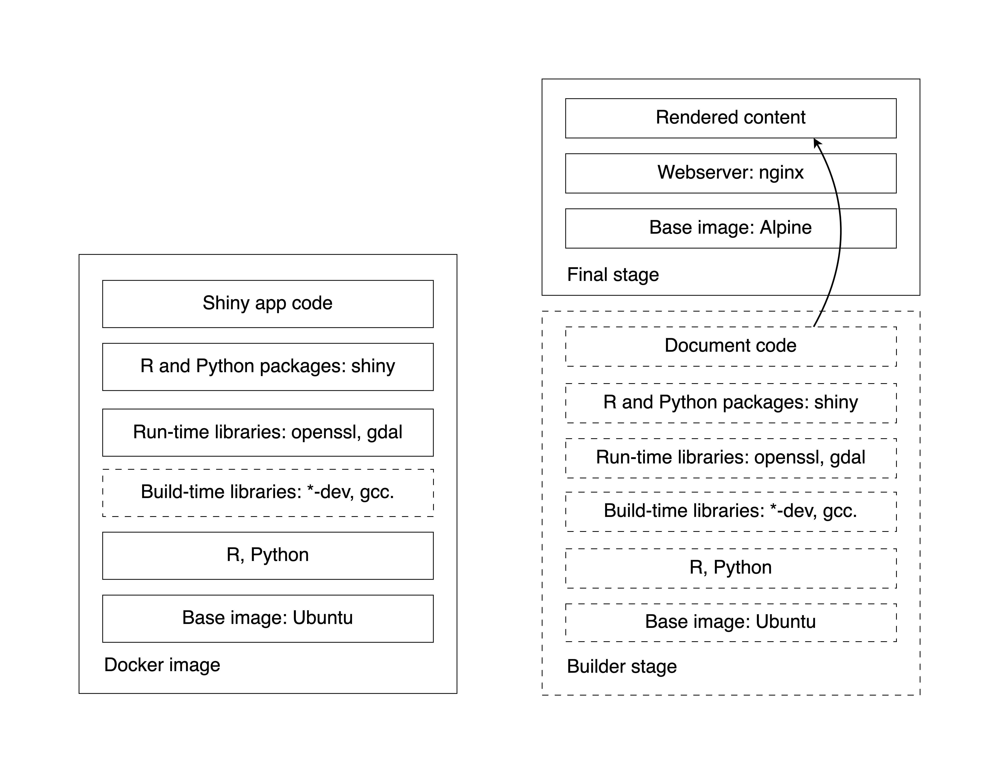

## Parent Images {#part2-parent-images}

We have reviewed Docker basics and how to dockerize a very simple Shiny app.
For anything that is a little bit more complex, you will have to manage
dependencies. Dependency management is one of the most important aspects
of app development with Docker. And it begins with finding the right parent
image as the basis of the rest of your Dockerfile.

The ground zero for Docker images is the reserved and explicitly empty 
image called `scratch`. `FROM scratch` is used for hosting super minimal images 
containing a single binary executable or as the foundation of common base images 
such as `debian`, `ubuntu` or `alpine`. 

Debian\index{Debian Linux} is a Linux distribution that's composed entirely of free and open-source 
software and is a community project. Ubuntu\index{Ubuntu Linux} is derived from Debian and is 
commercially backed by Canonical. Ubuntu uses the same APT packaging system as 
Debian and many packages and libraries from Debian repositories.
Both of these Linux distributions are loved for their versatility and 
reliability, and the huge user base ensures first class community support.

Alpine Linux\index{Alpine Linux} is a minimal distribution independent of Debian and other
distributions. It was designed with a focus on simplicity, security, and 
efficiency. This distribution has a very compact size, and therefore is
a popular choice for embedded systems and IoT devices. This distribution
is also community maintained.

Here are the sizes for these three images. Debian is the largest, Ubuntu in
the middle, and the Alpine being more than 10 times smaller:

```bash
REPOSITORY    TAG       IMAGE ID       CREATED       SIZE
debian        12.6      7b34f2fc561c   7 days ago    117MB
ubuntu        24.04     35a88802559d   4 weeks ago   78.1MB
alpine        3.20      a606584aa9aa   2 weeks ago   7.8MB
```

Many of the commonly used R and Python parent images use Debian/Ubuntu or Alpine
as the starting point. The general trade-off between these two lineages
comes down to convenience vs. minimalism. Ubuntu and its derivatives tend to be
much larger in size, but build times can be considerably faster due to very
mature package management system and the availability of pre-built binaries.

Alpine-based images, however, tend to be much smaller, almost bare bones.
Alpine uses different compilers that Ubuntu so you'll often have to build and 
compile your packages from source. This can be tedious and 
time consuming. However, its small size reduces the surface area for 
potential attackers and as a result the images tend to be less vulnerable.

The final image size is important to consider, but images based on the same
parent image share lots of their layers anyways, so the images can pack 
much tighter on your hard drive than you might think based on their size without 
subtracting common layers. Also,the size advantage of the Alpine 
distribution evaporates quickly as you start adding R and Python libraries. 
Some packages will take up more space than the parent image itself.

### Popular Parent Images for R {#part2-parent-images-r}

Let's see some of the most popular base R images based. Here is the 
output from `docker images` after pulling each of these Docker images:

```bash
REPOSITORY       TAG       IMAGE ID       CREATED         SIZE
r-base           4.4.1     16511f39cdb4   3 weeks ago     833MB
rocker/r-base    4.4.1     22b431698084   3 weeks ago     878MB
rocker/r-ver     4.4.1     9bb36eff1caa   3 weeks ago     843MB
rocker/shiny     4.4.1     a90ccd5c09b9   3 weeks ago     1.58GB
rocker/r2u       24.04     1441545ed6df   2 weeks ago     800MB
rhub/r-minimal   4.4.1     1e280d0205b7   3 weeks ago     44.9MB
```

The official `r-base` image is an R installation built on top of Debian. It is
maintained by the Rocker community (<https://rocker-project.org/>, @rocker).
This `r-base` image is like the `rocker/r-base`, these two images are built 
from the same Dockerfile, but with different build tools.
The Debian Linux distribution is more cutting edge than Ubuntu.
This means it has unstable repos added and it receives updates faster.
It is for those who like to live on the cutting edge of development.

For those who value stability more, the Ubuntu based images could be better
suited. Such as the Rocker versioned stack, `rocker/r-ver`, which emphasizes
reproducibility. This stack has both AMD64 and experimental ARM64 support
for R version 4.1.0 and later. For the AMD64 platform, it serves compiled 
binaries of R packages that makes package installs speedy.

The default CRAN mirror for `rocker/r-ver` is set to the Posit Public Package Manager\index{Posit Public Package Manager}
(P3M, <https://p3m.dev/>, previously called RStudio Package Manager or RSPM).
To ensure reproducibility, the non-latest R version images 
install R packages from a fixed snapshot of the CRAN mirror at a given date. 
So you'll end up with the same package versions no matter when you build your image.

The `rocker/shiny` image is based on the `rocker/r-ver` stack and comes with
Shiny related packages and Shiny Server Open Source installed. This makes it the 
beefiest of all the images presented. It has 68 packages available instead of 
the 31 within the `r-base` and `r-ver` stacks (14 base and 15 recommended packages). 
The images so far have been tagged by the R version that is inside the image, 
e.g. `4.4.1`.

The `rocker/r2u` is based on Ubuntu as well, and it brings Ubuntu binaries for
CRAN packages fully integrated with the system package manager (`apt`).
When you use `install.packages()` it will call `apt` in the background.
This has the advantage that system dependencies are fully resolved, i.e. no need
to guess and manually install them. Installations are also reversible.
It uses the CRAN mirror at <https://r2u.stat.illinois.edu>.
Keep in mind that packages and R itself are generally the highest available version.
Therefore, the image tag is not based on the R version but based on the 
Ubuntu LTS (Long Term Support) version, like `24.04`.

All the Rocker images pack utilities that help with command line tasks,
such as installing packages via `install.r` and `installGithub.r`,
all part of the `littler` project [@R-littler]. There is even a command line
tool for Shiny, so instead of 
`CMD ["R", "-e", "shiny::runApp(host='0.0.0.0', port=3838)"]`
you can use `CMD ["shiny.r", "-o", "0.0.0.0", "-p", "3838"]` in your Dockerfile.

Finally, the `rhub/r-minimal` image is based on Alpine Linux and is the tiniest 
available image for R. This feat is achieved by not having recommended R packages
installed (it has a total of 14 required packages), it does not have any 
documentation or translations, no X11 window support.
It does not even have C, C++ or Fortran compilers. So if an R package relies on
compiled code, first you have to install a compiler, then later uninstall it
to keep the image size minimal. The `installr` script provided as part of the
image helps with the installation and clean-up of build time dependencies,
see `installr -h` for the available options.

If you are looking for Linux distributions other than what we listed so far
(Debian, Ubuntu, Alpine), take a look at the 
[`rstudio/r-base`](https://github.com/rstudio/r-docker) images
that bring versioned base R to many Linux distributions, e.g. CentOS,
Rocky Linux, and OpenSUSE.

### Popular Parent Images for Python {#part2-parent-images-python}

The official Python images are maintained by the Python community
and are either based on Debian or Alpine Linux. Here are the most commonly used
variants:

```bash
REPOSITORY   TAG          IMAGE ID       CREATED       SIZE
python       3.9          8912c37cec43   12 days ago   996MB
python       3.9-slim     b4045d7da52e   12 days ago   125MB
python       3.9-alpine   893ee28ab004   12 days ago   53.4MB
```

The `python:<version>` image is the largest and is the most general supporting
all kinds of use cases and is recommended as a parent image. It contains the 
common Debian packages and compilers.

The `python:<version>-slim` version contains only the minimal Debian packages 
needed to run Python itself. It does not contain the compilers for modules 
written in other languages. This is the reason for the image's reduced size.

The `python:<version>-alpine` is based on Alpine and therefore is the smallest.
It is similarly bare bones as the minimal R image.

## Installing System Libraries {#part2-install-system-libraries}

System libraries are required for different purposes. Some libraries are needed
during build time. While others are needed at run time.
Say your R or Python package requires compilation or needs
to dynamically link to other system libraries. In these cases you have to
build your package using compilers (C, C++, Fortran, Rust) and other build
time dependencies. System libraries used at build time includes header files and 
tend to have extra dependencies. These build time system libraries are 
named with a `*-dev` or `*-devel` postfix.

Once your R or Python package has been compiled, you don't need the build time
libraries any more. However, you need the run time libraries. For example
if your package needs to be built with `libcurl4-openssl-dev`, the run time
dependency becomes `libcurl4`. The run time dependencies tend to be much smaller
and have fewer dependencies. These will have no conflict with other run time
libraries because of the lack of headers included.

### Manually Installation {#part2-install-system-libraries-manual}

FIXME: Review the Python specific parts.

The [Python Wheels](https://pythonwheels.com/)\index{Wheels, Python}
project offers binary Python packages. R binaries can be found on 
CRAN for Windows and Mac OS X. But CRAN does not offer binaries for various
Linux distributions for the obvious complexity involved in that.
The [Posit Public Package Manager](P3M, <https://p3m.dev/>)\index{Posit Public Package Manager} provides pre-built binary 
packages for R and Python. It supports various Linux distributions, including
Debian and Ubuntu. The [R Universe](https://r-universe.dev/search/)
project provide binaries for CRAN and GitHub packages for Windows, Mac OS X,
and in most cases for WebAssembly\index{WebAssembly} that is suitable for Shinylive applications.
The R Universe project only provides binaries for R packages on Ubuntu 
using the latest R version. 

R and Python packages, once compiled into a binary file, provide metadata about 
the run time dependencies. You can find the required system libraries on the 
website of a given repository or package manager. Alternatively, you can try
installing the package without its requirements and follow the string of
error messages to see what is it that you need to install as a prerequisite.

This GitHub repository lists system requirements for R packages: 
[rstudio/r-system-requirements](https://github.com/rstudio/r-system-requirements).
The primary purpose of this database is to support the Posit Public Package Manager.
To get programmatic access to the database, you can call the 
Posit Public Package Manager's API to request the system requirements.
For example, for the `curl` R package [@R-curl], you can query the API as
`https://p3m.dev/__api__/repos/1/packages/curl/sysreqs?distribution=ubuntu`.
Replace the `curl` and `ubuntu` parts to get results for other R packages and
Linux distributions. The HTTP `GET` request will result in a JSON response listing 
the libraries with the install script needed on Ubuntu (try pasting the
link into the browser address line):

```json
{
  "name": "curl",
  "install_scripts": [
    "apt-get install -y libcurl4-openssl-dev",
    "apt-get install -y libssl-dev"
  ]
}
```

You can also utilize the `pak` R package [@R-pak] to query system requirements:

```R
pak::pkg_sysreqs("curl", sysreqs_platform="ubuntu")
# -- Install scripts ---------------------------- Ubuntu NA --
# apt-get -y update
# apt-get -y install libcurl4-openssl-dev libssl-dev
#
# -- Packages and their system dependencies ------------------
# curl - libcurl4-openssl-dev, libssl-dev
```

Include these libraries in your Dockerfile as:

```dockerfile
RUN apt-get update && \
    apt-get install -y --no-install-recommends \
        libcurl4-openssl-dev \
        libssl-dev \
    && rm -rf /var/lib/apt/lists/*
```

When using `apt-get` (the older and stable version of `apt`) the first command is
always `apt-get update` which look for updates in the the package lists of
the package repositories. This way the system will know if an update is necessary
and where to find the individual packages. Next `apt-get install <package-name>` 
is called with a few flags: `-y` means that we answer yes to all the prompts, 
whereas `--no-install-recommends` will  prevent unnecessary recommended packages 
from being installed. The last bit cleans up the package lists downloaded by
`apt-get update` which are stored in the `/var/lib/apt/lists` folder.
All these three commands are chained together with `&&` and we used `\` for
breaking up single line commands to multiple lines for better readability
(the backslash escapes a newline character). This arrangement helps organize 
the packages and you can also comment them out as needed. 

You could put all of these chained commands in a separate `RUN`
line, but that is not recommended. Having a single `RUN` instruction will
lead to a single image layer. But what is most important is that the update and
install steps should not be separated. Imagine that you update the package lists
and now the resulting layer is added to the Docker cache.
The next time you add another package to install and rebuild your image.
The update command is cached and will not be rerun by default. As a result,
you might end up with an outdated version of the package.

### Automated Dependency Resolution with r2u {#part2-install-system-libraries-r2u}

If you are using R on Ubuntu, the [r2u](https://eddelbuettel.github.io/r2u/)\index{r2u}
project greatly facilitate dependency management.
It uses the Debian package format for R packages for latest R version on
various Ubuntu LTS platforms. This resolves all the system dependencies through 
using the `.deb` binary package format that combines together the pre-built binary 
package with the metadata about the dependencies. Then the Debian/Ubuntu package 
manager (`apt`) can do the rest.

The binary packages are base on P3M where available or built natively.
Selected BioConductor packages are also built natively on the project servers. 
The server hosting the `.deb` files is set up as a proper `apt` repository
with a signed Release file containing metadata that can be used to 
cryptographically validate every package in the repository. This file guarantees 
that the packages you receive are the one you expected and there has been no 
tampering with it during download.

Because the R packages now live as first class
citizens on Ubuntu, uninstalling packages would not unnecessarily remove the 
shared dependencies that other packages depend on. With the r2u setup and
using the `rocker/r2u` images, you can simply call `install.packages("curl")`
and `apt` will sort out the dependencies for you in the background.

### Dependencies on Alpine Linux {#part2-install-system-libraries-alpine}

The Alpine Linux has a package manager called `apk` that is different from
Debian's and Ubuntu's `apt`. This likely means that you might have to work 
harder to find all the Alpine-specific dependencies. You can still use the
tools previously mentioned, but will have to find the library for Alpine.
You can also follow the breadcrumbs of the error messages of missing dependencies.
However, the general idea is similar when it comes to working with the Dockerfile:

```dockerfile
FROM rhub/r-minimal:4.4.1

RUN apk add --no-cache --update-cache \
     --repository http://nl.alpinelinux.org/alpine/v3.11/main \
    autoconf=2.69-r2 \
    automake=1.16.1-r0 && \
    installr -d \
    -t "libsodium-dev curl-dev linux-headers gfortran autoconf automake" \
    -a libsodium \
    shiny plotly e1071
[...]
```

First we declare the minimal parent image, then use a `RUN` instruction to add
libraries from the Alpine repository. `autoconf` and `automake` is required for
building the R packages (`shiny`, `plotly`, and `e1071`). This example is
taken from the minimal Dockerfile for the [Bananas example app](https://github.com/h10y/bananas).

The next pieces uses the `istallr` utility that comes with the `rhub/r-minimal`
image and it's usage is explained on the GitHub site: <https://github.com/r-hub/r-minimal>.
The `-d` flag will install C and C++ compilers (`gcc`, `musl-dev`,`g++`) 
temporarily, i.e. those will be removed after the successful 
compilation and installation of the R packages.

The `-t` option lists Alpine packages to be installed temporarily (a.k.a. 
build time dependencies), and the `-a` option lists Alpine packages to keep
(a.k.a. run time dependencies). The built in cleanup feature keeps the image
sizes small in line with the goal of the parent image's purpose.

You can also list not only CRAN packages but different "remotes", like 
`tidyverse/ggplot2` for development version of `ggplot2` from GitHub, 
or `local::.` to install from a local directory.

The rest of the Dockerfile follow the same patterns as what we saw before. Adding 
a non-root user, defining the work directory, copying the Shiny app files
from the build context to the image's file system, setting owners for the files,
switching to the non-root user, exposing port 3838 and defining the default
command to run that calls `shiny::runApp()`:

```dockerfile
[...]
RUN addgroup --system app && \
    adduser --system --ingroup app app
WORKDIR /home/app
COPY app .
RUN chown app:app -R /home/app
USER app
EXPOSE 3838
CMD ["R", "-e", "shiny::runApp(host='0.0.0.0', port=3838)"]
```

The Dockerfile for the Faithful Shiny app (<https://github.com/h10y/faithful>)
is somewhat simpler:

```dockerfile
FROM rhub/r-minimal:4.4.1
RUN installr -d \
    -t "zlib-dev cairo-dev" \
    -a "cairo font-liberation" \
    Cairo \
    shiny
RUN addgroup --system app && \
    adduser --system --ingroup app app
WORKDIR /home/app
COPY app .
RUN chown app:app -R /home/app
USER app
EXPOSE 3838
CMD ["R", "-e", "shiny::runApp(host='0.0.0.0', port=3838)"]
```

The reason why we need the `Cairo` package [@R-Cairo] besides `shiny` is because the minimal
image has no X11 graphic device support which is used to display base R plots, like histograms.
Instead of X11, we can use the Cairo Graphics Library. You can see how we list
the build time `cairo-dev` library and the run time `cairo` for the R package.

The installation of the system packages and the general lack of available 
binary packages contributes to the longer build times. The Faithful example
took 5 minutes to build with `rhub/r-minimal` compared to 16 seconds with
`rocker/r2u` and the final image size was 230 MB compared to 975 MB. 
The Bananas app took 10.4 minutes vs. 28 seconds and resulted in an image of
size 113 MB as opposed to 909 MB.

As you can see, the image build time is significantly longer, while the minimal
image size is multiplying relative to the parent image's 45 MB size. The absolute
increase in the Ubuntu based image's size is similar but it is less noticeable
in relative terms.

Your Shiny apps are likely to have more dependencies that the examples we are 
using in this book. You will have to decide if the benefits that a minimal 
image provides will overweight the increased complexity and development time
required to maintain minimalist Shiny images.

## Installing R Packages {#part2-install-r-pkg}

The wealth of contributed R packages can supercharge Shiny app
development. This also means that you have to manage these dependencies.
In the previous sections, we have already hinted at installing these packages.
We will now see the different ways of installing R packages.

### Explicitly Stating Dependencies {#part2-install-r-pkg-explicit}

The first approach is to use `RUN` instructions in the Dockerfile to
install the required packages. You can use the `R -q -e "<expression>"`
pattern to use any R expression you would normally use in your R sessions
to install packages. The `-q` flag stands for quiet and means to not print out 
the startup message. The `-e` option means to execute the R expression that 
follows it and then exit. The `Rscript -e "<expression>"` is another way to
evaluate the expressions without echoing the expression itself. 
Most often we use the built in `install.packages()`
function and the different options from the `remotes` package [@R-remotes].

```dockerfile
RUN R -q -e "install.packages(c('shiny', 'remotes'))"
RUN R -q -e "remotes::install_github('tidyverse/ggplot2')"
RUN R -q -e "remotes::install_local('.')"
```

The Rocker images have the `littler` command line utility installed.
The previous code piece can be written as:

```dockerfile
RUN install2.r --error --skipinstalled shiny remotes
RUN installGithub tidyverse/ggplot2
RUN install2.r "."
```

The `--error` flag will throw an error when installation is unsuccessful
instead of a warning, `--skipinstalled` will skip installing already installed 
packages.

If installing from a private GitHub repository, `remotes` is going to use 
the `GITHUB_PAT` environment variable to authenticate with GitHub to be able to
download and install the package. You have to add the following line to your 
`Dockerfile` before the `RUN` instructions that define the install from GitHub:

```dockerfile
ARG GITHUB_PAT
```

To pass the `GITHUB_PAT` at image build, use the following commands:

```bash
  export GITHUB_PAT=ghp_xxxxxxxxxx
docker build -t <image-name> --build-arg="GITHUB_PAT=${GITHUB_PAT}" .
```

The `pak` R package [@R-pak] is planned to replace `remotes` in the future.
It provides very similar functionality and improvements, like parallel downloads,
caching, safe dependency solver for packages and system dependencies using
the P3M database by creating an installation plan before downloading any packages.
Not relevant for Linux containers, but `pak` can even handle locked package DLLs 
on Windows. Let's see how these common install statements would look using `pak`
(you don't need `remotes` because of using `pak`):

```dockerfile
RUN R -q -e "install.packages('pak')"
RUN R -q -e "pak::pkg_install('shiny'))"
RUN R -q -e "pak::pkg_install('tidyverse/ggplot2')"
RUN R -q -e "pak::pkg_install('.')"
```

The `installr` utility shipped with the `rhub/r-minimal` image uses `pak`
to install packages. The `-p` flag will remove `pak` after the installation.
You can do:

```dockerfile
RUN installr -p shiny tidyverse/ggplot2 local::.
```

You can pin package versions using Git references, e.g. `tidyverse/ggplot2@v1.0.0`,
or using `remotes::install_version()`.

These functions allow you to provide repositories as argument. But more often,
the repositories are set globally as part of `options()`. You can include
the list of repositories in the `Rprofile.site` file:

```R
# Rprofile.site
local({
    r <- getOption("repos")
    r["p3m"] <- "https://p3m.dev/cran/__linux__/noble/2024-07-09"
    r["archive"] <- "https://cranhaven.r-universe.dev"
    r["CRAN"] <- "https://cloud.r-project.org"
    options(repos = r)
})
```

The P3M repository is set for Ubuntu 24.04 (Noble) with a snapshot of 
CRAN taken on July 9th, 2024. This effectively freezes package versions to 
enhance reproducibility. This way of pining maximum package versions is also
called "time travel". The [CRAN Haven](https://www.cranhaven.org) 
repository is for recently archived CRAN packages. These archived packages might
find their way back to CRAN after addressing the issues for which those got 
archived. This repository can handle such temporary inconveniences.
`COPY` this file into the `/etc/R` folder on the Rocker images:

```
COPY Rprofile.site /etc/R
```

As you develop your Shiny app, you will have to occasionally update the `Dockerfile`
to add manually in any new dependencies. If you forget to do this you will be
reminded by an error the next time you build your Docker image and run your app.

### Using the DESCRIPTION File {#part2-install-r-pkg-description}

You have seen how to use `remotes::install_local()` to install a dependency
from a local directory or a `.tar.gz` source file. The list of packages to be
installed is determined by the `DESCRIPTION` file that is at the base of any
package folder. It lists the dependencies of the packages.

Packages listed under the `Imports` field are installed and needed by the
package. Other packages listed under the `Suggests` field are needed for 
development but are not essential for using the package.

A commonly used hack in the R community is to highjack the package development
tooling to simplify installation of the codebase even if it is
not necessarily structured as a package. The only thing you need for
`remotes::install_local()` and similar functions to work is the 
`DESCRIPTION` file. You don't even need all the customary fields like title,
description, or package maintainer in this file.

For the Bananas app, we need `shiny`, `plotly` and the `e1071` package listed
under `Imports`. Put this in the `DESCRIPTION` file:

```text
Imports: e1071, plotly, shiny
```

In the `Dockerfile` you need to `COPY` the `DESCRIPTION` file into the
file system of the image, then call the `remotes::install_deps()` function.
The `upgrade='never'` argument will prevent installing newer versions of existing
packages, thus cutting down unnecessary install time:

```dockerfile
FROM rocker/r2u:24.04

COPY app/DESCRIPTION .
RUN R -q -e "remotes::install_deps(upgrade='never')"

[...]
```

You can use the `Rprofile.site` to specify your preferred repositories.
The `remotes` functions will respect those settings.

Using the `DESCRIPTION` file lets you record the dependencies
outside of your `Dockerfile`. As you develop your Shiny app, you have to update 
the `DESCRIPTION`. When the file changes, Docker will invalidate the cache and
install the dependencies with the new packages included.

### Using renv {#part2-install-r-pkg-renv}

The `renv` package [@R-renv] is a dependency management toolkit for R. 
You can create and manage R libraries in your local project and record the state
of these libraries to a lockfile. This lockfile can be used later to restore
the project, thus making projects more isolated, portable, and reproducible.

If you are using `renv` with your Shiny projects, you are probably already
familiar with the workflow. You can discover dependencies with `renv::init()` 
and occasionally save the state of these libraries to a lockfile with 
`renv::snapshot()`. The nice thing about this approach is that the exact version 
of each package is recorded that makes Docker builds reproducible as well.

The renv package has a few different snapshot modes.
The default is called "implicit". This mode adds the intersection of all
your installed packages and those used in your project as inferred by
`renv::dependencies()` to the lockfile. 

The other mode is called "explicit" snapshot that only captures packages 
that are listed in the project `DESCRIPTION`.
The "custom" model lets you specify filters for modifying the implicit
snapshot, so that you will not end up with the kitchen sink of packages in
your Docker image. Read the _Using renv with Docker_ vignette of `renv` for 
more useful tips.

Once you have the lockfile in your project folder, you can use it like this:

```dockerfile
[...]
RUN install.r renv
COPY app/renv.lock .
RUN R -q -e "options(renv.consent=TRUE);renv::restore()"
[...]
```

You have to install `renv`, copy the `renv.lock` file over, and use the 
`renv::restore()` command. The `renv.consent` option gives consent to `renv`
to write and update certain files.

`renv` pins the exact package versions in the lockfile. This is necessary for
reproducibility. But full reproducibility is much harder than just the version
of R and the package versions. You have to think about the operating system,
your system dependencies, and even the hardware [@Rodrigues2023].

Exact package versions could take quite long to install. The reason for that is
that binary version of the packages might disappear from the package repositories.
In that case, `renv` will install it from source and it will need possible
build time dependencies. The older the lockfile gets, the more problematic
it can be to install it without hiccups.

### Using deps {#part2-install-r-pkg-deps}

`renv` goes to great lengths to make your R projects perfectly
reproducible. This requires knowing the exact package versions and the
source where it was installed from (CRAN, remotes, local files). This
information is registered in the lock file, which serves as the manifest
for recreating the exact replica of the environment.

Full reproducibility is often required for reports, markdown-based
documents, and scripts. These are loosely defined projects combined with
strict version requirements, often erring on the side of "more
dependencies are safer".

On the other end of the spectrum, you have package-based development.
This is the main use case for dependency management-oriented packages,
such as `remotes` and `pak`.

In this case, exact versions are managed only to the extent of avoiding
breaking changes (given that testing can surface these). So what we have
is a package-based workflow combined with a "no breaking changes"
philosophy to version requirements. This approach often leads to leaner
installation.

If you are developing your Shiny app as an R package, then the
package-based development is probably the way to go. You already have a
`DESCRIPTION` file, so just keep developing.

But what if you are not writing an R package and wanted to combine the best
of both approaches? A loosely defined project with just strict-enough
version requirements without having to manage a `DESCRIPTION` file.
Why would you need a `DESCRIPTION` file when you have no R package? 
Also, there is a lot that a `DESCRIPTION` file won't do for you.

You can manage dependencies with the `deps` [@R-deps] package by decorating your 
existing R code with special, roxygen-style comments. For example, here is
how you can specify a remote, and alternative CRAN-like repository, pin
a package version, or install from a local source:

```R
#' @remote analythium/rconfig@CRAN-v0.1.3
rconfig::config()

#' @repo sf https://r-spatial.r-universe.dev
library(sf)

#' @ver rgl 0.108.3
library(rgl)

#' @local mypackage_0.1.0.tar.gz
library(mypackage)
```

You can exclude development packages with the `@dev` decorator and list
system requirements following the `@sys` decorator.

`deps` helps to find all dependencies from our files using `renv::dependencies()`.
It writes these dependencies into the `dependencies.json` file, including  the 
information contained in the comments when using the `deps::create()` function.
The decorators make your intent explicit, just like if we were writing an
R package. But we do not need to manually write these into a file and
keep it up-to-date. We can just rerun `create()` to update the JSON
manifest file.

`create()` crawls the project directory for package dependencies. It
will amend the dependency list and package sources based on the
comments. The other function in `deps` is `install()` which looks for the `dependencies.json`
file in the root of the project directory (or runs `create()` when the JSON file 
is not found) and performs dependency installation according to the
instructions in the JSON file.

Here is the Dockerfile usage where first we install the `deps` package and
copy the `dependencies.json`. The next `RUN` instruction is needed if you
had system requirements specified via `@sys`. The `jq` package is used to
parse the JSON and install any of these libraries. Finally, the line with
`deps::install()` that performs the R package installation based on the JSON file:

```dockerfile
[...]
RUN install.r deps
COPY app/dependencies.json .

RUN apt-get update && \
    apt-get install -y --no-install-recommends \
    jq
RUN apt-get update && \
    apt-get install -y --no-install-recommends \
    $( jq -r '.sysreqs | join(" ")' dependencies.json )

RUN R -q -e "deps::install()"
[...]
```

The `deps` package comes with a small command line utility that can be
added to the dockerfile to simplify the installation process:

```dockerfile
FROM rocker/r2u:24.04

RUN install.r pak rconfig deps
RUN cp -p \
    $(R RHOME)/site-library/deps/examples/03-cli/deps-cli.R \
    /usr/local/bin/deps-cli
RUN chmod +x /usr/local/bin/deps-cli

COPY app .

RUN deps-cli all
[...]
```

The `deps-cli all` command will analyze dependencies and install system and R 
dependencies in 1 line. It also looks for the following files before attempting 
to auto-detect dependencies in the absence of the `dependencies.json`: 
`renv.lock`, `pkg.lock`, and `DESCRIPTION`. `pkg.lock` is the lockfile created 
by `pak`.

## Python Requirements {#part2-install-python}

FIXME: Add content here.

- renv <https://cran.r-project.org/web/packages/renv/vignettes/python.html>
- pip
- Conda, venv? Docker's purpose is isolation, so multiple venv's do not make sense in containers according to some posts. Maybe explain that here?
- mention shinylive installs
- how to reuse `.cache` by mounting it: <https://testdriven.io/blog/docker-best-practices/#cache-python-packages-to-the-docker-host>

## Dynamic Shiny Apps {#part2-dynamic-shiny-apps}

Dynamic Shiny app require a runtime environment on a host server that can support
the HTTP and websocket connections required for R and Python to communicate with
the client (Fig. \@ref(fig:part2-shiny-lifecycle)). Now that we have
reviewed Shiny app development and general principles of working with Docker,
we can dive into specific examples. We will use the Old Faithful example.
You can follow along using the code in the repository at <https://github.com/h10y/faithful>.

There are many examples organized into folders inside the repo. Consult the
readme file about each of these. In general, we provide Docker images
for the dynamic Shiny app examples in the form of 
`h10y/faithful/<folder-name>:latest`. You can use `docker run` to pull and 
start the Shiny app as:

```bash
docker run -p 8080:3838 ghcr.io/h10y/faithful/<folder-name>:latest
```

Visit `http://localhost:8080` in your browser to try the app.

### R {#part2-dynamic-shiny-apps-r}

The simplest containerized app follows the Dockerfile examples for R that you
have seen so far. We provide two Dockerfiles, one for the `rocker/r2u` and one
for the `rhub/r-minimal` image within the `r-shiny` folder. Follow this example
if your Shiny app consists of a single or multiple files. Put those files in the
`app` folder. Pick your favorite way of specifying your dependencies, and edit the
`Dockerfile` accordingly. The `CMD` instruction for this type of setup is
`shiny::runApp()`.

```dockerfile
FROM rocker/r2u:24.04

# Add here your dependencies
RUN R -q -e "install.packages('shiny')"

RUN groupadd app && useradd -g app app
WORKDIR /home/app
COPY app .
RUN chown app:app -R /home/app
USER app
EXPOSE 3838
CMD ["R", "-e", "shiny::runApp(host='0.0.0.0', port=3838)"]
```

If your Shiny app is organized as nested files following the structure expected
by the `rhino` package, check the `r-rhino` folder for an example.
`rhino` relies on the `renv` package for dependency management, so edit the
Dockerfile accordingly. The `CMD` instruction for a Rhino app is the same as
for the `r-shiny` setup, because Rhiny uses an `app.R` file as its entrypoint
that is being recognized by Posit products as a Shiny app. `shiny::runApp()`
will also recognize it as a Shiny app. The `app.R` file has a single 
command, `rhino::app()`, that returns a Shiny app object.

If you follow a package based development for your Shiny app, check out the
`r-package`, `r-golem`, and `r-leprechaun` folders for Dockerfile examples.
Here is the `r-package` example that does not follow any specific framework,
but uses the `DESCRIPTION` file to define its dependencies that will be picked
up by `remotes::install_local()`. At the end, we call a function from the package
itself to launch the Shiny app, i.e. `faithful::run_app()`:

```dockerfile
FROM rocker/r2u:24.04

RUN groupadd app && useradd -g app app

RUN R -q -e "install.packages('remotes')"
COPY faithful faithful
RUN R -q -e "remotes::install_local('faithful')"

USER app
EXPOSE 3838
CMD ["R", "-e", "faithful::run_app(host='0.0.0.0', port=3838)"]
```

The `install.packages('remotes')` line is not necessary for the `rocker/r2u`
image because it comes preinstalled. But we left the line there so that the
Dockerfiles can be used with other parent images that might not have `remotes`
available.

The Golem and Leprechaun framework based Dockerfiles are slight variations of 
this. Here is the one with Golem\index{Golem}:

```dockerfile
[...]
COPY faithfulGolem faithfulGolem
RUN R -q -e "remotes::install_local('faithfulGolem')"
[...]
CMD ["R", "-e", "faithfulGolem::run_app( \
    options=list(host='0.0.0.0', port=3838))"]
```

The same with Leprechaun\index{Leprechaun}:

```dockerfile
[...]
COPY faithfulLeprechaun faithfulLeprechaun
RUN R -q -e "remotes::install_local('faithfulLeprechaun')"
[...]
CMD ["R", "-e", "faithfulLeprechaun::run( \
    options=list(host='0.0.0.0', port=3838))"]
```

### Python {#part2-dynamic-shiny-apps-python}

The Python version of the app follows similar principles. You can find it in the 
`py-shiny` folder. The parent image is `python:3.9`, and dependency management 
is done via `pip` and the `requirements.txt` file. Edit this file as the 
starting point for your single or multiple file Python for Shiny apps. 
The `CMD` instruction calls `uvicorn`\index{Uvicorn} to host the app:

```dockerfile
FROM python:3.9

# Add here your dependencies
COPY app/requirements.txt .
RUN pip install --no-cache-dir --upgrade -r requirements.txt

RUN groupadd app && useradd -g app app
WORKDIR /home/app
COPY app .
RUN chown app:app -R /home/app
USER app
EXPOSE 3838
RUN mkdir .config
ENV MPLCONFIGDIR=/home/app/.config
ENV HOME=/home/app
CMD ["uvicorn", "app:app", "--host", "0.0.0.0", "--port", "3838"]
```

### R Markdown {#part2-dynamic-shiny-apps-rmd}

Hosting R Markdown\index{R Markdown} documents with the `runtime: shiny` is very similar to hosting
regular Shiny apps. You need `pandoc`\index{Pandoc} as a system requirement that you can
install with the image operating system's package manager. The `CMD` instruction
uses `rmarkdown::run()` to render and run the document every time a user 
connects to it:

```dockerfile
FROM rocker/r2u:24.04
RUN apt-get update && \
    apt-get install -y --no-install-recommends \
    pandoc \
    && rm -rf /var/lib/apt/lists/*
RUN R -q -e "install.packages(c('shiny', 'rmarkdown'))"
RUN groupadd app && useradd -g app app
WORKDIR /home/app
COPY app .
RUN chown app:app -R /home/app
USER app
EXPOSE 3838
CMD ["R", "-e", "rmarkdown::run( \
    shiny_args = list(port = 3838, host = '0.0.0.0'))"]
```

The prerendered\index{Prerendered Shiny runtime} option with `runtime: shinyrmd` require a rendering step 
by calling `rmarkdown::render()` before the final `rmarkdown::run()` 
in the `CMD`. Note that the `RMARKDOWN_RUN_PRERENDER` is set to `0` that tells 
`rmarkdown` to not render the document for every user. The HTML is rendered only 
once so only the reactive components need to be dealt with:

```dockerfile
FROM rocker/r2u:24.04
RUN apt-get update && \
    apt-get install -y --no-install-recommends \
    pandoc \
    && rm -rf /var/lib/apt/lists/*
RUN R -q -e "install.packages(c('shiny', 'rmarkdown', 'deps'))"
RUN groupadd app && useradd -g app app
WORKDIR /home/app
COPY app .
RUN R -q -e "deps::install(ask=FALSE)"
RUN R -e "rmarkdown::render('index.Rmd')"
RUN chown app:app -R /home/app
USER app
EXPOSE 3838
ENV RMARKDOWN_RUN_PRERENDER=0
CMD ["R", "-e", "rmarkdown::run( \
    shiny_args = list(port = 3838, host = '0.0.0.0'))"]
```

### Quarto with R {#part2-dynamic-shiny-apps-quarto-r}

Using Quarto\index{Quarto} with R to build and image is conceptually very similar to 
R Markdown. First we install `quarto`. There are many ways of installing it,
this is one option. You need `curl` to download the Quarto installer,
we use `gdebi` here to install Quarto from the downloaded `.deb` package.
Once we have Quarto installed, we remove the Gdebi build time dependency.

```dockerfile
FROM rocker/r2u:24.04

RUN apt-get update && apt-get install -y --no-install-recommends \
    pandoc \
    curl \
    gdebi-core \
    && rm -rf /var/lib/apt/lists/*
RUN curl -LO https://quarto.org/download/latest/quarto-linux-amd64.deb
RUN gdebi --non-interactive quarto-linux-amd64.deb
RUN apt-get purge -y gdebi-core && apt-get autoremove -y
RUN install.r quarto shiny deps

RUN groupadd app && useradd -g app app
WORKDIR /home/app
COPY app .

RUN R -q -e "deps::install(ask=FALSE)"

RUN quarto render index.qmd
RUN chown app:app -R /home/app
USER app
EXPOSE 3838
CMD ["quarto", "serve", "index.qmd", "--port", "3838", \
    "--host", "0.0.0.0", "--no-render"]
```

The prerendering uses `quarto render` before `quarto serve` with the 
`--no-render` flag in the `CMD` instruction at the end.

### Quarto with Python {#part2-dynamic-shiny-apps-quarto-python}

The Python version with Quarto works very similarly, the only difference is the
`pip install` part based in the `requirements.txt` file. Otherwise, the Python 
code will be `COPY`-ed over as part of the `.qmd` file. The rendering and serving 
steps are the same:

```dockerfile
FROM python:3.9

RUN apt-get update && apt-get install -y --no-install-recommends \
    pandoc \
    curl \
    gdebi-core \
    && rm -rf /var/lib/apt/lists/*
RUN curl -LO https://quarto.org/download/latest/quarto-linux-amd64.deb
RUN gdebi --non-interactive quarto-linux-amd64.deb
RUN gdebi --non-interactive quarto-linux-amd64.deb

COPY app/requirements.txt .
RUN pip install --no-cache-dir --upgrade -r requirements.txt

RUN groupadd app && useradd -g app app
WORKDIR /home/app
COPY app .
RUN quarto render index.qmd
RUN chown app:app -R /home/app
USER app
EXPOSE 3838
CMD ["quarto", "serve", "index.qmd", "--port", "3838", \
    "--host", "0.0.0.0", "--no-render"]
```

### Shiny Server {#part2-dynamic-shiny-apps-shiny-server}

Shiny Server\index{Shiny Server} is part of the `rocker/shiny` image which is commonly used Docker
parent image for hosting Shiny apps. Shiny Server's Professional version was
originally the enterprise self hosting option for Shiny apps before Posit
Connect. Nowadays, there is only an Open Source version available.
We will talk about non-containerized Shiny Server as a hosting option later.

A nice feature of a containerized Shiny Server compared to previously discussed 
options is that it can host multiple Shiny apps, even R, R Markdown, Python, 
and Quarto apps together in the same container.

FIXME: Provide link to this example.

We'll use the following setup, combining multiple version of our three 
example apps. We include the apps and their version in a hierarchical folder 
structure within the `apps` folder. Besides these files we have an `index.html`
file in the root of the `apps` folder which will provide links to the
different apps inside the nested folders. The `Dockerfile` sits next to the 
`apps` folder:

```bash
├── apps
│   ├── bananas
│   │   └── r-shiny
│   ├── faithful
│   │   ├── py-shiny
│   │   ├── quarto-r-shiny
│   │   ├── r-shiny
│   │   └── rmd-shiny
│   ├── lbtest
│   │   ├── py-shiny
│   │   └── r-shiny
│   └── index.html
└── Dockerfile
```

We use the `rocker/shiny:4.4.1` parent image, install `pip` for Python 3
because we need it to install requirements for the Python Shiny app (`pip` is
not part of the parent image but you already have Python). We use `install2.r`
to manually install R package dependencies.

Shiny Server comes with a few apps pre-installed inside the `/srv/shiny-server`
folder. We remove all these files before we `COPY` the contents from the `apps`
directory over to the image. Once all the files are there, we install
R dependencies by relying on the `deps` packages crawling feature: 
`deps::install(ask=FALSE)` will create a temporary `dependencies.json` file
based on exploring all the dependencies inside the newly populated
`/srv/shiny-server` folder. Next we install Python dependencies.
Finally, in `CMD` we call the executable `/usr/bin/shiny-server` that will start
the Shiny Server. It will by default listen on port 3838.

```dockerfile
FROM rocker/shiny:4.4.1

RUN apt-get update && apt-get install -y \
    --no-install-recommends \
    python3-pip \
    && rm -rf /var/lib/apt/lists/*
RUN install2.r --error --skipinstalled \
    shiny \
    bslib \
    rmarkdown \
    quarto \
    deps
RUN rm -rf /srv/shiny-server/*
COPY ./apps /srv/shiny-server/

RUN R -q -e "deps::install('/srv/shiny-server',ask=FALSE)"
RUN pip install --no-cache-dir --upgrade \
    -r /srv/shiny-server/faithful/py-shiny/requirements.txt

USER shiny
EXPOSE 3838
CMD ["/usr/bin/shiny-server"]
```

You can build the image and start a container as:

```bash
docker build -t shiny-server .
docker run -p 8080:3838 shiny-server
```

Visit `http://localhost:8080` to see the landing page 
(Fig. \@ref(fig:part2-docker-shinyserver). Use the links to navigate the
different apps.

```{r part2-docker-shinyserver, eval=TRUE, echo=FALSE,out.width="100%", fig.pos = "bt", fig.cap="Landing page for the containerized Shiny Server deployment."}

```

## Static Shiny Apps {#part2-static-shiny-apps}

Static Shiny apps can be rendered on your local machine as explained in
\@ref(part2-organizing-shiny-apps).
You'd use `shinylive::export("<input-folder>", "<output-folder>")` in R and 
`shinylive export <input-folder> <output-folder>` in Python to render the static pages for 
Shinylive\index{Shinylive} based on a Shiny app inside the `<input-folder>` folder.
The Quarto examples that used Shinylive were rendered similarly with the
`quarto render <input-file> --output-dir <output-folder>` command.

As you saw before, you need to have a proper webserver hosting the pages and
the required CSS and JavaScript assets to avoid cross-origin resource sharing 
(CORS) issues.
You can upload the static files to any file hosting service, like GitHub or
GitLab Pages, Netlify, or the DigitalOcean App Platform. These platforms all
offer a free tier for hosting static assets. 
The static pages we rendered based on the Old Faithful example are 
deployed to GitHub Pages at <https://h10y.github.io/faithful/>.
You can also set up your self hosted virtual server in the cloud to host 
static files, as you will see in later chapters.

Apart from static hosting, it is possible to put the static files in a Docker
image behind a server process. This option assumes that you have all the build
time requirements for rendering the Shinylive or Quarto with Shinylive
documents.

You can use R or Python as well to serve the static contents using 
the much bulkier parent images of `rocker/r2u` or `python:3.9`. You can use
the `httpuv` R package or the `http.server` Python module.
Although this is clearly doable, it is not necessary and will result in a much 
larger Docker image. The same outcome can be achieved by using a slimmer parent
image and using a multi-stage Docker build process.

We'll use the [OpenFaaS Watchdog](https://github.com/openfaas/of-watchdog) 
for static hosting. It is a single binary file that is built for multiple
architectures and is able to serve static assets among other use cases.
It is well suited for containerized deployments because it provides a healthcheck
mechanism and exposes metrics for observability. You may notice in this
example that we have two `FROM` instructions. The first one takes the
watchdog image, the second one uses a small Alpine linux image.
We `COPY` the contents from the `app` folder of the build context to the
`/home/app` folder of the Alpine image's file system as we did before. 
Then we copy the `fwatchdog` executable file from the watchdog image as well.
The only thing why the Dockerfile looks a bit verbose is because we want to
create a non-privileged user as we did before to harden our image's security.

```dockerfile
FROM ghcr.io/openfaas/of-watchdog:0.10.1 AS watchdog

FROM alpine:3.20
RUN adduser -D app
USER app
WORKDIR /home/app
COPY app .
COPY --from=watchdog /fwatchdog .
ENV mode="static"
ENV static_path="/home/app"
HEALTHCHECK --interval=3s CMD [ -e /tmp/.lock ] || exit 1
CMD ["./fwatchdog"]
```

The same `Dockerfile` would work for all static Shiny output whether that is coming
from Shinylive or Quarto with Shinylive. Just have these files in the `app`
folder and you are done.

The `FROM <image> AS <stage>` specification allows us to
later specify which parent image we refer to. This is done via the
`--from=<stage>` flag for the `COPY` instruction.
The multiple images used in the same `Dockerfile` are called stages, and the
a build is referred to as a _multi-stage build_. It is often used to
use a bulkier image for build purposes and a leaner image to only
copy specific files to. In this case we copy the static contents and an
executable file called `watchdog`.

The environment variables tell the watchdog process to use the static mode and
that the contents are in the `/home/app` folder. The `HEALTHCHECK` specifies that
we should check the existence of the `/tmp/.lock` file every 3 seconds.
This lockfile is created by the watchdog process and its existence is proof
of a healthy server. When you run your containers using container orchestration
tools like Kubernetes, a failed healthcheck results in
creating a new container and removing the old one.

### Multi-stage Builds {#part2-multi-stage-builds}

A common use case for multi-stage builds\index{Multi-stage build} is to run the building/rendering
process in the first stage of the build, and copy over the results -- in our
case the static files -- from the first stage to the final slimmer image
(Fig. \@ref(fig:part2-docker-layers).

```{r part2-docker-layers, eval=TRUE, echo=FALSE,out.width="100%", fig.pos = "bt", fig.cap="Docker layers for single (left) and multi-stage builds (right). Dashed lines are temporary layers."}
if (is_latex_output()) {
    include_graphics("images/02/docker-layers.pdf")
} else {
    
}
```

A Python Shinylive example demonstrates this use case of the multi-stage
build capabilities of Docker. The first stage is called the `builder` and is
based on the general `python:3.9` image. We save the rendered output into the 
`/root/output folder`. 

```dockerfile
FROM python:3.9 AS builder
WORKDIR /root
RUN pip install shinylive
COPY py-shiny/app app
RUN pip install \
    --no-cache-dir --upgrade -r /root/app/requirements.txt
RUN shinylive export app output
[...]
```

The same idea works for Quarto with Shinylive:

```dockerfile
FROM python:3.9 AS builder
RUN apt-get update && apt-get install -y --no-install-recommends \
    pandoc \
    curl \
    gdebi-core \
    && rm -rf /var/lib/apt/lists/*
RUN curl -LO https://quarto.org/download/latest/quarto-linux-amd64.deb
RUN gdebi --non-interactive quarto-linux-amd64.deb
RUN apt-get purge -y gdebi-core && apt-get autoremove -y
RUN pip install shinylive
WORKDIR /root/app
COPY quarto-py-shinylive/index.qmd /root/app/index.qmd
COPY quarto-py-shiny/app/requirements.txt /root/app/requirements.txt
RUN pip install --no-cache-dir --upgrade -r requirements.txt
RUN quarto add quarto-ext/shinylive --no-prompt
RUN quarto render /root/app/index.qmd --output-dir /root/output
[...]
```

The R version is slightly different because of the different packages
that one has to install. Refer to the previous Quarto examples or
the example repository for the corresponding changes.

The second part for the `Dockerfile` for both the Shinylive and the Quarto
with Shinylive examples (R and Python alike) is the following:

```dockerfile
[...]
FROM ghcr.io/openfaas/of-watchdog:0.10.1 AS watchdog

FROM alpine:3.20
RUN adduser -D app
USER app
WORKDIR /home/app
COPY --from=builder /root/output /home/app
COPY --from=watchdog /fwatchdog .
ENV mode="static"
ENV static_path="/home/app"
HEALTHCHECK --interval=3s CMD [ -e /tmp/.lock ] || exit 1
CMD ["./fwatchdog"]
```

This is identical to the previous example where you had the static files
rendered locally and outside of the Docker image, and then included with
`COPY app .`. Instead, you have `COPY --from=builder /root/output /home/app`
here which means: grab the files from the output folder of the build stage.
