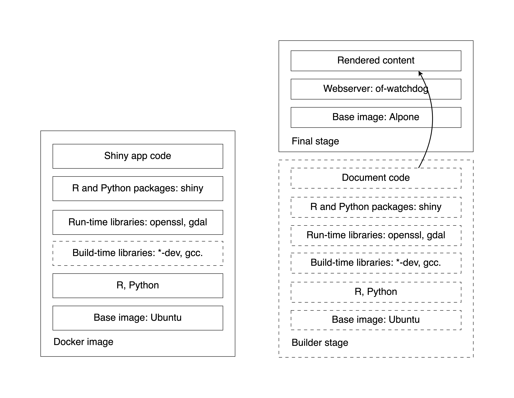

## Shiny Apps With Dependencies (use bananas)

What makes programming languages like R and Python great for making data
applications is the wealth of contributed extension packages that
supercharge app development. You can turn your code into an interactive
web app with not much extra code once you have a workflow and an
interesting question.

We have reviewed [Docker
basics](https://hosting.analythium.io/docker-basics-for-data-apps/) and
how to [dockerize a very simple Shiny
app](https://hosting.analythium.io/dockerizing-shiny-applications/). For
anything that is a little bit more complex, you will have to manage
dependencies. Dependency management is one of the most important aspects
of app development with Docker. In this post, you will learn about
different options.

### Parent Images

In the previous post, we explored [dependency management for Shiny
apps](https://hosting.analythium.io/dockerized-shiny-apps-with-dependencies/)
using the `rocker/r-ubuntu:20.04` as the parent image. A parent image is
an image that you define in the `FROM` directive of the `Dockerfile`. A
[base
image](https://docs.docker.com/develop/develop-images/baseimages/)
has `FROM scratch` as the first line. The R base images start with
parent images. For example, the R Ubuntu image starts with
`FROM ubuntu:focal`.

Here are the four commonly used parent images for R:

```bash
docker pull rhub/r-minimal:4.0.5
docker pull rocker/r-base:4.0.4
docker pull rocker/r-ubuntu:20.04
docker pull rstudio/r-base:4.0.4-focal
```

The image sizes vary quite a bit with the Alpine Linux base
`rhub/r-minimal` being smallest and the Ubuntu-based `rstudio/r-base`
25x the size of the smallest image:

```bash
$ docker images --format 'table {{.Repository}}\t{{.Tag}}\t{{.Size}}'

REPOSITORY          TAG                 SIZE
rhub/r-minimal      4.0.5               35.3MB
rocker/r-base       4.0.4               761MB
rocker/r-ubuntu     20.04               673MB
rstudio/r-base      4.0.4-focal         894MB
```

The Debian Linux based `rocker/r-base` Docker image from the
[Rocker](https://github.com/rocker-org/rocker/tree/master/r-base)
project is considered bleeding edge when it comes to system
dependencies, i.e. latest development versions are usually available
sooner than on other Linux distributions.

The two Ubuntu Linux based images, `rocker/r-ubuntu` and
`rstudio/r-base` from the
[Rocker](https://github.com/rocker-org/rocker/tree/master/r-ubuntu)
project and from
[RStudio](https://github.com/rstudio/r-docker)
are for long-term support Ubuntu versions and use the <a
href="https://packagemanager.rstudio.com/client/"
rel="nofollow">RSPM</a> CRAN binaries.

The Alpine Linux based `rhub/r-minimal` Docker image from the
[r-hub](https://github.com/r-hub/r-minimal)
project is preferred for its small image sizes.

FIXME: add FROM Scratch, ubuntu, alpine

#### Rocker, r-lib, rstudio (posit???)

We built the same Shiny app in three different ways. The sizes of the
three images differ quite a bit, with the `:renv` image being 40% bigger
than the other two images:

```bash
$ docker images --format 'table {{.Repository}}\t{{.Tag}}\t{{.Size}}'

REPOSITORY                  TAG                 SIZE
analythium/covidapp-shiny   renv                1.7GB
analythium/covidapp-shiny   deps                1.18GB
analythium/covidapp-shiny   basic               1.24GB
```

The `:basic` image has 105 packages installed (try
`docker run analythium/covidapp-shiny:basic R -q -e 'nrow(installed.packages())'`).
The  `:deps` image has remotes added on top of these, the `:renv` image
has remotes, renv and BH as extras. BH seems to be responsible for the
size difference, this package provides [Boost C++ header
files](https://cran.r-project.org/package=BH).
The COVID-19 app works perfectly fine without BH. In this particular
case, this is a price to pay for the convenience of automatic dependency
discovery provided by renv.

The renv package has a few different [snapshot
modes](https://rstudio.github.io/renv/reference/snapshot.html#snapshot-type).
The default is called "implicit". This mode adds the intersection of all
your installed packages and those used in your project as inferred by
`renv::dependencies()` to the lockfile. Another mode, called "explicit",
only captures packages that are listed in the project `DESCRIPTION`
file. For the COVID-19 app, both these resulted in identical lockfiles.
You can use `renv::remove("BH")` to remove BH from the project or use
the "custom" model and list all the packages to be added to the
lockfile.

If you go with the other two approaches, explicitly stating dependencies
in the `Dockerfile` or in the `DESCRIPTION` file, you might end up
missing some packages at first. These approaches might need a few
iterations before getting the package list just right.

Another important difference between these approaches is that renv pins
the exact package versions in the lockfile. If you want to install
versioned packages, use the `remotes::install_version()` function in the
`Dockerfile`. The [version-tagged Rocker
images](https://hub.docker.com/r/rocker/r-ver)
will by default use the [MRAN snapshot
mirror](https://mran.microsoft.com/documents/rro/reproducibility)
associated with the most recent date for which that image was current.

FIXME: add Shiny Server inside a container as a way to host multiple apps

FIXME: layers & caching vs size, why using alpine is not always needed


### system libraries

First of all, each package lists its system requirements. These are
usually run-time dependencies that the package needs to properly
function. So check that first.

There are at least two databases listing package requirements: one
maintained by
[RStudio](https://github.com/rstudio/r-system-requirements)
(this supports RSPM, you can browse the database
[here](https://packagemanager.rstudio.com/client/#/repos/2/packages)),
another one by
[R-hub](https://github.com/r-hub/sysreqsdb).
Both of these list system packages for various Linux distributions,
macOS, and Windows. But even with these databases, the build- vs.
run-time dependencies can be sometimes hard to distinguish. Build-time
system libraries are always named with a `-dev` or `-devel` postfix.
Read [the vignette of the
maketools](https://cran.r-project.org/web/packages/maketools/vignettes/sysdeps.html)
R package by Jeroen Ooms for a nice explanation and a suggested workflow
for determining run-time dependencies of packages.

#### RSPM, BSPM, r2u, python?

### R dependencies

The wealth of contributed R packages can supercharge Shiny app
development. This also means that you have to manage these dependencies.
Learn about dependency management when working with R and Docker.

When building Docker images for your R-based applications, the biggest
hurdle is knowing exactly which packages and system libraries your
package depends on. Luckily, the tools have evolved quite a bit over the
past few years. In this post, I show you where the deps package fits in
and how this can be a great choice for dependency management for
Docker-based workflows.

Tools like [packrat](https://cran.r-project.org/package=packrat),
[renv](https://cran.r-project.org/package=renv), and [capsule](https://github.com/MilesMcBain/capsule)
let you go to great lengths to make your R projects perfectly
reproducible. This requires knowing the exact package versions and the
source where it was installed from (CRAN, remotes, local files). This
information is registered in a lock file, which serves as the manifest
for recreating the exact replica of the environment.

Full reproducibility is often required for reports, markdown-based
documents, and scripts. A loosely defined project that is combined with
strict versioning requirements, often erring on the side of “more
dependencies are safer”.

On the other end of the spectrum, we have package-based development.
This is the main use case for dependency management-oriented packages,
such as [remotes](https://cran.r-project.org/package=remotes) and
[pak](https://cran.r-project.org/package=pak). Note that pak is
to replace remotes at some point in the future.

In this case, exact versions are managed only to the extent of avoiding
breaking changes (given that testing can surface these). So what we have
is a package-based workflow combined with a “no breaking changes”
philosophy to version requirements. This approach often leads to leaner
installation.


#### explicit dependencies

The first approach is to use `RUN` statements in the `Dockerfile` to
install the required packages. Check the `Dockerfile` in the
`03-docker-basic` folder. The structure of the `Dockerfile` follows the
general pattern outlined in
[this](https://hosting.analythium.io/dockerizing-shiny-applications/)
post. We use the `rocker/r-ubuntu:20.04` parent image and specify the
[RStudio Package
Manager](https://packagemanager.rstudio.com/)
(RSPM) CRAN repository in `Rprofile.site` so that we can install binary
packages for speedy Docker builds. Here are the relevant lines:

```dockerfile
FROM rocker/r-ubuntu:20.04
...
COPY Rprofile.site /etc/R
...
RUN install.r shiny forecast jsonlite ggplot2 htmltools
RUN Rscript -e "install.packages('plotly')"
...
```

Required packages are installed with the [littler
utility](https://cran.r-project.org/web/packages/littler/vignettes/littler-examples.html#install.r-direct-cran-installation)
`install.r` (littler is installed on all Rocker images). You can also
use `Rscript` to call `install.packages()`. There are other options too,
like `install2.r` from littler, or using `R -q -e install.packages()` –
`-q` suppresses the startup message, `-e` executes an expression then
quits.

Build and test the image locally, use any image name you like (in
`export IMAGE=""`), then visit `http://localhost:8080` to see the app:

```bash
# name of the image
export IMAGE="analythium/covidapp-shiny:basic"

# build image
docker build -t $IMAGE .

# run and test locally
docker run -p 8080:3838 $IMAGE
```

#### DESCRIPTION file, remotes & pak

The second approach is to record the dependencies in the `DESCRIPTION`
file. You can find the example in the `04-docker-deps` folder. The
[`DESCRIPTION`](https://cran.r-project.org/doc/manuals/r-release/R-exts.html#The-DESCRIPTION-file)
[file](https://cran.r-project.org/doc/manuals/r-release/R-exts.html#The-DESCRIPTION-file)
contains basic information about an R package. The file states package
dependencies and is used when installing the packages and their
dependencies. The `install_deps()` function from the
[remotes](https://cran.r-project.org/package=remotes)
package can install dependencies stated in a `DESCRIPTION` file. The
`DESCRIPTION` file used here is quite rudimentary but it states the
dependencies to be installed nonetheless:

```text
Imports:
  shiny,
  forecast,
  jsonlite,
  ggplot2,
  htmltools,
  plotly
```

Use the same Ubuntu-based R image and the RSPM CRAN repository. Install
the remotes package, copy the `DESCRIPTION` file into the image. Call
`remotes::install_deps()` which will find the `DESCRIPTION` file in the
current directory. Here are the relevant lines from the `Dockerfile`:

```dockerfile
FROM rocker/r-ubuntu:20.04
...
COPY Rprofile.site /etc/R
...
RUN install.r remotes
COPY DESCRIPTION .
RUN Rscript -e "remotes::install_deps()"
...
```

Build and test the image as before, but use a different tag:

```bash
# name of the image
export IMAGE="analythium/covidapp-shiny:deps"

# build image
docker build -t $IMAGE .

# run and test locally
docker run -p 8080:3838 $IMAGE
```

#### renv

The [renv](https://cran.r-project.org/package=renv)
package is a versatile dependency management toolkit for R. You can
discover dependencies with `renv::init()` and occasionally save the
state of these libraries to a lockfile with `renv::snapshot()`. The nice
thing about this approach is that the exact version of each package is
recorded that makes Docker builds reproducible.

Switch to the `05-docker-renv` directory and inspect the `Dockerfile`.
Here are the most important lines (Focal Fossa is the code name for
Ubuntu Linux version 20.04 LTS that matches our parent image):

```dockerfile
FROM rocker/r-ubuntu:20.04
...
RUN install.r remotes renv
...
COPY ./renv.lock .
RUN Rscript -e "options(renv.consent = TRUE); \
    renv::restore(lockfile = '/home/app/renv.lock', repos = \
    c(CRAN='https://packagemanager.rstudio.com/all/__linux__/focal/latest'))"
...
```

We need the remotes and renv packages. Then copy the `renv.lock` file,
call `renv::restore()` by specifying the lockfile and the RSPM CRAN
repository. The `renv.consent = TRUE` option is needed because this is a
fresh setup (i.e. not copying the whole renv project).

Tag the Docker image with `:renv` and build:

```bash
# name of the image
export IMAGE="analythium/covidapp-shiny:renv"

# build image
docker build -t $IMAGE .

# run and test locally
docker run -p 8080:3838 $IMAGE
```

#### deps

What if we are not writing an R package and wanted to combine the best
of both approaches? – A loosely defined project with just strict-enough
versioning requirements. All this without having to write a
`DESCRIPTION` file by hand. Because why would you need a `DESCRIPTION`
file when you have no package? Also, a `DESCRIPTION` file won’t let you
pin an exact package version or specify alternative CRAN-like
repositories.

What if you could manage dependencies by decorating your existing R code
with special, roxygen-style comments? Just like this:

```R
#' @remote analythium/rconfig@CRAN-v0.1.3
rconfig::config()

#' @repo sf https://r-spatial.r-universe.dev
library(sf)

#' @ver rgl 0.108.3
library(rgl)
```

This is exactly what deps does:

-   helps to find all dependencies from our files,
-   writes these into a `dependencies.json` file,
-   performs package installs according to the decorators.

The decorators make our intent explicit, just like if we were writing an
R package. But we do not need to manually write these into a file and
keep it up-to-date. We can just rerun `create` to update the JSON
manifest file.

There are many different tags that you can use as part of your
roxygen-style comments.

These tags are listed and explained in the package's GitHub repository.

The deps package has 2 main functions:

-   `create()` crawls the project directory for package dependencies. It
    will amend the dependency list and package sources based on the
    comments and query system requirements for the packages where those
    requirements are known for a particular platform; the summary is
    written into the `dependencies.json` file.
-   `install()` looks for the `dependencies.json` file in the root of
    the project directory (or runs `create()` when the JSON file is not
    found) and performs dependency installation according to the
    instructions in the JSON file.

In the simplest case, one might have a project folder with some R code
inside. Running `deps::install()` will perform the package installation
in one go. Additional arguments can be passed to `install()` so that
local libraries etc. can be specified.

These arguments are passed to `install.packages()`. This is a really
important consideration when it comes to utilizing RSPM or BSPM
repositories on Linux systems.
[RSPM](https://cran.r-project.org/package=rspm?ref=hosting.analythium.io)
(RStudio Package Manager) provides rebuild binaries,
[BSPM](https://cran.r-project.org/package=bspm?ref=hosting.analythium.io)
(Bridge to System Package Manager) provides full system dependency
resolution and integration with `apt` on top of binary packages.

The deps package helps users be more intentional about the R package
source and version requirements using text decorators in comments. This
is similar to a package-based workflow without actually writing a
package. But deps also lends itself to Dockerized development. It
identifies system requirements for the R packages, which is a welcome
addition to making the Docker experience for R as user-friendly and
hands-off as possible.

#### Using the deps CLI

FIXME: explain the deps CLI, note that it also works with pak, etc.

### Python requirements

FIXME: KALVIN to add here

#### pip

FIXME: KALVIN to add here

#### Other options for python

??? Conda, venv???

FIXME: KALVIN to add here

## Best Practices

The use of Docker with R has been [transformative in many
ways](https://journal.r-project.org/archive/2020/RJ-2020-007/RJ-2020-007.pdf)
over the past 5 years. What is common in this diversity of use cases is
that the Docker images almost always start with a parent image. What
parent image you use? How do you add new layers to it? These questions
will determine how quickly you can iterate while in development, and the
size of the final image you send to production. In this post, I will
compare using different parent images and outline best practices. I
focus on Shiny apps but most of these ideas apply generally to any
dockerized R application, like images for compute jobs or interfaces.

Based on these results and the list of [Dockerfile best
practices](https://docs.docker.com/develop/develop-images/dockerfile_best-practices/#dont-install-unnecessary-packages),
here are a few suggestions to improve the developer experience and the
quality of the final Docker images.

### Minimize dependencies


#### Minimize dependencies

Avoid installing "nice to have" packages and do not start from
general-purpose parent images aimed at interactive use. Images for Shiny
apps and other web services benefit from keeping the images as lean as
possible by adding those R packages and system requirements that are
absolutely necessary. [Multi-stage
builds](https://docs.docker.com/develop/develop-images/multistage-build/)
can be helpful to only include artifacts that are needed.

### Use caching

When building an image, Docker executes each instruction in the order
specified in the `Dockerfile`. Docker looks for an existing image in its
cache that it can reuse, rather than creating a new (duplicate) image.
Only the instructions `RUN`, `COPY`, `ADD` create layers:

-   for the `RUN` instructions, just the command string from the
    `Dockerfile` is used to find a match from an existing image;
-   for the `ADD` and `COPY` instructions, the contents of the file(s)
    in the image are examined and a checksum is calculated for each
    file;
-   the last-modified and last-accessed times of the file(s) are not
    considered in these checksums for the `ADD` and `COPY` instructions.

### Order layers

Caching can be useful is when installing R package dependencies. In a
previous post, we looked at [how to use the renv
package](https://hosting.analythium.io/dockerized-shiny-apps-with-dependencies/#use-the-renv-r-package)
to install dependencies. Here is a simplified snippet from
[that](https://github.com/analythium/covidapp-shiny/blob/main/05-docker-renv/Dockerfile)
`Dockerfile`:

```dockerfile
## install dependencies
COPY ./renv.lock .
RUN Rscript -e "renv::restore()"

## copy the app
COPY app .
```

What would happen if we switched the two blocks?

```dockerfile
## copy the app
COPY app .

## install dependencies
COPY ./renv.lock .
RUN Rscript -e "renv::restore()"
```

You would have to wait for the build to reinstall all the R packages
whenever the app files have changed. This is because once the cache is
invalidated all subsequent `Dockerfile` commands generate new images
instead of using the cache.

It is best to order the instructions in your `Dockerfile` from the less
frequently changed to the more frequently changed. This ensures that the
build cache is reusable.

```{r part2-docker-layers, eval=TRUE, echo=FALSE,out.width="80%", fig.cap="Docker layers for single (left) and multi-stage builds (right). Dashed lines are temporary layers."}
if (is_latex_output()) {
    include_graphics("images/02/docker-layers.pdf")
} else {
    
}
```

### Switch user


Running the container with root privileges allows unrestricted use which
is to be avoided in production. Although you can find lots of examples
on the Internet where the container is run as root, this is generally
considered bad practice. Use something like this:

```dockerfile
RUN addgroup --system app \
    && adduser --system --ingroup app app
WORKDIR /home/app
COPY app .
RUN chown app:app -R /home/app
USER app
```

### Multi-stage Builds

### Other considerations

#### Use a linter

Best practices for writing Dockerfiles are being followed more and more
often according to [this
paper](https://arxiv.org/pdf/2103.12298.pdf)
after mining more than 10 million Dockerfiles on Docker Hub and GitHub.
However, there is still room for improvement. This is where
[linters](https://en.wikipedia.org/wiki/Lint_(software))
come in as useful tools for static code analysis.
[Hadolint](https://github.com/hadolint/hadolint#rules)
lists lots of rules for Dockerfiles and is available as a [VS Code
extension](https://marketplace.visualstudio.com/items?itemName=exiasr.hadolint).

-   [Dockerfile best
    practices](https://docs.docker.com/develop/develop-images/dockerfile_best-practices/#leverage-build-cache)
-   [Hadolint
    rules](https://github.com/hadolint/hadolint#rules)
-   [Tips to Speed up Your Docker Image
    Build](https://vsupalov.com/5-tips-to-speed-up-docker-build/)-->

#### Use labels

#### Docker Security Scanning 

This brings up an important consideration when it comes to production
code and environments. Knowing the exact versions of your packages is
not only good for reproducibility but is also the foundation for
vulnerability scanning.

R users are familiar with the renv package and how it registers the
exact version of the R packages being used. However, it does not
register anything about the underlying system libraries, the version of
curl or openssl or GDAL libraries being used. This is what a Software
Bill Of Materials (SBOM) is used for. For this reason, Docker Desktop
4.7.0 introduced the experimental
[`docker sbom`](https://docs.docker.com/engine/sbom/) CLI command that
is based on a collaboration with the
[Syft](https://github.com/anchore/syft) project.

Reproducibility is concerned with keeping the versions immutable. It is
like a vintage car that is used once a year to derive to the car show.
As opposed to this, in production, we are more concerned with acting on
the information and upgrade packages when necessary while also making
sure that our app is running flawlessly. It is like how people drive
their kids to dance and soccer practice 7 days a week in a minivan. The
car is maintained continuously because there is no room for error.

The [`docker scan`](https://docs.docker.com/engine/scan/) CLI command
was introduced to quickly detect and learn how to remediate
vulnerabilities in your images.

> Vulnerability scanning for Docker local images allows developers and
> development teams to review the security state of the container images
> and take actions to fix issues identified during the scan, resulting
> in more secure deployments. Docker Scan runs on Snyk engine, providing
> users with visibility into the security posture of their local
> Dockerfiles and local images.  
>   
> Users trigger vulnerability scans through the CLI, and use the CLI to
> view the scan results. The scan results contain a list of Common
> Vulnerabilities and Exposures (CVEs), the sources, such as OS packages
> and libraries, versions in which they were introduced, and a
> recommended fixed version (if available) to remediate the CVEs
> discovered.

Another popular vulnerability scanner for container images and
filesystems is called [Grype](https://github.com/anchore/grype).
You will find links to some tutorials below walking through the use of
Syft and Grype.

SBOM was announced in 2022.
Here is the original announcement about SBOM from Docker in April 2022:

> making what is inside your container images more visible so that you
> can better secure your software supply chain

Announcing Docker SBOM: Increased Docker Image Visibility <https://www.docker.com/blog/announcing-docker-sbom-a-step-towards-more-visibility-into-docker-images/>

Image visibility and transparency are key to securing your software
supply chain. Learn how our Docker SBOM feature highlights core image
components.

Here is a short intro to how `docker sbom` command and the Syft project
are related (Syft supports the OCI, Docker, and Singularity image
formats):
[How to Improve Docker Security with `docker sbom` and Syft](https://thenewstack.io/how-to-improve-docker-security-with-docker-sbom-and-syft/)

Grype can use the SBOM output or scan the Docker image or local file
system directly. Then it performs a vulnerability scan by comparing the
package versions to information found in vulnerability databases. This
tutorial outlines the whole process:
[Container vulnerability scan with Syft and Grype](https://medium.com/rahasak/container-vulnerability-scan-with-syft-and-grype-f4ec9cd4d7f1)

[How to add a Software Bill of Materials (SBOM) to your containers with GitHub Actions](https://actuated.dev/blog/sbom-in-github-actions):

You might use GitHub actions to build a new image every time you merge
changes to your production branch. It can be important to make sure
there are no vulnerabilities. This post outlines how to do that:

## WHAT ELSE

### Layers and Caching

### Hardware Architectures

### Multi-stage builds

### Mounting volumes

### Ports

### UID

### Troubleshooting

FIXME: Accessing the logs: 
FIXME: how to enter a running container to find runtime info


### Shinylive

Shinylive: R & Python using Nginx and of-watchdog

### Rmd

Rmd: this is for R

### Quarto

Quarto: R & Python

### Using BuildKit

Docker versions 18.09 or higher come with a new opt-in builder backend
called
<a href="https://github.com/moby/buildkit"
rel="noreferrer noopener">BuildKit</a>. BuildKit prints out a nice
summary of each layer including timing for the layers and the overall
build. This is the general build command that I used to compare the four
parent images:

```bash
DOCKER_BUILDKIT=1 docker build --no-cache -f $FILE -t $IMAGE .
```

BuildKit backend is enabled by turning on the `DOCKER_BUILDKIT=1`
environment variable. I use the `--no-cache` option to avoid using
cached layers, thus having a fair assessment of build times (you usually
only build 1 and not 4). The `-f $FILE` flag allows building from
different files kept in the same folder.

All the code used here can be found in our Covid-19 Shiny app [GitHub repository](https://github.com/analythium/covidapp-shiny), look in
the folder `99-images`.

#### Image build times

This is the script I used to build the four images with BuildKit:

```bash
# rhub/r-minimal
export IMAGE="analythium/covidapp-shiny:minimal"
export FILE="Dockerfile.minimal"
DOCKER_BUILDKIT=1 docker build --no-cache -f $FILE -t $IMAGE .

# rocker/r-base
export IMAGE="analythium/covidapp-shiny:base"
export FILE="Dockerfile.base"
DOCKER_BUILDKIT=1 docker build --no-cache -f $FILE -t $IMAGE .

# rocker/r-ubuntu
export IMAGE="analythium/covidapp-shiny:ubuntu"
export FILE="Dockerfile.ubuntu"
DOCKER_BUILDKIT=1 docker build --no-cache -f $FILE -t $IMAGE .

# rstudio/r-base
export IMAGE="analythium/covidapp-shiny:focal"
export FILE="Dockerfile.focal"
DOCKER_BUILDKIT=1 docker build --no-cache -f $FILE -t $IMAGE .
```

I changed the CRAN repository for the Debian and Ubuntu Rocker images to
see timing differences between installing packages as binary or from
source. Total build times (on a 6-year old MacBook Pro) were the
following:

-   `rhub/r-minimal`: 27 minutes with building packages from source
-   `rocker/r-base`: 12 minutes when building from source, 2.9 minutes
    when installing binary packages
-   `rocker/r-ubuntu`: 12 minutes when building from source, 3.2 minutes
    when installing binary packages
-   `rstudio/r-base`: 3.1 minutes with installing binary packages

The difference between the binary vs. source package installs is
expected. What is interesting is the 12 vs. 27 minutes between the
Debian/Ubuntu images and the minimal Alpine image. Is it worth waiting
for?

#### Image sizes

I got the image sizes from `docker images` and made a small data frame
in R to calculate the size difference between the final and parent
images:

```R
x = data.frame(TAG=c("minimal", "base", "ubuntu", "focal"),
  PARENT_SIZE=c(35, 761, 673, 894) / 1000, # base image
  FINAL_SIZE=c(222 / 1000, 1.05, 1.22, 1.38)) # final image

x$DIFF = x$FINAL_SIZE - x$PARENT_SIZE

#       TAG PARENT_SIZE FINAL_SIZE  DIFF
# 1 minimal       0.035      0.222 0.187
# 2    base       0.761      1.050 0.289
# 3  ubuntu       0.673      1.220 0.547
# 4   focal       0.894      1.380 0.486
```

The image sizes themselves differed quite a bit, the RStudio Ubuntu
image was 6.2x larger than the minimal R image. Size differences were
similarly different.

Image sizes can be deceiving. It might not matter much if images are
large if for example, we have multiple images [sharing some of the
layers](https://semaphoreci.com/blog/2018/03/14/docker-image-size.html)
(i.e. ones from the parent image). The CPU and RAM footprint of the
containers might also be unrelated to the image sizes. But it might
impact "cold start" performance when images are pulled to an empty
server.

#### Alpine Linux based image

The Dockerfiles and the build experience for the Ubuntu and Debian
images were very similar. Build times and image sizes were also
comparable. The Alpine Linux-based minimal image took the longest time
to build but resulted in the smallest image size. The Dockerfile for
this setup also looks quite different from the Debian/Ubuntu setup:

```dockerfile
FROM rhub/r-minimal:4.0.5

RUN apk update
RUN apk add --no-cache --update-cache \
    --repository http://nl.alpinelinux.org/alpine/v3.11/main \
    autoconf=2.69-r2 \
    automake=1.16.1-r0 \
    bash tzdata
RUN echo "America/Edmonton" > /etc/timezone

RUN installr -d \
    -t "R-dev file linux-headers libxml2-dev gnutls-dev openssl-dev libx11-dev cairo-dev libxt-dev" \
    -a "libxml2 cairo libx11 font-xfree86-type1" \
    remotes shiny forecast jsonlite ggplot2 htmltools plotly Cairo

RUN rm -rf /var/cache/apk/*

RUN addgroup --system app && adduser --system --ingroup app app
WORKDIR /home/app
COPY app .
RUN chown app:app -R /home/app
USER app

EXPOSE 3838

CMD ["R", "-e", "options(tz='America/Edmonton');shiny::runApp('/home/app', port = 3838, host = '0.0.0.0')"]
```

The base image is so bare-bones that it needs to install time zones,
fonts and the Cairo device for ggplot2 to work (read the limitations
[here](https://github.com/r-hub/r-minimal#limitations)).
Instead of `apt` you have `apk` and might have to work a bit harder to
find all the Alpine-specific dependencies.

One interesting aspect of this image is that instead of the littler
utilities familiar from the Rocker images, we have the very similar
`installr` script that installs R packages and system requirements:

-   the `-d` flag installs then removes compilers ( `gcc`, `musl-dev`,
    `g++`), as these are typically not needed on the final image;
-   system packages listed after the `-t` flag are removed after the R
    packages have been installed;
-   system packages listed after the `-a` flag are run-time dependencies
    that are needed for the packages to function properly and are not
    removed from the image.

The installation of the system packages – that are all available on the
other parent images – contributes to the longer build times. The
BuildKit output gives you a clue about where exactly the time was spent.

The rest of the `Dockerfile` is very similar to the other distributions:
add Linux user, copy files, expose port, define the entrypoint command.
But how do you figure out what system packages you need?
