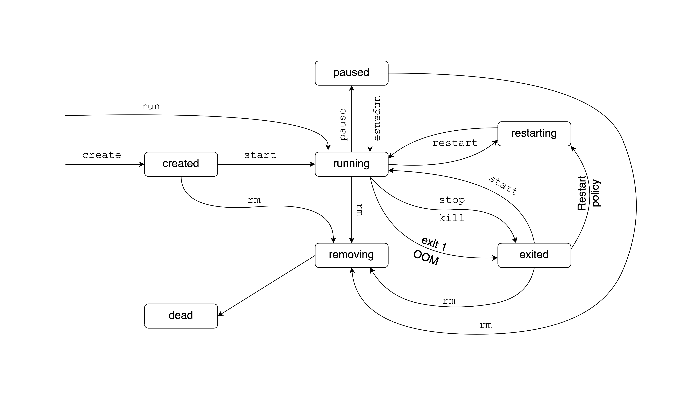

## Image Analysis

Image analysis is a two part process. First, we extract the 
Software Bill of Material (SBOM) and other image metadata.
These are called attestations.

Second, we evaluate these data against vulnerability data from security 
advisories. Docker Scout can perform image analysis among other things and 
is available by default for Docker Hub repositories.

Some of these features are experimental and are not universally supported
by default in all registries, so we won't cover everything in detail.
You can consult the Docker CLI reference for `docker scout`.

### Attestations

Attestations describe how an image was built, and what it contains.
The first kind of attestation is referred to as _provenance_.
You can add the minimum set of provenance information to an image using BuildKit
as:

```bash
docker buildx build -t <image-name>:<image-tag> \
    --attest type=provenance,mode=min .
```

Then you can inspect image provenance information with:

```bash
docker buildx imagetools inspect <image-name>:<image-tag> \
    --format "{{ json .Provenance.SLSA }}"
```

The second kind of attestation is the _Software Bill of Material_ (SBOM). 
The SBOM is a complete inventory of a codebase, the license and version information. 
The `docker scout` command can scan images and create an SBOM. 
Here is the list view of the SBOM from the `rocker/r2u:24.04` image:

```bash
docker scout sbom --format list rocker/r2u:24.04

#         Name                       Version                Type
# ------------------------------------------------------------------
#   KernSmooth                2.23-24                       cran
#   MASS                      7.3-61                        cran
#   Matrix                    1.7-0                         cran
#   acl                       2.3.2-1build1                 deb
#   [...]
#   zlib                      1:1.3.dfsg-3.1ubuntu2         deb
#   zlib1g                    1:1.3.dfsg-3.1ubuntu2         deb
#   zlib1g-dev                1:1.3.dfsg-3.1ubuntu2         deb
```

Write the SBOM information into a JSON file:

```bash
docker scout sbom rocker/r2u:24.04 > sbom-r2u.json
```

### Vulnerability Scanning

Image analysis uses image SBOMs to understand what packages and versions an image 
contains. Knowing the exact versions of your packages is not only good for 
reproducibility but is also the foundation for vulnerability scanning.
Docker Scout compares the SBOM to a list of 
[known vulnerabilities](https://docs.docker.com/scout/deep-dive/advisory-db-sources/).

The quick view gives a high level overview of different levels of 
vulnerabilities. Vulnerabilities are ordered by severity:
critical (`C`), high (`H`), medium (`M`) or low (`L`).
There are no critical vulnerabilities known for the `rocker/r2u` image
and there are 2 vulnerabilities classified as high, 6 as medium, and 6 as low.

```bash
docker scout quickview rocker/r2u:24.04

#   ✓ Pulled
#   ✓ Image stored for indexing
#   ✓ Indexed 435 packages
#
#   i Base image was auto-detected. To get more accurate results,
#     build images with max-mode provenance attestations.
#     Review docs.docker.com ↗ for more information.
#
# Target               │  rocker/r2u:24.04 │  0C  2H  206M  44L
#   digest             │  f3272f6d118c     │
# Base image           │  ubuntu:24.04     │  0C  0H    6M   6L
# Refreshed base image │  ubuntu:24.04     │  0C  0H    2M   6L
# Updated base image   │  ubuntu:24.10     │  0C  0H    0M   0L
```

The CVEs subcommand analyzes an image for vulnerabilities, e.g. 
`docker scout cves rocker/r2u:24.04`.
CVE is short for Common Vulnerabilities and Exposures.
You might want to filter this result to show only critical and high vulnerability
packages. 

It is not wise to ignore critical vulnerabilities. You should probably need
to find alternatives and do not include such packages in your image.
Such vulnerabilities often shake the whole software industry and usually patched
in a short amount of time, or at least a workaround is suggested.
Get only critical CVEs as:

```bash
docker scout cves --format only-packages --only-vuln-packages \
  --only-severity critical rocker/r2u:24.04

#   ✓ SBOM of image already cached, 435 packages indexed
#   ✓ No vulnerable package detected
#
# Name  Version  Type  Vulnerabilities
```

Here is how to check for critical and high vulnerabilities:

```bash
docker scout cves --format only-packages --only-vuln-packages \
  --only-severity critical,high rocker/r2u:24.04

#   ✓ SBOM of image already cached, 435 packages indexed
#   ✗ Detected 1 vulnerable package with 2 vulnerabilities
#
# Name     Version    Type        Vulnerabilities
# --------------------------------------------------------
# linux  6.8.0-35.35  deb      0C     2H     0M     0L
```

You can see that the 2 high CVEs are part of Linux itself and
are not coming from packages that r2u adds on top of the Ubuntu parent image.

## Containers

You have learnt how to build images using the Dockerfile to contain a Shiny app.
A "live" version of this image is called the container, that is the 
runtime instance of the docker image. Besides the image, it 
consists of a set of instructions that you set before or during run time,
and execution environment. Let's see how you can create, start, and manage
Docker containers.

### Docker Run

The `docker run` command is a versatile tool because it can
not only create and run a new container from an image, but it can also pull
the image if needed.

You have seen that we usually set the `-p` or `--port` option and map the 
host port 8080 to the container port 3838 as e.g. `-p 8080:3838`.
Setting the port is needed when running a web application, such as Shiny.
This way you can view the application in your browser.

When you start a Docker container it executes a command that you specified
before in the Docker image's configuration, the `Dockerfile`. 
The default settings from the image usually work well, but you can 
also change them if needed.
You may set or override many of the instructions from your Dockerfile:

- `--expose` exposes a port or a range of ports,
- `--user` provides a username to be used,
- `--workdir` sets the working directory inside the container,
- `--entrypoint` overwrites the default `ENTRYPOINT` instruction.

It is common to use the `--rm` flag to automatically remove the container and 
its associated anonymous volumes when it exits. This way, when you hit CTRL+C,
it will not only stop the container, but it will also remove it and
`docker ps -a` will not list it any more. This is best suited for development.

You can provide environment variables through the `-e` or `--env` option
or provide a file with the variables using `--env-file`.

Setting the platform via `--platform` is needed when working with different
architectures, such as ARM64 and AMD64.

Setting resources available for the container is possible with the 
`--cpus` (number of CPUs) and setting memory limits by `--memory`.

Docker containers and their file systems are considered ephemeral, which means
they are not expected to persist data for long. Therefore, it is recommended
to rely on external storage (databases, object stores) for anything that
needs to persist and you do not want it to disappear when the container is
deleted.

Docker can persisting data on the file system using 
[bind mounts or volumes](https://docs.docker.com/storage/).
Bind mounts may be stored anywhere on the host system and you can specify
this via the `--mount` option in `docker run`.
Compared to mounts, volumes are stored in a part of the host filesystem 
which is managed by Docker and other processes should not modify this part of 
the filesystem. You can specify volumes with the `--volume` option.
Persisting data on the file system is an advanced topic that we'll see some 
examples of later. We mention it here because managing file systems is also
part of the magic of `docker run`.

One more important flag is the `-d` or `--detach` flag. This starts the 
container as a background process. You get back your terminal and can start
typing other commands. It can be a good idea to also add a name to the container
so we can find it easier without looking for its ID:

```bash
docker run \
  --rm \
  -d \
  -p 8080:3838 \
  --name r-shiny \
  --restart=always \
  ghcr.io/h10y/faithful/r-shiny:latest

docker ps

# CONTAINER ID   IMAGE
# 592caa564860   ghcr.io/h10y/faithful/r-shiny:latest

# COMMAND                    CREATED          STATUS
# "R -e 'shiny::runApp..."   15 seconds ago   Up 14 seconds

# PORTS                    NAMES
# 0.0.0.0:8080->3838/tcp   r-shiny
```

The `docker ps` command lists running containers. You see not only the info
we provided with `docker run` or that were defined in the `Dockerfile`, but also
for how ling the container has been running (time since its creation) and also
the status of the container.

The `docker run` command is equivalent of first creating a container that 
consumes no resources yet with `docker create <image-name>` and then starting 
this container with `docker start <container-name-or-id>`, but it is much
more convenient to use `docker run`.

When the container is running in the background, you cannot stop it with CTRL+C.
You have to manage it using the container ID or the container name.
To stop the container, use `docker stop <container-name-or-id>`.
This will "gracefully" shut down the Shiny app sending it a so called SIGTERM
signal. If you use `docker kill <container-name-or-id>` instead, the process
will be abruptly killed with a so called SIGKILL signal. Try `docker stop`
first.

None of these commands will remove the container. This means you can start it 
again with `docker start <container-name-or-id>`, or remove it with 
`docker rm <container-name-or-id>`. Notice the subtle difference between
`docker rm` (remove a container) and `docker rmi` (remove an image).
Most of the docker commands have aliases, use these if you want to be more
specific, e.g. `docker rmi` is an alias for `docker image rm`, whereas
`docker rm` is an alias for `docker container rm`.

If for some reason, the container running in the background experiences an issue,
like a unexpected user input, or it runs out of memory, the container will be
stopped by default. If you want a different behavior, use the `--restart` to
specify a restart policy:

- `on-failure`: restart only if the container exits with a non-zero exit status,
- `unless-stopped`: restart the container unless it is explicitly stopped or 
  Docker itself is stopped or restarted,
- `always`: the Docker daemon tries to restart the container indefinitely
  irrespective of the cause.

A non-zero exit status and running out of resources are clear signs of the app
not running as expected. You will see in a bit how to troubleshoot 
using the Docker logs. But in less serious cases, we might hot know the 
"health" of the container without looking at the logs or a user telling us
that something is not right. This is where health checks come in.
Before we introduce health checks, let's stop the container:

```bash
docker stop r-shiny
```

We used the `--rm` flag, so the container will be removed after being stopped.
If we haven't used the `--rm` flag, we would still see it listed with 
`docker ps -a`.


### Health Check

Shiny apps, just like any other web application, can crash for many different 
reasons. It might be due to a bug in the code, your user might do something
unexpected. Or simply, the app runs out of resources. This most often means
that it runs out of memory. In these cases, it becomes unresponsive,
although the process inside is still running. From a user experience standpoint,
an exited process is the same as a non-exited but unresponsive process.
From a monitoring perspective, one is easier to detect than the other.
The purpose of the health check is to report on the status of our application,
so that we know when it is "unhealthy", which means users cannot access it.

The `HEALTHCHECK` Dockerfile instruction checks a container's health on startup.
It is written as `HEALTHCHECK <options> CMD <command>`.
The options determine how often the health check command is run
(`--interval`, default is 30s), the timeout duration (`--timeout`, 
default is 30s). If checks take longer than the timeout, it is considered to have 
failed.

There is also a start period (`--start-period`, default is 0s)
After this period there are by default 3 retries (`--retries`) 5s apart
(`--start-interval`). The container is not considered unhealth during the set
number of retries. If a health check succeeds during the start period, the 
container is considered started.

The health check command's exit status indicates the health status of the 
container. The exit status can be either 0 (health) or 1 (unhealthy).
Different commands might return different exit statuses. This is why you often 
see the health check command formatted as `<command> || exit 1` which will
force any non-0 exit status to be 1.

For web applications, the simplest command would be to see if the main page
responds to a request. If we start the shiny app on port 3838,
the Curl command `curl --fail http://localhost:3838` returns the HTML of the 
Shiny app or it fails due to the `--fail` flag (same as `-f`).

The health check instruction could look like this:

```dockerfile
HEALTHCHECK --interval=5s \
    CMD curl --fail http://localhost:3838 || exit 1
```

The `curl` command might or might not be installed in your image. The
`ubuntu:24.04` parent image does not ship `curl`, so you have to add this
to the `RUN` instructions that install system requirements.
Alternatively, you can use `bash` (which is available on `ubuntu:24.04`
but not on `alpine:3.20`):

```dockerfile
HEALTHCHECK CMD bash -c ':> /dev/tcp/127.0.0.1/3838' || exit 1
```

This `bash` command redirects (`>`) a null value (`:`) to the TCP port 
3838 on the local host, which is available from inside the container.

Let's try adding a health check to the `ghcr.io/h10y/faithful/r-shiny` image
and see how we might be able to see the health status. We can add the
command through the `--health-cmd` option of the `docker run`:

```bash
docker run --rm -d -p 8080:3838 \
  --name healthy \
  --health-cmd="bash -c ':> /dev/tcp/127.0.0.1/3838' || exit 1" \
  ghcr.io/h10y/faithful/r-shiny:latest
```

Let's start another container with a health check targeting a different port,
this will cause the check to fail. Note that the `healthy` container is already
using the 8080 port, we map the `unhealthy` container to run on port 8081:

```bash
docker run --rm -d -p 8081:3838 \
  --name unhealthy \
  --health-cmd="bash -c ':> /dev/tcp/127.0.0.1/4949' || exit 1" \
  ghcr.io/h10y/faithful/r-shiny:latest
```

Try `docker ps` a few times. The status for the health image should be `(healthy)`.
The unhealth image should display `(health: starting)`, which would switch
to `(unhealthy)` after the start period. You can also access the health status
with the `docker inspect` command. You'll need the `jq` command line tool that
can parse JSON output:

```bash
docker inspect --format "{{json .State.Health }}" healthy | jq
# {
#   "Status": "healthy",
#   "FailingStreak": 0,
#   "Log": [
#     {
#       "Start": "2024-07-17T08:29:36.969572509Z",
#       "End": "2024-07-17T08:29:37.0504063Z",
#       "ExitCode": 0,
#       "Output": ""
#     },
#     [...]
# }
```

The output shows the health check results and the failing streak (how many times 
the check has failed). A 0 failing streak is your target.
The same command for the `unhealthy` container would show a very unhealthy
failing streak:

```bash
docker inspect --format "{{json .State.Health }}" unhealthy | jq
# {
#   "Status": "unhealthy",
#   "FailingStreak": 10,
#   "Log": [
#     {
#       "Start": "2024-07-17T08:30:13.47309747Z",
#       "End": "2024-07-17T08:30:13.572182554Z",
#       "ExitCode": 1,
#       "Output": "bash: connect: Connection refused
#         bash: line 1: /dev/tcp/127.0.0.1/4949: Connection refused"
#     },
#     [...]
# }
```

Health checks can be more complex than pinging the Shiny app endpoint.
For example if your application depends on connecting to external databases
and APIs, you might want to include multiple checks in a single script file.
These can be shell scripts, R, or Python scripts and can also rely on
environment variables that contain access tokens during the container run time.
You can include this script file in your image and add the corresponding
instruction as:

```dockerfile
HEALTHCHECK CMD ./healthcheck.sh
```

### Container Life Cycle

You have seen the some of the possible statuses of containers. Let's review
the container life cycle in a bit more details so that you get a better sense
of how to manage containers that are in different states.
Figure \@ref(fig:part2-container-lifecycle) illustrates the container life cycle.

```{r part2-container-lifecycle, eval=TRUE, echo=FALSE,out.width="80%", fig.cap="The Docker container life cycle."}
if (is_latex_output()) {
    include_graphics("images/02/container-life-cycle.pdf")
} else {
    
}
```

Containers can be on one of seven states:
`created`, `running`, `paused`, `restarting`, `exited`, `removing`, and `dead`.
First the container is `created`, which means it has never been started.
A freshly created container does not yet consumes resources.

After the startup, the container is either `running` or `exited`.
An `exited` status can mean that the container finished its job and exited with
status code `0`, or instead of `running` the container failed to start and 
exited with an error code `1`. The exited container does not consumes resources.

A `running` container is started by either `docker start` or `docker run`.
It might have a web server listening to incoming traffic,
as is the case with Shiny. The start is considered successfully if the container 
is up for at least 10 seconds and Docker has started monitoring it.
The health check does not immediately affect the
state of the container as long as the main process is running, but the 
information might be used by the orchestration service (i.e. Kubernetes)
to decide the fate of the container and replace it with a new instance.

A container that is no longer running enters the `exited` state.
This might be due to a CTRL+C signal, an exit code of `1`. It can be due to the 
container running out of resources, for example exceeding the set memory limit. 
You can also use the `docker stop` to stop the container.
When using `docker stop`, the main process inside the container will receive 
a SIGTERM signal, and after a grace period, a SIGKILL. 
The `docker kill` command sends SIGKILL immediately to stop the container.

An `exited` container can be started again with `docker start`. It can also
enter the `restarting` state when the orchestrator tries to restart a failed
container due to a set restart policy. The restart policy will not apply to
containers stopped manually.

A running container can enter the `restarting` state due to the designated restart 
policy or by calling the `docker restart` command on a running container.
After that the container will enter the `running` (or the `exited`) state.

If you pause a running container with `docker pause` it will be considered `paused`.
All processes are suspended for an indefinite time, memory is still allocated
to store the state of the running container, but no CPU resources are used.
You can unpause the container with `docker unpause`.

You can remove a container with `docker rm`. You might have to force the removal
of a running container with the `--force` (or `-f`) flag. The forced stop will
use SIGKILL, thus is equivalent to first stopping the container with `docker kill`
and then removing it. The container will be in `removing` while the container 
is in the process of being removed.

After the container is removed it will no longer exist unless there was a problem
with the removal process. For example the container was only partially removed 
because resources were kept busy by an external process. Such a "defunct" container 
is called a `dead` container and it cannot be started, restarted, only removed.

You can check the status of the two containers that we were using for
the health check (we called them `healty` and `unhealthy`) as:

```bash
docker inspect --format '{{.State.Status}}' healthy
# running

docker inspect --format '{{.State.Status}}' unhealthy
# running
```

The `--format` instruction tells Docker to give us only the `State` related
parts of the overall object returned by the `docker inspect` command.
Within that list, we are interested in the `Status` property. This is what the
`.State.Status` notation means.

There are other interesting properties as part of the `State`, `Status` and 
`Health` are two properties that we have seen. But there are others:

```bash
docker inspect --format "{{json .State }}" healthy | jq
# {
#   "Status": "running",
#   "Running": true,
#   "Paused": false,
#   "Restarting": false,
#   "OOMKilled": false,
#   "Dead": false,
#   "Pid": 570,
#   "ExitCode": 0,
#   "Error": "",
#   "StartedAt": "2024-07-18T10:20:34.182018084Z",
#   "FinishedAt": "0001-01-01T00:00:00Z",
#   "Health": {
#     "Status": "healthy",
#     "FailingStreak": 0,
#     "Log": [
#       [...]
#     ]
#   }
# }
```

### Managing Containers

Here we summarize the most important commands related to containers.
The `docker ps` command lists the containers. If you have container
running, you will see those listed with status `Up` (i.e. `running`). 

```bash
docker ps
# CONTAINER ID   IMAGE
# c31e8c365534   ghcr.io/h10y/faithful/r-shiny:latest
# c2a7f34d38bc   ghcr.io/h10y/faithful/r-shiny:latest

# COMMAND                    CREATED          STATUS
# "R -e 'shiny::runApp..."   14 minutes ago   Up 14 minutes (unhealthy)
# "R -e 'shiny::runApp..."   14 minutes ago   Up 14 minutes (healthy)

# PORTS                    NAMES
# 0.0.0.0:8081->3838/tcp   unhealthy
# 0.0.0.0:8080->3838/tcp   healthy
```

`docker container stats` displays a live stream of the containers' resource 
usage statistics (hit CTRL+C to exit):

```
CONTAINER ID   NAME        CPU %     MEM USAGE / LIMIT     MEM %
c8c4dad4e371   unhealthy   0.18%     94.35MiB / 7.657GiB   1.20%
3b44c40aadb7   healthy     0.11%     122MiB / 7.657GiB     1.56%
```

Use `docker logs <container-name-or-id>` will print (all) the logs for a
given container. Logs are made up of the container's STDOUT and STDERR.
To print only the tail of the logs use
`docker logs -n 10 <container-name-or-id>` that will print the last 10 lines.
To follow the logs in real time, use `docker logs -f <container-name-or-id>`.

The `docker exec` command executes a command in a running container.
For example `docker exec -it healthy sh` will start a shell in the `healthy`
container we still have running. The `-it` flag stands for the combination of 
`--interactive` (keep standard input, STDIN, open) and `--tty` (pseudo
"teletypewriter") so we can use the shell interactively.

Start poking around, try typing a few commands:

- `whoami` should return `app` as the user name,
- `pwd` should return `/home/app` as per our Dockerfile instructions,
- `env` lists environment variables.

Exit the container's shell with `exit`.

To evaluate a command in the container, try 
`docker exec -it healthy sh -c "whoami"`.

Let's stop the containers with `docker stop healthy unhealthy` (yes, you can
pass an array of container names to `docker stop`).
You can also stop all running containers with `docker stop $(docker ps -q)`
and all (running and stopped) containers with `docker stop $(docker ps -a -q)`.
The `$(...)` shell expression executes the command within the parentheses and
inserts the output and `$(docker ps -q)` will print out the container IDs.

If you stopped all the containers, you will not see any running containers listed
with `docker ps`. To see the stopped but not removed containers, 
use the `docker ps -a` command. We started the `healthy` and `unhealthy`
containers with the `--rm` flag, so there were removed after being stopped.
As a result, not even `docker ps -a` will list them.

Sometimes you need to be able to manage containers because the kill signal
is not properly relayed to the container when using CTRL+C. This happens when
the `CMD` instruction is provided in shell form 
(i.e. `CMD R -e "shiny::runApp()"` instead of `CMD ["R", "-e", "shiny::runApp()"]`).
The shell form runs as a child process of `/bin/sh -c` (default `ENTRYPOINT`), 
and the executable does not receive Unix signals.
If this happens, you need to find a way to stop the container.

These are the most commonly used commands with containers:

- `docker container stop <container-id>`: gracefully stop a running container 
  (wait for the process to stop),
- `docker container start <container-id>`: start a stopped container,
- `docker container restart <container-id>`: restart a container,
- `docker container rm <container-id>`; remove a container,
- `docker container kill <container-id>`: kill a container (abruptly terminate 
  the entry point process).

`docker container rm --force <container-id>` will remove running containers too.
You can make sure the container is removed after CTRL+C if you add the `--rm` 
option to the `docker run` command and it will automatically remove the container 
when it exits.

### Docker Compose

You have seen how to manage a single container. But in practice, we often
manage multiple containers: multiple replicas of the same app, different 
applications, and services that help with sending traffic to the right places,
collect diagnostic information, provide a layer of security etc.

Managing all this complexity with Docker on a single container basis is going 
to be a problem. It is not impossible, but it will be difficult and error prone, 
and as a result less secure. 

Docker Compose is a tool for defining and running multi-container applications.
Docker Compose is declarative in nature, it uses a single, comprehensible YAML 
configuration file to define the expected state of your system. The YAML defines 
the services, networks, volumes.

Version 1 of the Docker Compose project stopped receiving updates from July 2023.
Compose Version 2 is included with any new install of Docker Desktop. Version 2
uses BuildKit, and has continued new-feature development.

You might see commands starting with `docker-compose`. That used to be the
command for Version 1. It is now an alias for `docker compose` by default.
It is important to be aware of this historical difference because most examples
that you find online might refer to the use of Version 1 and `docker-compose`.
We will use the recommended Version 2 and `docker compose` for our examples 
to make this distinction clear.

### The Compose File

You will see older tutorials using `docker-compose.yml` which refers to
Version 1 of Docker Compose. Version 2 still supports this file naming,
but `compose.yaml` is recommended to make the distinction clear.

Create an empty text file named `compose.yaml` and copy-pase this into it.

```yaml
services:
  faithful:
    image: "ghcr.io/h10y/faithful/py-shiny:main"
    ports:
      - "8080:3838"
  bananas:
    image: "ghcr.io/h10y/bananas/r-shiny:main"
    ports:
      - "8081:3838"
    environment:
      - DEBUG=1
```

The Compose file specification has several top level elements:

- `version` is obsolete but can be important for backwards compatibility.
- `name` is a value to override the default project name that is derived from 
  the base name of the project directory.
- `services` must be defined, it is abstract definition of a computing resource 
  within an application that can be "composed" together and modified 
  independently from other components.
- `networks` defines how the services communicate with each other. By default, 
  each container for a service joins the default network and is reachable by 
  other containers.
- `volumes` are persistent data stores.

In our simple example we only use `services` and define two Shiny apps.
You will see more complex examples later.
Services are listed by name, each service is followed by their attributes.
Attributes are very similar to the command line options we saw for `docker run`.
See the [Compose file specification](https://docs.docker.com/compose/compose-file/) 
for all the details.

The compose file can also define a service via a Dockerfile under the
`build` attribute. The image will be built and started by Compose.
Similarly, you can define the `image` attribute for pulling the image from a
registry. The `ports` attribute should look familiar by now. It is used to 
define the port mappings between the host machine (left side of the colon) 
and the containers (right side of the colon). Notice the
double quotes in the YAML file. Some characters, like `*` or `:` have special
meaning in YAML, thus values containing these should be double quoted.

We defined two services, the Python version of the Faithful example and 
the R version of the Bananas app. You see environment variables defined for
the `bananas` service.

### Compose Command Line

You can use Docker Compose through the `docker compose` command of the 
Docker Command Line Interface (CLI), and its subcommands.
Let's review the most important commands. Change your working directory
so that the `compose.yaml` file is in the root of that folder.
Start all the services defined in your `compose.yaml` file as:

```bash
docker compose up
# [+] Running 10/10
#  ✔ bananas Pulled                                        13.8s
# [...]
#  ✔ faithful Pulled                                        1.0s
# [+] Running 3/3
#  ✔ Network 03-compose_default       Created               0.1s
#  ✔ Container 03-compose-faithful-1  Created               0.3s
#  ✔ Container 03-compose-bananas-1   Created               0.3s
# [...]
# bananas-1   | Listening on http://0.0.0.0:3838
# [...]
# faithful-1  | INFO:     Uvicorn running on http://0.0.0.0:3838 [...]
```

You'll see logs appearing in your terminal. First about pulling the images if
those are not yet available, or if a newer version can be found.
Visit `http://localhost:8080` to see the Faithful app and
`http://localhost:8081` to see the Bananas app.
Hit CTRL+C to stop the containers.

Similarly to `docker run`, we can use the `-d` (or `--detach`) flag to start
the containers in the background as `docker compose up -d`.
You'll get back your terminal. Use `docker compose ls` to list currently running
Compose projects:

```bash
docker compose ls
# NAME                STATUS              CONFIG FILES
# 03-compose          running(2)          compose.yaml
```

Use `docker compose ps` to list the containers for the current Compose project:

```bash
docker compose ps
# NAME                    IMAGE
# 03-compose-bananas-1    ghcr.io/h10y/bananas/r-shiny:main
# 03-compose-faithful-1   ghcr.io/h10y/faithful/py-shiny:main

# COMMAND                  SERVICE
# "R -e 'shiny::runApp…"   bananas
# "uvicorn app:app --h…"   faithful

# CREATED          STATUS          PORTS
# 11 minutes ago   Up 17 seconds   0.0.0.0:8081->3838/tcp
# 11 minutes ago   Up 17 seconds   0.0.0.0:8080->3838/tcp
```

Use `docker compose logs` to get visibility into the logs when containers are
running in detached mode. Logs can grow long. Use the `-n` option to show the 
tail of the logs: `docker compose logs -n 10` will show the last 10 lines of the 
logs; `docker compose logs -n 10 bananas` will show the last 10 lines of 
the logs for the Bananas app, you have to use the service name as defined in the
YAML configuration. If you want to follow the logs in real time, use 
`docker compose logs -f` for all the logs or `docker compose logs -f <service-name>`
for a given service. Hit CTRL+C to get back into the terminal.

To poke around in the running containers, use `docker compose exec`.
`docker compose exec bananas sh` will give you a shell inside the
container. Let's type the `env` command to see the environment variables
`DB_PWD` and `DEBUG` that we defined in the Compose file:

```bash
$ env
# HOSTNAME=4f87a297b85c
# DEBUG=1
# HOME=/home/app
# TERM=xterm
# PATH=/usr/local/sbin:/usr/local/bin:/usr/sbin:/usr/bin:/sbin:/bin
# LANG=en_US.UTF-8
# DEBIAN_FRONTEND=noninteractive
# LC_ALL=en_US.UTF-8
# PWD=/home/app
# TZ=UTC
```

Type `exit` to exit the shell. Now let's suppose that you want to change
the `DEBUG` variable to `0` to turn off the debugging mode of the app.
Edit the `config.yaml` file and change the value of `1` to `0`. Save your
changes. Type `docker compose up -d` to apply the changes. This will recreate
the Bananas service:

```bash
docker compose up -d
# [+] Running 1/2
#  ✔ Container 03-compose-faithful-1  Running              0.0s 
#  ⠏ Container 03-compose-bananas-1   Recreate

# Wait for a fe seconds ...

# [+] Running 2/2
#  ✔ Container 03-compose-faithful-1  Running                0.0s 
#  ✔ Container 03-compose-bananas-1   Started               10.5s 
```

Type `docker compose exec bananas sh -c "env"` to list the environment variables.
You should see the new value `DEBUG=0`.

Stop the containers with `docker compose down`:

```bash
docker compose down
# [+] Running 3/3
#  ✔ Container 03-compose-bananas-1   Removed 10.2s
#  ✔ Container 03-compose-faithful-1  Removed 0.5s
#  ✔ Network 03-compose_default       Removed 0.1s
```

### Container Orchestration

Complexity does not stop at managing multiple containers. The number of 
containers might not stay constant as you might to demand by scaling up and down. 
You might also want to roll out new versions by causing minimal disruption in 
the system. Even Docker Compose might be insufficient for
use cases at such scale. This is where container orchestration comes in.

Container orchestration makes this complexity manageable for development and 
operations (DevOps). Container orchestration automates the provisioning, 
deployment, scaling, and management of containerized applications.
It also abstracts away the underlying infrastructure.

Kubernetes is a widely used container orchestration platform.
Running Shiny apps is an advanced topic, but all that you have learnt about
containerized application development will be useful if you ever need to
use Kubernetes for your production deployment.

## Best Practices

No matter the use case, Docker images start with a parent image. What
parent image you use? How do you add new layers to it? These decisions
will determine how quickly you can iterate while in development, and the
size of the final image you send to production. But it is not only about your
experience, but about possible issues that may arise and security implications
that might matter even more.

Let's review best practices for Dockerfiles and building images
that apply not only to containerized Shiny app 
development but to any containerized application and workflow.
These will all improve the developer experience and the
quality of the final Docker images.

#### Parent Images {-}

Decide which is the right parent image for the `FROM` instruction of your image.
The type of the application might dictate this, e.g. R or Python. If you have
fewer dependencies, try using a lean image variant. If you need build time
tools see if a more general and usually larger image is the best starting point.
You might still be able to strip away some fat by leveraging multi-stage builds.

You should also pin the version of your base image. Otherwise, using the
`latest` image tag might surprise you if you try to rebuild your image
a few years later. Although Linux systems are generally considered very robust,
best practices and the security landscape is evolving constantly. For
example, if you used `adduser` to create a new non-privileged user in your image
using Ubuntu 22.04 or earlier, it would fail on 24.04 because it has `useradd` 
instead as the recommended function to use. Not a big hurdle, but the
image nevertheless would not build as is because now the `latest` tag refer to
the latest version.

Pinning the parent image version might also help with other dependencies as well,
e.g. in the Rocker versioned stack of images you'll have a maximum R package
version also pinned that was available at the time of the R versioned image.

#### Minimize Dependencies {-}

Minimizing dependencies is advantageous for many reasons. It results in a smaller
final image size, but more importantly, it presents smaller attack surface
for malicious actors. Smaller is usually safer. This is especially true
when the image is being used as part of client-facing applications on the
Internet. Internal tools and dev containers are less of a concern because
these cannot be accessed by the public.

Avoid installing "nice to have" packages and do not start from
general-purpose parent images aimed at interactive use. Images for Shiny
apps and other web services benefit from keeping the images as lean as
possible by adding only those R packages and system requirements that are
absolutely necessary. You should also uninstall unnecessary build time libraries.
Multi-stage builds can be helpful to only include artifacts that are needed.

#### Cache and Order Layers {-}

When building an image, Docker executes each instruction in the order
specified in the `Dockerfile`. Docker looks for an existing image in its
cache that it can reuse, rather than creating a new (duplicate) image layer.
Only the instructions `RUN`, `COPY`, `ADD` create layers.

For the `RUN` instructions the command string from the `Dockerfile` is used to 
find a match from an existing image. For the `ADD` and `COPY` instructions, 
the contents of the file(s) in the image are examined and a checksum is 
calculated for each file, however he last-modified and last-accessed times of 
the file(s) are not considered in these checksums.

You can chain `RUN` instructions to create a single layer. This is especially
important when using `apt-get update && apt-get install` so that the package
lists will be used to find the most up-to-date candidates to install.
When troubleshooting, use `docker run --no-cache <image-name>` to disregard the cache.

Caching can be useful is when installing dependencies. Here is a simplified 
snippet of a `Dockerfile` to illustrate cache invalidation:

```dockerfile
## Install dependencies
COPY <dependencies> .
RUN <dependency-install-command>

## Copy the app
COPY app .
```

What would happen if we switched the two blocks?

```dockerfile
## Copy the app and <dependencies>
COPY app .

## Install dependencies
RUN <dependency-install-command>
```

You would have to wait for the build to reinstall all the packages
whenever the app files have changed. This is because once the cache is
invalidated all subsequent `Dockerfile` commands generate new images
instead of using the cache.

In general, start with the instructions that change less frequently.
Putting your dependencies before the application source code sounds trivial.
But you might have to use parts of your code that define the dependencies
through a lock file, etc. In this case you have to copy the lock file
separately, install dependencies, then copy the rest of the source code
in another `COPY` instruction.

#### Switch to Non-root User {-}

By default, Docker containers run as the root user. Root privileges allow 
unrestricted use which is to be avoided in production. Although you can find 
lots of examples on the Internet where the container is run as root [@Eng_2021], 
this is generally considered bad practice or a "code smell".

Some parent images come with a non-root user already defined. For example 
some of the Rocker images have a non-privileged `docker` user that you can use. 
Otherwise, create a new group and user with something like this:

```dockerfile
[...]
RUN groupadd <group> && useradd -g <group> <user>
WORKDIR /home/<user>
COPY app .
RUN chown <user>:<group> -R /home/<user>
USER <user>
[...]
```

#### No Secrets {-}

Avoid hard coding sensitive information into the Dockerfile or the image. 
Do not set environment variables with `ENV` that store passwords or tokens. 
Set these at run time with environment variables. 

Also do not store such sensitive information in files that you copy. 
Add such files to `.gitignore` and `.dockerignore` to help prevent 
leaking secrets. Here is an example `.dockerignore` file that will exclude 
common files used for storing secrets:

```dockerignore
**/.env
**/.aws
**/.ssh
```

#### Shell vs. Exec Syntax {-}

Use the exec array syntax for `CMD` and `ENTRYPOINT` instructions,
e.g. `CMD ["R", "-e", "shiny::runApp()"]`. This will ensure that when you
hit CTRL+C to stop the container process it will actually be signalled
properly and you won't have to abruptly kill the container.
Use the shell syntax only for `RUN` instructions, e.g. 
`RUN R -e "install.packages('shiny')"`.

#### Log to STDOUT and STDERR {-}

Your apps should writ logs to standard output (STDOUT) and standard error (STDERR)
instead of writing these messages to a file. This way you will be able to
use standard Docker tools for reding and collecting the logs later.

#### Include HEALTHCHECK {-}

Use the `HEALTHCHECK` instruction to determine if the process running in your 
container is "healthy" and not just up and running.

#### Version Your Images {-}

Use timestamps, Git commit hashes, or semantic versioning for your image tags,
or a combination of these. You can avoid overwriting existing images and will 
be able to roll back changes when you send some bugs into production. 
You can automate this using GitHub actions as you'll see later.

#### Readability {-}

Chain commands in your `RUN` instructions and sort multiline arguments using `\`.
This will also help in updating your Dockerfile and track the changes with Git.
The difference will be only a line instead of the whole  statement.

#### More Tips {-}

Linters, like Hadolint use many more rules for Dockerfiles that are worth consulting
as an extension of this best practices list. Hadolint is also available as a 
VS Code extension. Here are some other resources that are worth checking out
to improve your Dockerfiles and Docker images, and to secure your containerized
applications:

- [Building best practices by Docker](https://docs.docker.com/build/building/best-practices/)
- [Hadolint rules](https://github.com/hadolint/hadolint#rules)

## Summary

The use of Docker with other open source software such as R nd Python has been 
transformative over the past decade [@rocker; @Rockerverse; @Eng_2021]. 
You can find examples for almost anything ranging from interactive data science 
to asychronous APIs in Kubernetes.

With the newfound ability to wrap any Shiny app in a Docker container,
you'll be able to deploy these images to many different hosting
platforms. Of course, there is a lot more to learn, e.g. about handling
dependencies, persisting data across sessions and containers, and so on.
We'll cover these use cases in due time. Until then, celebrate this
milestone, check out further readings, and try to containerize some of
your own Shiny apps.

You can also share Docker images with others. This, however, will require the 
recipient of your app to have Docker installed and be able to run it locally.

In the next Part, we'll cover options for hosting your app, so that others
will only need a browser to be able to access it. No R, Python, or Docker
runtime environment is needed on the user's part. Hosting the app for your
users will also be the preferred option in case you do not want to share
the source code or the Docker image with the users.

Further reading:

- [Docker glossary](https://docs.docker.com/glossary/)
- [Docker reference](https://docs.docker.com/reference/)
- [Docker Compose](https://docs.docker.com/compose/)
