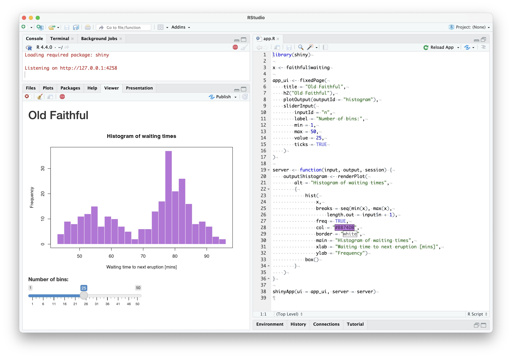
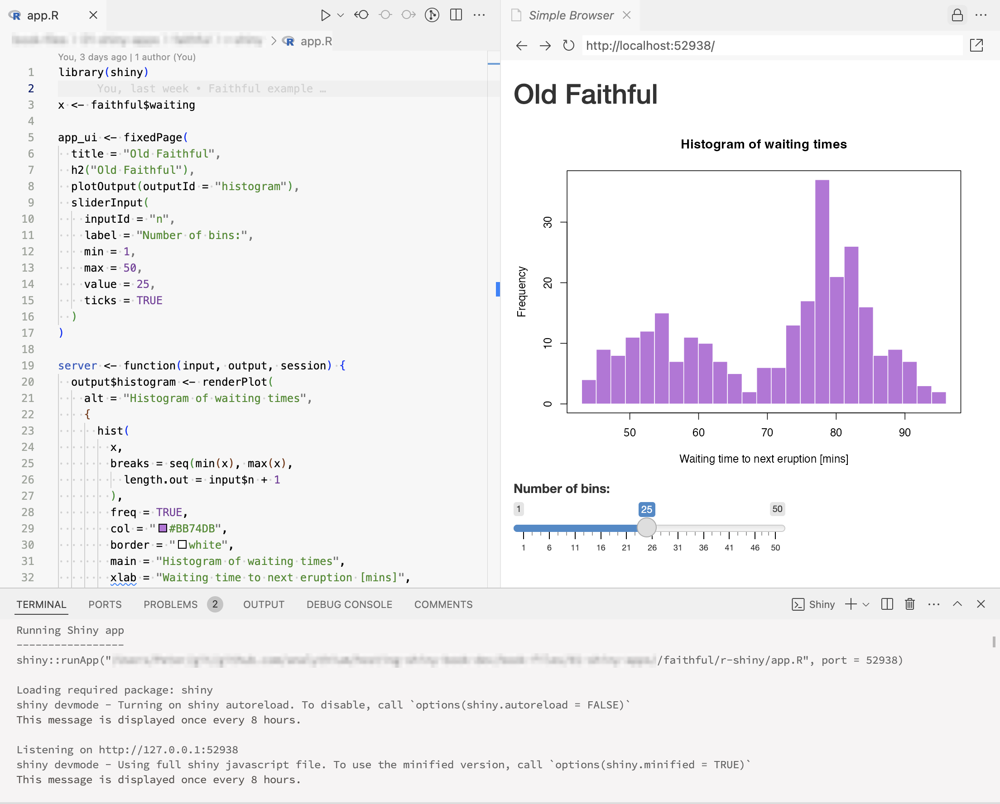
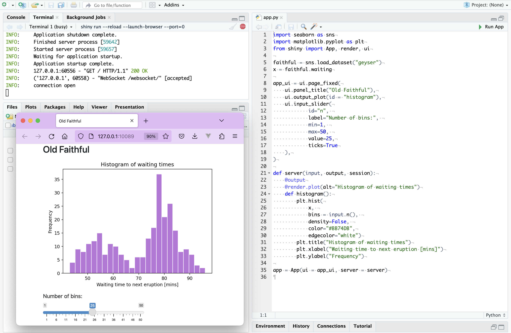
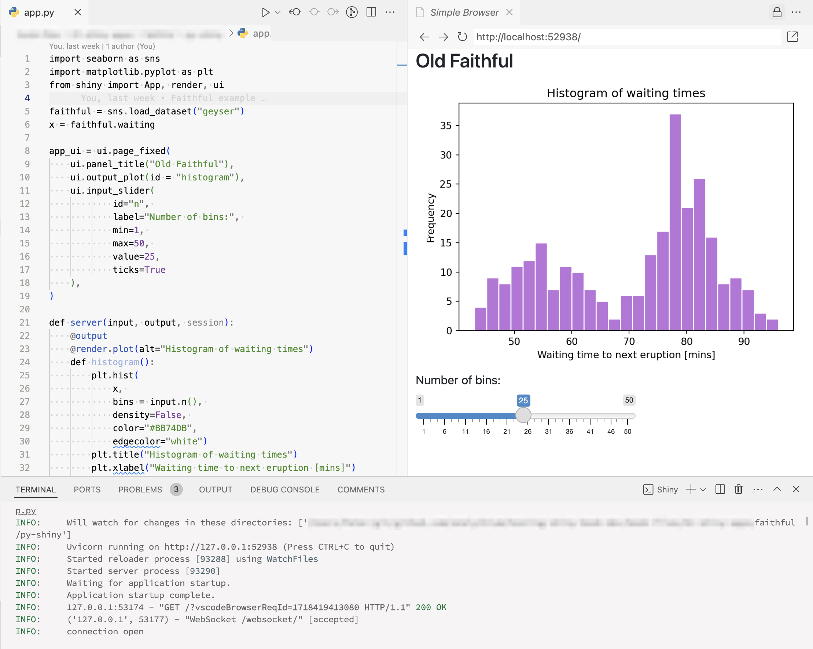

# Running Shiny Apps Locally {#part2-run-shiny-locally}

::: {.noteblock data-latex=""}
This chapter introduces how to run your app locally so that
you can test and preview your application, as well as demo it
from your computer. 

If you're looking to share your Shiny app with a wider audience,
you should proceed to Chapter \@ref(part2-sharing-shiny-code).
:::

When you are developing your app locally, you likely want to run the app and
check the look and see the changes that you've made.
In the previous chapter we already used some of the commands needed to
run the code. Let's review the different ways of running Shiny for R and Python 
apps locally.

Running your app locally is necessary for testing. Of course testing goes way 
beyond just opening up the app in the browser. We will not cover best practices
for testing your app. If you are interested, you can read about R package based
development in @Fay2021 or check out the documentation for the 
`shinytest2` R package [@R-shinytest2]. For testing related the Python version,
see the [Tapyr](https://github.com/Appsilon/tapyr-template) project
that uses [`pytest`](https://docs.pytest.org/) and 
[`playwright`](https://playwright.dev/python/docs/running-tests) 
for validation and testing.

<!--
REVIEW:
- There is a mistake in the sample code for running a shiny app in R using a specific port. The code given is `runApp(..., path = 8080)` but it should be using the "port" parameter, not "path"
-->

## R

When the app is in a single R file, you should name it `app.R`
just like we did previously for the `faithful` example.
If you have multiple files, make sure that you have the `server.R` and `ui.R`
files in the same directory. If you are using other frameworks, an `app.R`
file usually serves as an entrypoint that your IDE will recognize. 
This way, you can run it easily inside of the RStudio IDE\index{RStudio Desktop}
(Fig. \@ref(fig:rstudio-r)) or VS Code\index{VS Code} with the Shiny extension 
(Fig. \@ref(fig:vscode-r)) by pushing the "▷ Run App" button. 
Clicking on button would run the app in either a simple browser window
tab inside your IDE, or in a separate browser window, depending on your settings.
Another IDE is Positron by Posit that can also be used to develop and run
Shiny apps. It supports R and Python.

Besides the app showing up in the browser, you can also see some messages
appearing in your R console. If you inspect the console output, you should see 
something like this:

```text
Running Shiny app
-----------------
shiny::runApp("r-shiny/app.R", port = 52938)

Loading required package: shiny
shiny devmode - Turning on shiny autoreload. To disable, 
call `options(shiny.autoreload = FALSE)`
This message is displayed once every 8 hours.

Listening on http://127.0.0.1:52938
```

What does this mean? Pushing the Run App button led to running the
`runApp()` command. This started a web server on localhost (`127.0.0.1`) 
listening on port `52938` (your port number might be different). 
If you visit the `http://127.0.0.1:52938` address in your
browser, you would see the Shiny app with the slider and the histogram.
Stop the app by closing the app window in RStudio or using CTRL+C.

Running the app this way will allow you to keep the server running while
making changes to the app source code. Your changes will trigger a reload
so you can immediately see the results.
You can disable this behavior by turning off the auto-reload option
with `options(shiny.autoreload = FALSE)`.

```{r rstudio-r, eval=TRUE, echo=FALSE, fig.pos = "bt", fig.cap="Running an R Shiny app in the RStudio IDE."}
# use PNG for both

```

```{r vscode-r, eval=TRUE, echo=FALSE, fig.pos = "bt", fig.cap="Running an R Shiny app in the VS Code IDE with the Shiny extension."}
# use PNG for both

```

The `runApp()` function can take different types of arguments to run the
same app. What you saw above was serving the app from a single file. 
If you name the single file something else, e.g.
`my-app.R`, you can provide the path to a single file as
`runApp("<app-directory>/my-app.R")`.

You can start the Shiny app from the terminal using the command
`R -q -e 'runApp("<app-directory>/my-app.R")'` where the `-q` flag means to
suppress the usual opening message, and `-e` instructs R to execute the
expression following it. You can also specify the 
port number as an argument, e.g. `R -q -e "runApp(..., port = 8080)"` will
start the web server on port `8080`.

Running these lines will start the Shiny server locally that you can visit in the browser.
To be precise, the `shinyApp()` R function returns the app object which is
run either by implicitly calling the `print()` method on it when running
in the R console. You can also pass the app object to the `runApp()`
function. Stop the server by CTRL+C.

```text
R -q -e "shiny::runApp("r", port = 8080)"

> shiny::runApp("r", port = 8080)
Loading required package: shiny

Listening on http://127.0.0.1:8080
```

This pattern might be unusual for you if you are using R mostly in interactive 
mode through an IDE. You will see this pattern in the next chapters when we call 
R from the terminal shell. This is how we can start the web server process in
non-interactive mode.

## Python

You can run the Python app from the RStudio IDE 
(Fig. \@ref(fig:rstudio-py)) or VS Code  
(Fig. \@ref(fig:vscode-py)) by pushing the same "▷ Run App" button.
You'll see something like this in your console with localhost and
a randomly picked and available port number (`52938`).

```text
python -m shiny run --port 52938 --reload [...] py-shiny/app.py

INFO: Will watch for changes in these directories: ['py-shiny']
INFO: Uvicorn running on http://127.0.0.1:52938 (Press CTRL+C to quit)
INFO: Started reloader process [85924] using WatchFiles
INFO: Started server process [85926]
INFO: Waiting for application startup.
INFO: Application startup complete.
INFO: 127.0.0.1:56050 - "GET [...] HTTP/1.1" 200 OK
INFO: ('127.0.0.1', 56053) - "WebSocket /websocket/" [accepted]
INFO: connection open
```

Running the Shiny app in Python relies on the [Uvicorn](https://www.uvicorn.org/) 
web server library that can handle websocket connections.

```{r rstudio-py, eval=TRUE, echo=FALSE, fig.pos = "bt", fig.cap="Running a Python Shiny app in the RSudio IDE."}
# use PNG for both

```

```{r vscode-py, eval=TRUE, echo=FALSE, fig.pos = "bt", fig.cap="Running a Python Shiny app in the VS Code IDE with the Shiny extension."}
# use PNG for both

```

The other port number (`56053`) is for the websocket connection
created for the session. If you open another browser window
pointing to `http://127.0.0.1:52938`, you'll see another websocket
connection opening for the new session:

```text
# Opening another browser tab
INFO: 127.0.0.1:56194 - "GET / HTTP/1.1" 200 OK
INFO: ('127.0.0.1', 56196) - "WebSocket /websocket/" [accepted]
```

Use `App(app_ui, server, debug=False)` to suppress the messages.

From the terminal, you can run the single app file from the terminal with
`shiny run --port 8080 <app-directory>/app.py` on port `8080`.
If you change the output of the `App()` statement from the default 
`app = App(...)` to `faithful_app = App(...)`,
you have to define the app as well not just the file:
`shiny run <app-directory>/app.py:faithful_app`. If the file is called `app.py`
and the app object is called `app`, you can omit the file name and use
`shiny run`, in this case `app.py:app` is assumed in the current working directory.

Trying to run both the R and Python versions on the same port at the same time 
will not be possible. If you want to run both, use different port numbers, e.g. 
`8080` and `8081`.

The `shiny run` command starts the app. Use the `--launch-browser` flag 
to automatically launch the app in a web browser.
The `--reload` flag means that the Python process restarts and the browser 
reloads when you make and save changes to the `python/app.py` file.
Use CTRL+C to stop the process.

## Summary
This chapter reviews how to run Shiny apps. Understanding how Shiny apps run
is important for hosting, since we need to know which commands
to run on our remote server for hosting.
