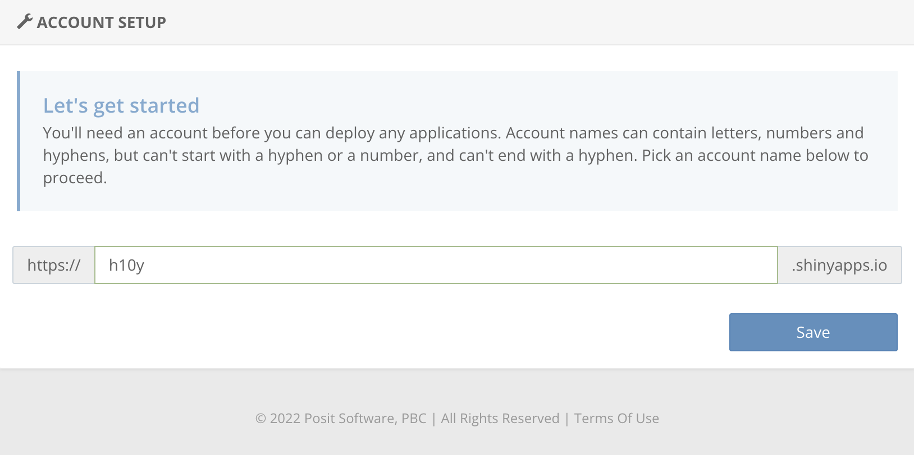
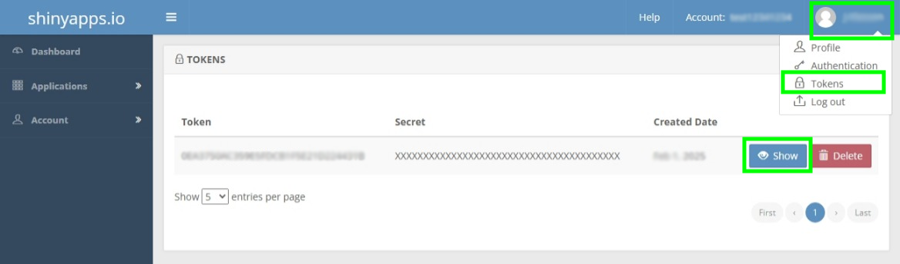
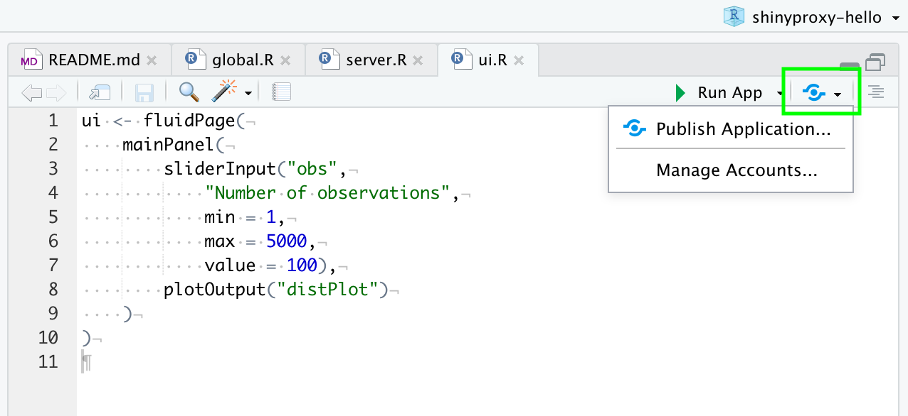
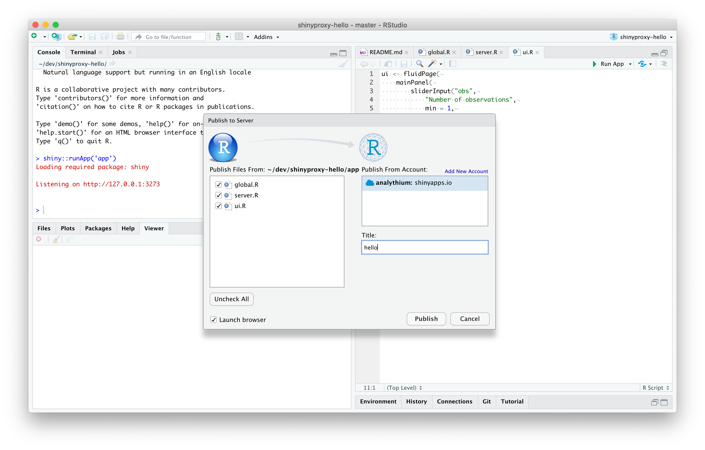
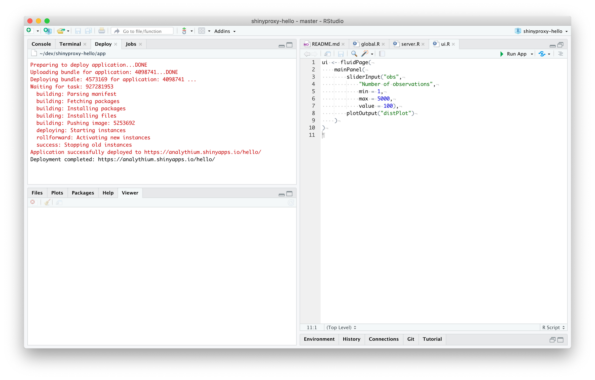
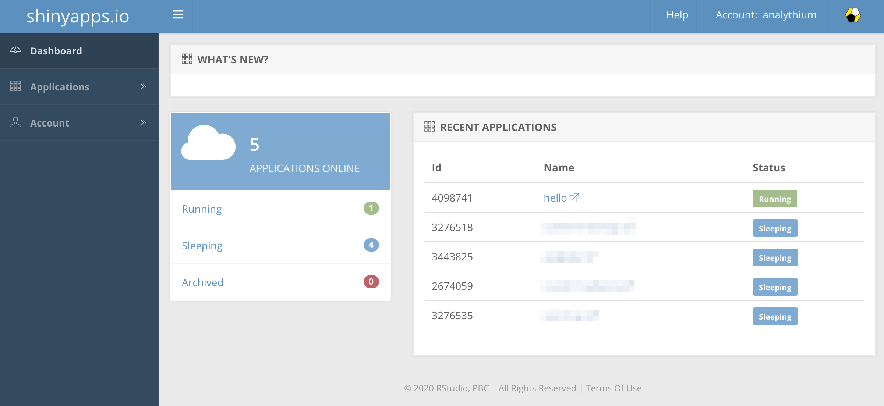
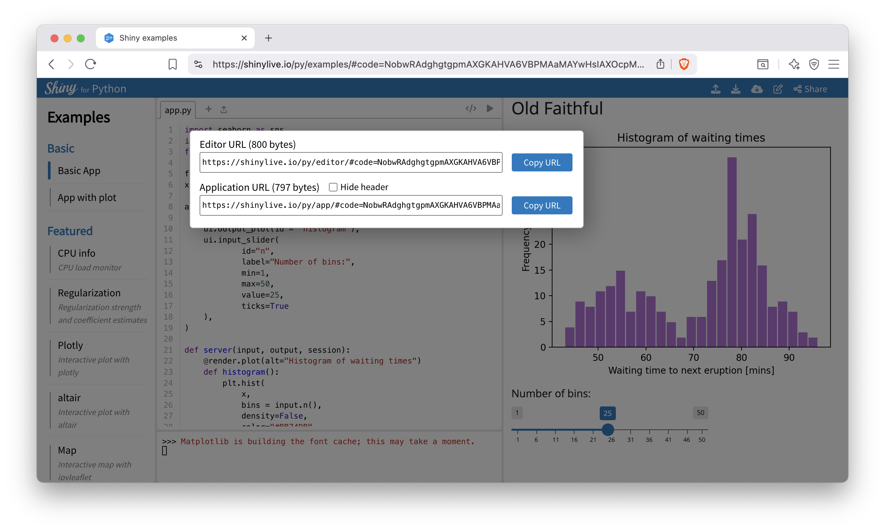

# Sharing Your Shiny App {#part2-sharing-shiny-code}

::: {.noteblock data-latex=""}
This chapter introduces different ways of sharing
your Shiny application code with a wider audience
starting with simply sending the code files to
publishing to the shinyapps.io platform.

If you wish to explore more advanced options
of sharing your Shiny apps, which includes
potential cost savings, proceed to
Chapter \@ref(part3-hosting-options).
:::

Once you have developed your Shiny app, you can
distribute your code or deploy your code depending
on your intended audience.

Distributing code involves sharing your Shiny source code
so that it can run on different computer other than your
own computer. This approach is more suited for other developers
or technical users who are familiar with setting up
and running a Shiny app project.

Deploying code involves hosting your code on a server
so that users can access your Shiny app without any setup.
This approach is ideal for non-technical users as all they
need to do is enter a website address in their web browser.

## Distributing Code {#part2-distributing-code}

Distributing the source code of a Shiny app allows collaborators, clients, 
and users to run it on their own machines, if they are savvy
enough. When the audiences of a Shiny app are R or Python users, 
it makes sense to share the app as a Gist, a GitHub repository, or a zip file. 
However, sharing Shiny apps this way leaves installing dependencies up to the user.

A Gist is a service provided by GitHub to share code snippets. It is version
controlled and tracks changes made to code snippets. You can think
of a Gist as a virtual notebook for code which is ideal for small Shiny
apps that do not rely on large sets of data.

In comparison, a GitHub repository is a full fledged source code management
system. Its underlying technology, Git, allows for multiple versions
of source code to be tracked in a central location. Many Shiny apps
are hosted on GitHub or other similar services (like GitLab or Bitbucket),
and GitHub also offers other useful features that developers rely on.
Such as issues, pull requests, continuous integration and deployment (CICD)
through GitHub Actions. If your GitHub repository is private,
the users of the app will have to have their own GitHub account so that
you can share the repository with them without making it public.

A zip file is compressed archive that bundles folders and files into a single
file. By "zipping" up your source code to a single file, you can easily
distribute your file via email, a download link, or even physical media 
like a USB drive or CD-ROM. This approach, however, will make it harder to
trace changes and maintain different versions compared to approaches listed
previously.

The `shiny` R package comes with a few useful functions that makes sharing
your apps with technical users easier. You can use the `runUrl()`,
`runGitHub()`, and `runGist()` functions to run apps from specific URLs,
GitHub repositories, and Gists, respectively. `runUrl()` can be pointed at
R files or compressed files, such as `.zip`.

Another option is distributing your R Shiny app as an R package.
This option takes care of dependency management. You can install the R
package from different sources, like GitHub, and you can also have it
hosted on CRAN. However, the recipients will have to be able to install the 
package, which implies familiarity with R and package management.
Sharing the app source code is a low effort option on your part, 
but might be a high effort option for the ones you are sharing your app with.

Since sharing the source code can be cumbersome for non-technical recipients, 
it is ideal to share a deployed version of your Shiny application 
accessible through a web browser.
In the remainder of the book, we'll guide you through the process of 
deploying Shiny apps. The content is structured to gradually introduce simpler 
solutions, progressing to more advanced solutions.
<!--
REVIEW:
- This section feels too surface-level to be useful. I would either scrap it entirely, or expand it. But in its current form, it feels like a short filler without any substance.
-->

<!-- FIXME: why you might not want to distribute the code: IP considerations
but you need to be careful about licenses (what libraries you use in the app,
and what the license is for the hosting solutions you are using) -->

## Deploying Shiny Apps {#part2-deploying-shiny-apps}

Shiny applications can be deployed in two ways. **Shinylive** runs entirely in 
the browser, allowing a Shiny app to function without a backend server for any 
application logic. Shinylive can run on any static site hosting service such 
as GitHub Pages or even straight from the shinylive.io editors for R and Python.

In contrast, classic **Shiny** provides a fully reactive 
experience by connecting to a backend server to handle application logic.
Shiny deployments can run on your self-hosted server, or on a cloud-based
platform provided by a third party, such as shinyapps.io.

The next sections introduce how to deploy Shiny apps in the simplest ways possible.

### shinyapps.io {#part2-deploy-to-shinyapps-io}

shinyapps.io offers a dedicated Shiny hosting service to share your application
through a web browser. It is a Platform as a Service (PaaS) tailored for Shiny apps
and is provided by Posit PBC. It is a **fully managed** solution 
(no server maintenance costs, only service costs) 
and is tightly integrated with the RStudio IDE for R Shiny apps. 
R and Python based Shiny apps can also be published from the command line. 
Apps are self-contained and isolated from each other.
Connections are encrypted (HTTPS) by default.

To begin you must sign up by visiting <https://shinyapps.io>.
After sign-up, you will be prompted to set your account name as
seen in Figure \@ref(fig:shinyapps-io-setup).

```{r shinyapps-io-setup, eval=TRUE, echo=FALSE, out.width="75%", fig.pos = "bt", fig.cap="Account name setup screen after sign up."}
# use PNG in both the html and latex versions

```

Your account name is used to access any published apps from the 
`https://<account-name>.shinyapps.io` web address.

Now that your account has been set up, let us explain how to deploy from
the RStudio IDE for Shiny R apps and deploy from the command line
for Shiny Python and R apps.

#### R: Deploying from RStudio IDE {-}

<!-- FIXME: Faithful app deployed here: <https://analythium.shinyapps.io/faithful/> -->

If you develop a Shiny app with R, you can deploy your app straight from the 
RStudio Desktop IDE with the click of a button.

To be able to take advantage of push-button publishing, you will need the 
following prerequisites:

- Install a recent version of [RStudio Desktop](https://posit.co/download/rstudio-desktop/),
- Install R and the `rsconnect` R package, e.g. via `install.packages("rsconnect")`.

Following the installation of R and RStudio, access the tokens page on shinyapps.io
by clicking on your profile picture and selecting "Tokens" as seen 
in Figure \@ref(fig:shinyapps-io-tokens).

```{r shinyapps-io-tokens, eval=TRUE, echo=FALSE, out.width="75%", fig.pos = "bt", fig.cap="shinyapps.io tokens page."}
# use PNG in both the html and latex versions

```

On the tokens page, click the "Show" button and you will be presented 
instructions on how to connect with R. Simply click the copy button, and
paste the command into the R console in RStudio.

Once connected, you can publish your app by clicking the publish button seen in 
Figure \@ref(fig:shinyapps-io-rstudio-publish-button). You will see the
publish button after opening a R source code file.

```{r shinyapps-io-rstudio-publish-button, eval=TRUE, echo=FALSE, out.width="100%", fig.pos = "bt", fig.cap="RStudio IDE Shiny publish button."}
# use PNG in both the html and latex versions

```

Next, you must select the account you wish to deploy to if you set up multiple
accounts, name the app (here we use 'hello'), and select what files
to deploy as part of the app. An example of this can be seen in
Figure \@ref(fig:shinyapps-io-rstudio-publish-screen).

```{r shinyapps-io-rstudio-publish-screen, eval=TRUE, echo=FALSE, out.width="100%", fig.pos = "bt", fig.cap="RStudio IDE shinyapps.io publish screen."}
# use PNG in both the html and latex versions

```

Finally, once you click publish, wait until the deployment is complete, 
you can follow the process in the Deploy pane of RStudio IDE (Figure \@ref(fig:shinyapps-io-rstudio-deploy-pane)).

```{r shinyapps-io-rstudio-deploy-pane, eval=TRUE, echo=FALSE, out.width="100%", fig.pos = "bt", fig.cap="RStudio IDE deploy pane."}
# use PNG in both the html and latex versions

```

The browser will be launched with the new deployment by default, check
that everything works as expected.
Your newly deployed app will be available at
`https://<account-name>.shinyapps.io/<app-name>`. 

The dashboard in your shinyapps.io account will list your app similar to
Figure \@ref(fig:shinyapps-io-app-dashboard).

```{r shinyapps-io-app-dashboard, eval=TRUE, echo=FALSE, out.width="100%", fig.pos = "bt", fig.cap="shinyapps.io app dashboard"}
# use PNG in both the html and latex versions

```

<!-- Click on the app to see
usage statistics and
[settings](https://docs.posit.co/shinyapps.io/guide/applications/index.html).
This is the place where you can archive or delete the app too. -->

#### R + Python: Deploying from Command Line {-}

Deployment from the command line is supported for R and Python Shiny apps.
Both options require the installation of a `rsconnect` library 
to connect with shinyapps.io via a token and a secret.

To get connected with the token and secret, you will need to access the 
tokens page on shinyapps.io. 
First, log in to the shinyapps.io dashboard, click on your profile picture, and select "Tokens", 
as shown in Figure \@ref(fig:shinyapps-io-tokens). You should already have a token listed in the table.
Click "Show" to reveal the command needed to authenticate with R or Python and run it
in the appropriate console.

##### R {-}

To deploy your Shiny app in R, first install the `rsconnect` package
if you haven't already in the R console:

```R
install.packages("rsconnect")
```

Copy the authentication command from the shinyapps.io "Tokens" page and run it 
in your R console. It should look like this:

```R
rsconnect::setAccountInfo(
    name = "<account-name>",
    token = "<token-value>",
    secret = "<SECRET>")

# example
rsconnect::setAccountInfo(
    name = "h10y",
    token = "A1B2...Y8Z9",
    secret = "abc123...xyz789")
```

Once authenticated, deploy your app with:

```R
rsconnect::deployApp(
    appDir = "/path/to/your/app",
    account = "<account-name>",
    appName = "<app-name>")

# example
rsconnect::deployApp(
    appDir = "./r-shiny/app", 
    account = "h10y",
    appName = "faithful-r")
```

The rsconnect package explores the app source files and creates a manifest
based on the local R version being used and the packages mentioned
as part of the app source files. rsconnect will also check dependencies
parsed by other packages, like packrat or renv.
You might see an error message telling you that your app library and 
lockfile is out of sync.
You can either use `renv::restore()` or `renv::snapshot()` to synchronize
the packages, or add an `.rscignore` file to ignore the lock file.

##### Python {-}

To deploy the Shiny app in Python, first install the 
[`rsconnect-python`](https://docs.posit.co/rsconnect-python/) library if you haven't already
using the following command in your terminal:

```sh
pip install rsconnect-python
```

Copy the connection command from the shinyapps.io "Tokens" page 
and run it in your terminal. Use the `add` command to store information about 
the server your are deploying to, so that you can deploy to the server later
without providing the credentials again. The `--name` option specifies
a "nickname" for the server that you can refer to when deploying apps later.
It should look like this:

```sh
rsconnect add \
    --account <account-name> \
    --name <NAME> \
    --token <token-value> \
    --secret <SECRET>

# example
rsconnect add \
    --account h10y \
    --name h10y \
    --token A1B2...Y8Z9 \
    --secret abc123...xyz789+
# Checking shinyapps.io credential...  [OK]
# Added shinyapps.io credential "h10y".
```

Note, that this command will save the token and secret used to authenticate 
with shinyapps.io into a file that is marked as accessible by the owner only.
It is a plain text file and it is good to remember that it exists and take
precautions to prevent unauthorized access.

Once authenticated, deploy your app by providing the `NAME` of the
server you set with the previous command and the app's title. This
title will be the path following the shinyapps.io domain 
(`https://<account-name>.shinyapps.io/<app-name>`):

```sh
rsconnect deploy shiny /path/to/your/app \
    --name <NAME> \
    --title <app-name>

# example
rsconnect deploy shiny ./py-shiny/app \
    --name h10y \
    --title faithful-py
# Validating server...    [OK]
# Validating app mode...  [OK]
# Making bundle ...       [OK]
# Deploying bundle ...
# Waiting for task: 1575868905
#   building - Processing bundle: 10720803
#   building - Installing files
#   building - Pushing image: 13166256
#   staging - Pushing image: 13166256
#   deploying - Pushing image: 13166256
#   deploying - Starting instances
# Task done: Stopping old instances
# Application successfully deployed to https://h10y.shinyapps.io/faithful-py/
#         [OK]
# Saving deployed information...  [OK]
# Verifying deployed content...   [OK]
```

Currently, shinyapps.io supports python 3.7 to 3.12, using the 
most recent patch version of Python loaded on shinyapps.io.
Because the Python version is not part of the `requirements.txt` file,
the rsonnect library will guess the Python version to use based on the local 
environment. You might see a warning related to this ambiguity when
running the `rsonnect` command.
You can consider specifying a Python version constraint via the 
`pyproject.toml`, `setup.cfg` or `.python-version` files.
The `pyproject.toml` or `setup.cfg` can have the Python version requirement
added to the project section as:

```toml
[project]
requires-python = ">= 3.10.6"
```

If using the `.python-version` file, add one or multiple Python versions, e.g.:

```text
3.10.6
```

### Sharing Shinylive {#part2-sharing-shinylive}

In Chapter \@ref(part2-shinylive), we introduce the concept of Shinylive which 
allows a Shiny app to run entirely in a browser without the need for a server. 
The Shinylive editor makes it easy to share your Shinylive application straight 
from the browser.

However, it should be noted that libraries can be slow to load, hence Shinylive 
is mostly ideal for micro projects that need minimal libraries and simple 
calculations. Furthermore, Shinylive may not run in certain browsers and its 
performance depends on the internet connection and the computer you are loading 
the application on.

It should also be noted that the presented option in this section is not a true 
"deployment" of Shinylive as the code is fed to the Shinylive editor hosted by Posit.
There are also the Shinylive libraries for R and Python that allow you to create 
files for static site hosting of Shinylive on your hosting service of choice 
without relying on the Shiylive editor. We explain more about the static site 
hosting of Shinylive in Chapter \@ref(part3-static-hosting).

#### Shinylive Web Editor {-}

Posit offers a hosted Shinylive editor in the browser for R and Python[@shinylive-editor-deployment].
The R editor is available here: <https://shinylive.io/r>.
The Python editor is available here: <https://shinylive.io/py>.

First, you will need to copy your code into the editor.
Once you have copied the code you can press `Ctrl+Shift+Enter`
to run the code, or press the play button in the editor
to make sure it runs properly. Next, to share your app you will need to press 
the share button as seen in Figure \@ref(fig:shinylive-share-link).

```{r shinylive-share-link, eval=TRUE, echo=FALSE, out.width="100%", fig.pos = "bt", fig.cap="Shinylive editor share link."}
# use PNG in both the html and latex versions

```

There are 2 options for sharing:

- the **Editor URL** option loads your app via the code editor,
- the **Application URL** option loads your app without the code editor, but 
  there is an optional header that provides a link to the editor.

You can copy either of the URLs and share it with your 
intended recipient and ideally it should run if your
recipients web browser supports WebAssembly.

The URLs returned by the editor create a hash of the code
that is read by the web browser[@shinylive-editor-deployment]. That means no code
is ever sent to a server and your source code
is never sent directly to anybody other than
the recipient that you share the URL with.

Since the app source is completely encoded in a URL,
it may not work if your application code is too large.
This is so because there is a maximum length for URLs that varies by browser.
To solve this issue, we recommend either deploying a full Shiny app to shinyapps.io
or exporting your own Shinylive app which is described in Chapter \@ref(part3-static-hosting).

## Summary

We have reviewed options for sharing your app's source code 
with others in Section \@ref(part2-distributing-code). Sharing the app source 
code has several issues when you are sharing
with non-technical users. First off, they will have to have an R or Python 
runtime environment. Second, they will have to have all the right 
dependencies installed, sometimes with specific versions of the libraries.

To make your Shiny app more accessible, we introduce how to publish
your app to be accessible via a web browser with shinyapps.io. We also
introduce the option to share your Shiny app with the Shinylive editor.

The options we have introduced to share your Shiny app are just the tip
of the iceberg, in the next part of this book, we will delve into
more considerations for hosting you Shiny app including costs, branding, and
security.

<!-- As you will see in the next chapter, sharing the app as a Docker image
is also an option. This might help with having a runtime environment and
managing dependencies, but again, your users will need to understand and use 
Docker and that can be often too much to ask for.
So the real reason we are talking about Docker is that it can help you host the
app. -->

<!-- shinyapps.io is a fully managed solution for Shiny apps provided by Posit, the creators of Shiny.
It is the easiest and quickest way to publish Shiny apps due to its integration with RStudio and
the provided command line tools for deployment. However, costs might be prohibitive as an application
scales, hence our introduction of hosting options in Chapter \@ref(part3-hosting-options). -->
