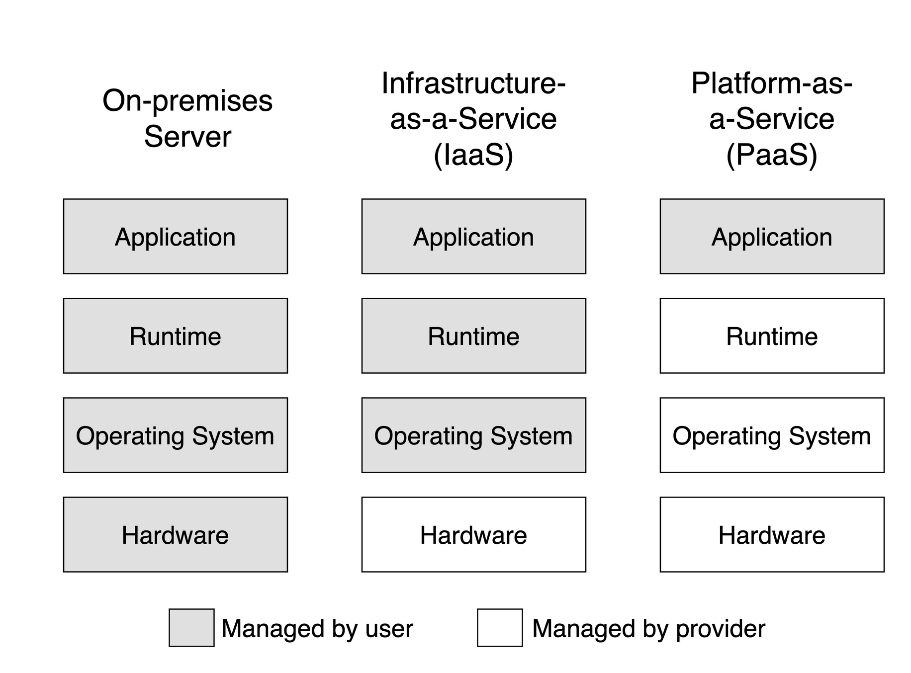
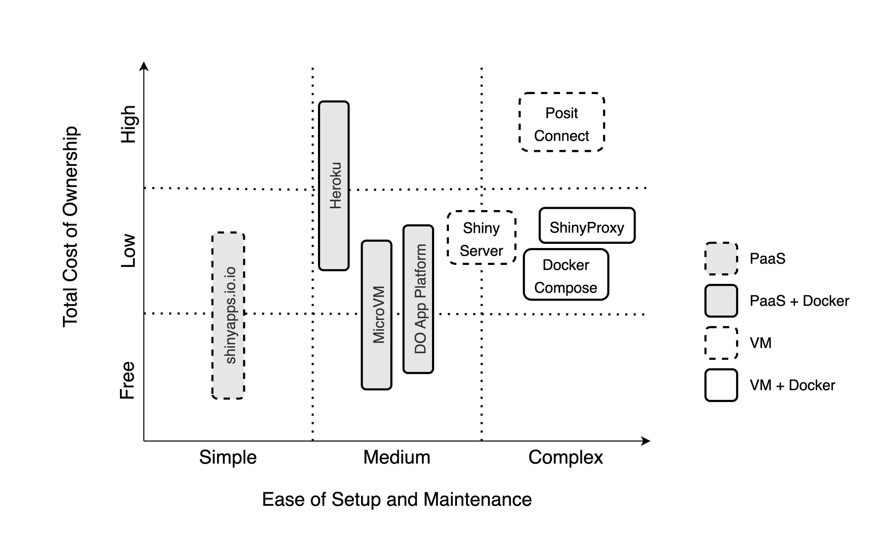
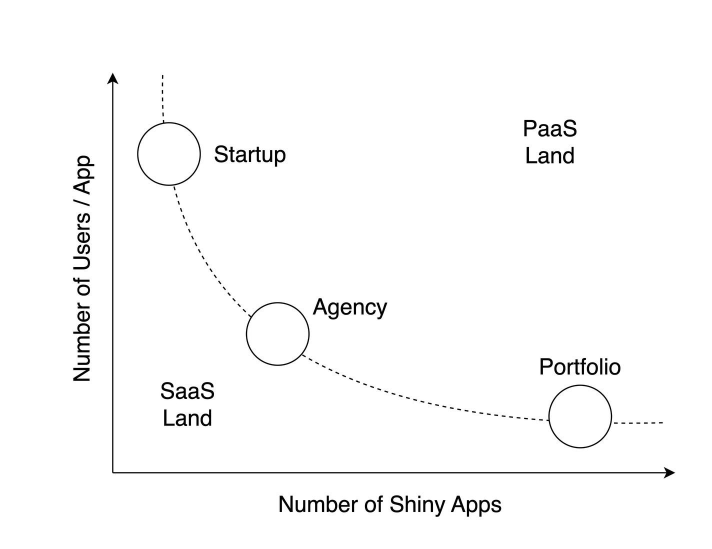
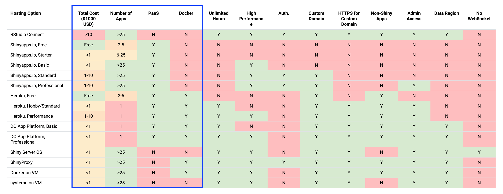

# (PART) Hosting Shiny Apps {-} 

# A Review of Shiny Hosting Options {#part3-hosting-options}

::: {.noteblock data-latex=""}
This chapter expands on Chapter \@ref(part2-sharing-shiny-code)
which explains how to share your Shiny app to a wider audience.
Reading this chapter will help you explore the different options,
accounting for factors like costs, skill level, and time,
for hosting your Shiny app.
:::

In the previous parts of the book you've acquired all the tools and skills 
needed to deploy and host your Shiny app. From this part, you'll learn how the
many hosting options work.
In this chapter, we want to build the intuition behind the different 
kinds of hosting options and choosing the option that best suits your needs.
This review is going to provide you with a framework that you can use now, and 
use again later if ever your needs have changed.

## Hosting Patterns for Shiny Apps {#part3-hosting-patterns}

Web applications can run statically or dynamically. If running statically, then a 
backend server is not required as all the necessary content is pre-generated.
However, dynamic web applications require a backend server to render pages.

The pros of hosting an static app include a small app size and fast loading 
speed, the ability to be hosted for free, improved 
search engine optimization (SEO), and content decoupling. 
However, the cons are that the app is the same for all users and not reactive.
This is the limitation that Shinylive solves using WebAssembly (Wasm) to add
the reactivity to the client side (see Section \@ref(part2-creating-a-shiny-app)).
These static Shinylive apps can be hosted cost effectively and easily compared to
dynamic Shiny apps. Application loading times might depend on how the content
is bundled and the specifications of the client computer.

The benefit of a dynamically hosted app is the provision of user-specific content 
along with full reactivity facilitated by websockets. However, the drawbacks 
include the tendency to be resource-hungry, slow initial loading times, 
challenges with search engine optimization (SEO, i.e. bots can't crawl a page 
that is not yet rendered), more complex hosting requirements, and the 
high performance costs.

Both static and dynamic apps can be hosted on platforms, or servers that you 
manage. We will use the term virtual machine (VM) and server interchangeably,
although a server might mean a virtualized piece of hardware in the cloud (VM),
or a physical server on premises. We are not giving recommendations regarding
bare metal server setup. But when you start with an Ubuntu operating system, the
management of a physical server and a VM are almost identical.

Hosting platforms (platform-as-a-service, PaaS), like shinyapps.io, aim to remove
most of the difficulties associated with setting up a server and the ongoing 
maintenance. Platforms also provide some security guarantees out of the box.
What is included and how much hosting on a platform might cost vary widely.
Most platforms offer free hosting for static content, including Shinylive apps.
Certain platforms, like shinyapps.io or Fly offer dynamic app hosting with some
limits on resource usage. 

Table \@ref(tab:hosting-patterns) provides an overview of the hosting 
options we tackle in the book. The options are organized according to the
backend type of the app (static or dynamic), the use of Docker, and whether 
it is a platform-as-a-service (PaaS) or a self-managed server.
A server can also be physical server on premises or so a called virtual
machine or VM for short (Fig. \@ref(fig:vm-and-paas)).

```{r vm-and-paas, eval=TRUE, echo=FALSE,out.width="100%", fig.pos = "bt", fig.cap="The difference between servers and platform-as-a-service."}
if (is_latex_output()) {
    include_graphics("images/vm-and-paas/vm-and-paas.pdf")
} else {
    
}
```


```{r hosting-patterns, eval=TRUE, echo=FALSE}
capt <- "Shiny hosting options at a glance. Bold font indicates when the hosting option is free of charge."
if (!is_latex_output()) {
    bf1 <- "**"
    bf2 <- "**"
} else {
    bf1 <- "\\textbf{"
    bf2 <- "}"
}
z2 <- matrix(c(
"Shiny", "PaaS", "✘ No", paste0(bf1, "shinyapps.io", bf2),
"Shiny", "PaaS", "✔ Yes", paste0("DOAP, Heroku, ", bf1, "Fly", bf2),
"Shiny", "VM", "✘ No", "Posit Connect, Shiny Server",
"Shiny", "VM", "✔ Yes", "ShinyProxy, Docker Compose",
"Shinylive", "PaaS", "✘ No", paste0(bf1, "GitHub Pages", bf2, ", ", bf1, "Netlify", bf2),
"Shinylive", "PaaS", "✔ Yes", paste0(bf1, "DOAP", bf2, ", Heroku, ", bf1, "Fly", bf2),
"Shinylive", "VM", "✘ No", "File server",
"Shinylive", "VM", "✔ Yes", "ShinyProxy, Docker Compose"
), ncol = 4, byrow = TRUE)
colnames(z2) <- c("Type", "PaaS/VM", "Docker", "Options")
# z2 <- z2[,c(2,3,1,4)]
z2[c(2:4, 6:8),1] <- ""
z2 <- as.data.frame(z2)
if (!is_latex_output()) {
    z2 |>
        kableExtra::kbl(booktabs = TRUE, caption = capt) |>
        kableExtra::kable_styling(
            font_size = NULL)
} else {
    z2 |>
        kableExtra::kbl(booktabs = TRUE, caption = capt, escape = FALSE) |>
        kableExtra::kable_styling(
            font_size = NULL)
}
```

<!-- FIXME: Talk about licenses for the hosting solutions you are using, MIT/Apache/GPL/AGPL -->

The use of Docker becomes important when considering the hosting options.
Most platforms provide runtime for containerized applications. As a result,
the apps become more portable across platforms and cloud providers.
Containerization also provide isolation to apps and users, it might be 
beneficial for managing the dependencies of the apps as well. 
But using Docker also comes with a learning curve. See more in Chapter \@ref(part4-containers).

Figure \@ref(fig:hosting-comparison) shows the hosting options according 
to the level of complexity. Non-containerized platform solutions are the
easiest to deal with. Medium complexity is when you are not yet managing your 
own server, but the platform might require containerized apps.
The most complex setup, of course, is when you are managing your own server.
You'll have to deal with security, storage, backups, logging, monitoring, etc.

```{r hosting-comparison, eval=TRUE, echo=FALSE,out.width="100%", fig.pos = "bt", fig.cap="Hosting options for dynamic Shiny apps organized by total cost of ownership and the ease of setup and maintenance."}
if (is_latex_output()) {
    include_graphics("images/hosting-comparison/hosting-comparison.pdf")
} else {
    
}
```

## The Decision Framework {#part3-decision-framework}

When searching for you first or next hosting option, you might be asking,
_Which option is the best?_. Let us try to reframe that question a little bit:
_Which option is the best for what?_
You could say, for example, that _I want to host my portfolio for free
and I don't care about a custom domain name_. Or a nonprofit might say,
_We want to host our apps at low cost, we want custom domains, and we
want to be able to handle surge traffic, but we don't want to maintain
any servers_.

If you have been developing Shiny apps, you might already have your
preferred way of deployment. But as your needs evolve, you will identify
additional requirements and might find that your go-to option is not the
best anymore. Then you'll do some research and find the next option
as we explained in the introduction for the hosting cycle
(Fig. \@ref(fig:hosting-cycle)).

If you are not yet familiar with Shiny hosting options, you still need
to make an informed choice at some point, so you are not wasting
your time and effort on something that will not serve you well over the
long run. Here is the 3-step process that you can follow to help you
with this decision. Here are the 3 steps:

1. Start with the _Why?_
2. Define your requirements.
3. Identify your constraints.

Let's review each of these steps.

### Start with the Why

Why do you want the app or apps deployed? Are you building a
portfolio to boost your career? Are you deploying useful apps for
stakeholders or clients of your organization? Are you trying to sell an
app as a software-as-a-service (SaaS) offering?
These are some of the common questions that you might ask when identifying
the needs and constraints of your app.

Shiny developers start out as enthusiasts who develop apps for fun or to
build a portfolio. There could be large number of apps that you develop as
a result, but you do not necessarily expect a large number of users visiting
these apps. You try to keep costs down and spare yourself the headache of 
maintenance (free or paid shinyapps.io). If the app is slow, or you run out of app 
hours, it is usually not the end of the world.

You can start a business or join an existing one that builds and hosts apps
for other organizations. In this agency model, you have a growing number of
apps, and a fair number of users. These users require authentication and you 
have a really good idea about the number of users and you can use a setup
that make sense and adjust the setup as needed due to growth.

Academics and nonprofits might fall somewhere between portfolio and agency.
There could be an app supporting each scientific paper. Demand might surge after 
a conference but is expected to die down quickly afterwards. They might maintain 
a few apps and host them on a platform or use university owned hardware.

You might find yourself in a situation where a company focuses on a single 
application or a small number of related apps. However, they have a large
number of users. This is the situation when user authentication and scaling 
become really important.

Finding the right persona of what you need and why will lead you to
the requirements behind the hosting needs of your application.


<!--
Defining your persona and having a sense of your users will put you somewhere
on the continuum of apps vs. users that is shown in Figure \@ref(fig:apps-users).
We listed some examples for combinations of number of users vs. number of
apps above when we described the personas. Those personas are quite common to our
knowledge. However, having a large number of users and a large number of apps, 
is quite uncommon. shinyapps.io is an example of such a combination, another one 
is Polished, a company that recently went out of business. Building a platform (PaaS) 
offering is a risky undertaking. Probably that is why most companies operate on 
the opposite side of the spectrum, offering software-as-a-service (SaaS) instead.

```{r apps-users, eval=TRUE, echo=FALSE, out.width="100%", fig.pos = "bt", fig.cap="Number of apps vs. number of users per app."}
if (is_latex_output()) {
    include_graphics("images/apps-users/apps-users.pdf")
} else {
    
}
```
-->

### Requirements

Answering the Why question and finding your persona will probably reveal important 
details about your motivations, your users and audience, the number of apps you 
are going to host, etc. The answer will also bring you closer to identifying the
requirements that you'll need.

You might realize that you don't need to host your Shiny 
app. For example, your app might be used on a laptop as a GUI to analyze data by
non-specialists in the field without internet coverage. In this
case, no need to move on to step 2, because all you need is to run
Shiny locally.

 <!-- /FIXME: add ref to chapter/. -->

However, if your answer makes it clear to you that your users will be
accessing the app over the Internet, you will have a host of other requirements:

- How much memory does your app need?
- How many concurrent users are you expecting? 
- Do you need a custom domain? 
- Do you need HTTPS? (Everybody needs HTTPS.)
- Do you need authentication or app-level authorization? 
- Do you want to host a single app or many apps? How many?
- Will you host any non-Shiny apps (Dash, Streamlit, etc.)?
- Do your users have patchy internet connection so websockets might not work well?
- Do you need admin access?
- Do you have compliance needs, i.e. specific data/server region requirements?

<!-- /FIXME: need the final URL to legend/ -->
```{r eval=TRUE,echo=FALSE, results='asis'}
if(is_latex_output()){
txt <- '
Figure \\@ref(fig:hosting-options-at-a-glance) lists hosting options and the various needs you might have.
The table lists tiers offered by the same company as separate options. 
Use the interactive online version of this table to filter the table.
'
} else {
txt <- '
The following interactive table provides a feature comparison for hosting options that are available for dynamic Shiny apps.
The table lists tiers offered by the same company as separate options. 
You can filter the table to find the options(s) that satisfy your requirements.
'
}
cat(txt)
```

```{r eval=TRUE,echo=FALSE}
library(reactable)

shopt <- structure(list(name = c("Posit Connect", "shinyapps.io.io, Free", 
    "shinyapps.io.io, Starter", "shinyapps.io.io, Basic", "shinyapps.io.io, Standard", 
    "shinyapps.io.io, Professional", "Heroku, Eco", "Heroku, Basic", 
    "Heroku, Standard", "Heroku, Performance", "DO App Platform, Basic", 
    "DO App Platform, Professional", "Fly.io, Free", "Fly.io, Paid", 
    "Shiny Server OS", "ShinyProxy", "VM + Docker", "VM + systemd"
    ), tco = c(">10", "Free", "<1", "<1", "1-10", "1-10", "<1", "<1", 
    "<1", "1-10", "<1", "<1", "Free", "1-10", "<1", "<1", "<1", "<1"
    ), napps = c(">25", "2-5", "6-25", ">25", ">25", ">25", "1", 
    "1", "1", "1", "1", "1", "2-5", "1", ">25", ">25", ">25", ">25"
    ), paas = c("N", "Y", "Y", "Y", "Y", "Y", "Y", "Y", "Y", "Y", 
    "Y", "Y", "Y", "Y", "N", "N", "N", "N"), docker = c("N", "N", 
    "N", "N", "N", "N", "Y", "Y", "Y", "Y", "Y", "Y", "Y", "Y", "N", 
    "Y", "Y", "N"), unlimhrs = c("Y", "N", "N", "N", "N", "N", "N", 
    "Y", "Y", "Y", "Y", "Y", "N", "N", "Y", "Y", "Y", "Y"), hiperf = c("Y", 
    "N", "N", "Y", "Y", "Y", "N", "N", "Y", "Y", "N", "Y", "Y", "Y", 
    "Y", "Y", "Y", "Y"), authen = c("Y", "N", "N", "N", "Y", "Y", 
    "N", "N", "N", "N", "N", "N", "N", "N", "N", "Y", "N", "N"), 
        domain = c("Y", "N", "N", "N", "Y", "Y", "Y", "Y", "Y", "Y", 
        "Y", "Y", "Y", "Y", "Y", "Y", "Y", "Y"), https = c("Y", "N", 
        "N", "N", "N", "N", "Y", "Y", "Y", "Y", "Y", "Y", "Y", "Y", 
        "Y", "Y", "Y", "Y"), noshiny = c("Y", "N", "N", "N", "N", 
        "N", "Y", "Y", "Y", "Y", "Y", "Y", "Y", "Y", "N", "Y", "Y", 
        "N"), admin = c("Y", "N", "N", "N", "N", "Y", "Y", "Y", "Y", 
        "Y", "Y", "Y", "Y", "Y", "Y", "Y", "Y", "Y"), region = c("Y", 
        "N", "N", "N", "N", "N", "N", "N", "N", "N", "Y", "Y", "Y", 
        "Y", "Y", "Y", "Y", "Y"), nowebsock = c("N", "N", "N", "N", 
        "N", "N", "N", "N", "N", "N", "N", "N", "N", "N", "Y", "N", 
        "N", "N")), row.names = c("Connect", "shinyapps.io-Free", "shinyapps.io-Start", 
    "shinyapps.io-Basic", "shinyapps.io-Stand", "shinyapps.io-Prof", "Heroku-Eco", 
    "Heroku-Basic", "Heroku-Stand", "Heroku-Perf", "DOAP-Basic", 
    "DOAP-Prof", "Fly-Free", "Fly-Paid", "ShinyServer", "ShinyProxy", 
    "VM-Docker", "VM-systemd"), class = "data.frame")
yn_fun <- function(value) {
    list(background = if (value == "Y") "#69B34C44" else "#FF0D0D44")
}
or1_fun <- function(value) {
    list(background = switch(value,
        "Free" = "#69B34C44",
        "<1" = "#FAB73344",
        "1-10" = "#FF8E1544",
        ">10" = "#FF0D0D44",
        stop("OR1!")))
}
or2_fun <- function(value) {
    list(background = switch(value,
        ">25" = "#69B34C44",
        "6-25" = "#FAB73344",
        "2-5" = "#FF8E1544",
        "1" = "#FF0D0D44",
        stop("OR2!")))
}
cell_fun = function(value) {
    #if (value == "Y") "\u2714\ufe0f Y" else "\u274c N"
    value
}
```

`r if(!is_latex_output()){"\n<!--\n"}`

```{r hosting-options-at-a-glance, eval=TRUE, echo=FALSE,out.width="100%", fig.pos = "bt", fig.cap="Feature comparison for hosting options that are available for dynamic Shiny apps."}
if (is_latex_output()) {
    
} else {
    
}
```

`r if(!is_latex_output()){"\n-->\n"}`

```{r hosting-options-table, eval=TRUE, echo=FALSE}
if (!is_latex_output()) {
    reactable(
        shopt,
        rownames = FALSE,
        pagination = FALSE,
        filterable = TRUE,
        highlight = TRUE,
        #  selection = "multiple",
        columns = list(
            name = colDef(name = "Hosting Option", align = "left", minWidth = 200,
            html = TRUE, cell = function(value, index) {
            #   sprintf('<a href="%s" target="_blank">%s</a>', x$link[index], value)
                value
            }),
            tco = colDef(name = "Total Cost ($1000 USD)", align = "center",
                        style = or1_fun),
            napps = colDef(name = "Number of Apps", align = "center",
                        style = or2_fun),
            paas = colDef(name = "PaaS", align = "center",
                        style = yn_fun, cell=cell_fun),
            docker = colDef(name = "Docker", align = "center",
                        style = yn_fun, cell=cell_fun),
            unlimhrs = colDef(name = "Unlimited Hours", align = "center",
                            style = yn_fun, cell=cell_fun),
            hiperf = colDef(name = "High Performance", align = "center",
                            style = yn_fun, cell=cell_fun),
            authen = colDef(name = "Auth.", align = "center",
                            style = yn_fun, cell=cell_fun),
        #    author = colDef(name = "Authorization", align = "center",
        #                    style = yn_fun, cell=cell_fun),
            domain = colDef(name = "Custom Domain", align = "center",
                            style = yn_fun, cell=cell_fun),
            https = colDef(name = "HTTPS for Custom Domain", align = "center",
                        style = yn_fun, cell=cell_fun),
            noshiny = colDef(name = "Non-Shiny Apps", align = "center",
                            style = yn_fun, cell=cell_fun),
            admin = colDef(name = "Admin Access", align = "center",
                        style = yn_fun, cell=cell_fun),
            region = colDef(name = "Data Region", align = "center",
                            style = yn_fun, cell=cell_fun),
            nowebsock = colDef(name = "No WebSocket", align = "center",
                            style = yn_fun, cell=cell_fun)
        ),
        theme = reactableTheme(
            borderColor = "#dfe2e5",
            stripedColor = "#f6f8fa",
            highlightColor = "#f0f5f9",
            cellPadding = "8px 12px",
            style = list(fontFamily = "Manrope, Roboto, Arial, sans-serif"),
            searchInputStyle = list(width = "100%"),
            rowSelectedStyle = list(backgroundColor = "#eee",
                                    boxShadow = "inset 2px 0 0 0 #69B34C")
        )
        )
}
```

### Constraints

The last step involves identifying your constraints:

- What is your budget?
- What is your current skill level?
- How much time do you have?

Recognizing these constraints will guide you towards an optimal
solution.

The Total Cost of Ownership (TCO) (USD/year) covers licensing fees and
operating costs for the "Number of Apps" listed in the table. Prices
range quite a bit from free to the tens of thousands. Price increases
with performance and with the availability of enterprise features, such
as custom domains and authentication.

There might be subscription fees for PaaS and licensing fee for software you
install on a VM. You pay PaaS fees in exchange for convenience. On a VM, you
will have different costs that can add up quickly:

- Setup costs including your own time or fees for consultants, including customization, integration, and onboarding.
- Maintenance and support, including upgrades and updates (your time, consultants, employees).
- Operating costs for infrastructure, data storage, backup, security, compliance.

PaaS means platform-as-a-service, i.e. it is a fully managed system
without you having to worry about the underlying infrastructure. This
also means less control over the infrastructure, i.e. when it comes to
choosing the data region where your app is served from.

Unlimited app hours are more common for self-hosted options or paid
PaaS plans including a single app. The need to host multiple apps
will involve some compromises. The ability to host non-Shiny apps
(Dash, Streamlit, etc.) is a feature for RStudio Connect and the
Docker-based options.

Time as a constraint will depend on how far your current skill level
is from the level needed for a specific hosting option. You also have to
consider that some options are fully managed PaaS offerings, others you
have to manage, or learn how to use Docker.

If you have to develop new skills, it might take longer. If you have
to manage your servers, it will take more time to get started and then
you are on the hook for maintaining your setup.

Figure \@ref(fig:hosting-comparison) gives an intuitive overview of the different
options. The vertical axis represents the total cost from the table
above: free, low, and high cost. The horizontal axis shows a range of
skills you need to set up and manage your hosting solution.
It can be as simple as pushing a button, or as complex as managing
servers or cloud clusters.

The hosting options in this diagram are not separated by tiers but
rather shown as spanning over a range. The fill colors identify Docker
and non-Docker-based options, the stroke styling indicates the PaaS
solutions.

### Picking an Option

Use the table (the online version of the book has an interactive version of the
table) to filter down the options.
After identifying your needs and constraints, you should see only a few or a 
single option left. Look up the instructions for that option to get started.

If there is no option left in the table, then you might need to be more
realistic about your expectations or relax some of your constraints. For
example, to keep costs low, you could spend more time and invest in
skill development. But if you have more room in your budget, you might
choose a different path. You can also revise your requirements until you
find an acceptable solution.

If you followed the 3-step process to collect all the information you
need, it is likely that you have found an option that is best for your
needs. Now go ahead and learn more about that option, deploy, and start
hosting your app. That is what the rest of the book will help you with.

Shiny is a very popular interactive data application framework. As a
result, new hosting options are popping up every time. We hope that the book
will give you a solid foundation for such options too.

## Important Prerequisites {#part3-important-prerequisites}

In Chapter \@ref(part1-hosting-concepts), we outlined the essential concepts 
of domains and hosting environments. Understanding these elements is crucial 
for addressing the following requirements:

- custom Domains to access your app,
- HTTPS for secure access to your app

These requirements are common features among the hosting platforms explored
in Chapter \@ref(hosting-platforms). They are also important for creating
a polished application solution for other users to access your app.

A registered domain name can be useful for apps hosted on your own servers
and hosting platforms alike.

### Custom Domain Names {#part3-custom-domains}

Custom domain names are important for giving an easy to access url for your Shiny application.
It is important for branding memorability.

To obtain a custom domain, you must register a domain with a registrar (e.g.\ NameCheap or GoDaddy).
The registrar leases you a domain name from the domain registry annually for a nominal fee.
You must renew your domain name every year.
Each domain extension (e.g.\ .com) has its own registry with different associated registration costs.

Some common domain name registrars are NameCheap, NameSilo, and Porkbun. 

Domain names are linked to a nameserver that helps resolve to an IP address of 
a server that returns content to a client.

On the Domain Name System (DNS) server, records are kept about your domain.
The `A` record entry helps resolve a name to an IPv4 address.
The `AAAA` record entry helps resolve a name to an IPv6 address.
Lots of websites have shifted to using IPv4 in addition to IPv6.
It is recommended that you at least have an IPv4 record as not everybody has an IPv6 connection.

### HTTPS Access to Your App {#part3-https}

A fully registered domain name is one of the requirements for an TLS (also referred to as an SSL) 
certificate to enable your application to use HTTPS. TLS stands for Transport layer
Security and is a protocol to encrypt traffic from a user to a server and verify a server's identity.

A TLS certificate is issued by a trusted third party known as the Certificate Authority.
Certificate Authorities digitally sign issued certificates with their own private key.
Web browser clients can verify the issued certificates with a public key. Most certificate
authorities charge a nominal fee to issue certificates such as GlobalSign or Comodo, but 
there are free options as well. One of the most popular free options is Let's Encrypt which 
issues SSL certificates via the shell on your server.

Hosting platforms usually manage the issuance of an TLS certificate and access via HTTPS.
All that is needed to enable HTTPS access for your application is the configuration of
your custom domain name's DNS records.

## Summary

This chapter has reviewed the Shiny hosting options at a high level. There is still a
lot to discuss about the individual options that might help you with the
decision. We will come back to the skills you need and the characteristics
of each of the commonly used hosting options in the following chapters.
We first review the platform offerings and then move into the territory
of hosting apps on a dedicated server.
