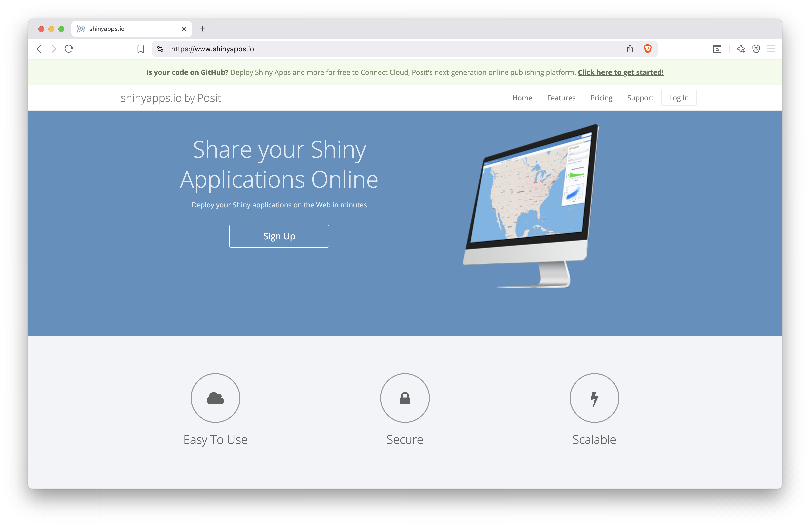
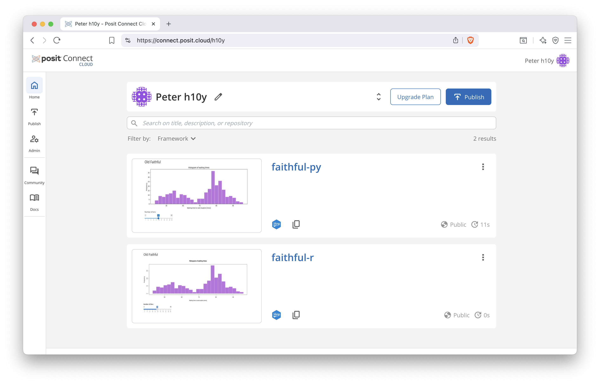
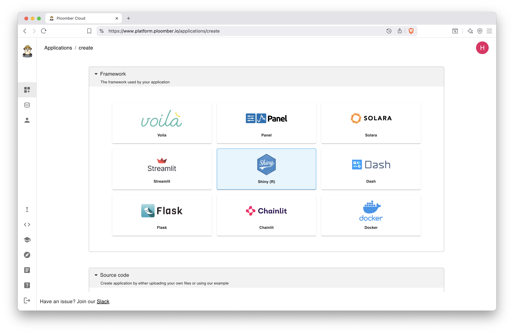

# Platforms for Shiny Hosting {#platforms-shiny-hosting}

::: {.noteblock data-latex=""}
This chapter covers hosting platforms designed
specifically for Shiny app deployment which can
be more costly than using general hosting platforms,
but easier to use.

If you are interested in more cost effective general hosting
platforms, please continue to Chapter \@ref(hosting-platforms).
:::

In Section \@ref(part2-deploy-to-shinyapps-io), we explain how to deploy your
Shiny app with shinyapps.io, a platform specifically designed for Shiny hosting.
This section will discuss the key features and benefits of shinyapps.io. We
also briefly mention alternative Shiny hosting platforms (Posit Connect Cloud and Ploomber) 
that offer similar functionality
and are worth exploring for those seeking options other than shinyapps.io.

## shinyapps.io {#paas-shinyapps-io}

You can share your R and Python Shiny applications on
[shinyapps.io](https://www.shinyapps.io/) for free or choose paid cloud
hosting with push-button publishing. Your apps are hosted in the cloud on 
shared servers operated by Posit.

The free tier is is ideal for those who are just starting with Shiny or 
using Shiny as a hobby or building their portfolio. 
The most expensive Professional option is best suited for smaller agencies who 
do not want to deal with running their own servers (\@ref(fig:shinyapps-io-landing)).

```{r shinyapps-io-landing, eval=TRUE, echo=FALSE, out.width="100%", fig.pos = "bt", fig.cap="Landing page for shinyapps.io."}
# use PNG in both the html and latex versions

```

The cost of shinyapps.io ranges from $0 to $4,188 per year depending on the plan and
whether you are paying month-to-month or the full year. This is all
subscription fees, which would normally go under operating expenses, no
acquisition cost (like licensing fees).

shinyapps.io is a fully managed platform operated by Posit, thus you won't
need to worry about server costs on top of the fees, such as costs related to
maintenance or personnel running the servers.

Posit has long history of building products supporting Shiny given that they
invented Shiny itself, as a result, deployment is usually seamless.
No DevOps skills are needed for infrastructure setup.
shinyapps.io is a fully managed platform-as-a-service (PaaS), 
therefore you only have to worry about your application.

Shiny apps can be deployed with a click of a button right from the RStudio
IDE or using the rsconnect library (available for both R and Python)
from the command line or from CICD pipeline, such as GitHub Actions.
You can host Shiny apps written in R or Python.
See Chapter \@ref(part2-sharing-shiny-code) for different ways of deploying these apps. 

The free tier comes with community support, all the paid plans
include premium email support.
You can host up to 5 apps for free. This tier gives you 25 active
hours that is the up time for the maximum 5 apps combined.

Note that not just usage time is counted towards active hours, but also the time
when the application is idle. Idle is the state between active and sleep.
The default instance idle timeout is 15 minutes. To maximize the usage time,
set the idle timeout to 5 minutes, that is the minimum. You have to repeat this
for each application.

The cheapest paid Starter plan ($145/year) roughly costs double the yearly cost of a
small cloud server, but the Starter plan comes fully managed with an admin
dashboard. This tier allows you to host up to 25 applications with a 100
active hours limit. Running apps on your own cloud servers would give
you more active hours, but it might cost more if the apps are memory- or
CPU-hungry. So this tier is a good trade-off between cost and ease of maintenance.

The Basic plan ($550/year) gives you unlimited applications with a
500 active hours limit and performance boost.
The performance boost means multiple worker processes per app up to 8 GB RAM, 
and you can add additional instances (max 3) to handle larger volumes of users.

The Standard ($1,330/year) and Professional ($3,860/year) plans add more active
hours (2 and 10 thousand, respectively) and more instances per app (5 and 10,
respectively).

Note that instances are "large" by default with 1 GB RAM, there is no guarantee 
regarding available CPU cores and speeds. Upload bundle sizes are limited to 
1 GB for the Free and Starter plans and 5 GB for the other plans.

No user authentication is provided for the Free, Starter, and Basic plans.
User authentication (user log-in required) and authorization (which apps they 
have access to once logged-in) are part of the Standard and Professional plans.
The Professional plan also comes with account sharing which
is handy when multiple people need access to the admin dashboard.

All tiers except for the Professional tier are using the shinyapps.io domain and
the apps are available as `https://<account-name>.shinyapps.io/<app-name>`.
You can use your own domain or subdomain under the Professional plan, such as:
`https://<custom-domain>/<path-to-the-app>`. The path replaces the app name and is
case sensitive. Application can be hosted on multiple domains and using 
different paths.

Regarding the shinyapps.io hosting environment, Shiny apps run in their own 
protected environments. Access to the apps is always encrypted over HTTPS
with transport layer security (TLS). However, TLS certificates are not
provided for custom domains:
"_shinyapps.io does not currently support secure URLs for custom domains. 
The URLs you define in the application settings are accessible only via the 
http protocol, not the https protocol._"
A solution to this is to embed the application without a custom domain 
into another page. It is explained in Chapter \@ref(embedding-shiny-apps).

The servers backing shinyapps.io are part of the Amazon Web Services
(AWS) US-East 1 region. You might have to consider data regions if
you or your organization is governed by data residency laws.
shinyapps.io does not provide database integrations and it counts as a
compute instance, so your data policies might be a bit more relaxed as
compared to actually housing the data in shinyapps.io.

The admin dashboard provides detailed account and application metrics.
You can find the account metrics under the Account/Usage tab. This is
useful to track your hours. For each app, you can click on the Metrics
icon to see the CPU, memory, network usage and the number of processes and
worker processes over time up to 3 months into the past.
Application metrics can be accessed through the `rsconnect::showMetrics()`
command in R that returns a data frame for the specified time interval.

Note that sudden changes in resource usage might not show in the metrics,
because the metrics are captured with one-minute granularity.
To understand that the instance ran out of memory, you might have to take a
look at the logs to see an out of memory error.
The application logs can be found under the Logs icon. The logs are
helpful for troubleshooting loading issues with the app.
The logs can be downloaded from the dashboard or accessed using the
`rsconnect::showLogs()` function.

Detailed instructions about navigating the admin dashboard and changing the
settings can be found at <https://docs.posit.co/shinyapps.io/guide/>.

We explained how dependencies are handled by shinyapps.io in 
Section \@ref(part2-deploy-to-shinyapps-io).
CRAN packages, Python libraries, and their system dependencies are well covered 
by Posit's package management system. But you might run into issues when using
GitHub or other non-standard package dependencies in the Shiny app that
requires a system library that is unavailable on shinyapps.io.
In such cases, you can reach out to support and ask them to add the missing
package to the stack.

If you are using a proprietary R package in your app,
it is possible to install those dependencies from a private GitHub repository.
Log into the shinyapps.io admin dashboard and go to the Account/Profile tab.
Under the Authentication click the Update Authentication button.
This will take you an identity management page where you can enable
access to GitHub including private repository access for shinyapps.io
and Posit Cloud.

## shinyapps.io Alternatives {#paas-shinyapps-io-alternatives}

While shinyapps.io is a widely used platform for deploying Shiny applications
written in R or Python. Let's review some other options that offer similar 
solutions to shinyapps.io.
These options can also be used to host other kinds of frameworks,
such as Streamlit, Dash, Bokeh, Jupyter, etc., frameworks that you
cannot deploy to shinyapps.io.

### Posit Connect Cloud {#paas-posit-connect-cloud}

[Posit Connect Cloud](https://connect.posit.cloud) is a cloud environment to easily showcase your Python and 
R content. It integrates with GitHub repositories for deployment.
Use case for this is for consultants who develop apps but do not want to
host the app in the long run, but want an easy way to share progress with the client.

The Connect Cloud platform that makes it easy for you to share all your data 
applications and documents in one place. Besides Shiny apps, you can deploy 
Quarto documents, and R Markdown documents, apps written in 
Streamlit or Dash, and Jupyter notebooks.

Pricing structure is very similar to shinyapps.io.
The Free plan offers 4 GB of memory, 2 CPUs, and 20 active hours for up to 5 applications.
The Basic plan includes 8 GB memory, 2 CPUs, and 100 active hours for up to 25 applications.
The Enhanced plan comes with 16 GB memory, 4 CPUs, and 500 active hours for unlimited applications.
Paid plan allow you to deploy from private GitHub repositories and offers
private link sharing.
The Custom plan offers Role-Based Access Control (RBAC), Single Sign-On (SSO),
and external guests via email authentication.

A dependency file is required to let Connect Cloud know which R libraries to 
include in a given deployment. Any content that has R code needs a `manifest.json`
file included in the GitHub repository.

Connect Cloud does not currently support renv to set up the R environment. 
It captures everything it needs from `manifest.json`, including the packages 
and the R version. Generate a `manifest.json` file with the rsconnect library as
`rsconnect::writeManifest()`.
The `manifest.json` file can either be in the root directory of the 
repository or in the subdirectory with the primary application file.

The easiest way to deploy the app is from a connected GitHub repository.
The Posit Connect Cloud GitHub App is used to publish your content from GitHub.
Go to Admin/Integrations and follow the prompts to install the app and
give it permission to the desired repositories.

Next, click Publish and select the type of application, e.g. Shiny.
Configure the source by selecting the GitHub repository, the Git branch, and the
primary file (e.g. `py-shiny/app/app.py`). Under Advanced settings,
you can change the Python version and configure variables, such as
secrets that you do not want in version control. These variables are encrypted.

The Automatically publish on push toggle is on by default.
This will automatically republish the content when you push to the selected 
branch without having to integrate with GitHub Actions.

Once the app is deployed, you will see it in the dashboard (Fig. \@ref(fig:connect-cloud-dash)).
Go into the settings to update the app's title and description.
The default app URL will look like `https://<app-id>.share.connect.posit.cloud`,
where the app ID is a random sequence of numbers and letters,
e.g. <https://019871cf-1ee6-277a-3390-2eb0d43f54eb.share.connect.posit.cloud>.
You can customize the URL by providing a custom name for the app to get
the URL in the following format: `https://<account-name>-<app-name>.share.connect.posit.cloud`.
E.g. <https://h10y-faithful-r.share.connect.posit.cloud/>.


```{r connect-cloud-dash, eval=TRUE, echo=FALSE, out.width="100%", fig.pos = "bt", fig.cap="Posit Connect Cloud dashboard."}
# use PNG in both the html and latex versions

```

<!-- /Users/Peter/git/github.com/analythium/hosting-shiny-book-dev/book-source-v2/images/connect-cloud/connect-cloud-08.png -->

### Ploomber {#paas-ploomber}

[Ploomber](https://ploomber.io/) allows for the deployment from the command 
line or web UI for R Shiny apps (\@ref(fig:ploomber-shiny)).

To deploy a Shiny R application to Ploomber Cloud you need a Ploomber Cloud account,
a `startApp.R` file to start the app, an `install.R` file to install dependencies,
and the Shiny code, e.g. the `app.R`.

The `startApp.R` looks like:

```R
library(shiny)
options(shiny.host = "0.0.0.0")
options(shiny.port = 80)
runApp("app.R") # edit this line as needed
```

The `install.R` file lists `install.packages()` statements.
Some R packages depend on system libraries, which are not installed by default.
In this case, use the container based deployment that is also
supported by Ploomber and we will discuss in Chapter \@ref(hosting-platforms).

Connect to GitHub to install from these source files or upload the source files
as a zip archive. You can also use the `ploomber-cloud` library and an API 
key to deploy the app as follows:

```bash
pip install ploomber-cloud
ploomber-cloud key <YOUR-KEY>
cd <path-to-the-app>

ploomber-cloud init
ploomber-cloud deploy --watch
```

Ploomber offers running 2 apps simultaneously under the Free plan (0.5 CPI and 1 GB RAM).
The Professional plan starts at $20/month and comes with custom domains,
app authentication with password, continuous app uptime, up to 10 apps,
and an AI editor. The Teams and Enterprise plans offer more advanced authentication,
on-premises deployment, and more.

```{r ploomber-shiny, eval=TRUE, echo=FALSE, out.width="100%", fig.pos = "bt", fig.cap="Ploomber dashboard."}
# use PNG in both the html and latex versions

```


<!-- FIXME: This is also the place to mention Scaly later -->
<!-- # Buildpack and Nixpack Deployments for Shiny -->

## Summary

<!-- Shinylive is designed for micro applications, which might not meet your needs as you need 
intensive calculations that cannot be done client side. This means that Shinylive
applications might be slow to load. -->

<!-- Therefore you may want to deploy your app as Shiny and consider hosting on platforms
like shinyapps.io. -->

Shiny specific platforms such as shinyapps.io and their alternatives 
allow for easy small deployments of Shiny applications with minimal setup.
However, the tradeoff is that you do not have control on how your apps
run and may come across dependency issues and hosting can become costly.
More cost effective general hosting
platforms are explained in Chapter \@ref(hosting-platforms).


<!-- Many platforms offer deployments with Buildpack or Nixpack. However, Buildpack and Nixpack
might not support the dependencies you need for your Shiny app. Therefore we recommend either
setting up your application on your own virtual machine or containerizing your Shiny application
to be deployed on a platform as a service. -->
