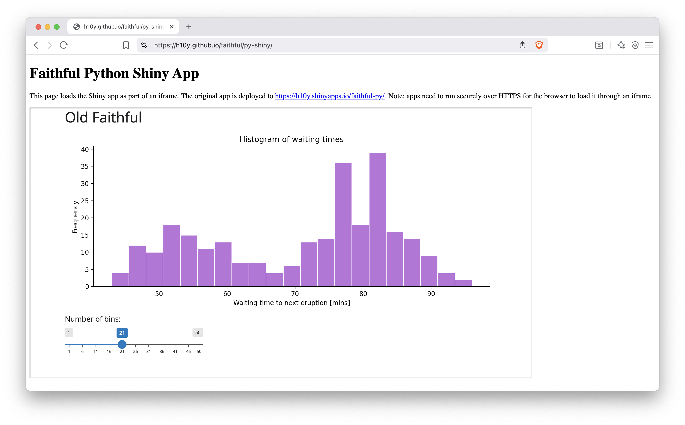

# Embedding Shiny Apps  {#embedding-shiny-apps}

::: {.noteblock data-latex=""}
This chapter covers integrating Shiny applications
into your existing website or web application
to enable consistent user experience.
:::

Once you have deployed your Shiny application, you may not
want to directly share the link. Instead, you already
have an existing website and you would like your
Shiny application to appear seamlessly within your existing website.
This also means that if you host your Shiny app on a different platform with a unique URL, 
you can embed the Shiny app hosted elsewhere into your own website, ensuring it remains 
accessible under a branded, consistent web address.

Iframes are useful when your Shiny app functions as a dashboard or 
informational widget that doesn't resemble a full application but 
still requires branding and navigation to other pages with a header.
They are also useful when you would like to load an informational
Shiny app for a blog post.
Your application can be Shinylive or Shiny hosted anywhere -- what matters
is that the app has a web address that is public and accessible.

This chapter will go through using iframes (inline frame) which is an HTML element
that allows embedding another website into the current webpage.

## Understanding Iframes

An inline frame (iframe) is an HTML (HyperText Markup Language) element that 
embeds another website into a website page. The iframe code is to be expected to 
embedded into the HTML of your website. If you are using a platform like
WordPress, you would use an HTML widget to embed an iframe.
To use an iframe in HTML, the code would
be as follows:

```html
<iframe
  title="Faithful R Shiny App"
  style="border: none;"
  frameborder="0"
  src="https://h10y.shinyapps.io/faithful-r/"
></iframe> 
```

The `src` attribute specifies the website you would like to embed.
The `title` attribute specifies the title of your iframe element and is
used by screen readers to describe the contents of the embedded website.

The `frameborder` attribute, recognized only by older browsers, 
specifies if there should be a border or not.
The `style` attribute is used to specify CSS (cascading style sheet) 
styling rules for the iframe tag.
Here we specify `border: none;` to ensure that no border is present
when embedding a website if the `frameborder` attribute
is not recognized by the browser. 

## Styling Iframes

In the previous section briefly mentioned how to style the border
of an iframe. There are several other options to make your iframe
more responsive and reduce the performance impact of loading iframes.

To make the iframe more responsive, filling the 
browser window as needed, you can set the
`height` attribute to `80vh` and `width` attribute
to `100%`. `80vh` stands for 80% of the viewport height. 
The vh unit is relative to the height of the 
browser window (viewport). To fill your iframe to be 100% of 
the window height you would set it to `100vh`. The `100%`
of width means that it will take up 100% of the width of
its parent container. 

Furthermore, you might also not want the iframe to load the
embedded webpage until the web browser has the iframe in
view. Hence, you can also set the `loading` attribute to
be `lazy`. By default the attribute is `eager`.
These are how the rules are defined in an iframe:

```html
<iframe
  title="Faithful R Shiny App"
  style="border: none;"
  frameborder="0"
  width="100%"
  height="80vh"
  loading="lazy"
  src="https://h10y.shinyapps.io/faithful-r/"
></iframe> 
```

The following example shows a simple HTML page to give you an idea for how to
embed the Shiny app, for example, as part of a blog post or and educational
material where you need a micro-app to demonstrate something in an interactive 
fashion (\@ref(fig:embedded-shiny)):

```html
<!DOCTYPE html>
<head>
</head>
<body>
  <!-- HTML content -->
  <iframe
    title="Faithful Python Shiny App"
    style="width:80%; height:500px; loading:lazy"
    frameborder="1"
    src="https://h10y.shinyapps.io/faithful-py/"
  >
    Your browser doesn't support iframes
  </iframe>
</body>
</html>
```

```{r embedded-shiny, eval=TRUE, echo=FALSE, out.width="100%", fig.pos = "bt", fig.cap="A Python Shiny app embedded into a static HTML page hosted by GitHub pages."}
# use PNG in both the html and latex versions

```

Most blogging platforms, like Wordpress or Ghost, support adding
HTML snippets that can contain iframes too. In that case, only include the
iframe part, not the full HTML page.

You might notice that we used the `style` to list more than one attribute
for the iframe. This is equivalent to listing them as key-value pairs.
The text between the opening `<iframe>` and the closing `</iframe>` tags
shows up in browsers that do not support iframes.

The next HTML example is useful when you want the full window to be taken up
by the embedded app, so that the embedding HTML's URL is shown instead
of the embedded URL source:

```html
<!DOCTYPE html>
<head>
</head>
<body>
  <iframe
    title="Faithful R Shiny App"
    style="position:fixed; width:100%; height:100%; border:none;"
    src="https://h10y.shinyapps.io/faithful-r/"
  >
    Your browser doesn't support iframes
  </iframe>
</body>
</html>
```

This full-page view is ideal when using a custom domain for your static
HTML pages that embed Shiny apps from shinyapps.io where custom domains
do not support HTTPS. The full-page iframe is also ideal when hosting
apps on different hosting platforms under the free tiers (or using multiple
user accounts on a particular platform for free). In this case, the app URLs
might have different domains. Using iframes will provide with custom
domain name and customizable URL paths for many different Shiny and other
applications.

You can use static hosting options outlined for Shinylive applications 
(Chapter \@ref(part3-static-hosting)) or host the HTML pages on your own 
file server (Chapter \@ref(part3-vm-setup)).
Take a look at the GitHub Pages setup of the Faithful example
(<https://github.com/h10y/faithful>).
The `docs/r-shiny/index.html` and `docs/py-shiny/index.html` files
contain more elaborate versions of the above two examples.
These HTML pages also use a [CSS-based loader](https://projects.lukehaas.me/css-loaders/). 
Such loaders can be helpful when the cold start time of the embedded app is 
relatively long and the user needs some reassurance that something is 
happening before the shinyapps.io or other platform responds.
The CSS-based loader is also practical, because it does not rely on
JavaScript or animated GIF images.

## Summary

Embedding Shiny apps can make your existing website more interactive
and offer a custom feel. We outline in this section how to use
the iframe HTML tag, and options for styling the iframe on
your website.
