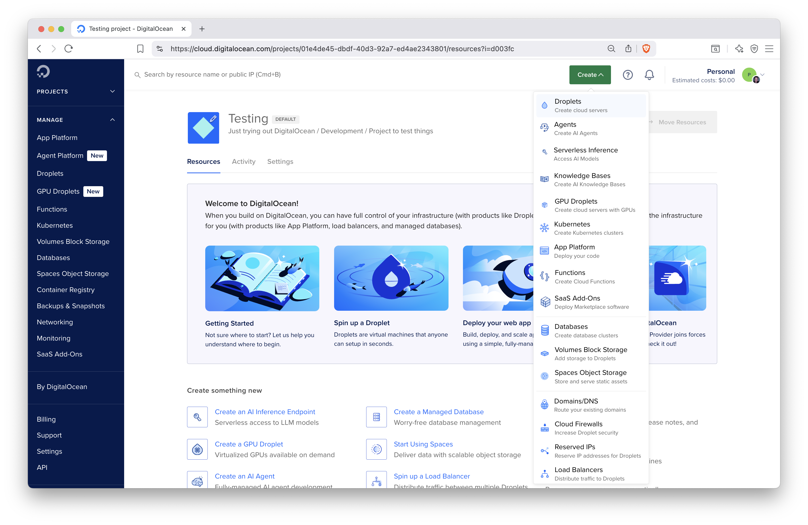
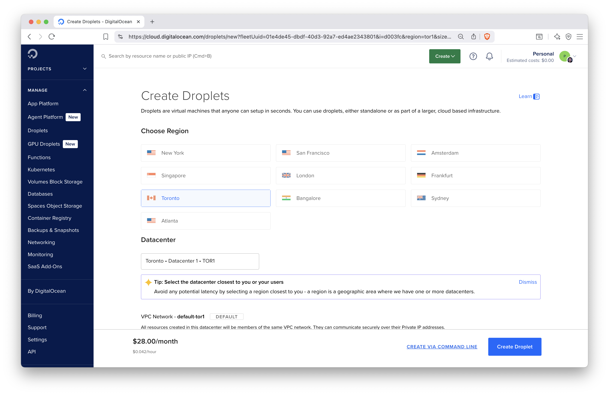
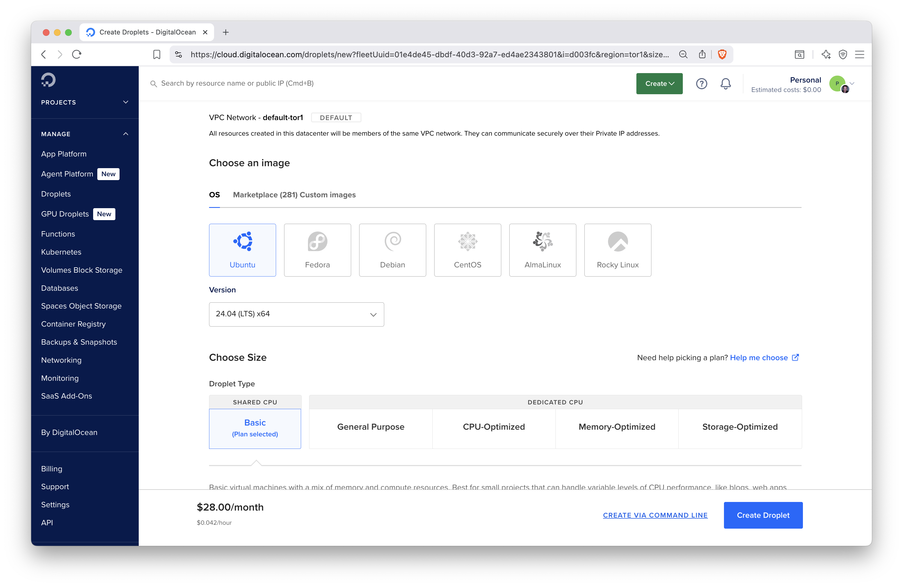
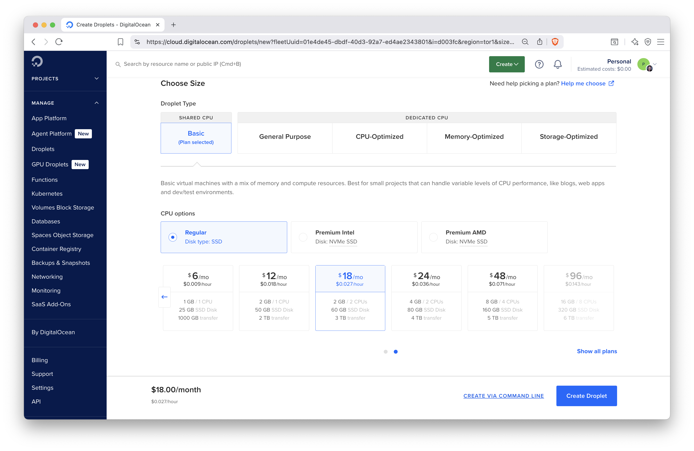
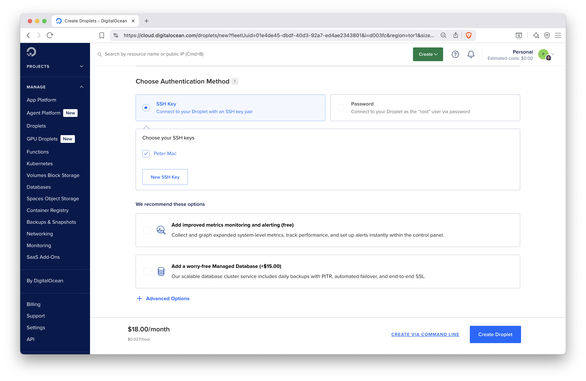
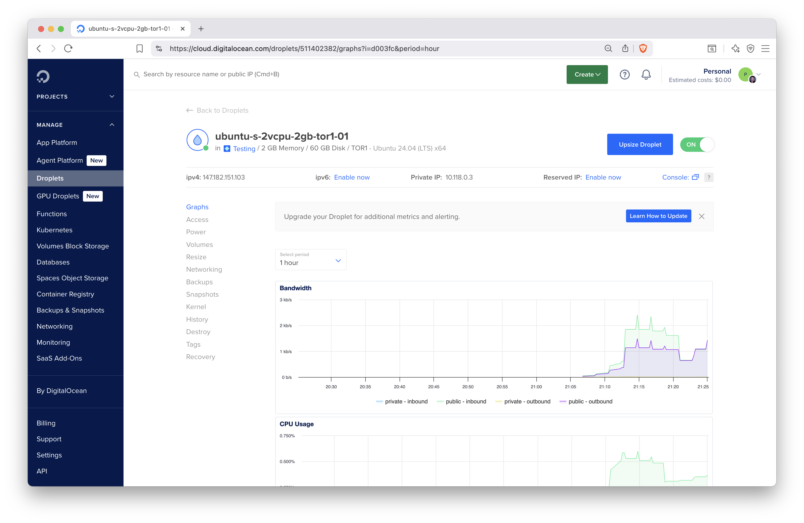
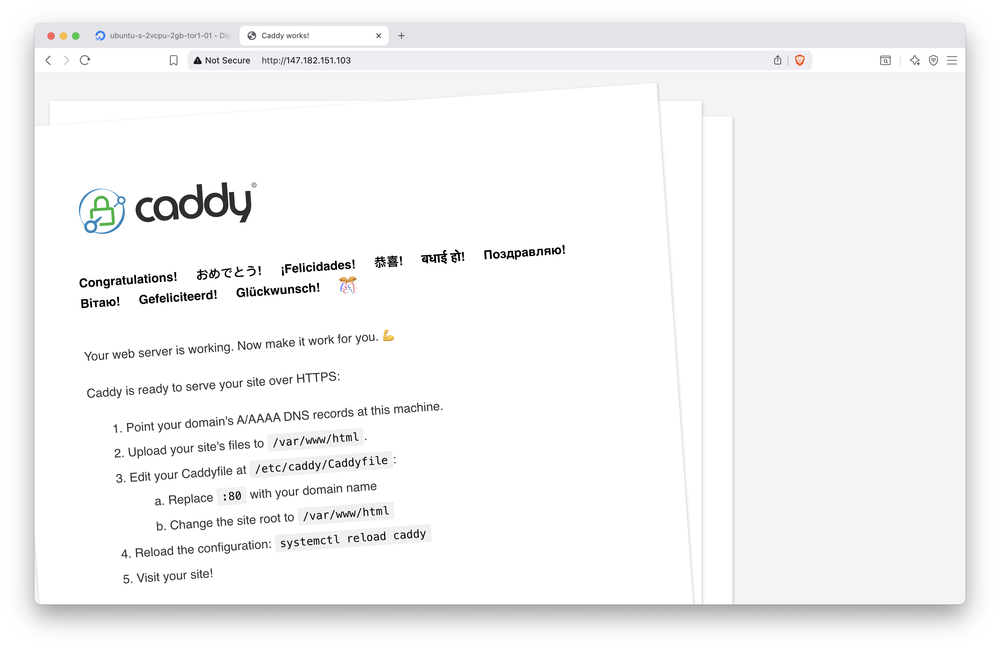
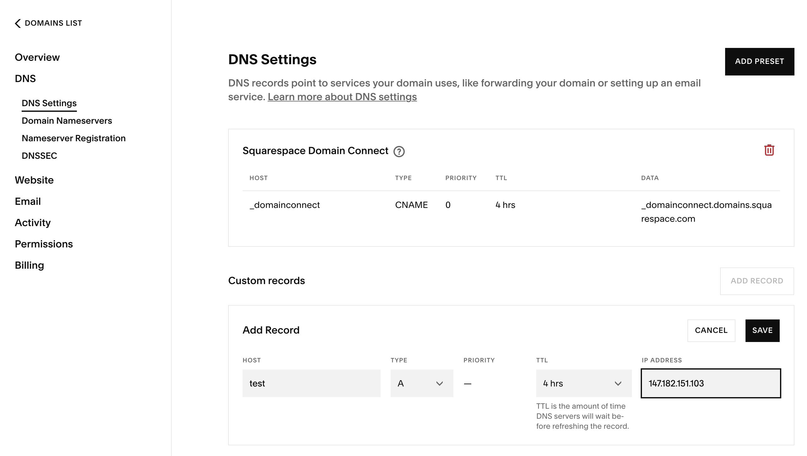

# Hosting on Virtual Machines {#part3-vm-setup}

::: {.noteblock data-latex=""}
This chapter covers the concepts of setting up a virtual machine
so that you can host your Shiny app on it. Using a virtual machine
is much more involved than using a platform to deploy your Shiny app,
but it can be more cost effective and gives more control.
A dedicated server requires maintenance and thinking about security.
:::

<!-- 
In this chapter we dive into reverse proxies, static Shiny apps, dynamic Shiny apps,
and custom domain names.

To connect to a server hosted application, a reverse proxy is required. 
A reverse proxy sits in front of your web application and forwards browser 
requests to your web application. It is used to create a secure connection to 
your web application and to distribute the load of user requests to your web 
application. A reverse proxy also helps to route requests to a domain sent by a 
client to the server to the appropriate web application. -->

The cloud refers to remote servers that are available for rent at a cost. 
Often the costs of these remote servers are charged by the hour. 
The cloud is part of Infrastructure as a Service (IaaS) where server 
infrastructure can be provided on demand (Fig. \@ref(fig:vm-and-paas)).

A virtual machine, or VM for short, refers to a "part" of a server park
maintained by a cloud service provider. It is a part of a larger
hardware infrastructure, and the way the part is defined is in terms
of CPUs and memory. These resources are allocated using virtualization
technology, that's why these "servers" are called virtual machines.

The CPUs can be shared among many instances, which makes such shared
instances more affordable. Shared CPUs can be considerably slower,
so for critical production workloads, it is advised to pay for
dedicated CPUs, which will not be used by other instances.

Some of the post popular cloud service providers include:

- AWS EC2
- MicroSoft Azure
- Google Cloud Platform
- DigitalOcean
- Akamai (formerly Linode)
- Vultr
- Hetzner
- OVH Cloud

These cloud services allow you to quickly set up a server for remote access, 
often within minutes. The servers can be hosted in various physical locations 
where the service provider has data centers. Choosing a specific location can 
be important for meeting data compliance regulations for your Shiny app. 
Additionally, selecting a data center closer to your geographical area can 
enhance the loading speed of your Shiny app by reducing latency.

It's important to note that operating costs can vary significantly between 
different regions, which may lead to considerable differences in pricing. 
Therefore, if cost is a concern, it is best to consider a few cloud providers 
before making a decision of where to host your Shiny app.

<!-- This remote connection can be done via the command line as we have described in Section \@ref(part1-ssh). -->

<!-- Cost estimator: <https://www.linode.com/estimator/> -->

## Custom Domain Names {#part3-vm-setup-custom-domains}

Custom domain names are important for giving an easy to access URL for your 
Shiny application. It is important for branding memorability too.
Most people can remember a few letters or a phrase (`example.com`)
better than a series of random digits (e.g. `147.182.151.103`).

To obtain a custom domain, you must register a domain with a registrar.
Some common domain name registrars are NameCheap, NameSilo, 
Squarespace (former Google Domains), AWS Route 53, and Porkbun.
The registrar leases you a domain name from the domain registry annually 
for a nominal fee. You must renew your domain name every year, e.g. using
auto renewal.
<!-- Each top level domain (e.g. `com` or `ca`) has its own registry. -->

Note that the registrar information is publicly searchable from the
WHOIS database. You can search this database to find information about the 
owner of a domain name and find their contact information in case of disputes
or if you want to buy that domain name.
Most registrars allow you to hide your contact information (email and address)
by enabling privacy protection. Sometimes this privacy protection service
might be available for an additional fee.

Domain names are linked to a name server that helps resolve to an 
internet protocol (IP) address of a server that returns content to a client.
On the domain name server (DNS), the `A` record entry helps resolve a name to an 
IPv4 address that looks like `147.182.151.103`.
The `AAAA` record entry helps resolve a name to an IPv6 address that is
a series of numbers and letters separated by colons, e.g.
`2001:0db8:85a3:0000:0000:8a2e:0370:7334`.
Lots of websites have shifted to using IPv4 in addition to IPv6.
It is recommended that you at least have an IPv4 record as not everybody has an 
IPv6 connection.

Another common record type is `CNAME` that contains information about a domain's 
alternative name. For example, it is common to set up a `CNAME` entry for
GitHub Pages so that the canonical `<username>.github.io` subdomain
is replaced by a custom domain, `<yourdomain>.com`.
There are other records that we won't need in this book (e.g. ones related to
sending out emails, like MX Mail exchange or TXT Text notes).

A fully registered domain name is also one of the requirements for an HTTPS 
certificate. Therefore, if you would like your server to encrypt
communication between the server and the client, you must have a
domain name. If you are part of an organization, ask for the person
managing the company domain name to help with adding new DNS records.

The `dig` and nslookup` command line utilities are used to look up
information about DNS entries. E.g. `nslookup google.com` will print
the following information revealing the IPv4 address registered for
the `A` record:

```txt
Server:   192.168.0.1
Address:  192.168.0.1#53

Non-authoritative answer:
Name: google.com
Address: 142.250.73.110
```

## Server Setup {#part3-vm-setup-servers}

You might be wondering, _What plan do I choose?_ or _How do I get started?_
In this section, we want to highlight the general intuition behind getting 
started with a cloud provider. We will outline the concepts of the different 
options when choosing a server plan for a cloud provider.

For our examples, we will be using DigitalOcean. However, the same principles 
apply to different cloud providers.
Later we will also talk about securing your server instance.

You will need to sign up for DigitalOcean using your email address
by visiting https://digitalocean.com. To start using their resources,
you will have to provide a payment method, e.g. valid credit card, under the 
Billing tab in the dashboard after sign-up and login.
This is not unique to DigitalOcean, all cloud providers will require
payment, but some, like AWS, will provide a free tier for new customers,
including some compute options for a limited time.

Figure \@ref(fig:do-04) shows the dashboard with the services listed on the
left hand side, e.g. Droplets (virtual machines in DigitalOcean terminology),
App Platform, Databases, etc. We will focus on Droplets now.
Navigate to the Droplet creation by clicking the Create button and selecting
Droplets.
<!-- ref to app platform here -->

```{r do-04, eval=TRUE, echo=FALSE, out.width="100%", fig.pos = "bt", fig.cap="The DigitalOcean dashboard."}

```

The next page will take you to the Droplet settings, as shown in Figure \@ref(fig:do-05).
We choose Toronto as the data center. The next setting is to choose the
operating system and the version for the machine (Fig. \@ref(fig:do-06)).
We select Ubuntu Linux version 24.04.

```{r do-05, eval=TRUE, echo=FALSE, out.width="100%", fig.pos = "bt", fig.cap="Choosing data center for the DigitalOcean virtual machine."}

```

```{r do-06, eval=TRUE, echo=FALSE, out.width="100%", fig.pos = "bt", fig.cap="Selecting the operating system and VM type for the DigitalOcean droplet."}

```

The next setting will determine the resources, like CPUs, memory, disk size, 
assigned to our machine. We select the basic droplet type with shared
CPUs using 2 virtual CPUs, 2 GB of memory, and 60 GB of disk space
(Fig. \@ref(fig:do-07)).

```{r do-07, eval=TRUE, echo=FALSE, out.width="100%", fig.pos = "bt", fig.cap="Selecting machine types and CPU/memory settings."}

```

These are specifications that might be sufficient and cheaper for testing.
Specifications for production might be different. In general,
we recommend at least 2 CPUs and 4 GB of memory so that you won't get stuck. 
The memory is needed for compiling packages, and being able to run the 
required system services, and handling users connecting to the server.

Instances used for testing purposes need to be removed after they are no longer 
needed. The slightly higher than necessary cost will not matter if you are only 
charged for a few hours. But when you forget about these instances, the
costs will accumulate over time.

Longer term deployments and resourcing requires a better understanding of the
requirements and more testing and monitoring might be required before finding the most
optimal setup. This is one of the advantages of using virtual machines as
opposed to buying your own hardware. It is easier to experiment with
different settings and make changes on demand.
<!-- FIXME: reference scaling chapter here -->

<!-- 
- CPU
- RAM
- OS
- IP Address (IPv4 vs IPv6)
- SSH Key 
-->

Next, you will have to select the SSH keys to be added to the server during setup.
This way, you can connect to the server using `ssh` secure shell.
You can choose to connect using a password, but we recommend using SSH.

For using SSH, you will first have to generate an SSH key pair.
SSH key pairs are two cryptographically secure keys that is used to 
authenticate a client (i.e. your laptop) to an SSH server (i.e. the
service running on your virtual machine).
The key pair has a public and a private key. The private key stays on your
local machine, while the public key is used on the servers.
The same key can be used on multiple servers.

On Windows, you will be able to use `ssh` from command prompt or powershell.
Note that when in the SSH session paste is right click.
On Unix/Linux machines, you can generate a key pair using the `ssh-keygen`
command. On Windows, the `git-bash.exe` has the `ssh-keygen` utility.

You will be prompted to select a location for the keys.
The default location for the keys is in the `~/.ssh` directory of the user's
home directory. The private key is named `id_rsa` and the public key is
names `id_rsa.pub`. We recommend to use the default file names and location,
so that the SSH client will find these automatically without having to
specify the key every time using the `ssh` command to connect to the server.

In the DigitalOcean dashboard, add your public SSH key by copying the file's
contents by clicking the Add SSH key button under Settings and Security.
Such SSH keys will show up under the list of selectable options when
creating your Droplet (Fig. \@ref(fig:do-08)).

```{r do-08, eval=TRUE, echo=FALSE, out.width="100%", fig.pos = "bt", fig.cap="Authentication method selection."}

```

After setting all these for the Droplet, there is only one more thing is left to
do, clicking the Create Droplet button. This will launch a progress bar and
after a little bit of waiting, a notification will let you know that the
virtual machine is ready to be used. Once it is ready, you can click
the Droplet's name in the dashboard. The link will take you to the
Droplet's page (Fig. \@ref(fig:do-14)) where you can see your CPU and other
usage statistics. One important piece of information here is the IPv4 address.
Clicking the value will copy the IP address to the clipboard.

```{r do-14, eval=TRUE, echo=FALSE, out.width="100%", fig.pos = "bt", fig.cap="The Droplet dashboard with resource usage metrics."}

```

You can power the Droplet down or turn it back on. Add volumes (extra disk space),
resize (change the CPU and memory settings), turn on backups or make snapshots
so that you can restore the server in case something unexpected happens.

The Networking tab can be used to set firewall rules for the Droplet and to
assign reserved IP address to the Droplet. A reserved IP address is useful
for production servers. You can assign the DNS A record to the reserved IP
address instead of the Droplet's own IP address. In case you have to set up
a new server, you'll get a new IP address with it, therefore you will have
to update the A record with your registrar. This can lead to some downtime
of the server during the time the new IP address propagates through the
name servers. If you want to avoid this downtime (during which the IP address
might still resolve to the old server address), use the reserved IP.
You won't have to update the A record, you will only have to assign the
reserved IP address to the new server.

You will also find a tab where you can destroy the Droplet, meaning, the
allocated resources will be freed up and you won't be charged for the Droplet
any more.

## Installing Software for Shiny Hosting {#part3-vm-setup-install}

Before you can install software on the newly created virtual machine,
you have to log in to the server, change the IP address to your Droplet's
address:

```bash
ssh root@$147.182.151.103
```

You will see a warning that the authenticity of the host can't be established.
This is normal on the first connection. Type `yes` when prompted to continue.
After this, the 147.182.151.103 address will be permanently added to 
the list of known hosts.

You logged in as the `root` user, this user is an admin or super user.
As a result, you will not have to use the `sudo` prefix before commands to
act as an admin. Logging in as the root user is not universal practice
across cloud providers. When the user used to log in via SSH is not a privileged
user, you will have to elevate permissions by using `sudo -i`.
For example, AWS cloud instances will use the non root `ubuntu` user for SSH login.

Once on the server, you'll see a welcome message listing some details of the
operating system:

```bash
Welcome to Ubuntu 24.04.1 LTS (GNU/Linux 6.8.0-51-generic x86_64)

 * Documentation:  https://help.ubuntu.com
 * Management:     https://landscape.canonical.com
 * Support:        https://ubuntu.com/pro

 System information as of Sun Aug  3 03:09:30 UTC 2025

  System load:  0.0               Processes:             114
  Usage of /:   3.2% of 57.08GB   Users logged in:       0
  Memory usage: 10%               IPv4 address for eth0: 147.182.151.103
  Swap usage:   0%                IPv4 address for eth0: 10.20.0.5

[...]

Ubuntu comes with ABSOLUTELY NO WARRANTY, to the extent permitted by
applicable law.

root@ubuntu-s-2vcpu-2gb-tor1-01:~# 
```

Once on the server, update the operating system as:

```bash
apt update
apt upgrade
```

This will first update the list of available packages and their versions,
then install newer versions of the packages.

In your Droplet page, the default performance metrics include Bandwidth, CPU, 
and Disk I/O metrics. Installing the DigitalOcean Metrics Agent will provide you 
with Memory, Load (1/5/15 minutes aggregates) and Disk Usage information.
You can use these metrics to visualize performance and to set up and receive 
alerts via email to proactively manage your server. E.g. you can set an
alert for the CPU or memory running high (above 80%), etc.
You can install the agent it via: 

```bash
curl -sSL https://repos.insights.digitalocean.com/install.sh | sudo bash
```

Note that this metrics agent is DigitalOcean specific. Other cloud providers
will have other mechanisms for providing these types of metrics.

<!--
  - Reverse proxy setup with Caddy
    - Static hosting on file server
    - systemd
    - Posit Connect
    - Shiny Server
      - multiple apps / linux users
-->

## Reverse Proxies

Reverse proxies are useful tools to send incoming traffic to the final destination.
For example when someone accesses the server through the HTTPS port (443),
the server will need to know where to send that request.
There are different options of reverse proxies such as: Nginx, Apache, and Caddy.
One of the easiest to use and configure is Caddy.
Caddy is a powerful open-source web server with automatic HTTPS. Follow
the [Caddy server docs](https://caddyserver.com)
and install the software:


```bash
sudo apt install -y \
  debian-keyring debian-archive-keyring apt-transport-https curl
curl -1sLf 'https://dl.cloudsmith.io/public/caddy/stable/gpg.key' | \
  sudo gpg --dearmor -o /usr/share/keyrings/caddy-stable-archive-keyring.gpg
curl -1sLf 'https://dl.cloudsmith.io/public/caddy/stable/debian.deb.txt' | \
  sudo tee /etc/apt/sources.list.d/caddy-stable.list
chmod o+r /usr/share/keyrings/caddy-stable-archive-keyring.gpg
chmod o+r /etc/apt/sources.list.d/caddy-stable.list
sudo apt update
sudo apt install caddy
```

Now visit `http://147.182.151.103` (use your IP address) to see the Caddy 
greetings page (Fig. \@ref(fig:caddy-01)).

```{r caddy-01, eval=TRUE, echo=FALSE, out.width="100%", fig.pos = "bt", fig.cap="Caddy server greetings page."}

```

Figure \@ref(fig:dns-a-record) shows how to add an A record for IPv4 147.182.151.103 
(use your IP address here).
Visit the address `http://test.h10y.com/` (use your domain name). You will
see the same unsecured page (i.e. no lock icon in the browser address bar)
as we saw when we used the plain IP address.

```{r dns-a-record, eval=TRUE, echo=FALSE, out.width="100%", fig.pos = "bt", fig.cap="Adding A record to your domain name settings."}

```


To turn HTTPS on, we have to edit the Caddyfile, which is the easiest way for
managing Caddy. Open the Caddyfile with nano: `nano /etc/caddy/Caddyfile`.
You should see this (with comments):

```text
:80 {
        root * /usr/share/caddy
        file_server
}
```

This block between the curly braces in the Caddyfile is called the site block.
It defines a so-called static file server. The `/usr/share/caddy` folder contains an 
`index.html` file that is responsible for the default Caddy welcome page we saw.
You can host static files inside the folder specified by the `root` directive of
the Caddyfile, i.e. `/usr/share/caddy`. Put there any HTML files, create
subfolders, etc. You can even copy Shinylive apps that we mention in
Chapter \@ref(part3-static-hosting) into the folder.
<!-- link to static shinylive hosting -->

Change the `:80` (which stands for the HTTP port on the server)
to your domain name `test.h10y.com`, leave everything else as is for now:

```text
test.h10y.com {
        root * /usr/share/caddy
        file_server
}
```

Restart Caddy with `systemctl reload caddy` for the changes to take
effect. You can check the Caddy logs using `journalctl -u caddy --no-pager | less`.

Go back to the browser, you should see `https://test.h10y.com/`.
You'll see the browser now lists the page as secure.

<!-- FIXME: link to chapter explaining how to copy files with rsync or scp -->

HTTPS is important because it encrypts the traffic between the client and server.
It ensures that the data sent to the client from the server is not tampered 
with and vice-versa.
If you are unsure if your site needs HTTPS, read about it here: <https://doesmysiteneedhttps.com>.
Caddy uses HTTPS automatically and by default. It obtains
and renews TLS certificates for your sites automatically.
For a [Let's Encrypt certificate](https://letsencrypt.org/), you
need a fully registered domain name. You can add other TLS certificates
to Caddy, but we won't cover those cases here.

## Setting the Firewall {#set-firewall}

The firewall restricts incoming or outgoing traffic on different ports.
If you disable all ports, you won't be able to access the server or
the server won't be able to download software from the Internet.

Cloud providers generally allow to set firewall rules as part of their
dashboard. Here we'll show how to use the `ufw` (Uncomplicated Firewall)
command line utility to manage the firewall settings.
On DigitalOcean, `ufw` is pre-installed. On other providers, you might have
to install it with `sudo apt install ufw`.

As general practice, we want to allow outgoing traffic
but restrict incoming traffic except for certain ports,
such as port 22 (ssh), 80 (http), and 443 (https):

```bash
ufw default allow outgoing
ufw default deny incoming
ufw allow ssh
ufw allow http
ufw allow https
ufw enable
```

The last line will enable the firewall, i.e. the settings will be applied.

## Monitoring Processes

Often times, you might need to check if a specific program is running on your 
remote computer, or you would like to know the memory or CPU that is currently 
being used.

By typing the `top` command you can get a live view of the processes currently 
running on your computer.

At the top you can see the total time your computer has been running for. 

The `%cpu` row shows how much of the CPU is being used. The `us` stands for user 
time of the cpu, while the `sy` stands for the system of the CPU. 

Below the `%cpu` row is the `MiB Mem` row which shows the amount of memory that 
is consumed in megabytes. And the `MiB Swap` which is the hard disk space used 
for RAM.

Finally, there are the live processes in a table below the top heading. You can 
see the command that has been executed and the amount of CPU and memory it has 
been using.

To quit `top`, simply press the `q` character on your keyboard.

<!-- FIXME: add used/free disk space commands. -->

## Shutdown and Reboot

You may need to reboot or shutoff your server at times. These commands will 
require super user access as you may be interrupting the operations of other 
users on the server.

Therefore to reboot the server, you would run: `sudo reboot`.

To shut off the server, you would run: `sudo poweroff`.

If you do shut off the server, you will have to turn it back on in your cloud 
hosting provider panel. Or if it is a physical server, you can also physically 
press the power button.

<!-- 
- VMs
  - Setup
    - DO droplet & ssh login
    - Navigation & commands
    - Reverse proxy / Caddy (mention Apache & Nginx)
    - Custom domain & TLS
    - Firewall

 Check:

- https://www.youtube.com/watch?v=F-9KWQByeU0
- mention nginx apache traefik
-->


## Summary
We have reviewed the basics of setting up a virtual machine
and the basic operations to manage it.

With a virtual machine setup, you will be able to run Shiny
hosting softare like Shiny Server and Posit Connect explained
in the next 2 chapters. Having your own virtual machine, also
enables you to run containerized Shiny applications explained in
Chapter \@ref(part4-containers) with ShinyProxy (Chapter \@ref(shinyproxy-deployment)).