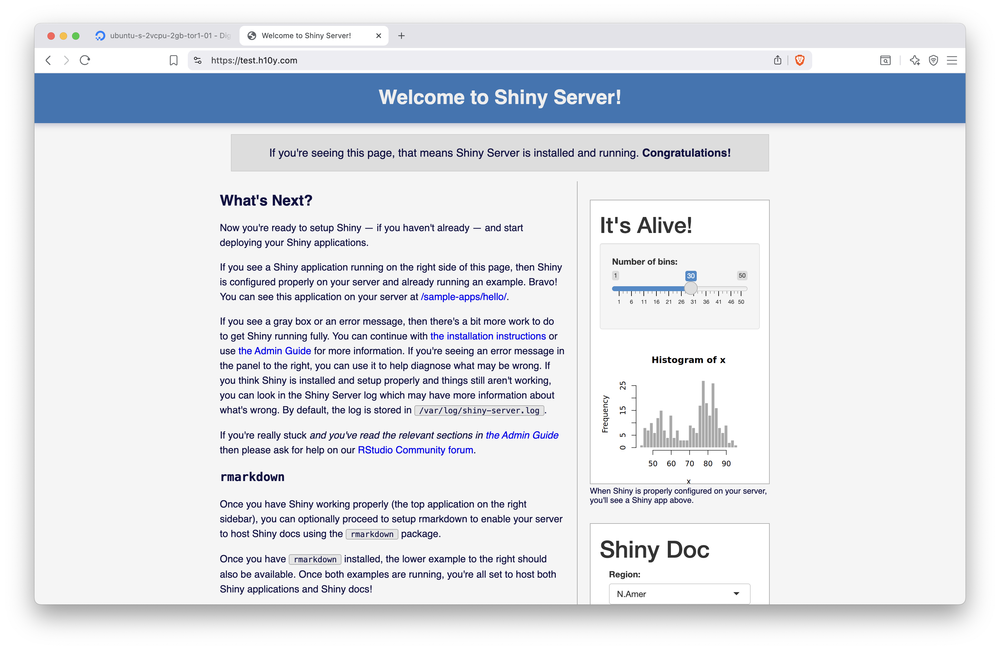

# Shiny Server

::: {.noteblock data-latex=""}
Shiny Server is a tool to deploy your Shiny app on your own server.
Shiny Server has been a trusted deployment method since the
beginning of Shiny and one of the easiest ways to start running apps
on your own server.
:::

Shiny Server is a free and open-source option to host R and Python Shiny web apps and R
markdown documents. You can host unlimited applications without running
out of active hours. Shiny Server provides an easy way to self-host Shiny apps on a
low-cost virtual machine. You can let multiple system users use the server
to develop and manage their own Shiny applications.

You can set up the server yourself as explained in the
previous chapter and deploy apps in minutes. Dependency management requires
some attention when managing multiple Shiny apps. So it is good practice to
use version control, like Git, and do periodic backups
of the server to easily revert any breaking changes.

There is no licensing fee because Shiny Server is a free (as in free
speech _and_ as in free beer) and open-source option for self-hosting
Shiny apps licensed under GNU Affero General Public License (AGPL) version 3.
The paid Shiny Server Pro version is discontinued in favour
of Posit Connect (Section \@ref(posit-connect)).
However, you have to host it on a server, therefore, you will have 
operating costs for the server. For reference, the cost of a
basic virtual machine with 2 GB RAM and 1 CPU costs $150 US /year on
DigitalOcean. You need to provision the server and install R, Python, Shiny
and other libraries as needed, and Shiny Server itself. 
You also need to configure the server if you want a custom domain and serving 
content over HTTPS.

The deployment of Shiny apps can be done by you or by multiple users
responsible for their own apps. Shiny apps can be directly deployed by editing
files on the server, using secure file transfer, or using version control.
Continuous integration and continuous delivery (CICD) can be a bit more
involved because testing and production environments are not
guaranteed to be the same and there is a slight chance that updating the 
dependencies of one app might have unintended consequences for other Shiny apps
on the server. If you need help, you can get
[community support](https://forum.posit.co/tag/shiny-server).


<!-- The deployment of Shiny apps can be done by you or by [multiple users
responsible for their own
apps](https://support.posit.co/hc/en-us/articles/218541988-Shiny-Server-Quick-Start-Let-users-manage-their-own-applications).
Shiny apps can be directly deployed by [editing
files](https://hosting.analythium.io/file-transfer-based-publishing-for-shiny-apps/#edit-text-files-on-the-server)
on the server, using [secure file
transfer](https://hosting.analythium.io/file-transfer-based-publishing-for-shiny-apps/#secure-copy-the-files),
or
[git](https://hosting.analythium.io/file-transfer-based-publishing-for-shiny-apps/#git-based-deployment). -->


There is no limit on the number of apps and active hours, unlike the case on 
fully hosted platforms. Performance is only limited by the specifications of 
your server. You can use vendor provided monitoring and alerting to track
the health of the server, but monitoring usage of individual apps might
require logging usage through the Shiny apps. If you are in need of more
CPU power or memory, backing up and resizing the server could be options,
possibly using a reserved IP address to simplify domain name management.

Concurrent access is by default limited to 100 sessions per Shiny
application. Once this number is reached, users attempting to create a
new session on this application will receive an error page. The default
setting can be changed in the [server
config](https://docs.posit.co/shiny-server/#simple-scheduler).
R processes that crash or are terminated will automatically restart
for the next user requesting the application.

Shiny Server is a Node.js application that serves the Shiny apps
to the users of the server primarily over websocket
connections, but it also supports other types of connections. A
websocket is a long-running connection open between the client and the
server, which is crucial for maintaining the application state. 
Shiny Server uses [SockJS](https://github.com/sockjs/sockjs-client)
under the hood and can emulate WebSocket behavior over HTTP protocol
to support older browsers, including Internet Explorer 8 & 9.

The open-source version has no built-in mechanism for app user
authentication and Shiny app-level authorization. Authentication can
be added manually, either as simple authentication via a reverse proxy
server, or using third-party integrations through the app.
<!-- add refs to auth chapter in part 6 -->

Multiple system users can have access to the server to manage their own apps, 
possibly having different R versions for each user. System users need to have 
a password or SSH based login.

Shiny Server has no built-in support for custom domains
and HTTPS. However, both custom domains and HTTPS (obtaining and
automatically renewing TLS certificates) can be added manually using
Caddy Server as explained in Section \@ref(part3-vm-setup), or using Nginx.

Because you have full control over the servers you are running Shiny
Server on, you are free to host it in any data region if you are
governed by data residency laws.
You are also responsible to keep your server secure by setting appropriate
firewall rules and by applying latest updates to the operating system.

<!-- -   [Shiny Server documentation](https://docs.posit.co/shiny-server/)
-   [Shiny Server feature
    comparison](https://posit.co/products/open-source/shiny-server/)
-   [Shiny for Python](https://shiny.posit.co/py/docs/deploy.html) -->

## Provisioning a Server

Hosting Shiny apps on the open-source Shiny Server requires to set
up a virtual machine with one of the public cloud providers as explained in
\@ref(part3-vm-setup), including a DNS A record for a custom domain name,
Caddy server and firewall settings. Caddy will automatically obtain
and renew TLS certificates for your site.
Additionally For Shiny Server, we need R/Python depending on your preferences,
and Shiny Server open-source.

You can skip the install steps using the 
[RStudio 1-click app](https://marketplace.digitalocean.com/apps/rstudio)
from the DigitalOcean marketplace that has RStudio and Shiny Server pre-installed
on a virtual machine (droplet). This setup uses Nginx and does not come
with automatic HTTPS setup. Here, we continue to focus on the more general 
Caddy Server based setup.

R on a Ubuntu machine can be installed via the script provided by
the _r-ci_ project, which integrates R package installation with the `apt`
package manager using pre-built binaries to streamline package installation
and removal:

```bash
curl -OLs https://eddelbuettel.github.io/r-ci/run.sh && chmod 0755 run.sh
sudo ./run.sh bootstrap

# Install R packages: add more as needed
R -q -e "install.packages(c('shiny', 'rmarkdown'))"
```

For Python installation, see Chapter \@ref(part1-installing-python):

```bash
# Add the deadsnakes package repository
sudo add-apt-repository ppa:deadsnakes/ppa

# Update the Package List Cache
sudo apt update

# Replace Python version as needed
sudo apt install python3.12
sudo apt install python3.12-venv
sudo apt install python3-pip
```

Install Shiny Server:

```bash
# from https://posit.co/download/shiny-server/
# Version: 1.5.23.1030 - Released: October 1, 2024
sudo apt-get install gdebi-core
wget https://download3.rstudio.org/ubuntu-20.04/x86_64/shiny-server-1.5.23.1030-amd64.deb
sudo gdebi shiny-server-1.5.23.1030-amd64.deb
```

You will see a printout similar to this one:

```text
Shiny Server
 Shiny Server is a server program from RStudio, Inc. that makes Shiny 
 applications available over the web. Shiny is a web application framework for 
 the R statistical computation language.
Do you want to install the software package? [y/N]:Y

Selecting previously unselected package shiny-server.
(Reading database ... 86861 files and directories currently installed.)
Preparing to unpack shiny-server-1.5.23.1030-amd64.deb ...
Unpacking shiny-server (1.5.23.1030) ...
Setting up shiny-server (1.5.23.1030) ...
Creating user shiny
Adding LANG to /etc/systemd/system/shiny-server.service, setting to C.UTF-8

Created symlink /etc/systemd/system/multi-user.target.wants/shiny-server.service 
 → /etc/systemd/system/shiny-server.service.
● shiny-server.service - ShinyServer
     Loaded: loaded (/etc/systemd/system/shiny-server.service; enabled; preset: enabled)
     Active: active (running) since Sun 2025-08-03 04:02:52 UTC; 16ms ago
   Main PID: 12311 (shiny-server)
      Tasks: 1 (limit: 2320)
     Memory: 408.0K (peak: 1.2M)
        CPU: 7ms
     CGroup: /system.slice/shiny-server.service
             └─12311 /opt/shiny-server/bin/shiny-server
```

Once Shiny Server is installed, it will be listening on port 3838.
You can check the port with `ss -plut | grep -i shiny`.

If you followed the firewall setup, this port won't be available from
outside of your server. This is where we need Caddy to direct
incoming traffic to the 3838 port that Shiny Server is listening on.
Open the Caddyfile with `nano /etc/caddy/Caddyfile` and edit it to
contain the reverse proxy directive:

```text
test.h10y.com {
        reverse_proxy 0.0.0.0:3838
}
```

After editing and saving the file, reload the Caddy service to pick up
the changes in the configuration with `systemctl reload caddy`.
Use `journalctl -u caddy --no-pager | less` to see the Caddy logs.

Visit `https://yourdomain.com` to see the Shiny Server welcome page. The
two demo apps are located at `https://yourdomain.com/sample-apps/hello/`
and `https://yourdomain.com/sample-apps/rmd/`
(Fig. \@ref(fig:shiny-server-01)).

```{r shiny-server-01, eval=TRUE, echo=FALSE, out.width="100%", fig.pos = "bt", fig.cap="Shiny Server set up with Caddy server and HTTPS."}

```

If you would like to use a different path, e.g. <https://test.h10y.com/apps/>, 
you can edit the Caddyfile like this, keeping
the original static file server at the root:

```text
test.h10y.com {
        root * /usr/share/caddy
        handle_path /apps/* {
                reverse_proxy 0.0.0.0:3838
        }
        file_server
}
```

You can test the Hello Shiny app with the slider and the R Markdown document
on the landing page (it uses iframes as in Section \@ref(embedding-shiny-apps)).
Follow the link to the sample apps to explore them on full screen.

## Using Systemd

`systemctl` is a command-line utility used to manage and interact with the `systemd`
system and service manager in Linux.
It is used to start, stop, restart, enable, and disable services, as well as check their status.
Here is a list of `systemctl` commands:

- `start`: start a service
- `stop`: stop a service
- `restart`: restart a running service
- `reload`: reload configuration files without restarting the service
- `reload-or-restart`: reload the configuration in-place if available, otherwise restart
- `enable`: start services automatically at boot
- `disable`: disable the service from starting automatically
- `status`: check the status of a service
- `is-enabled`, `is-failed`: see if the unit is enabled or in a failed state

<!-- https://www.digitalocean.com/community/tutorials/how-to-use-systemctl-to-manage-systemd-services-and-units
journald/journalctl -->

Use the commands following the `systemctl <command> <service-name>` pattern.
For example, here is how to enable and check the status for Shiny Server:

```bash
systemctl enable shiny-server
systemctl status shiny-server
```

## Configuring Shiny Server

Add a `shinyUsers` user group via `groupadd shinyUsers`. 
We will use this group later to limit access to Shiny Server.
The Shiny Server configuration is at `/etc/shiny-server/shiny-server.conf`.
Edit it using `nano` as follows:

```bash
run_as shiny;

server {
  listen 3838;

  location / {
    run_as :HOME_USER:;
    user_dirs;
    members_of shinyUsers;
    directory_index on;
  }

  location / {
    run_as shiny;
    site_dir /srv/shiny-server;
    log_dir /var/log/shiny-server;
    directory_index on;
  }
}
```

Restart the Shiny Server with `systemctl restart shiny-server`.

Shiny Server logs are written to `/var/log/shiny-server.log`.
Application specific logs can be found at `/var/log/shiny-server/*.log`, 
one file per application. For locations configured to use `user_apps` or `user_dirs`, 
these logs are created in each user's `~/ShinyApps/log/` directory.

If you want to change the landing page, edit the `/srv/shiny-server/index.html` file.

## File Transfer Based Publishing

The `index.html` file for the Shiny Server's landing page and the
`hello` and `rmd` apps are in the `/srv/shiny-server/` folder as defined in
the Shiny Server configuration:

- `/srv/shiny-server/index.html`
- `/srv/shiny-server/sample-apps/hello`
- `/srv/shiny-server/sample-apps/rmd`

These directories map to the server path as:

-   `http://yourdomain.com` is the landing page (`index.html`),
-   `http://yourdomain.com/sample-apps/hello/` is the `hello` app,
-   `http://yourdomain.com/sample-apps/rmd/` is the `rmd` app.

This is the location where we can create new directories for our apps.
Just copy the Shiny apps directly into folders within the `/srv/shiny-server/` 
directory. We can directly create and edit files on the server,
use secure file transfer, or Git.

### Editing Files on the Server

Let's add an app called `faithful` to the path `http://yourdomain.com/histogram/`:

```bash
mkdir /srv/shiny-server/faithful
nano /srv/shiny-server/faithful/app.R
```

Copy-paste the Shiny app from below into `app.R` that you just opened
with `nano` (Ctrl+O to save, Ctrl+X to exit `nano`), see 
Chapter \@ref(part2-developing-shiny-apps) for the full source code:

```R
library(shiny)
x <- faithful$waiting
app_ui <- fixedPage(
    # ...
)
server <- function(input, output, session) {
    # ...
}
shinyApp(ui = app_ui, server = server)
```

### Secure Copy Files to the Server

We will use `scp` to copy local files to the server. 
The `scp` protocol uses port 22 similarly to `ssh` and `sftp`.
If you are using the non-secure FTP protocol to copy the files, make
sure port 21 of your server is open for incoming traffic (e.g. `sudo ufw allow 21`).

The following script copies the local `APP_DIR` directory over to the
`SHINY_DIR` directory of the Shiny Server (this use of `scp` assumes you
access the server using your `ssh` key pair, otherwise you'll be
prompted to provide your username/password):

```bash
export APP_DIR="~/git/faithful/r-shiny/app"
export SHINY_DIR="faithful"

scp -r $APP_DIR root@$HOST:/srv/shiny-server/$SHINY_DIR
```

Change the variables to reflect your situation, and install necessary libraries
on the server for the app to work. Visit the `http://yourdomain.com/SHINY_DIR/`
link to test your app.

## Git-based Deployment

After logging into the server with `ssh`, set up `git`, so you can work with 
your public and private repositories (`git` is already installed, this is a 
one-time setup for each user):

```bash
git config --global user.email "you@example.com"
git config --global user.name "Your Name"
```

Change to your home directory with `cd ~` and run the following script.
This will clone the GitHub repository specified in the environment
variables, or pull changes if the directory already exists; then makes a
directory for Shiny Server if that directory is not already there, then
copies the app files (`$APP_DIR` can be empty):

```bash
#!/bin/bash

export GIT_HOST="github.com"
export GIT_USER="h10y"
export GIT_REPO="faithful"
export APP_DIR="r-shiny/app"
export SHINY_DIR="faithful"

# clone or pull repo
if [[ ! -e $GIT_REPO ]]; then
    git clone https://$GIT_HOST/$GIT_USER/$GIT_REPO.git
else
    cd $GIT_REPO
    git pull
    cd ..
fi

# make dir if not already there
mkdir -p /srv/shiny-server/$SHINY_DIR

# copy repo contents to Shiny Server
cp -rf $GIT_REPO/$APP_DIR/* /srv/shiny-server/$SHINY_DIR
```

Check the app at `http://yourdomain.com/SHINY_DIR/`.

You can modify this script for other repositories and save it in a file,
e.g. `update_app.sh` . Then you can run `bash update_app.sh` every
time you need the app to be updated. It is also possible to set up a
cron job to update the app daily or tie the script to a webhook event triggered
by a successful GitHub action.
Also don't forget to install app dependencies on the server.

### Apps with Multiple Linux Users

In this setup, we add users to the server. We leverage the Shiny Server
configuration that we laid out above. With this setup, 
all apps will be publicly accessible for everyone,
but users will be able to host Shiny apps from their own home directories.
For example, users "kalvin" and "peter" will each have a directory in their 
home dir that gets hosted by the server, at locations such as 
`yourdomain.org/shiny/kalvin/app1` and `yourdomain.org/shiny/peter/app1`.
We will ensure that hosted apps have read/write permissions.

Let's a user called `kalvin` and assign to the `shinyUsers` group:

```bash
adduser --ingroup shinyUsers kalvin
```

Supply a password when prompted. The user will be able to access the server as
e.g. `ssh kalvin@147.182.151.103`.

Adding apps to the `/srv/shiny-server` are run by the shiny user and use the 
general R installation libraries:
`/usr/local/lib/R/site-library`, `/usr/lib/R/site-library`, and `/usr/lib/R/library`.

When we add applications as regular user,
the Shiny Server setup allows users to host their apps from their home folders 
as `yourdomain.org/shiny/<username>/<appname>/`.
The user's applications are indexed at `yourdomain.org/shiny/<username>/`.

Pretend to be the user `kalvin`: `sudo -u kalvin -s` (or log in via `ssh` as that user) 
and create a `/home/kalvin/ShinyApps/hello/app.R` file with with the Shiny
source code copied to it as we did before.
You will find the new app at: `yourdomain.org/shiny/kalvin/hello/`,
logs are written to `/home/kalvin/ShinyApps/log`.

User installed packages will be in the `/home/kalvin/R/x86_64-pc-linux-gnu-library/4.5` 
or similar folder (depending on R version), 
thus each user can have their own versions/packages installed in their home folders, 
and the apps will use those. To install new packages, start R as the user by 
typing R into the console after `ssh` into the server.
Now the user can use `install.packages()` as usual.

You can repeat these steps for other users.
A user and all their files can be removed as: `deluser --remove-all-files <username>`.

## Licensing Considerations

R and the shiny R package are both licensed under the GNU General
Public License that permits making a modified version and letting the public 
access it on a server without ever releasing its source code to the public.
However, it is important to note that the open-source version of Shiny
Server is licensed under the GNU Affero General Public License version 3 (AGPLv3).
AGPL closes the application service provider (ASP) loophole and has a 
controversial reputation in tech circles.

<!-- > The GNU General Public License permits making a modified version and
> letting the public access it on a server without ever releasing its
> source code to the public. The GNU Affero General Public License is
> designed specifically to ensure that, in such cases, the modified
> source code becomes available to the community. It requires the
> operator of a network server to provide the source code of the
> modified version running there to the users of that server. Therefore,
> public use of a modified version, on a publicly accessible server,
> gives the public access to the source code of the modified version. -->

We do not provide legal advice, but mentioning it in case it is something 
that you or your organization might have to look into because the
interpretation of modified source code and public accessibility on a
server leaves a lot of room for interpretation, see some discussions
on the [Posit forum](https://forum.posit.co/search?q=shiny+server+agpl).
which might or might not affect you depending on your intentions and your
corporate environment. Posit offers paid exceptions to the AGPL
license in the form of Posit Connect (and previously also Shiny Server Pro),
this model is called dual-licensing.

## Summary

Shiny Server is one of the most popular self-hosting options for Shiny apps.
Some shortcomings of the open source Shiny Server include that it does not pass
HTTP headers, it logs to a file (instead of to standard output),
there is no health-check endpoint, and no resource metrics.
Some of these features are reserved for the discontinued Pro version.
A [fork of the Shiny Server](<https://github.com/ministryofjustice/analytics-platform-shiny-server>)
addresses these limitations, but the project is currently archived.
Posit Connect or other offerings that we discuss later in the book
might be better options. These options would also help better manage
dependencies.
