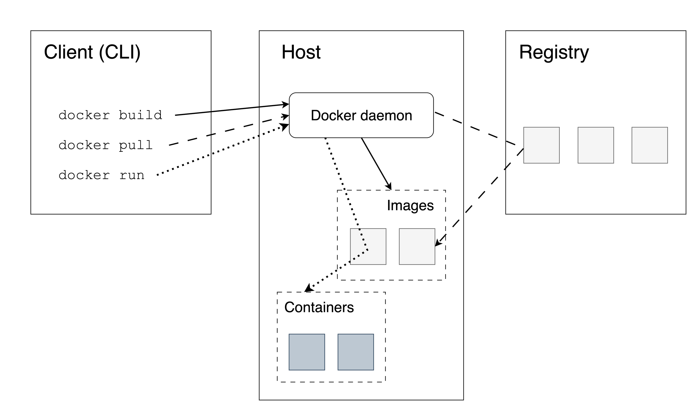

# (PART) Containerized Shiny Apps {-} 

# Introduction to Containers {#part4-containers}

::: {.noteblock data-latex=""}
This chapter covers setting up a
container environment for your application
so that you can run it on an environment separate
of your local machine environment, or host it on
platforms that support container deployments.
:::

Containerization is a topic that is of increasing interest to data 
scientists and is a key feature for being able to cover the R and Python 
aspects of Shiny hosting in parallel. Once the container image is built, 
deployment and hosting become independent of the language that the app was 
written in. Tooling around this task has made huge advances over the past two 
years, and thanks to this, the topic is now accessible to a wider audience.

Containerization enables you to separate your applications from
your infrastructure so you can deliver software faster.
Containerization help makes an application platform independent by creating 
virtual environments in a container. To run a specific application, you will 
need to develop an **image** for that platform which is then published on a 
**container registry**. The developed image can be pulled from the registry to 
run a virtualized container environment for the application. 

Docker is one of the most popular tools for creating and managing containers 
for Shiny apps. This chapter will outline the needed concepts for containerizing 
your shiny application.

Learning Docker seems daunting at first, but it is an incredibly
powerful piece of technology once you get the hang of it. It is also the
building block of the modern web.

Docker\index{Docker} is not the only tooling for containerizing applications. 
Docker's licensing model has recently changed and can require a paid license for 
commercial use. Therefore, there are alternatives of the Docker Engine such as 
using [Podman](https://podman.io/)\index{Podman}. 
However, Podman is much more technical to use than Docker.

All the general advantages of containerized applications apply to Shiny
apps. Docker provides isolation to applications. Images are immutable:
once built they cannot be changed, and if the app is working, it will
work the same in the future. Another important consideration is scaling.
Shiny apps are single-threaded, but running multiple instances of the
same image can serve many users at the same time. Let's dive into the
details of how to achieve these.

<!--
REVIEW:
- I find it odd to jump straight into containers before any other simple/traditional hosting methods are taught. I would start with the easiest hosting solutions, and slowly work up to more difficult ones. Using containers is definitely considered one of the harder ones.
- I expected the term "container" to be explained in the first few paragraphs. It was not. The text talks about what to do with a container, but doesn't clearly define what a container is
-->

## Docker Concepts {#part2-docker-concepts}

Containers provide portability, consistency, and are used for packaging,
deploying, and running cloud-native data science applications.
[Docker](https://www.docker.com/) is the most
popular virtualization environment to deliver software in containers.
Docker is also well supported for Python and R.
Among the many use cases, Docker is most commonly used to deploy
reproducible workflows and to provide isolation for Shiny apps.

Containers bundle their own software, libraries and configuration
files and are isolated from one another. Containers are the
run-time environments or instances defined by container
images. Let's review the most important concepts. 
Figure \@ref(fig:docker-architecture) illustrates
how all the Docker-related concepts all fit together.

```{r docker-architecture, eval=TRUE, echo=FALSE,out.width="100%", fig.pos = "bt", fig.cap="Docker architecture. Follow the solid, scattered and dotted lines to see how the Docker command line interface (CLI) interacts with the Docker daemon and the container registry for various commands."}
if (is_latex_output()) {
    include_graphics("images/docker-architecture/docker-architecture.pdf")
} else {
    
}
```

You as the user, will use the command line as the **client** to the Docker Engine 
which exists on a **host** machine. The Docker Engine interfaces with the 
**container registry** to pull the necessary **images** for building a local copy of 
an image on the host for running an instance of a **container**.

### Docker Engine {#part2-docker-engine}

The Docker Engine is a client-server application that includes a
**server** (a long-running daemon process\index{Daemon process} called `dockerd` that listens to API 
requests), an **application programming interface**
(REST API) that specifies the interface that programs can use to talk to the
daemon process, and a **command-line interface** (CLI) that is the client-side
of Docker.

The CLI uses the REST API to control or interact with the Docker daemon.
The daemon creates and manages Docker objects, such as images,
containers, volumes, networks, etc.

### Container Registries {#part2-container-registries}

A Docker registry stores Docker images. [Docker Hub](https://hub.docker.com/) 
is a public registry and Docker is configured to look for images on Docker Hub by
default. There are many other registries, or users can have their own
private registries. You will see some examples later.
Strictly speaking, container registries are for images and not containers.

### Images {#part2-docker-images}

An image\index{Image, Docker} is a read-only template with instructions for creating a
Docker container. You can view an image as a set of compressed files and 
metadata describing how these files -- also called image layers\index{Image layer, Docker} -- fit together.

An image can be based on another image with additional customization on top of 
this so-called **base** or a **parent** image. A base image is an image created 
from "scratch", whereas a parent image is just another image that serves as the 
foundation for a new image. You might see the term base image used for both situations 
when reading tutorials. Don't get confused, the Docker lingo has a few 
inconsistencies that we just have to accept and move on.

### The Dockerfile {#part2-the-dockerfile}

Docker builds images by reading the instructions from a file called
`Dockerfile`. A Dockerfile\index{Dockerfile} is a text document that contains all the
commands to assemble an image using the `docker build` CLI command. You
will learn more about the `Dockerfile` as part of the worked Shiny
examples later.

### Containers {#part2-docker-containers}

A container\index{Container, Docker} is a runnable instance of an image. Users can create,
start, stop a container using the Docker API or CLI. It is also possible
to connect a container to networks or attach storage to it.

By default, a container is isolated from other containers and the
host machine. The degree of isolation can be controlled by the user and
depends on whether it is connected to networks, storage, other
containers, or the host machine.

### The Docker Command Line {#part2-docker-cli}

The most common Docker CLI\index{Docker CLI} commands are:

- `docker login`: log into a Docker registry,
- `docker pull`: pull an image from a registry,
- `docker build`: build a Docker image based on a `Dockerfile`,
- `docker push`: push a locally built image to a Docker registry,
- `docker run`: run a command in a new container based on an image.

You will learn more about these commands in the subsequent sections.

## Summary

After this brief conceptual overview of Docker, the subsequent chapters
will go over the details of working with containers in general (Chapter \@ref(part2-images), and 
specifically using it with Shiny apps (Chapter \@ref(part2-containerizing-shiny-apps)).
