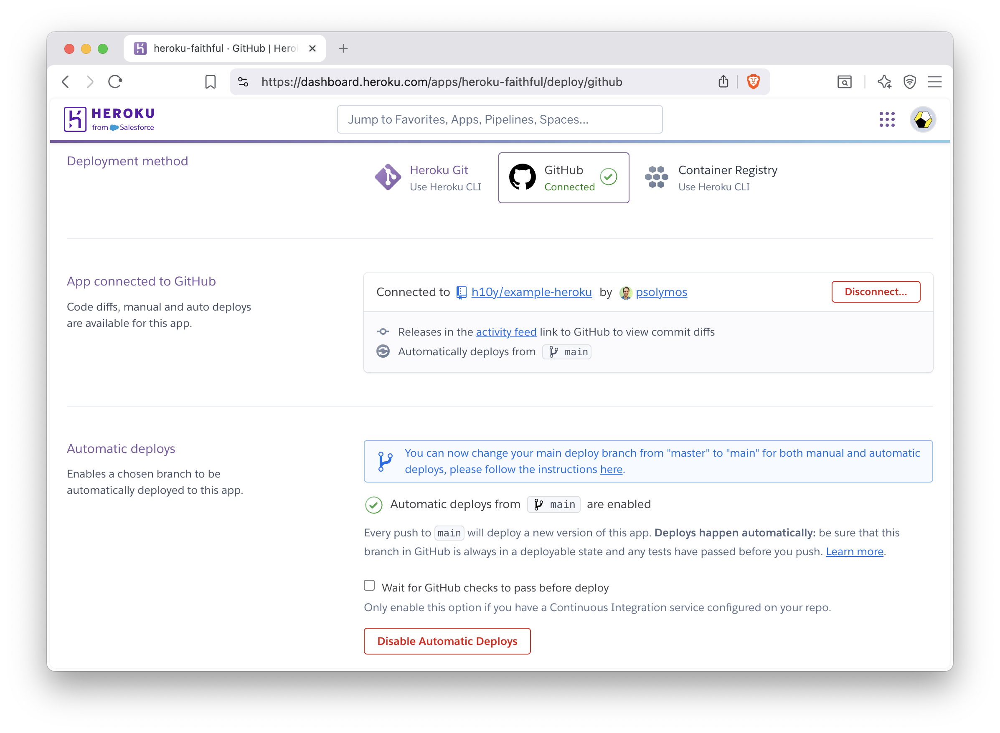
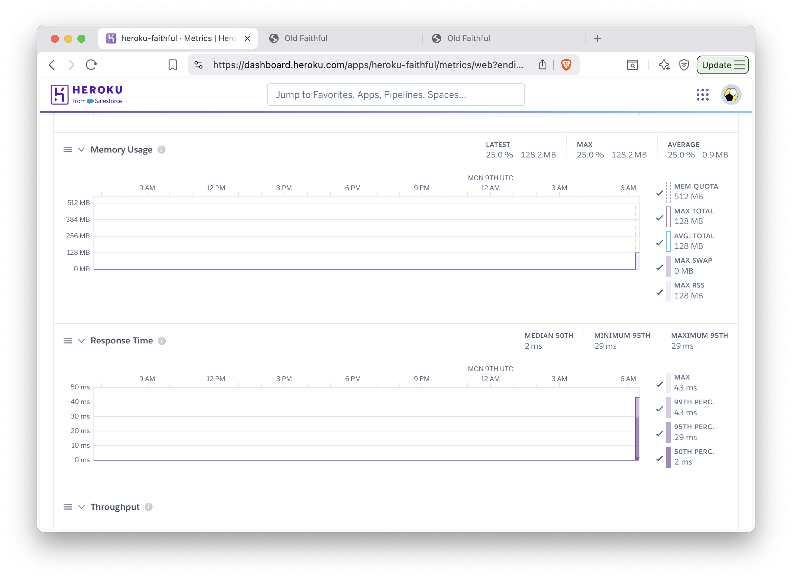
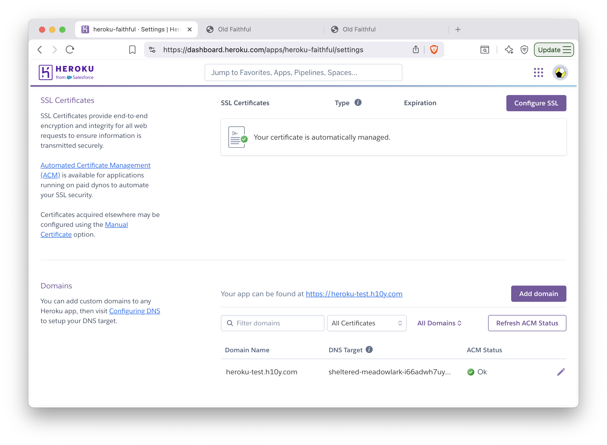

## Heroku {#general-paas-heroku}

Heroku was one of the first cloud platforms developed for deploying web applications
and has been in development since 2007.
Originally developed for Ruby on Rails applications, it has evolved to be programming
language agnostic through the development of buildpacks for programming languages, 
and the support of containers for application deployment. Heroku applications run 
in a collection of lightweight Linux containers called **dynos**. 

A Heroku buildpack is a set of scripts to build application source code for deployment on the
Heroku platform. Buildpacks are developed both by the Heroku team and the wider community.
However, a drawback to the buildpacks is that not all system dependencies might be available for
your Shiny application when deploying on Heroku and will require modifications to a
buildpack. Therefore, it is recommended to use a Docker-based stack that uses a 
containerized version (learn more in Chapter \@ref(part2-containerizing-shiny-apps)) 
of your application to handle all the system dependencies.

Prerequisites for deploying on Heroku include familiarity with git and the 
command line (see Chapters \@ref(part1-command-line) and \@ref(part1-scm-git)).
The Heroku dashboard can also be used to define app deployments.

```{=latex}
\cloudservice{Heroku}{
    \item \$0 to \$6,000 per year
    \item Free: \$0 (0.5 GB RAM)
    \item Hobby: \$84 (0.5 GB RAM)
    \item Standard: \$300--600 (0.5--1 GB RAM)
    \item Performance: \$3,000--6,000 (2.5--14 GB RAM)
}{
    \item Familiar with command line
    \item Some Git knowledge
}{
    \item Community support
    \item Paid support available for critical applications
}{
    \item Free: 550 dyno hours per month, 5 apps
    \item Always on from Hobby tier onwards
    \item Horizontal scaling, preboot, and autoscaling (Performance only)
}
```

### Deployment from the Command Line

Heroku provides a command line tool for deploying to their platform.
To install the Heroku command line, follow the instructions here: 
<https://devcenter.heroku.com/articles/heroku-cli#install-the-heroku-cli>.
Use `heroku --version` to test if the CLI is ready to be used. Then type
`heroku login` which will prompt you to type in credentials. Next time
the CLI will log you in automatically.

In this step, we assume that you have containerized your Shiny application.
That means your Shiny application can be run using specifications in a 
`Dockerfile`. 

The `heroku.yml` in your application's root directory is required
to deploy to Heroku. The following example `heroku.yml` specifies the
Dockerfile to be used to build the image for the app's web process:

```yml
build:
  docker:
    web: Dockerfile
run:
  web: uvicorn app:app --host 0.0.0.0 --port $PORT
```

The `build` section specifies the build process for the application. The `docker` key specifies that you are
using Docker to build the application. The `web` key indicates that it is a web process. The `Dockerfile`
specifies the location of the Dockerfile relative to your root directory that is used for building a container
image. 

The run section indicates how your Shiny application will be run. Under the `web` key it specifies how
to run the web process for your Shiny application. In Python it would be along the lines of:
```yml
run:
  web: uvicorn app:app --host 0.0.0.0 --port $PORT
```
While in R, it would be along the lines of:
```yml
run:
  web: R -e "shiny::runApp('/home/app', host = '0.0.0.0', port=as.numeric(Sys.getenv('PORT')))"
```

To deploy with your Dockerfile, you will have to specify the `PORT` environment
variable and to modify the `CMD` line of your Dockerfile to take in the `PORT` environment
variable. This is Heroku specifies the a port for the container when deploying
your application.

You will now need to initialize a git repository in the root of your Shiny app directory if you
haven't done so already. Only repositories with new commits will deploy once the app is already on
Heroku:

```sh
# Initialize the local directory as a Git repository
git init -b main

# Add the files and stage them for commit
git add .

# Commit tracked changes and sign-off the message
git commit -s -m "First commit"
```

Create the Heroku application with the container stack.
The command will give you the application URL:

```sh
heroku create --stack=container

# Creating app... done, ⬢ morning-plateau-34336, stack is container
# https://morning-plateau-34336.herokuapp.com/ | https://git.heroku.com/morning-plateau-34336.git
```

A Heroku git remote is also added for the application to track changes.
This means that changes will be sent to not just your Git service of choice,
i.e. GitHub, but also to Heroku.

You can configure an existing application to use the container stack
using `heroku stack:set container`.

Finally, you can deploy your application to Heroku, replace `main` with your branch name
if it is different. This will trigger a git push and a docker build on a remote Heroku
server and docker push to the Heroku container registry:

```sh
git push heroku main
# Enumerating objects: 4, done.
# Counting objects: 100% (4/4), done.
# Delta compression using up to 4 threads
# Compressing objects: 100% (3/3), done.
# Writing objects: 100% (4/4), 1.09 KiB | 1.09 MiB/s, done.
# Total 4 (delta 0), reused 0 (delta 0), pack-reused 0
# remote: Compressing source files... done.
# remote: Building source:
# remote: === Fetching app code
# remote:
# remote: === Building web (Dockerfile)
# remote: Sending build context to Docker daemon  3.072kB
# remote: Step 1/3 : FROM registry.gitlab.com/analythium/shinyproxy-hello/hello
# remote: latest: Pulling from analythium/shinyproxy-hello/hello
# remote: 4363cc522034: Pulling fs layer
# ...
# remote: Successfully built 8b891983b438
# remote: Successfully tagged 6dc2e345582f143cd104cf98fec788c65e9a72a6:latest
# remote:
# remote: === Pushing web (Dockerfile)
# remote: Tagged image "6dc2e345582f143cd104cf98fec788c65e9a72a6" as "registry.heroku.com/morning-plateau-34336/web"
# remote: Using default tag: latest
# remote: The push refers to repository [registry.heroku.com/morning-plateau-34336/web]
# remote: cec4817fd20b: Preparing
# ...
# remote: Verifying deploy... done.
# To https://git.heroku.com/morning-plateau-34336.git
#     * [new branch]      main -> main
```

Open the app in your browser using the `heroku open` command.

### Deployment using the Web Dashboard

Sign up for Heroku and log in. You might have to provide a valid credit card
to be able to use the resources. You will also need the heroku command line tool.

Find a Create New App button, click it.
You can give the app a name, e.g. `heroku-faithful` and select a region where
the app will be deployed.

Choose the GitHub based deployment. Heroku has a GitHub application that can be 
used to grant access to your account, so it can pull changes and update the apps
accordingly.
You'll need the `heroku.yml` file in the root of the repository as explained
in the previous section. 
Log in to the heroku account then set the stack to `container`:

```sh
heroku login
# Logging in... done
# Logged in as <your_heroku_email>

heroku stack:set container --app=heroku-faithful
# Setting stack to container... done
```

Figure \@ref(fig:paas-heroku-04) show the Heroku dashboard where you can connect
to the GitHub repository and can enable automatic deploys from a given git branch.
You can trigger the deployment manually, this will result in Heroku
building the container image and deploying it. Click the Open app button
to see the app deployed with a Heroku provided URL, e.g.
<https://heroku-faithful-45457b65a2b8.herokuapp.com/>.

```{r paas-heroku-04, eval=TRUE, echo=FALSE, out.width="100%", fig.pos = "bt", fig.cap="GitHub based deployment in Heroku."}

```

You can view the build logs and check the metrics for the app in the dashboard (Fig. \@ref(fig:paas-heroku-10)).
Application logs are also available after clicking the More button and selecting
it from the drop-down menu.

```{r paas-heroku-10, eval=TRUE, echo=FALSE, out.width="100%", fig.pos = "bt", fig.cap="Monitoring metrics in Heroku."}

```

### Custom Domain and HTTPS

Adding custom domain and setting TLS certificates for HTTPS access can be done
in the app dashboard after the app is successfully deployed (Fig. \@ref(fig:paas-heroku-07)).
Navigate to Settings and configure the SSL Certificate using your own
certificate or by selecting Let's Encrypt for Automated Certificate Management.
Next, click the Add domain button. Provide the domain name here and click Next.
The next page will reveal the URL target that you can copy, that will look like
`sheltered-meadowlark-i66adwh7uy89vnhycaw2inzo.herokudns.com`.
Use this value in your DNS settings to add a `CNAME` record pointing to this
URL.

```{r paas-heroku-07, eval=TRUE, echo=FALSE, out.width="100%", fig.pos = "bt", fig.cap="Managing custom domains and TLS certificates in Heroku."}

```

### Scaling

We will use the _Heroku CLI_ to scale the app and enable 
[session affinity](https://devcenter.heroku.com/articles/session-affinity):

```bash
heroku features:enable http-session-affinity --app=heroku-faithful
# Enabling http-session-affinity for ⬢ heroku-faithful... done
```

Session affinity\index{Session affinity} uses a cookie to maintain 
information about a user's session. Once the feature is enabled,
the Heroku router will start adding an HTTP cookie named `heroku-session-affinity` 
to every new request and response. This cookie contains no private application information.
Based on this cookie value, the Heroku router will be able to determine the appropriate dyno for each request.

The least expensive dyno type that we can use with automatic certificate management 
is the `basic` (with 500 MB RAM). This, however, does not allow horizontal scaling. 
Change [dyno type](https://devcenter.heroku.com/articles/dyno-types) to allow 
scaling to >1 replicas, for this you need at least the Standard-1X 
(with 500 MB RAM, `web=standard-1x`) or Standard-2X (1 GB RAM, `web=standard-2x`) dyno type:

```bash
heroku ps:type web=standard-1x --app=heroku-faithful
# Scaling dynos on ⬢ hello-shiny... done
# === Dyno Types
# type  size         qty  cost/hour  max cost/month
# ────  ───────────  ───  ─────────  ──────────────
# web   Standard-1X  1    ~$0.035    $25
# === Dyno Totals
# type         total
# ───────────  ─────
# Standard-1X  1
```

[Scale](https://devcenter.heroku.com/articles/scaling) the number of web dynos to 2 or more:

```bash
heroku ps:scale web=2 --app=heroku-faithful
# Scaling dynos... done, now running web at 2:Standard-1X
```

You can now refresh your browser, and open a new incognito window to see how a new user would connect. 
Go to the logs in the dashboard (under the _More_ button). You'll see the `web.1` and the `web.2` 
replicas listed. Trying this with the load balancing app should pass the sticky session test.
You can see how the app failing if you remove session affinity with 
`heroku features:disable http-session-affinity --app=heroku-faithful` and run the tests again.

The dyno type and replication can be changed according to demand. The standard dyno types (1X and 2X) also 
allow [preboot](https://devcenter.heroku.com/articles/preboot) to be turned on 
(`heroku features:enable preboot --app=heroku-faithful`). This old instances are not shut 
down before new instances can receive traffic, this eliminates cold start 
behavior when deploying new versions of the web app.

You can destroy the app with `heroku apps:destroy --confirm=heroku-faithful --app=heroku-faithful`.

#### Multiple Apps in the Same Heroku Instance {-}

One can use the `rocker/shiny` image that has Shiny Served Open Source included, 
and add multiple apps under different paths as explained in Section \@ref(part2-dynamic-shiny-apps-shiny-server).
This way you can host multiple apps using a single instance (dyno).

<!--
### Considerations and Limitations
#### Costs
Cost ranges from **$0 to $6000 per year per app** depending on the plan:

-   Free: $0/year, 0.5 GB RAM, sleeps after 30 mins of inactivity
-   Hobby: $84/year, 0.5 GB RAM, always on
-   Standard: $300–600/year, 0.5–1 GB RAM, always on
-   Performance: $3000–6000/year, 2.5–14 GB RAM, always on
-   Private & Shield: no publicly available pricing info

On top of this, there might be **additional fees** for managed databases
and other services.

#### Skill Level and Support
Heroku is a **fully managed** platform-as-a-service (PaaS), **no DevOps
skills** (setting up and running infrastructure) are required to get
started.

You only have to worry about your application. Hosting **dockerized
apps** will provide lots of benefits when it comes to [managing
dependencies](https://hosting.analythium.io/dockerized-shiny-apps-with-dependencies/).

Shiny apps can be deployed locally with the Heroku **[Command Line
Interface](https://hosting.analythium.io/deploying-shiny-apps-to-heroku-with-docker-from-the-command-line/)**
(CLI) or with **[GitHub
Actions](https://hosting.analythium.io/deploying-shiny-apps-to-heroku-with-docker-and-github-actions/)**.

All plans come with **community support**. [**Paid
support**](https://www.heroku.com/support) is available too for
business-critical applications.

#### Scale and Performance
The [Free plan](https://www.heroku.com/free) gives your 550 dyno hours
per month and 5 free apps. If you verify your Heroku account with a
credit card (you will not be charged, unless you use a paid service),
you get **1000 [free dyno
hours](https://devcenter.heroku.com/articles/free-dyno-hours), 100 free
apps**.

Apps on the Free plan will **sleep after 30 mins** of inactivity. The
Hobby plan and up offer dynos that are **always on** (no sleep after 30
mins).

[**Horizontal scaling**](https://devcenter.heroku.com/articles/scaling)
(increase replicas for the app) and
[**preboot**](https://devcenter.heroku.com/articles/preboot) (new web
dynos are started before the existing ones are terminated) for the
professional plans (Standard & Performance).

[**Autoscaling**](https://devcenter.heroku.com/articles/scaling#autoscaling)
and **dedicated resources** are available in the Performance tier.

#### User Management
**Authentication needs to be added manually**. E.g. as simple
authentication via a reverse proxy server in front of the Shiny app on
the Docker container, or third-party integrations as part of the Shiny
app.

Apps are managed independently, so authorization needs to be handled
using groups, labels, or something similar with your authentication
provider.

The Free plan has no team access but you can give **access to your
collaborators**. **Paid plans come with 1–5 free team members**, 6–25
members for an additional $10/month. Role-based team access for
unlimited members under the enterprise plans.

#### Security
Never forget that it is **your responsibility** to ensure that the Shiny
code does not expose anything sensitive!

Heroku apps are deployed to randomly named or available user-defined
subdomains ( `app-name.herokuapp.com`). All these subdomains are served
over HTTPS

All **paid plans** (starting with Hobby and up) have **SSL for custom
domains** and automated certificate management. There is **no SSL for
custom domains on the Free plan**.

Dynos and databases reside physically in the **region where you create**
them. There might be [exceptions to
this](https://devcenter.heroku.com/articles/regions#data-residency) for
3rd party integrations, some APIs, and managed databases.

Apps are by default **deployed to the US** unless EU is specified when
creating the app. The US and EU are considered the Common Runtime
regions. Enterprise plans (Private & Shield) allow you to deploy apps in
**6 different regions** (Dublin, Frankfurt, Oregon, Sydney, Tokyo,
Virginia).

The Shield plan is <a href="https://www.hhs.gov/hipaa/index.html"
rel="noreferrer noopener"><strong>HIPAA-compliant</strong></a>.

Note that there is no free SSL on custom domains, these will be served
via HTTP and not HTTPS for apps that are using free resources.

If you want extra security, you have 3 options:

-   upgrade to a paid Heroku tier;
-   use
    [Cloudflare](https://support.cloudflare.com/hc/en-us/articles/205893698-Configure-Cloudflare-and-Heroku-over-HTTPS?ref=hosting.analythium.io);
-   serve the app via the original secure app URL and an iframe.

#### Branding
Log into your Heroku account and see the application listed in your
dashboard. You can set up a [custom domain for the
app](https://devcenter.heroku.com/articles/custom-domains?ref=hosting.analythium.io)
under the applications settings.


[**Custom
domains**](https://devcenter.heroku.com/articles/custom-domains) are
available on all tiers with a verified account. There is no custom
domain option for unverified accounts and there is no SSL for custom
domains on the Free plan. However, free apps can be served in iframes
using the secure Heroku subdomain, as explained
[here](https://github.com/mayamathur/evalue_website#website).

#### Other Considerations
-   [Heroku
    reference](https://devcenter.heroku.com/categories/reference?ref=hosting.analythium.io)
-   [Heroku container registry and
    runtime](https://devcenter.heroku.com/articles/container-registry-and-runtime?ref=hosting.analythium.io)
-   [Heroku deployment with
    Git](https://devcenter.heroku.com/articles/git?ref=hosting.analythium.io)
-   [Heroku + Docker + R
    example](https://github.com/virtualstaticvoid/heroku-docker-r?ref=hosting.analythium.io)
-   [Shiny on Heroku using
    Buildpack](https://steve-condylios.medium.com/how-to-move-your-r-shiny-app-on-to-the-web-using-heroku-fd54b7d2ad88?ref=hosting.analythium.io)

-   Docker is versatile so you can easily host **any containerized
    applications**, e.g.
    <a href="https://www.rplumber.io/articles/hosting.html#docker"
    rel="noreferrer noopener">Plumber APIs</a>, <a
    href="https://towardsdatascience.com/docker-for-python-dash-r-shiny-6097c8998506"
    rel="noreferrer noopener">Python/Dash apps</a> etc., not just Shiny
    apps
-   No **metrics** for Free, 24 hrs for Hobby, 7-day retention
    professional tiers
-   **Data persistence** needs database connections -->

### Summary
Heroku is a popular platform to host apps of any kind at scale without
managing infrastructure. Shiny apps are best hosted through Docker
images. Heroku can be seen as the containerized version of
shinyapps.io. However, the free tier appears to include more apps
and free hours. Once on the paid tier, payment applies to each app
separately. Upgrade as demand dictates, you can also switch back to the
free tier once a predictable surge is over.

<!-- https://www.youtube.com/watch?v=-bCtShSHsfA

Heroku costs money, DOAP costs moeny
Fly.io is not free

Buildpacks are outdated -->


<!--
### Prerequisites

- [Docker Desktop](https://docs.docker.com/engine/install/) for local testing
- A [Heroku account](https://www.heroku.com/), after signup, you might also want to [verify](https://devcenter.heroku.com/articles/account-verification) your account
- [Git](https://git-scm.com/downloads) and a [GitHub](https://github.com/) account
- Your favorite text editor or IDE (RStudio Desktop or VS Code) and a terminal
- [Heroku CLI](https://devcenter.heroku.com/articles/heroku-cli)

### Deploying the app

Log into Heroku, in the dashboard click on _Create New App_:


Give the app a name, e.g. _hello-shiny_, if available:


Go to your _Account settings_:


Scroll down and find your _API key_. Click the _Reveal_ button and copy the key to your clipboard.


Got to the _Settings_ tab of the repo on GitHub, scroll down to _Secrets and variables_:


Add the Heroku API key as a _New repository secret_:


Repeat this with your Heroku email:


The [`heroku-deploy.yml`](../.github/workflows/heroku-deploy.yml) file defines the [GitHub Action](https://github.com/features/actions) that uses the secrets to log in with Heroku and push the changes to your app. See comments in the [YAML]((../.github/workflows/heroku-deploy.yml)) file for details. The Action uses the [AkhileshNS/heroku-deploy](https://github.com/AkhileshNS/heroku-deploy) action, see the documentation for more arguments as needed.


Go back to the Heroku dashboard for the application, you should see that the app is now deployed:


Click on the _Open app_ button which will take you to the deployed app:


You can view the container logs by clicking the _More_ button in the top right corner, fund the logs there.

### Custom domain

Go to your application dashboard in Heroku. Under the Settings tab, scroll down to find the _Domain settings_:


Click on _Add domain_, type in the domain/subdomain name you'd like to add. I am showing a subdomain here:


You can read more about domains [in the Heroku docs](https://devcenter.heroku.com/articles/custom-domains). Once you click next, you'll see the _DNS target_:


You have to provide this DNS target for the a `CNAME` record with your DNS provider:


After you added the `CNAME` record, go back to the Heroku dashboard and test the custom (sub)domain. It should work, but it will not have HTTPS with the little lock icon in your browser. For HTTPS, you need to add SSL security (more recently SSL is referred to as TLS, transport layer security, but Heroku uses the SSL terminology).

You can use [_Automated Certificate Management_](https://devcenter.heroku.com/articles/automated-certificate-management) for applications running on paid [dynos](https://devcenter.heroku.com/articles/dyno-types) to automate your SSL security. Click Configure SSL:


Select _Automated Certificate Management_ and click Next:


You should see a green check mark under the _ACM Status_:


### Scaling the app

We will use the _Heroku CLI_ to scale the app. The app name is defined as the `APP` variable that we have to provide for the commands.

Enabling [session affinity](https://devcenter.heroku.com/articles/session-affinity):

```bash
export APP=hello-shiny

heroku features:enable http-session-affinity --app=$APP
# Enabling http-session-affinity for ⬢ hello-shiny... done
```

Session affinity is using a cookie:

> As soon as the feature is enabled on an application, the Heroku router will start adding an HTTP cookie named `heroku-session-affinity` to every new request and response.
>
> This cookie contains no private application information and doesn’t require request- or response-related data to function.
>
> Based on this cookie value, the Heroku router will be able to determine the appropriate dyno for each request.

The least expensive dyno type that we can use with automatic certificate management is the `basic` (with 500 MB RAM). This, however, does not allow horizontal scaling. Change [dyno type](https://devcenter.heroku.com/articles/dyno-types) to allow scaling to >1 replicas, for this you need at least the Standard-1X (with 500 MB RAM, `web=standard-1x`) or Standard-2X (1 GB RAM, `web=standard-2x`) dyno type:

```bash
heroku ps:type web=standard-1x --app=$APP
# Scaling dynos on ⬢ hello-shiny... done
# === Dyno Types
# type  size         qty  cost/hour  max cost/month
# ────  ───────────  ───  ─────────  ──────────────
# web   Standard-1X  1    ~$0.035    $25
# === Dyno Totals
# type         total
# ───────────  ─────
# Standard-1X  1
```

[Scale](https://devcenter.heroku.com/articles/scaling) the number of web dynos to 2 or more:

```bash
heroku ps:scale web=2 --app=$APP
# Scaling dynos... done, now running web at 2:Standard-1X
```

You can now refresh your browser, and open a new incognito window to see how a new user would connect. Go to the logs in the dashboard (under the _More_ button). You'll see the `web.1` and the `web.2` replicas listed, and both sessions should pass the sticky session test successfully:


The dyno type and replication can be changed according to demand. The standard dyno types (1X and 2X) also allow [preboot](https://devcenter.heroku.com/articles/preboot) to be turned on (`heroku features:enable preboot --app=$APP`). This old instances are not shut down before new instances can receive traffic, this eliminates cold start behavior when deploying new versions of the web app.

You can see how the app fails if you remove session affinity with `heroku features:disable http-session-affinity --app=$APP` and run the tests again.


You can destroy the app with `heroku apps:destroy --confirm=$APP --app=$APP`.

### Multiple apps in the same Heroku instance

One can use the [`rocker/shiny`](https://rocker-project.org/images/versioned/shiny.html) image that has Shiny Served Open Source included, and you can add multiple apps under different paths.

### Pricing

Dyno prices are detailed [here](https://devcenter.heroku.com/articles/usage-and-billing).
-->