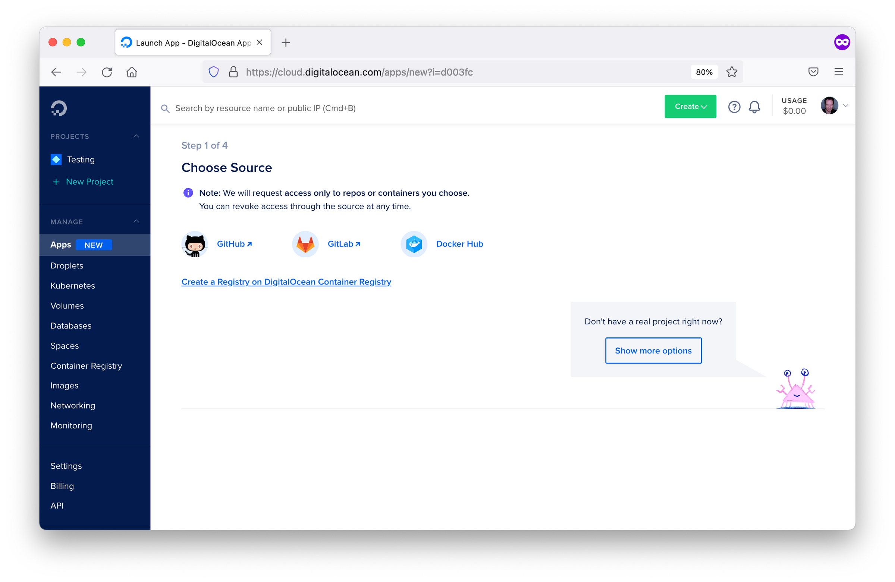
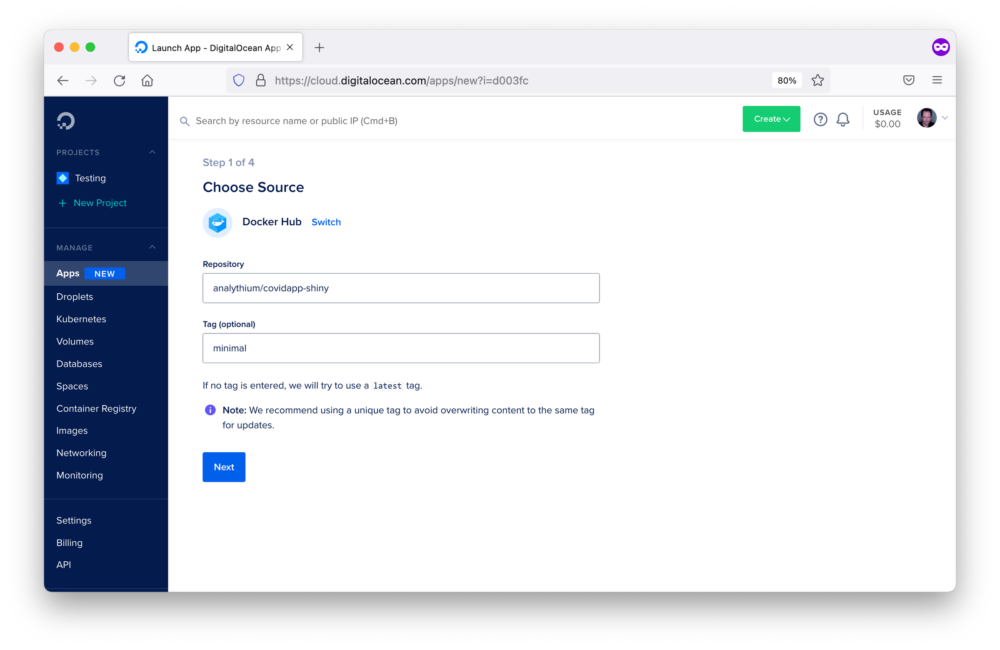
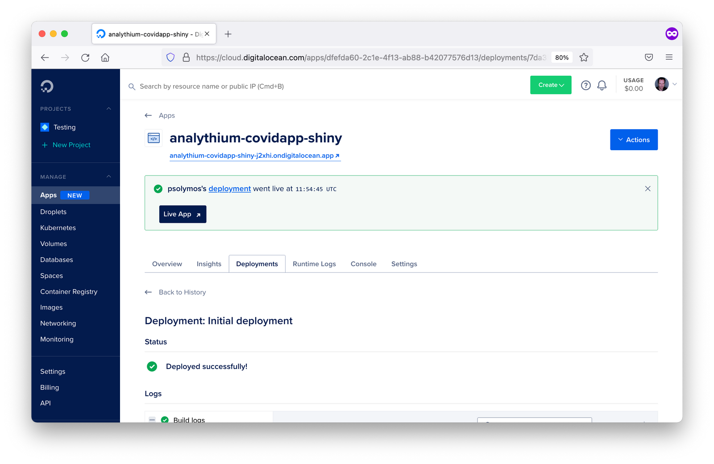
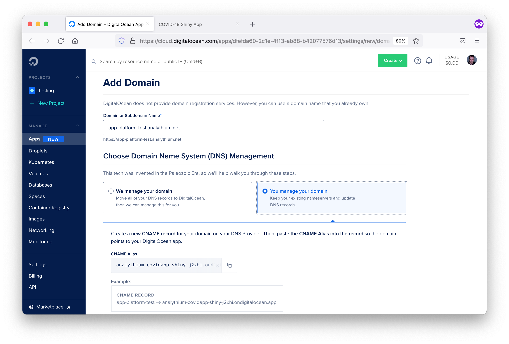

## DigitalOcean App Platform {#general-paas-doap}

The DigitalOcean App Platform (DOAP) can publish applications from your GitHub repository, 
or publish a container image you have already uploaded to a Docker registry. 
The platform supports GitOps (git push-based deployment), and vertical and horizontal scaling.

In spirit and most practical aspects, the DOAP is similar to Heroku in the sense that you
can use Buildpacks or Dockerfiles to build applications. There is no native Buildpack for R. But as we
explain in Chapter \@ref(part2-containerizing-shiny-apps), Shiny apps can be containerized. 
This gives us a way to deploy to DOAP seamlessly.

```{=latex}
\cloudservice{DigitalOcean App Platform}{
    \item \$60 to \$3,600 per year
    \item Container applications billed by the second
}{
    \item Familiar with command line
}{
    \item Ticket-based support
}{
    \item 24/7 operation in paid plans
    \item Shared or dedicated CPU options
}
```

### Prerequisites

You must sign up for a DigitalOcean account and set up the appropriate billing information.
After logging in, choose the 'Apps' option in the dashboard.
After clicking 'Launch Your App', you are presented with source options such as: Docker Hub and GitHub.
This screen can be seen in Figure \@ref(fig:doap-source-selection).
We will delve into GitHub and Docker Hub in the subsequent sections. Docker Hub allows deployment from
a container registry while GitHub allows deployment from a code repository.

```{r doap-source-selection, eval=TRUE, echo=FALSE, out.width="100%", fig.pos = "hbt", fig.cap="DOAP source selection options."}

```

### Docker Hub Deployment

After choosing the Docker Hub deployment option, you will need to specify the Docker Hub repository image
location similar to the screen in Figure \@ref(fig:doap-docker-hub).
To have an image on Docker Hub, you first must build and publish an image as explained
in Chapter \@ref(part2-docker-push).

```{r doap-docker-hub, eval=TRUE, echo=FALSE, out.width="100%", fig.pos = "hbt", fig.cap="Docker Hub configuration in DOAP."}

```

Once an image has been specified, you will have to define the parameters for running your image. This includes
specifying the type of application which is 'Web Services' in the case of Shiny, the run command, the
port that your application runs on in the container, and any environment variables for configuring
your application.

Once the deployment parameters have been defined, you will need to specify the name you want
DigitalOcean to identify your application as, as well as the region you want your Shiny app
hosted in.

Finally, you must specify a plan, which at a minimum is `Basic` as you are deploying a non-static application.
You can also specify the number of replicates for horizontal scaling.

After clicking launch, you will see the app deployed on a subdomain: `app-name-hash.ondigitalocean.app`.

#### Updating the App {-}

You can edit the source image tag in your app's settings. Once the new
version is tagged and pushed to the Docker registry, just edit the tag
and the app will be redeployed to the App Platform.

### GitHub Deployment

By linking with GitHub, you can enable the automatic deployment of your 
application to the DigitalOcean App Platform.
To get started, you must define in the source repo: `/.do/app.yaml`.
The .do folder contains the app specification (`app.yaml`) file that defines how the
Shiny app should be deployed.

```yml
name: app-platform-shiny
services:
- dockerfile_path: Dockerfile
  github:
    repo: h10y/faithful
    branch: main
    deploy_on_push: true
  name: app-platform-shiny
```

<!-- FIXME: explain the yaml specification -->

Choose the GitHub deployment option when deploying your application.
Follow the prompts and install the GitHub app for your personal account or the organization 
of your choice. Select 'All repositories' or 'Only select repositories' as appropriate. 
Finally, click 'Save'.

Now go back to the Apps control panel, you will
see a screen similar to Figure \@ref(fig:doap-source-github). 
Select the repository from the dropdown menu, specify 
the branch you wish to deploy. If you want to deploy both a development and a production 
version of the same repository, you can create multiple apps with the same repo but 
using different branches.

```{r doap-source-github, eval=TRUE, echo=FALSE, out.width="100%", fig.pos = "hbt", fig.cap="GitHub repository selection screen in DOAP."}

```

Leave 'autodeploy' checked if you want to trigger new deployments when the code changes, 
then click 'Next'.
Review the app settings inferred from the Dockerfile, i.e. the HTTP port, etc.
Type in the name of the service, select the data region, then click 'Next'.
The final step lets you define the performance of the app and the corresponding pricing. 

After a few minutes, you should see the green checks besides the build and deployment log 
entries. Building the image might take some time, depending on the number of dependencies 
in your app.
Follow the app URL from the control panel to see the app online served over HTTPS.

If you make any changes to your GitHub repository, then a new version of the app will
be deployed. One potential issue with this GitHub integration is it does not depend on 
passing tests before deployment. If you want to test your changes before deployment, here 
are the steps to follow:

1. Push changes to the development branch,
2. Run automated tests for the development branch, e.g. using GitHub actions,
3. Set up the production branch as a protected branch, so that merging pull requests require 
passing tests.

### Programmatic Deployment

DigitalOcean also offers a command line tool with a YAML specification file for deploying applications
to the DigitalOcean App Platform.
Once you have deployed an app, you can find the YAML specification file for your deployed app under the Settings
tab in apps. Most of the info in the spec file is self-explanatory and relates to all the settings defined
when deploying from the browser GUI.
To use the app spec from the command line you have to install the doctl command-line tool and follow 
the steps described in the [docs](https://docs.digitalocean.com/reference/doctl/how-to/install/?ref=hosting.analythium.io) 
to use the API token to grant doctl access to your DigitalOcean account.

<!-- FIXME: reference yaml specification in the previous section -->
<!-- FIXME: explain doctl setup better -->

### Logs

The dashboard (similar to Figure \@ref(fig:doap-app-dashboard)) of your deployed app allows you to inspect the deployment and runtime logs under 
the "Runtime Logs" tab.
You can even access the container through the console under the "Console". 
Under the "Insights" tab, you can also check CPU and memory consumption.

```{r doap-app-dashboard, eval=TRUE, echo=FALSE, out.width="100%", fig.pos = "hbt", fig.cap="Dashboard of deployed application in DOAP."}

```

### Custom Domains

You can add a custom domain using a CNAME record with your DNS provider. 
Go to your app's settings tab, find the 'Add Domain' button.
You will be presented with a screen similar to Figure \@ref(fig:doap-custom-domain).
Follow the prompts and copy the app's current URL.
Go to your DNS provider and add a CNAME record, and save.
After some time the custom domain will be live and listed as 'Active' under settings.

```{r doap-custom-domain, eval=TRUE, echo=FALSE, out.width="100%", fig.pos = "hbt", fig.cap="Custom domain configuration in DOAP."}

```

<!--
### Considerations and Limitations
#### Costs
Cost ranges from **$60 to $3600 per year per app** depending on the
plan. Container-based applications are billed by the second, starting at
a minimum of one minute.

On top of this, there might be **additional fees** for managed databases
and other services. You'll have **no server costs** or costs related to
maintenance or personnel running the servers. Platform pricing covers
all of these.

#### Skill level and support
The App Platform is a **fully managed** platform-as-a-service (PaaS),
**no DevOps skills** (setting up and running infrastructure) are
required to get started.

You only have to worry about your application. Hosting **dockerized
apps** will provide lots of benefits when it comes to [managing
dependencies](https://hosting.analythium.io/dockerized-shiny-apps-with-dependencies/).

Shiny apps can be deployed using **[existing Docker
images](https://hosting.analythium.io/how-to-host-shiny-apps-on-the-digitalocean-app-platform/)**,
directly from [GitHub/GitLab **after git
push**](https://hosting.analythium.io/auto-deploy-shiny-app-changes-to-the-digitalocean-app-platform/),
or using **[GitHub
Actions](https://hosting.analythium.io/how-to-use-github-actions-with-the-digitalocean-app-platform-for-shiny-apps/)**.

[Support](https://docs.digitalocean.com/support/) is available as a
ticket system tied to your account.

#### Scale and Performance
There are only paid plans, so your **apps will run 24/7**. App
performance will vary depending on whether you use a **shared or
dedicated CPU**, and based on the number of CPUs and memory allocated
(see the cost breakdown above).

**[Horizontal
scaling](https://docs.digitalocean.com/products/app-platform/how-to/scale-app/)**
(increase replicas for the app) and **high availability** is available
for the Professional plan.

#### User Management
**Authentication needs to be added manually**. E.g. as simple
authentication via a reverse proxy server in front of the Shiny app in
the Docker container, or third-party integrations as part of the Shiny
app.

Apps are managed independently, so authorization needs to be handled
using groups, labels, or something similar with your authentication
provider when you are applying it to multiple apps.

You can have unlimited team members.

#### Security

Never forget that it is **your responsibility** to ensure that the Shiny
code does not expose anything sensitive!

All plans include assigned or **custom domains** served over **HTTPS**.

Apps can be deployed in **[8 different
regions](https://docs.digitalocean.com/products/platform/availability-matrix/#app-platform-availability)**.

**Distributed denial of service (DDoS) attack mitigation** is included
in all plans.

#### Branding
All plans include assigned or **custom domains** served over **HTTPS**.

##### Other considerations
-   Docker is versatile so you can easily host **any containerized
    applications**, e.g.
    <a href="https://www.rplumber.io/articles/hosting.html#docker"
    rel="noreferrer noopener">Plumber APIs</a>, <a
    href="https://towardsdatascience.com/docker-for-python-dash-r-shiny-6097c8998506"
    rel="noreferrer noopener">Python/Dash apps</a> etc., not just Shiny
    apps
-   **Application metrics** are available hourly or by the minute
-   **Data persistence** needs database connections-->

### Summary

DigitalOcean App Platform allows you to deploy containerized applications from
a container image hosted in a container registry, through a container image specified
in a code repository, or programmatically. It can be an easier to setup 
alternative to Heroku for hosting containerized applications.

The next chapter will cover another alternative
container hosting platform named "Fly.io" which offers the option of
multi-region availability for your hosted Shiny application. 
