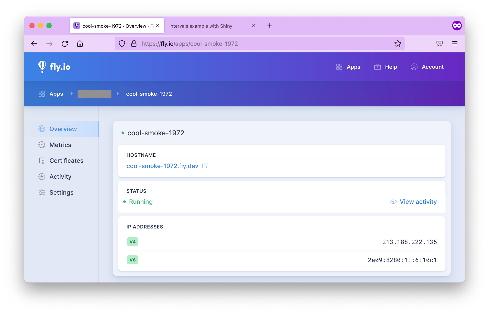
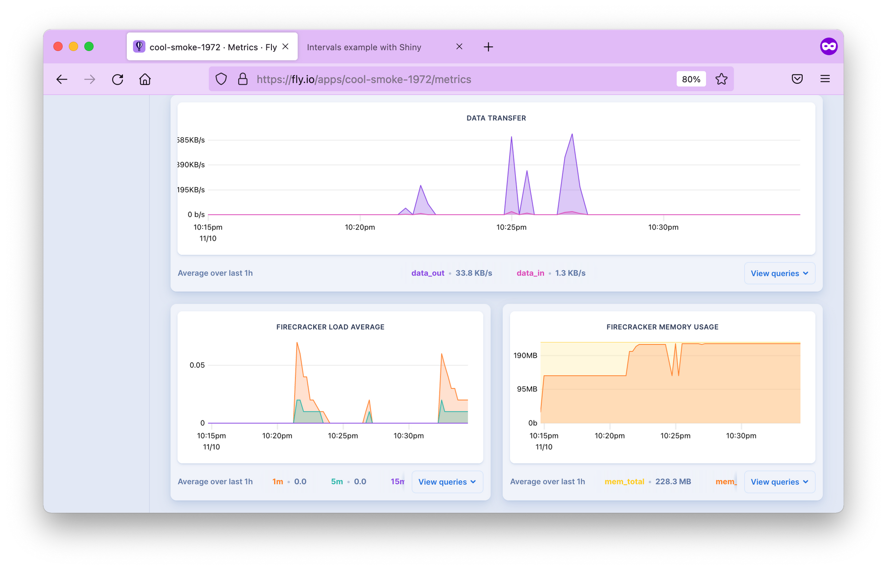

## Fly.io {#general-paas-flyio}

[Fly.io](https://fly.io/) is an application hosting platform. The
platform is ideal for hosting worldwide apps with low latency.
Fly.io enables the launch of containerized applications with
the command line.

```{=latex}
\cloudservice{Fly.io}{
    \item \$23.28 to \$6,697.92 per year
    \item Free tier: 2,340 hours per month (3 shared 1 CPU VMs)
}{
    \item Familiar with command line
}{
    \item Support available through the Fly Community
}{
    \item 24/7 operation
    \item Options for horizontal and vertical scaling
}
```

### Prerequisites

First of all, you'll need Docker installed on your local machine.

This [hands-on intro](https://fly.io/docs/hands-on/start/) from the Fly
documentation is a good place to start to make sure you have everything
installed. First, you need to [install
`flyctl`](https://fly.io/docs/hands-on/installing/), that is the
command-line utility that lets you work with Fly. Follow instructions
for your operating system of choice.

[Sign up](https://fly.io/docs/hands-on/sign-up/) for a Fly account. Set
up email/password combination or use your GitHub social login. You will
also be prompted for credit card payment information, required for
charges outside the free tier on Fly (see
[pricing](https://fly.io/docs/about/pricing) info, you can run 3 apps
for free). Without a credit card, you will not be unable to create a new
application on Fly.

Now you can [sign in](https://fly.io/docs/hands-on/sign-in/) with
`flyctl`:
```sh
flyctl auth login
```

### Creating a Fly.io App
We will use the Docker image from the
<a href="https://gitlab.com/analythium/shinyproxy-hello"
rel="nofollow">analythium/shinyproxy-hello</a> GitHub project. If you
have another Docker image with a Shiny app in it, feel free to use a
different `DOCKER_IMAGE`. Once the image tag is specified, you have to
pull the image to your local machine:
```sh
export DOCKER_IMAGE="ghcr.io/h10y/faithful/py-shiny:main"
docker pull $DOCKER_IMAGE
```

With that app pulled, you can go ahead and create a Fly app from the
existing Docker image. You'll be prompted to select the account and the
data center region:
```sh
flyctl launch --image $DOCKER_IMAGE

# Creating app in /Users/Peter
# Using image ghcr.io/h10y/faithful/py-shiny:main
# ? Select organization: <organization_name>
# ? Select region: sea (Seattle, Washington (US))
# Created app cool-smoke-1972 in organization <organization_name>
# Wrote config file fly.toml
```

There are quite a few regions to select from, you are offered the one
closest to you based on your IP address.

Open and edit the newly created `fly.toml` (see the [Fly
docs](https://fly.io/docs/reference/configuration/) for detailed config
options). Leave all the contents except for the `internal_port` that you
should change from `8080` to `3838` because this is the port exposed in
the Docker image:

```yml
    ...
    [[services]]
    ...
      internal_port = 3838
    ...
```

If you are using a different image, make sure you set this to the port
that the app is running at.

### Deploying to Fly.io

Use the `flyctl deploy` command to deploy the app:
```sh
flyctl deploy

# Deploying cool-smoke-1972
# ==> Validating app configuration
# --> Validating app configuration done
# Services
# TCP 80/443 ⇢ 3838
# Searching for image 'ghcr.io/h10y/faithful/py-shiny:main' locally...
# image found: sha256:b11b4100...
# ==> Pushing image to fly
# The push refers to repository [registry.fly.io/cool-smoke-1972]
# e86054b4a909: Pushed
# ...
# e749bc5a8d9b: Pushed
# deployment-1636607519: digest: sha256:33b633191... size: 3245
# --> Pushing image done
# Image: registry.fly.io/cool-smoke-1972:deployment-1636607519
# Image size: 1.2 GB
# ==> Creating release
# Release v2 created
# 
# You can detach the terminal anytime without stopping the deployment
# Monitoring Deployment
# 
# 1 desired, 1 placed, 1 healthy, 0 unhealthy [health checks: 1 total, 1 passing]
# --> v0 deployed successfully
```

As a result of the deploy command, the image is pushed into the Fly
registry. Watch the process from the command line. If you quit the
process, you can still check the app status:

```sh
flyctl status

# App
#   Name     = cool-smoke-1972
#   Owner    = <organization_name>
#   Version  = 0
#   Status   = running
#   Hostname = cool-smoke-1972.fly.dev
# 
# Deployment Status
#   ID          = 1c31f05d-b84c-d5da-4613-9679727495e5
#   Version     = v0
#   Status      = successful
#   Description = Deployment completed successfully
#   Instances   = 1 desired, 1 placed, 1 healthy, 0 unhealthy
# 
# Instances
# ID       PROCESS VERSION REGION DESIRED STATUS  HEALTH CHECKS      RESTARTS CREATED
# 00d78cfc app     0       sea    run     running 1 total, 1 passing 0        5m8s ago
```

Your app is up and running when the status changes to successful.
Inspect the container logs with `flyctl logs`.

The output will give the Hostname (`app_name.fly.dev` where `app_name`
is the app name from the TOML configuration file). Copy the Hostname and
paste in the browser tab, or use `flyctl open` to visit the app.

### Metrics and Logs

If you go to the Fly.io dashboard and click on your app name,
you'll see a menu with the app overview with the status, green means the app
is healthy (Fig. \@ref(fig:paas-fly-io-01)). 

```{r paas-fly-io-01, eval=TRUE, echo=FALSE, out.width="100%", fig.pos = "bt", fig.cap="The Fly.io dashboard for the app."}

```

The Metrics tab shows HTTP response times, 
concurrency (meaningful only if you scaled the app to more than 1 replica), data transfer speed,
memory usage, etc. (Fig. \@ref(fig:paas-fly-io-02)). You can access logs for up to 2 days.
You can also manage TLS certificates here, view activity and settings.

```{r paas-fly-io-02, eval=TRUE, echo=FALSE, out.width="100%", fig.pos = "bt", fig.cap="Metrics in the Fly.io dashboard."}

```

### Setting up a Custom Domain

It is recommended to use an A or AAAA record if you set up an apex
domain (like `example.com`). Get the IPv4 and IPv6 addresses and add
those to your DNS.

```sh
flyctl ips list

# TYPE ADDRESS             REGION CREATED AT
# v4   213.188.220.171     global 5m47s ago
# v6   2a09:8280:1::6:11cc global 5m47s ago
```

This means creating an A or AAAA record with your domain name provider to point to 
the IPs listed by the command above.
Give a few minutes to the name servers. Once the records are propagated,
you should be able to access the app at your custom domain. 

### Adding TLS/SSL certificate

You might have noticed the crossed lock symbol when loading your Shiny app,
indicating that the app is served over HTTP.

Let's add TLS certificate to the domain name:
```sh
export DOMAIN_NAME="your.domain.com" # change domain here

flyctl certs create $DOMAIN_NAME
# Your certificate for your.domain.com is being issued.
# Status is Awaiting certificates.
```

Wait for a bit, issuing certificates might take a couple of minutes.
Once it is done, you should see that a certificate has been issued:

```sh
flyctl certs show $DOMAIN_NAME
# The certificate for fly-shiny.analythium.net has been issued.
# Hostname                  = your.domain.com
# DNS Provider              = googledomains
# Certificate Authority     = Let's Encrypt
# Issued                    = ecdsa,rsa
# Added to App              = 24 minutes ago
# Source                    = fly
```

If you visit your app URL now, the lock symbol looks good, the Shiny app
is now served over HTTPS

### Autoscaling in Multiple-Regions

Fly.io allows the deployment of your application across data centers located worldwide including:
Amsterdam, Atlanta, Paris, Dallas, Parsippany, Frankfurt, Sao Paulo, Hong Kong, Ashburn, Los Angeles, 
London, Chennai, Tokyo, Chicago, Santiago, Seattle, Singapore, Sunnyvale, Sydney, Toronto, Bathurst.

Fly.io makes sure users are directed to the geographically closest location to
ensure performance is as best as can be.
Use the `flyctl` to list the regions for the deployed app. Depending on
your location, you will see different regions listed. I deployed the app
from Toronto (`yyz`). If you are in doubt about what the 3-letter codes
mean, these are airport codes, so just search for them.

```sh
flyctl regions list

# Region Pool:
# yyz
# Backup Region:
# bhs
# ewr
```

My backup regions are `ewr` (Parsippany, NJ US) and `bhs` Bathurst,
Australia. If for any reason, the app can't be deployed in Toronto, Fly will try to
spin it up in one of the backup regions. You can build your own region
pool. For example, `flyctl regions add ord cdg` would add Chicago and
Paris to the region pool:

```sh
flyctl regions add ord cdg

# Region Pool:
# cdg
# ord
# yyz
# Backup Region:
# ams
# bhs
# ewr
# lhr
# vin
```

Use `flyctl regions remove ord` to remove `ord` from the region pool.
Once you defined the regions where you want your apps to run, it is time
to set how many instances your app will have. But when do you need a new
instance and what is an instance in this case?

#### Instances and concurrency {-}

Fly.io uses a virtualization technology called Firecracker
microVMs to run multi-tenant container services. So an instance is a microVM.
Think of it as a portion of a shared virtual CPU and 256 MB memory
units. These units are scaled up and down.

In your `fly.toml` configuration
file you can find a section about concurrency with the following defaults:

```yml
    ...
      [services.concurrency]
        hard_limit = 25
        soft_limit = 20
        type = "connections"
    ...
```

This concurrency setting determines the microVM capacity. The default is
20 concurrent connections. When a user connects, the request is sent to
the nearest microVM with capacity. If the existing VMs are at capacity,
Fly launches more in the busiest regions. Idle microVMs are shut off. 
The room between the soft and hard limits gives time for new instances to be 
brought to life.

#### Scale count {-}

The scale count is the number of instances. A scale count of 1 (default)
means that 1 instance of the app is running in 1 of the regions in the
region pool. Scale count refers to horizontal scaling.

You can increase the scale count with the `flyctl scale count` command.
`flyctl scale count 2` tells us to run 2 instances of your application.
You can see your current scaling parameters with `flyctl scale show`:

```sh
flyctl scale show
# VM Resources for cool-smoke-1972
#         VM Size: shared-cpu-1x
#       VM Memory: 256 MB
#           Count: 2
#  Max Per Region: Not set
```

The scaled app is placed in different regions in the region pool. Use
the `flyctl status` command to list instances and which regions they are
running in:

```sh
flyctl status
# App
#   Name     = cool-smoke-1972
#   Owner    = <organization_name>
#   Version  = 3
#   Status   = running
#   Hostname = cool-smoke-1972.fly.dev
#
# Instances
# ID       PROCESS VERSION REGION DESIRED STATUS  HEALTH CHECKS      RESTARTS CREATED
# 535327bc app     3       yyz    run     running 1 total, 1 passing 0        3m7s ago
# 0c0bd76e app     3       cdg    run     running 1 total, 1 passing 0        4h55m ago
```

#### Scaling virtual machines {-}

The physical servers that the microVM instances are running on have 8--32
CPU cores and 32--256 GB of RAM. Multiple virtual machines (VMs) share
the same physical box. The number of cores and amount of memory
available in the virtual machine can be set for all application
instances using the `flyctl scale vm` command.

```sh
flyctl platform vm-sizes
# NAME             CPU CORES MEMORY
# shared-cpu-1x    1         256 MB
# dedicated-cpu-1x 1         2 GB
# dedicated-cpu-2x 2         4 GB
# dedicated-cpu-4x 4         8 GB
# dedicated-cpu-8x 8         16 GB
```

You can change the type of your VMs by
adding the required size name to `fly scale vm` or using the
`fly scale memory` to directly set the VM's memory allocation. This type
of scaling is referred to as vertical scaling.

#### Autoscaling {-}

Autoscaling means that the Fly system will create at least the minimum number of
application instances across the regions in your region pool. New
instances will be created based on traffic up to the maximum count.

By default, autoscaling is disabled and scale count is in effect. There
are two types of auto-scaling models: Standard and Balanced. Here is
what the Fly docs say:

-   **Standard**: Instances of the application, up to the minimum count,
    are evenly distributed among the regions in the pool. They are not
    relocated in response to traffic. New instances are added where
    there is demand, up to the maximum count.
-   **Balanced**: Instances of the application are, at first, evenly
    distributed among the regions in the pool up to the minimum count.
    Where traffic is high in a particular region, new instances will be
    created there and then, when the maximum count of instances has been
    used, instances will be moved from other regions to that region.

The command `flyctl autoscale standard` will turn on the Standard
autoscaling plan. If you want the Balanced plan with min/max counts of 3
and 5, use `flyctl autoscale balanced min=3 max=10`. The command
`flyctl autoscale disable` will disable autoscaling.

When you are done, use `flyctl destroy $APP_NAME` to destroy the
deployed application. Don't forget to remove the A or CNAME record from
your DNS settings too.

<!-- #### Session affinity {-}

When there are multiple instances of the same app running (scale count
>1), load balancing is needed to distribute the workload among the
server processes. Without so-called "session affinity" (or "sticky
sessions"), requests are sent to the instance that is next in line.

Problems with this type of load balancing can arise when the internet
connection is severed for some reason, e.g. due to poor cell coverage.
If saving the users' state is important for the app to work, e.g. the
user uploads files etc., having no session affinity won't be ideal.

> When you bump up your scale count, we'll place your app in different
> regions (based on your region pool). If there are three regions in the
> pool and the count is set to six, there will be two app instances in
> each region.

In theory, we could place instances in different
regions to make sure traffic is only going to the closest instance. So
when you increase the scale count (`flyctl scale count`), make sure you
have the matching number of regions set up first (`flyctl regions add`). -->

<!--
### Considerations and Limitations
#### Costs
Fly offers a **Free tier** that includes **2,340 hours per month** that
is enough to run 3 shared 1 CPU virtual machines with 256 MB RAM full
time.

The paid plans can cost anywhere between **$23.28 and $6,697.92
US/year/app**, not including extras like persistent volumes or
databases. The cheapest is the same shared CPU instance as under the
free tier. The largest instances boast 8 dedicated CPUs and 64 GB RAM.

You'll have **no server costs** or costs related to maintenance or
personnel running the servers. Platform pricing covers all of these.

#### Skill level and support
The Fly platform is a **fully managed** platform-as-a-service (PaaS),
**no DevOps skills** (setting up and running infrastructure) are
required to get started.

You only have to worry about your application. Hosting **dockerized
apps** will provide lots of benefits when it comes to [managing
dependencies](https://hosting.analythium.io/dockerized-shiny-apps-with-dependencies/).

Shiny apps can be deployed using **[existing Docker
images](https://hosting.analythium.io/make-your-shiny-app-fly/)** or
using **[GitHub
Actions](https://fly.io/docs/app-guides/continuous-deployment-with-github-actions/)**.

Support is available through the [Fly
Community](https://community.fly.io/).

#### Scale and Performance
Your **apps will run 24/7** under the free and paid tiers alike. App
performance will vary depending on whether you use a **shared or
dedicated CPU**, and based on the number of CPUs and memory allocated
(see the cost breakdown above).

You can fine-tune **[concurrency, horizontal and vertical
scaling](https://hosting.analythium.io/auto-scaling-shiny-apps-in-multiple-regions-with-fly-io/#scaling)**
for the app using the command-line tool. Read about **[session
affinity](https://hosting.analythium.io/scaling-shiny-apps-for-python-and-r-sticky-sessions-on-heroku/)**
if your app needs to preserve state or has file upload functionality to
avoid surprises for your users.

#### User Management
**Authentication needs to be added manually**. E.g. as simple
authentication via a reverse proxy server in front of the Shiny app in
the Docker container or third-party integrations as part of the Shiny
app.

Apps are managed independently, so authorization needs to be handled
using groups, labels, or something similar with your authentication
provider when you are applying it to multiple apps.

[**Organizations**](https://fly.io/docs/hands-on/create-app/) are a way
of sharing applications and resources between Fly users. There is no
limit on the number of members in your organization. This feature is
useful for team collaboration.

#### Security
Never forget that it is **your responsibility** to ensure that the Shiny
code does not expose anything sensitive!

The free plan includes 10 free **SSL/TLS certificates** for your apps.
You can get additional certificates for $0.10/month for a single
hostname and for $2/month for wildcards.

You can set up **custom domains** and use free or paid certificates to
serve your apps over **HTTPS**.

Apps can be deployed in **[20 different
regions](https://fly.io/docs/reference/regions/)**. You can pick **[one
or multiple
regions](https://hosting.analythium.io/auto-scaling-shiny-apps-in-multiple-regions-with-fly-io/#regions)**,
and select how new instances should be deployed when autoscaling.

#### Branding
All plans include the option to use **custom domains** served over
**HTTPS** for no additional cost.

#### Other considerations
-   Docker is versatile so you can easily host **any containerized
    applications**, e.g.
    <a href="https://www.rplumber.io/articles/hosting.html#docker"
    rel="noreferrer noopener">Plumber APIs</a>, <a
    href="https://towardsdatascience.com/docker-for-python-dash-r-shiny-6097c8998506"
    rel="noreferrer noopener">Python/Dash apps</a> etc., not just Shiny
    apps
-   **Application metrics** are available in the dashboard
-   **Data persistence** needs database connections-->


### Summary

Fly.io is a quick and easy way for deploying containerized Shiny app to a
PaaS for free. There are some features that set Fly.io apart from other similar platforms.
If you need multi-region availability and really flexible scaling for
your app, Fly can give that to you at a reasonably low cost and with no
ops involved.
