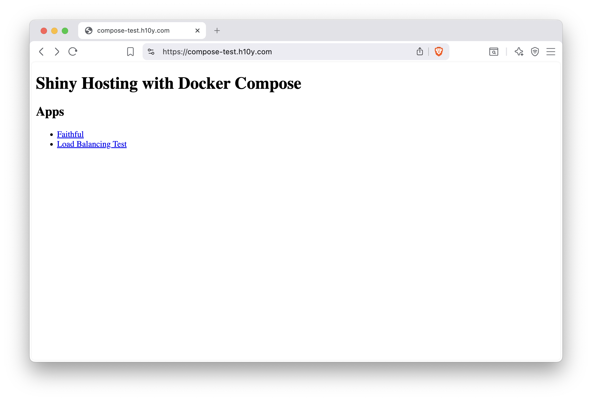
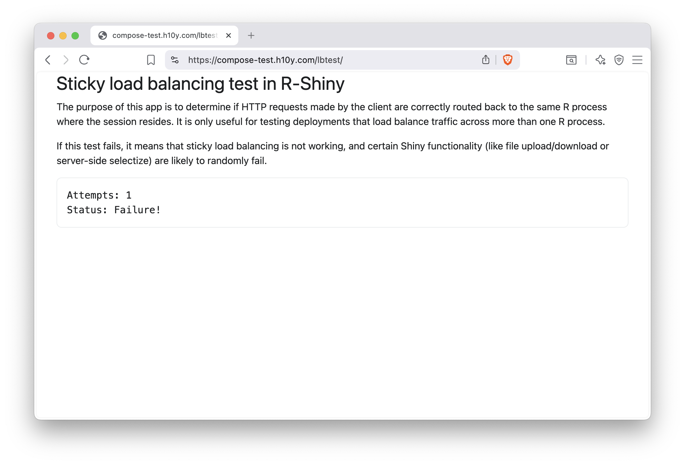
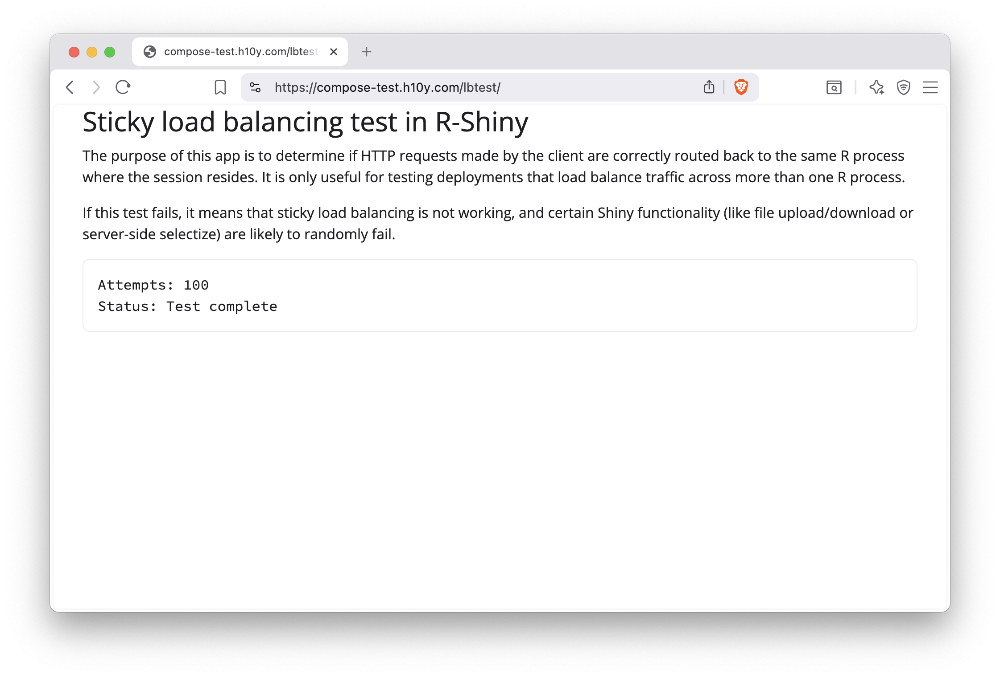

# Docker Compose {#part2-docker-compose}

::: {.noteblock data-latex=""}
This chapter covers using Docker Compose to run
your containerized Shiny application. Docker Compose
is meant to be run on your own self-hosted machine,
and requires more technical knowledge than a hosting
platform.

You should be familiar with the command line and containers to
understand this chapter. Please refer back to Chapter \@ref(part1-command-line)
if you need a refresher on the command line, and refer back to
Chapter \@ref(part4-containers) for a refresher on containers.
:::

You have seen how to manage a single container in the previous chapters. But in practice, we often
manage multiple containers: multiple replicas of the same app, different 
applications, and services that help with sending traffic to the right places,
collect diagnostic information, provide a layer of security etc.

Managing all this complexity with Docker on a single container basis is going 
to be a problem. It is not impossible, but it will be difficult and error prone, 
and as a result less secure. 

Docker Compose\index{Docker Compose} is a tool for defining and running multi-container applications.
Docker Compose is declarative in nature, it uses a single, comprehensible YAML 
configuration file to define the expected state of your system. The YAML defines 
the services, networks, and volumes.

Version 1 of the Docker Compose project stopped receiving updates from July 2023.
Compose Version 2 is included with any new install of Docker Desktop. Version 2
uses BuildKit, and has continued new-feature development.

You might see commands starting with `docker-compose`. That used to be the
command for Version 1. It is now an alias for `docker compose` by default.
It is important to be aware of this historical difference because most examples
that you find online might refer to the use of Version 1 and `docker-compose`.
We will use the recommended Version 2 and `docker compose` for our examples 
to make this distinction clear.

> Compose is a tool for defining and running multi-container Docker
> applications. With Compose, you use a YAML file to configure your
> application's services. Then, with a single command, you create and
> start all the services from your configuration. -- [Docker Compose
> documentation](https://docs.docker.com/compose/)

This definition sums up the most important features for our Shiny app
use case. We do not want to manage individual applications. Rather, we
want to be able to define the whole stack in a declarative way.

In this Chapter, you will learn the most important Docker Compose concepts and 
commands. If you followed the Docker examples so far, you should already have
Docker Compose installed. Check it with `docker compose version`, this will print the
version of Docker Compose.

## The Compose File {#part2-compose-file}

You will see older tutorials using `docker-compose.yml` which refers to
Version 1 of Docker Compose. Version 2 still supports this file naming,
but `compose.yaml` is recommended to make the distinction clear.

Create an empty text file named `compose.yaml` and copy-paste this into it.

```yaml
services:
  faithful:
    image: "ghcr.io/h10y/faithful/py-shiny:main"
    ports:
      - "8080:3838"
  lbtest:
    image: "ghcr.io/h10y/lbtest/r-shiny:main"
    ports:
      - "8081:3838"
    environment:
      - DEBUG=1
```

<!-- FIXME: provide link to the example. -->

The Compose file specification has several top level elements:

- `name` is a value to override the default project name that is derived from 
  the base name of the project directory.
- `services` must be defined, it is the abstract definition of a computing resource 
  within an application that can be "composed" together and modified 
  independently from other components.
- `networks` defines how the services communicate with each other. By default, 
  each container for a service joins the default network and is reachable by 
  other containers.
- `volumes` are persistent data stores.

In our simple example we only use `services` and define two Shiny apps.
You will see more complex examples later.
Services are listed by name, each service is followed by their attributes.
Attributes are very similar to the command line options we saw for `docker run`.
See the [Compose file specification](https://docs.docker.com/compose/compose-file/) 
for all the details.

The compose file\index{Compose file} can also define a service via a Dockerfile under the
`build` attribute. The image will be built and started by Compose.
Similarly, you can define the `image` attribute for pulling the image from a
registry. The `ports` attribute should look familiar by now. It is used to 
define the port mappings between the host machine (left side of the colon) 
and the containers (right side of the colon). Notice the
double quotes in the YAML file. Some characters, like `*` or `:` have special
meaning in YAML, thus values containing these should be double quoted.

We defined two services, the Python version of the Faithful example and 
the R version of the Bananas app. You see environment variables defined for
the `bananas` service.

## Compose Command Line {#part2-compose-cli}

You can use Docker Compose through the `docker compose` command of the 
Docker Command Line Interface (CLI), and its subcommands.
Let's review the most important commands. Change your working directory
so that the `compose.yaml` file is in the root of that folder.
Start all the services defined in your `compose.yaml` file as:

```bash
docker compose up
# [+] Running 10/10
#  ✔ bananas Pulled                                        13.8s
# [...]
#  ✔ faithful Pulled                                        1.0s
# [+] Running 3/3
#  ✔ Network 03-compose_default       Created               0.1s
#  ✔ Container 03-compose-faithful-1  Created               0.3s
#  ✔ Container 03-compose-bananas-1   Created               0.3s
# [...]
# bananas-1   | Listening on http://0.0.0.0:3838
# [...]
# faithful-1  | INFO:     Uvicorn running on http://0.0.0.0:3838 [...]
```

You'll see logs appearing in your terminal. First about pulling the images if
those are not yet available, or if a newer version can be found.
Visit `http://localhost:8080` to see the Faithful app and
`http://localhost:8081` to see the Bananas app.
Hit CTRL+C in the terminal to stop the containers.

Similarly to `docker run`, we can use the `-d` (or `--detach`) flag to start
the containers in the background as `docker compose up -d`.
You will get back to your terminal. Use `docker compose ls` to list currently running
Compose projects:

<!-- FIXME: edit the compose project name according to example repo name. -->

```bash
docker compose ls
# NAME                STATUS              CONFIG FILES
# 03-compose          running(2)          compose.yaml
```

Use `docker compose ps` to list the containers for the current Compose project:

```bash
docker compose ps
# NAME                    IMAGE
# 03-compose-bananas-1    ghcr.io/h10y/bananas/r-shiny:main
# 03-compose-faithful-1   ghcr.io/h10y/faithful/py-shiny:main

# COMMAND                  SERVICE
# "R -e 'shiny::runApp…"   bananas
# "uvicorn app:app --h…"   faithful

# CREATED          STATUS          PORTS
# 11 minutes ago   Up 17 seconds   0.0.0.0:8081->3838/tcp
# 11 minutes ago   Up 17 seconds   0.0.0.0:8080->3838/tcp
```

Use `docker compose logs` to get visibility into the logs when containers are
running in detached mode. Logs can grow long. Use the `-n` option to show the 
tail of the logs: `docker compose logs -n 10` will show the last 10 lines of the 
logs; `docker compose logs -n 10 bananas` will show the last 10 lines of 
the logs for the Bananas app, you have to use the service name as defined in the
YAML configuration. If you want to follow the logs in real time, use 
`docker compose logs -f` for all the logs or `docker compose logs -f <service-name>`
for a given service. Hit CTRL+C to get back into the terminal.

To poke around in the running containers, use `docker compose exec`.
`docker compose exec bananas sh` will give you a shell inside the
container. Let's type the `env` command to see the environment variable
`DEBUG` that we defined in the Compose file:

```bash
$ env
# HOSTNAME=4f87a297b85c
# DEBUG=1
# HOME=/home/app
# TERM=xterm
# PATH=/usr/local/sbin:/usr/local/bin:/usr/sbin:/usr/bin:/sbin:/bin
# LANG=en_US.UTF-8
# DEBIAN_FRONTEND=noninteractive
# LC_ALL=en_US.UTF-8
# PWD=/home/app
# TZ=UTC
```

Type `exit` to exit the shell. Now let's suppose that you want to change
the `DEBUG` variable to `0` to turn off the debugging mode of the app.
Edit the `config.yaml` file and change the value of `1` to `0`. Save your
changes. Type `docker compose up -d` to apply the changes. This will recreate
the Bananas service:

```bash
docker compose up -d
# [+] Running 1/2
#  ✔ Container 03-compose-faithful-1  Running              0.0s 
#  ⠏ Container 03-compose-bananas-1   Recreate

# Wait for a few seconds ...

# [+] Running 2/2
#  ✔ Container 03-compose-faithful-1  Running                0.0s 
#  ✔ Container 03-compose-bananas-1   Started               10.5s 
```

Type `docker compose exec bananas sh -c "env"` to list the environment variables.
You should see the new value `DEBUG=0`.

Stop the containers with `docker compose down`:

```bash
docker compose down
# [+] Running 3/3
#  ✔ Container 03-compose-bananas-1   Removed 10.2s
#  ✔ Container 03-compose-faithful-1  Removed 0.5s
#  ✔ Network 03-compose_default       Removed 0.1s
```

We'll be able to use these commands on a remote machine the same way.

## Docker Compose on a Virtual Machine {#docker-compose-vm}

Chapter \@ref(part3-vm-setup) outlined how to set up a virtual server that
runs Ubuntu Linux. For Docker Compose, we will only need a bare operating system.
No need to install Caddy Server as a standalone service. We will need only Docker.
Once the server is up and running, use `ssh` to log in and install Docker 
(including Docker Compose) on the server as:

```bash
curl -fsSL https://get.docker.com -o get-docker.sh
sudo sh ./get-docker.sh
```

Set the firewall as explained in Section \@ref(set-firewall) to only allow
incoming traffic on ports 22 (ssh), 80 (http), and 443 (https).

The following compose file will build on our previous example. Here we add
the `caddy` service besides the two apps we had before. This is the
containerized version of the Caddy Server we have used as reverse proxy
in previous chapters. The compose file also contains volumes.

Open a file with nano as `nano compose.yml` and put the following content in it:

```yaml
services:
  faithful:
    image: "ghcr.io/h10y/faithful/py-shiny:main"
    restart: always
    expose:
      - "3838"
  lbtest:
    image: "ghcr.io/h10y/lbtest/r-shiny:main"
    restart: always
    expose:
      - "3838"
  caddy:
    image: caddy:2.10-alpine
    restart: unless-stopped
    ports:
      - "80:80"
      - "443:443"
      - "443:443/udp"
    depends_on:
      - faithful
      - lbtest
    volumes:
      - $PWD/conf:/etc/caddy
      - $PWD/site:/srv
      - caddy_data:/data
      - caddy_config:/config
    environment:
      - HOST=":80"

volumes:
  caddy_data:
  caddy_config:
```

The `faithful` and `lbtest` apps are defined similarly to how we did it
for the local deployment. We added the restart policy `always` to always
restart the app services if for whatever reason they are down.
Instead of `ports` we used `expose` which refers to the container port
3838 that is exposed to the other services inside the bridge network
that Compose creates upon deployment. This way the apps will not be directly
available over any host ports.

The Caddy service definition uses the unless-stopped restart policy to make 
sure the Caddy container is restarted automatically when your machine is rebooted.
The Caddy server service is based on the official Alpine Linux-based Caddy server
image. We maps the HTTP (80) and HTTPS (443) ports of the container to the same
ports of the host (443/udp stands for the HTTP/3 protocol). 
It mounts the `conf` directory which contains e.g. your Caddyfile configuration,
and the `site` directory to serve the static files from.
`$PWD` stands for the current work directory. These mounted volumes can be
changed by external processes. For example, we can open the files in `nano`
and make changes to them, as we'll show below.

Then we declare that the Caddy service depends on the `faithful` and `lbtest`
services. This means, that these services need to be up before the Caddy service
is launched. This is to ensure that Caddy can send traffic to the apps.
As a result, services will start (and stop) according to the dependency order.

The named volumes for `/data` and `/config` are defined to persist important information.
Volumes in the Compose file follow the `source_path:target_path` syntax.
These volumes are created and managed by the Docker daemon and
are used to store the TLS certificates and the server logs. The
`volumes` key at the end of the file lists the volumes that will be
created at the first invocation of the compose file. The two volume
definitions are empty, which implies the default settings, i.e. `local`
driver. If data in these volumes need to be
persisted between Docker compose ups and downs, you might want to create
external named volumes with i.e. `docker volume create caddy_data` and
`docker volume create caddy_config`, then specify these in the
`compose.yml` as follows:

```yaml
...
volumes:
  caddy_data:
    external: true
  caddy_config:
    external: true
```

This will not be torn down with `docker compose down`, only when using
`docker volume rm <volume_name>`.

The environment variable we defined called `HOST` is set to port 80 on the
local host. If you have an A record with a domain name set you can replace the
`":80"` with the domain name. We will use `"compose-test.h10y.com"` here.

Next, we create the Caddyfile inside the `config` folder as
`nano conf/Caddyfile` and add the following:

```text
{$HOST} {
        root * /srv
        handle_path /faithful/* {
                reverse_proxy faithful:3838
        }
        handle_path /lbtest/* {
                reverse_proxy lbtest:3838
        }
        file_server
}
```

You can see that we define rules for the `HOST` which will be substituted from
the Docker compose environment variable. The Caddyfile defines two paths
for the two apps. Notice that the target for the reverse proxy is the
service name and the container port (`faithful:3838`). These are available
inside the Docker network. The other lines are responsible for sending any
other requests not mapped to the app paths to the static file server.
Let's add a simple HTML file as our landing page listing the apps.
Use `nano site/index.html` and put the following content inside the file:

```html
<!DOCTYPE html>
<body>
  <h1>Shiny Hosting with Docker Compose</h1>
  <h2>Apps</h2>
  <ul>
    <li><a href="./faithful/">Faithful</a></li>
    <li><a href="./lbtest/">Load Balancing Test</a></li>
  </ul>
</body>
</html>
```

## Docker Compose Up and Down

It is time now to Docker Compose up with the `-d` flag to start the services 
in the background:

```bash
docker compose up -d
# [+] up 38/38
#  ✔ Image ghcr.io/h10y/lbtest/r-shiny:main    Pulled              28.4s
#  ✔ Image caddy:2.10-alpine                   Pulled              4.8s
#  ✔ Image ghcr.io/h10y/faithful/py-shiny:main Pulled              35.4s
#  ✔ Network root_default                      Created             0.1s
#  ✔ Volume root_caddy_config                  Created             0.0s
#  ✔ Volume root_caddy_data                    Created             0.0s
#  ✔ Container root-lbtest-1                   Created             0.3s
#  ✔ Container root-faithful-1                 Created             0.3s
#  ✔ Container root-caddy-1                    Created             0.1s
```

The command pulls three images, sets up the default network and create the
volumes. 
Now visit domain you set to see the simple landing page as shown in
Figure \@ref(fig:docker-compose-01).

```{r docker-compose-01, eval=TRUE, echo=FALSE, out.width="100%", fig.pos = "bt", fig.cap="Shiny apps listed on the landing page of a site running Docker Compose."}

```

## Scaling with Docker Compose {#compose-scaling}

Docker Compose can scale services to more than one replica.
Add the `deploy` part to the compose YAML as

```yaml
  ...
  lbtest:
    image: "ghcr.io/h10y/lbtest/r-shiny:main"
    restart: always
    expose:
      - "3838"
    deploy:
      mode: replicated
      replicas: 3
  ...
```

Use `docker compose up -d` for the changes to take effect. You'll see the 2
replicas coming live (`lbtest-1`, `lbtest-2` and `lbtest-3`):

```bash
docker compose up -d
# [+] up 8/8
#  ✔ Network root_default      Created               0.1s
#  ✔ Container root-faithful-1 Created               0.1s
#  ✔ Container root-lbtest-2   Created               0.1s
#  ✔ Container root-lbtest-1   Created               0.1s
#  ✔ Container root-lbtest-3   Created               0.1s
#  ✔ Container root-caddy-1    Created               0.1s
```

Run the test in the browser by following the link to the `/lbtest/` app. 
Sometimes it counts up to 100 and does not fail. Repeat a few times
and you will see that it fails. 
The setup fails because the standard load balancing provided by Docker 
for scaling services is "round robin" and the replica that the app is 
connecting to is not always the same. In other worlds, the sessions are
not "sticky".

Load balancing is the process of splitting traffic when directed to the same app 
and sending different users or browser sessions to the replicas according
to some rules. Round robin iterates the replicas in turn.
To achieve session affinity\index{Session affinity} ("sticky" sessions), we can replicate the service
using a template in the compose file and using Caddy to do the load balancing.

Here is how the templating works so we don't have to copy-paste the definitions:

```yaml
x-node: &node
  image: "ghcr.io/h10y/lbtest/r-shiny:main"
  restart: always
  ports:
    - ":3838"

services:
  faithful:
    image: "ghcr.io/h10y/faithful/py-shiny:main"
    restart: always
    ports:
      - ":3838"
  lbtest1:
    <<: *node
  lbtest2:
    <<: *node
  lbtest3:
    <<: *node
  caddy:
    image: caddy:2.10-alpine
    restart: unless-stopped
    ports:
      - "80:80"
      - "443:443"
      - "443:443/udp"
    volumes:
      - $PWD/conf:/etc/caddy
      - $PWD/site:/srv
      - caddy_data:/data
      - caddy_config:/config
    depends_on:
      - faithful
      - lbtest1
      - lbtest2
      - lbtest3
    environment:
      - HOST="compose-test.h10y.com"
      - LB_POLICY="ip_hash"

volumes:
  caddy_data:
  caddy_config:
```

We manually defined 3 replicas. You have to remember to add these as dependencies
for the `caddy` service. You might also notice that there is a new environment
variable called `LB_POLICY` that we set to `"ip_hash"`. Load balancing
based on the IP hash maps the remote IP address to a "sticky" session.
Change the `conf/Caddyfile` as follows:

```text
{$HOST} {
        root * /srv
        handle_path /faithful/* {
                reverse_proxy faithful:3838
        }
        handle_path /lbtest/* {
                reverse_proxy /* lbtest1:3838 lbtest2:3838 lbtest3:3838 {
                        lb_policy {$LB_POLICY}
                }

        }
        file_server
}
```

The load balancing policy is part of the reverse proxy directive,
we listed the 3 services to balance across.

If you reload the changes with Docker Compose down and up again and visit
the URL in your browser, you'll see that the load balancing test now 
succeeds (Figs. \@ref(fig:docker-compose-03)).
Try changing `"ip_hash"` to `"random"` (Caddy default) in the compose file.
The test will fail (Fig. \@ref(fig:docker-compose-04)).

```{r docker-compose-03, eval=TRUE, echo=FALSE, out.width="100%", fig.pos = "bt", fig.cap="Round robin load balancing with Docker Compose fails."}

```

```{r docker-compose-04, eval=TRUE, echo=FALSE, out.width="100%", fig.pos = "bt", fig.cap="Scaling apps with Docker Compose using session affinity."}

```

## Server Maintenance

You can list the services that are running using `docker compose ps`.
When the containers are already running, and the configuration or image
has changed after the container's creation, by default
`docker-compose up -d` picks up the changes by stopping and recreating
the containers. This feature makes it ideal for managing apps, compared
to starting and stopping individual containers.

However, if you used the `:latest` image tag, compose will not know the
difference if the image has been updated in the registry (a good reason
for using versioned image tags). If this is the case, use
`docker compose pull && docker compose up -d` to pull new images before
the compose up.

The `docker compose down` command will stop containers and removes
containers, networks, volumes, and images created by `up`.

Check the logs with `docker compose logs` or
`docker compose logs <service_name>`. E.g. `docker compose logs caddy -n=1000 -f`
will show you Caddy's 1000 most recent logs, and follow to see new ones streaming in.

If you change the image tags, or change the compose YAML file, compose will pick up the
changes and restart the services accordingly.
Remember that if you used the `:latest` image tag, compose will not know
the difference if the image has been updated in the registry. You'll
have to use `docker-compose pull` before `docker compose up` to pull new images.

If you make changes to the Caddyfile, here is how to reload Caddy:

```bash
docker compose exec -w /etc/caddy caddy caddy reload
```

## Summary

The Docker Compose setup we described is well suited for small to medium sites, 
as it includes HTTPS and custom domains with detailed access logs. 
Docker Compose does most of the heavy lifting for orchestrating containers and networking. 

With Docker Compose, developing and updating your application is straightforward.
You simply have to pull container images from the container registry to ensure 
development/production parity, ensuring that your development environment 
is as similar to the production environment as possible and vice-versa.
