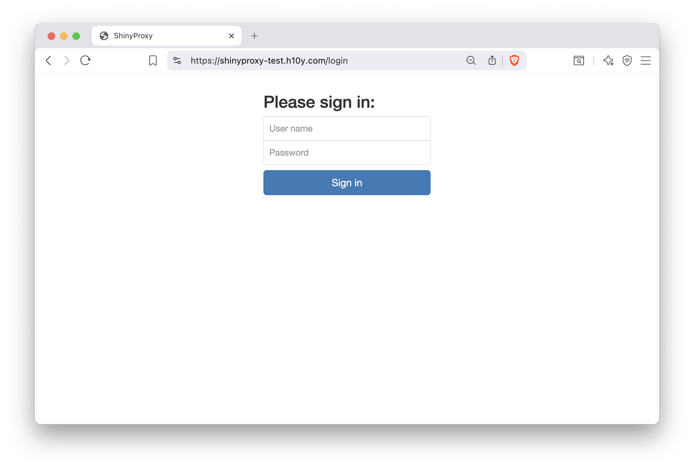
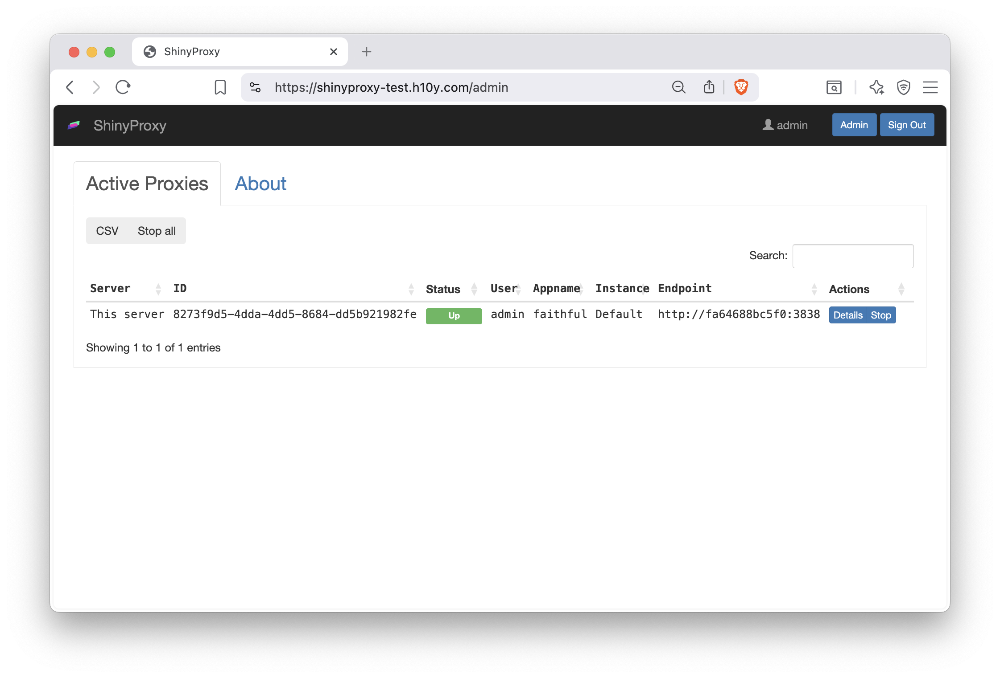
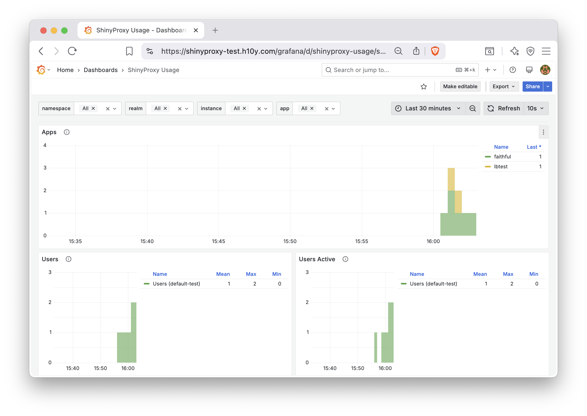

<!--
  - Containerized setups
    - ShinyProxy
      - Setup
-->
# ShinyProxy {#shinyproxy-deployment}

::: {.noteblock data-latex=""}
This chapter covers ShinyProxy which is a tool
to run containerized applications on your own self-hosted
server. It can be more cost effective than hosting platforms,
but requires more technical know-how.

ShinyProxy is an enterprise-level deployment platform for
containers and requires knowledge about containers (see Chapter \@ref(part4-containers)) 
and familiarity with the command line (see Chapter \@ref(part1-command-line)).
:::

ShinyProxy is an open-source platform designed to host Shiny 
applications designed to support enterprise deployments
by enabling authentication and app-level authorization.
It allows for concurrent usage of Shiny applications with 
each user session isolated from other users via containerization.
It also allows for Shiny apps with different dependency requirements 
to run at the same time.

ShinyProxy allows for the following features because of containerization:

-   Fully isolated user sessions
-   Different R and Python versions, package versions, and
    dependencies per application
-   Updates to one app not interfering with other apps
-   Monitoring and resource management (RAM and CPU usage)
-   A dashboard interface for users to login and select different applications to load

ShinyProxy can be deployed directly on a server using a Jar (Java executable) file, 
making it straightforward to run and test ShinyProxy. We do not discuss the
detailed setup required for the direct deployment, but we encourage interested
readers to try the ShinProxy 1-click app from the DigitalOcean Marketplace
<https://marketplace.digitalocean.com/apps/shinyproxy>, and inspecting the 
setup scripts at <https://github.com/analythium/shinyproxy-1-click>.
The 1-click setup includes Nginx based reverse proxy and automated HTTPS setup,
but for other production aspects of the deployment, i.e. monitoring, users
need to do additional setup on their own.

The ShinyProxy Operator is a deployment option that completely automates the 
deployment of ShinyProxy on both pure Docker hosts and Kubernetes.
It also includes automatic deployment of Redis to keep track of app and users,
automatic HTTPS setup using Caddy Server and Let's Encrypt,
and the full setup of the monitoring stack including Prometheus, Loki and Grafana.

Using Java does not allow for seamless updates of ShinyProxy,
while Kubernetes and Docker do allow that via the ShinyProxy Operator. 
However, at the time of writing, Kubernetes does not offer the automatic deployment
of monitoring, and TLS certificates. 

This chapter will focus on deploying ShinyProxy with Docker in a single-server context,
including how to deploy monitoring and setting up TLS certificates.

## Setting up ShinyProxy Using Docker

You will need the virtual machine with Docker installed on Ubuntu Linux
as explained in Chapter \@ref(docker-compose-vm).
If you have not installed Docker, you can do so by running the
Docker install script as follows: `curl -fsSL https://get.docker.com | sh`.
Make sure that you login and logout to enable Docker.
You'll need to also allow incoming traffic on ports 22 (ssh), 80 (http), and 443 (https).

We recommend at least 1 CPU core and 2GB memory
to set up the demo ShinyProxy deployment with ShinyProxy operator. 
You can provision a Linux-based virtual private server with your favorite cloud provider. 
Ensure that you have root user access, which is typically available as 
`root` or commands can be run as root by prepending the `sudo` command.

You will also need a domain name if you wish to setup TLS certificates and 
access your app from a custom URL and not IP address.

To check if you have installed Docker, type the following
command in your terminal: `docker ps`. It should execute
with no error and include a message beginning with
`CONTAINER ID`.

### Docker Compose for ShinyProxy

Next, you will have to make a ShinyProxy user for your host machine
with the following command: `sudo useradd -m shinyproxy`.

Finally, you will need to create the ShinyProxy directories
and create a Docker Compose file that will be used to run ShinyProxy.
To simplify this step, we have created a bash script as follows:

```bash
#!/bin/bash

# Get the ID of the shinyproxy user
SHINYPROXY_USER_ID=$(sudo id -u shinyproxy)

# Get the ID of the docker group
DOCKER_GROUP_ID=$(sudo getent group docker | cut -d: -f3)

# Create a directory for the configuration files of ShinyProxy
sudo mkdir -p /opt/shinyproxy-docker-operator/data
sudo -u shinyproxy mkdir -p /home/shinyproxy/shinyproxy/input
sudo chown -R shinyproxy:shinyproxy /opt/shinyproxy-docker-operator

# Create the compose.yml file with the appropriate IDs
cat <<EOL | sudo -u shinyproxy tee /home/shinyproxy/shinyproxy/compose.yml > /dev/null
services:
  shinyproxy-operator:
    image: openanalytics/shinyproxy-operator:2.3.1
    environment:
      SPO_ORCHESTRATOR: docker
      SPO_DOCKER_GID: $DOCKER_GROUP_ID # Docker group ID
      SPO_CADDY_ENABLE_TLS: "true"
    volumes:
      - ./input:/opt/shinyproxy-docker-operator/input
      - /var/run/docker.sock:/var/run/docker.sock:ro
      - /opt/shinyproxy-docker-operator/data:/opt/shinyproxy-docker-operator/data
    group_add:
      - $DOCKER_GROUP_ID # Docker group ID
    networks:
      - sp-shared-network
    restart: always
    labels:
      app: shinyproxy-operator
    user: "$SHINYPROXY_USER_ID" # ShinyProxy user ID
networks:
  sp-shared-network:
    name: sp-shared-network
EOL

echo "ShinyProxy operation configuration has been set up successfully."
```

The script above gets the necessary user ID for ShinyProxy and group ID
for Docker, as well as create the ShinyProxy directories and generate
the Docker Compose file for starting up ShinyProxy. 

To run the script, copy the text into a new file using an editor as follows:

```sh
nano shinyproxy_setup.sh
```
Once the editor is open, paste the copied script into the editor. 
You can usually do this by right-clicking in the terminal or 
using the keyboard shortcut Ctrl + Shift + V.

Finally, save the file, in the nano editor, you would:

- Press Ctrl + O (the letter O, not zero) to write out the file.
- Press Enter to confirm the filename.
- Press Ctrl + X to exit the nano editor.

Before running the script, you need to ensure it has executable permissions. 
Use the following command:

```bash
chmod +x shinyproxy_setup.sh
```

Now you can execute the script by typing:

```bash
./shinyproxy_setup.sh
```

Feel free to modify the Docker Compose file located in `/home/shinyproxy/shinyproxy/compose.yml`
to suit your needs using your preferred editor. If you are unsure how to execute
this script, you can also copy the each line of the script and execute 
them in your terminal.

Finally, you can start the ShinyProxy operator with 
`sudo docker compose -f  /home/shinyproxy/shinyproxy/compose.yml up -d`.

```bash
[+] up 14/14
 ✔ Image openanalytics/shinyproxy-operator:2.2.1 Pulled       7.0s
 ✔ Network sp-shared-network                     Created      0.1s
 ✔ Container shinyproxy-shinyproxy-operator-1    Created      0.4s
```

Congratulations, you have successfully set up the ShinyProxy operator.
Next, you will need to set up ShinyProxy by creating a configuration file.

### ShinyProxy Configuration {#shinyproxy-config}

To setup ShinyProxy with the ShinyProxy operator, you will have
to create a configuration file in the following folder:
`/home/shinyproxy/shinyproxy/input/`. The input folder 
is polled every minute for updates, and ShinyProxy is 
automatically restarted when there are changes.

Below is an example bash script to generate a configuration
file:

```bash
#!/bin/bash

# Set configuration variables here
# Change this to your desired realm ID
REALM_ID="${REALM_ID:-test}"
# Change this to your domain name for production
FQDN="${FQDN:-shinyproxy-test.h10y.com}"
# Specify the ShinyProxy Docker image version
DOCKER_IMAGE="${DOCKER_IMAGE:-openanalytics/shinyproxy:3.2.0}"

# Define the configuration file path
CONFIG_FILE="/home/shinyproxy/shinyproxy/input/${REALM_ID}.shinyproxy.yaml"

# Create the input directory if it doesn't exist
mkdir -p "$(dirname "$CONFIG_FILE")"

# Write the configuration to the file
cat <<EOL > "$CONFIG_FILE"
spring:
  session:
    store-type: redis
image: $DOCKER_IMAGE
fqdn: $FQDN
proxy:
  title: ShinyProxy
  logo-url: https://h10y.com/img/logo.png
  landing-page: /
  favicon-path: favicon.ico
  heartbeat-rate: 10000
  heartbeat-timeout: 60000
  docker:
    internal-networking: true
    image-pull-policy: Always
  store-mode: Redis
  stop-proxies-on-shutdown: false
  realm-id: $REALM_ID
  authentication: simple
  admin-groups: admins
  admin-users: admin
  # Example: 'simple' authentication configuration
  users:
  - name: admin
    password: password
    groups: admins
  - name: user
    password: password
    groups: users
  specs:
  - id: faithful
    display-name: Old Faithful App
    description: A simple reactive histogram
    container-cmd: ["R", "-e", "shiny::runApp(host='0.0.0.0', port=3838)"]
    container-image: ghcr.io/h10y/faithful/r-shiny:main
    logo-url: https://h10y.com/img/0.png
    access-groups: [admins, users]
  - id: lbtest
    display-name: Load Balancing
    description: App to test session affinity
    container-cmd: ["R", "-e", "shiny::runApp(host='0.0.0.0', port=3838)"]
    container-image: ghcr.io/h10y/lbtest/r-shiny:main
    logo-url: https://h10y.com/img/1.png
    access-groups: [admins]
server:
  forward-headers-strategy: native
EOL

# Output a message indicating the configuration file has been created
echo "Configuration file created at $CONFIG_FILE"
```

You can run it using similar steps for generating
the ShinyProxy operator Docker Compose file,
e.g. copy the contents into a file called `shinyproxy_config.sh`,
set it as executable and run as:

```bash
chmod +x shinyproxy_config.sh
./shinyproxy_config.sh
```

There are numerous variables to change in the script.
The script defines the path for the configuration file as `<REALM_ID>.shinyproxy.yaml`.
Several variables are also set:

- `REALM_ID`: A string identifier for the namespace of the ShinyProxy deployment (set to "test").
- `FQDN`: The fully qualified domain name for accessing ShinyProxy on the server. 
- `DOCKER_IMAGE`: Specifies the ShinyProxy Docker image version to use.

By setting different `REALM_ID` and `FQDN`, you can have multiple deployments
of ShinyProxy on the same server. The way the script is set up, you can pass the
values for these variables and use the script to write new configurations, e.g.:

```bash
REALM_ID=production FQDN=example.com ./shinyproxy_config.sh
```

This will create the `production.shinyproxy.yaml` with `fdqn: example.com`
as part of the config.

As well, you can modify the ShinyProxy configuration under `proxy:` including
setting authentication and defining what apps you would like to run under
`specs:`. We delve into more of these options in the next section.

ShinyProxy allows flexible configuration including how ShinyProxy will manage
and display apps in general, how apps are authenticated, and how
apps are initialized in containers.

In this section, we refer to the ShinyProxy configuration defined under
the `proxy` block as an example for how ShinyProxy can be configured.

### General {#sp-general}

The top part of the `proxy` block has some general properties that will
affect the behavior of ShinyProxy in general and will apply to all the
apps you deploy.

```yaml
    proxy:
      title: ShinyProxy
      logo-url: https://h10y.com/img/logo.png
      landing-page: /
      favicon-path: favicon.ico
      heartbeat-rate: 10000
      heartbeat-timeout: 60000
      docker:
        internal-networking: true
        image-pull-policy: Always
      store-mode: Redis
      stop-proxies-on-shutdown: false
      realm-id: $REALM_ID
    ...
```

The general configuration for ShinyProxy includes:

-   `title`: the title is the text that is displayed in the top
    navigation bar of ShinyProxy beside the logo
-   `logo-url`: the URL of the logo beside the title in the top
    navigation bar of ShinyProxy (it can also be a file, `file://...`)
-   `landing-page`: the URL where the user is sent after logging in, the
    default `/` redirects the user to the list of applications
-   `favicon-path`: path to the favicon file to be used by ShinyProxy,
    the tiny PNG image that is displayed in the left corner of the
    browser tabs for easy recognition
-   `heartbeat-rate`: this is the time in milliseconds the user's
    browser is sending a signal, called the heartbeat, to check in with
    the application, the default value is 10 seconds (10,000 ms)
-   `heartbeat-timeout`: this is the time in milliseconds the server
    waits after not receiving a heartbeat, when this time is passed the
    relevant proxy (instance of the app) will be released (the Docker
    container stopped) -- 60 seconds (60,000 ms)

Other general configuration includes your backend, which is defined as
`docker` and its option `internal-networking` is configured to true
because ShinyProxy is run as a container on the same Docker host.
Also defined under `docker` is the image pull policy which can be set
to `Never`, `IfNotPresent` and `Always`. `Never` means that you must
already have your container image available in Docker. While 
`IfNotPresent` will pull your image if it does not already exist in
Docker. `Always` will always try to pull a container image, meaning
that you will get the latest version of your Shiny application every
time you push an image of your Shiny application to the container
image registry. If you are not familiar with container images, please
refer back to how container images are built in Chapter \@ref(part2-existing-images).

You can maintain Shiny application persistence by setting
`store-mode` with a backend like Redis and `stop-proxies-on-shutdown`
to false. All the Shiny application sessions will be saved in Redis,
so that when ShinyProxy is restarted, users can be redirected
to their previous ShinyProxy containers.

Finally, `realm-id` is a namespace identifier for ShinyProxy identifier
to know which ShinyProxy instance is being managed by ShinyProxy operator.
The `realm-id` is useful when you are managing multiple instances
of ShinyProxy with the ShinyProxy operator and wanting to look at the
logs of each ShinyProxy instance.

### Authentication {#sp-authentication}

ShinyProxy supports many different types of authentication, starting
from `none` (no authentication) and `simple` (user names and passwords
defined in the config file) to various types of authentication servers
and 3rd party providers (e.g., LDAP, OIDC, SAML). We explain how
simple authentication works in this section, and more authentication
providers can be configured by referring to the 
[documentation](https://www.shinyproxy.io/documentation/configuration/#authentication).

User authorization happens on a [per-app basis using **group-based
authorization**](https://shinyproxy.io/documentation/configuration/#apps),
see the `access-groups` field for the apps in the configuration as seen
in Section \@ref(shinyproxy-config-applications).
Multiple users can get access to the admin interface by specifying the
groups they belong to as part of the `admin-groups` field in the configuration.
Group based authentication is available for all authentication providers.

```yaml
    proxy:
    ...
      authentication: simple
      admin-groups: admins
      admin-users: admin
      # Example: 'simple' authentication configuration
      users:
      - name: admin
        password: password
        groups: admins
      - name: user
        password: password
        groups: users
    ...
```

-   `authentication`: authentication method
    (one of `ldap`, `kerberos`, `keycloak`, `openid`, `saml`, `social`, `webservice`
    `simple` or `none`); see the relevant section below for
    configuration details regarding each of these authentication
    methods;
-   `admin-groups`: one (e.g. `admin`) or more groups (e.g.
    `[admins1, admins2]`) that have access to the administrative
    interface of ShinyProxy to view active sessions, defined according
    to the authentication backend; `admin-users` is currently required for
    the admin user to be able to access the Grafana monitoring dashboards;
-   `users`: list here the users, each one has 3 different properties,
    `name` and `password` to log in with, and `groups` that is used to
    define [access to the
    apps](https://www.shinyproxy.io/documentation/configuration/?ref=hosting.analythium.io#simple-authentication)
    via the `access-groups` property -- the `access-groups` field allows
    authorizing access per application

It should also be noted that two environment variables are 
provided to the Shiny applications in a container initialized by
ShinyProxy after successful authentication by a user, the username
(`SHINYPROXY_USERNAME`) and groups that the user is a member of
(`SHINYPROXY_USERGROUPS`, comma-separated value). You can 
use these values to personalize the application.

The ShinProxy documentation provides detailed examples for setting up other
types of authentication, including OpenID Connect, SAML, LDAP,
header based custom authentication, etc. You can also turn off authentication by
setting `authentication: "none"` in the YAML file. This will result in
all apps being public. With authentication turned off, make sure to set the
number of seats that can be run on a single container to higher than 1
via the `seats-per-container` setting to avoid the server running out of memory
due to provisioning a high number of containers for public users.

### Applications {#shinyproxy-config-applications}

All Shiny apps served by ShinyProxy have their configuration listed in
the `specs` block in the configuration file.

```yaml
    proxy:
    ...
      specs:
      - id: faithful
        display-name: Old Faithful App
        description: A simple reactive histogram
        container-cmd: ["R", "-e", "shiny::runApp(host='0.0.0.0', port=3838)"]
        container-image: ghcr.io/h10y/faithful/r-shiny:main
        logo-url: https://h10y.com/img/0.png
        access-groups: [admins, users]
      - id: lbtest
        display-name: Load Balancing
        description: App to test session affinity
        container-cmd: ["R", "-e", "shiny::runApp(host='0.0.0.0', port=3838)"]
        container-image: ghcr.io/h10y/lbtest/r-shiny:main
        logo-url: https://h10y.com/img/1.png
        access-groups: [admins]
    ...
```

-   `id`: the identifier of the application, this is also the URL path
    the app is going to be available through the [ShinyProxy API
    endpoints](https://www.shinyproxy.io/documentation/configuration/#endpoint-urls)
    either as `/app/<id>` (standard ShinyProxy interface with a toolbar,
    servers the Shiny app in an iframe) or `/app_direct/<id>` (without
    the iframe and navigation bar)
-   `display-name`: the name that will be displayed for the app on the
    ShinyProxy landing page as well as in the browser tab once the
    application is opened
-   `container-cmd`: the command that is run when the user launches the
    Docker container, the `CMD` line from the end of the Dockerfile
-   `container-image`: the Docker image tag to be started for every new
    user of this app
-   `logo-url`: the URL or a local file (`file://...`) of an image used
    as the logo for an application, when none of the applications in the
    `application.yml` specifies a `logo-url` field, the landing page of 
    ShinyProxy will be a bullet list
-   `access-groups`: one or more groups (`[group1, group2]`) that the
    user needs to belong to in order to gain access to the app, apps for
    which `access-groups` are not specified will be handled as “public”
    applications in the sense that all authenticated users will be able
    to access these applications.

This is the section you are most likely to edit often if you are going
to be deploying one or more Shiny applications. For each new application,
you would be adding an entry under specs.

## Deploying TLS with ShinyProxy Operator

Using the Docker ShinyProxy operator, TLS certificates for HTTPS can be automatically
issued and installed by modifying the ShinyProxy operator configuration.
This is because ShinyProxy operator manages all routing
requests made to your host machine using the Caddy
reverse proxy server.

This section covers the most common use case of
getting a certificate issued with Caddy, but it is also
possible to use custom certificates which is explained
further in the 
[ShinyProxy operator documentation](https://www.shinyproxy.io/documentation/shinyproxy-operator/docker/#using-custom-certificates).

Some prerequisites for deploying include having a domain
and configuring it to point to your server. More information
on this can be found in Section \@ref(part3-vm-setup-custom-domains).

You can enable TLS by setting the Caddy TLS value to true
`SPO_CADDY_ENABLE_TLS: "true"` under environment variable 
section to the `compose.yml` you created previously in
`/home/shinyproxy/shinyproxy/compose.yml`. 

The default setting of the compose file is to use HTTPS with Caddy.
Without making any changes, you should be able to access your ShinyProxy
instance at your domain name you specified under `FQDN` in your
ShinyProxy configuration. Otherwise, you can always debug
the Caddy container with the command:
`sudo docker logs -f sp-caddy` to see what might have went
wrong when issuing or installing a certificate.

If you set the value to `"false"` the site will be accessible over HTTP only.
After you made changes to the `SPO_CADDY_ENABLE_TLS`
run these commands in your terminal so the change takes effect:

```bash
sudo docker compose -f /home/shinyproxy/shinyproxy/compose.yml down
sudo docker stop sp-caddy
sudo docker rm sp-caddy
sudo docker compose -f /home/shinyproxy/shinyproxy/compose.yml up -d
```
The commands stop your current ShinyProxy operator container.
Removes the Caddy reverse proxy container started by ShinyProxy
and restarts ShinyProxy which re-creates the Caddy reverse proxy container.

## User Interface

If you followed the ShinyProxy setup instructions so far, you should see the
login page as in Figure \@ref(fig:sp-01-login).
The user interface is the same irrespective of the ShinyProxy backend and
deployment approach, i.e. with or without Docker.

```{r sp-01-login, eval=TRUE, echo=FALSE, out.width="100%", fig.pos = "bt", fig.cap="ShinyProxy login page."}

```

With the simple authentication setup, we defined two users: `admin` and `user`.
The admin user has access to both the `faithful` and the `lbtest` apps, while 
the other user can only see the `faithful` app. The admin user can click the
Admin button in the top navigation bar to see the running proxies (i.e. instances
of various apps, Fig. \@ref(fig:sp-04-admin-view)).

```{r sp-04-admin-view, eval=TRUE, echo=FALSE, out.width="100%", fig.pos = "bt", fig.cap="ShinyProxy admin interface."}

```

## Deploying Monitoring with ShinyProxy Operator {#spo-monitoring}

Monitoring and observability of ShinyProxy and the Shiny applications 
is enabled through installing the following tool stack:

- **Grafana**: User interface for visualizing and analyzing data.
- **Grafana Loki**: Log aggregation system for collecting and querying logs.
- **Loki Docker Driver**: Sends Docker container logs to Grafana Loki.
- **Prometheus**: Monitoring toolkit for collecting metrics of ShinyProxy and the deployed Shiny apps.
- **cAdvisor**: Monitors container performance and resource usage in real-time.

The tool stack is automatically installed by setting
an environment variable with the exception of the Loki Docker Driver
which requires installing a Docker plugin.

To install the Loki Docker plugin, use the script bundled in the ShinyProxy operator image:

```bash
sudo docker run --group-add $(getent group docker | cut -d: -f3) \
  -v /var/run/docker.sock:/var/run/docker.sock:ro \
  openanalytics/shinyproxy-operator:2.2.1 /install_plugins.sh
```
This command starts a new container with `docker` group permissions, mounts the Docker socket,
and executes the `install_plugins.sh` script within the container.

Now that the Loki Docker plugin is installed, you can modify the `compose.yml`
file located in `/home/shinyproxy/shinyproxy/compose.yml` if you were following
along earlier in the book. Add `SPO_ENABLE_MONITORING: "true"` to the environment 
variables section. You will also need to add the logging configuration under 
the `shinyproxy-operator` service:

```yaml
services:
  shinyproxy-operator:
    # ...
    environment:
      ...
      SPO_ENABLE_MONITORING: "true"
    # ...
    logging:
      driver: loki
      options:
        loki-url: "http://localhost:3100/loki/api/v1/push"
        mode: non-blocking
        loki-external-labels: app=shinyproxy-operator,namespace=default
```

Finally, you will need to restart the ShinyProxy operator container, for the 
changes to take effect, to do so run the following commands:

```bash
sudo docker compose -f /home/shinyproxy/shinyproxy/compose.yml down
sudo docker compose -f /home/shinyproxy/shinyproxy/compose.yml up -d
```

The commands stop the ShinyProxy operator service and starts it up again in the background.
Ensure that the users you wish to have access to monitoring is added to the list of admin users
in the configuration (see Section \@ref(sp-authentication)). After the monitoring tool stack has started,
you will be able to access the monitoring dashboard via `http://<location to ShinyProxy (FQDN)>/grafana`.
Through the Grafana dashboard, you can access ShinyProxy and app logs,
app usage metrics, and resource usage stats, etc. (Fig. \@ref(fig:sp-11-grafana-usage)).
You can also share or export monitoring results in various formats using the
Grafana user interface.

```{r sp-11-grafana-usage, eval=TRUE, echo=FALSE, out.width="100%", fig.pos = "bt", fig.cap="ShinyProxy app usage metrics in the Grafana dashboard."}

```


## Benchmarking ShinyProxy Applications

There are two ways to benchmark applications running in ShinyProxy
to estimate the amount of CPU and Memory needed. First, is using
the `docker stats` command, and the other option is to
enable ShinyProxy monitoring and view the Grafana dashboard.

### Docker Stats {#shinyproxy-docker-stats}

Docker provides a built-in stats system for understanding
the resources containers are using in real time.
It can be used for basic benchmarking to understand
the amount of CPU and Memory needed for a host machine.

To get Docker stats, type `sudo docker stats` into the terminal.
You will be presented with CPU and Memory Usage like the following table:

| **Container ID** | **Name**   | **CPU %** | **Memory Usage / Limit** | **Memory %** |
|-------------------|------------|-----------|--------------------------|--------------|
| e2f0      | Shiny App   | 2.00%     | 55.8 MiB / 1 GiB         | 5.00%        |
| b7a9     | Shiny App2 | 0.80%     | 30.7 MiB / 1 GiB       | 5.99%        |
| f1d8     | Shiny App3 | 12.35%    | 120.9 MiB / 1 GiB        | 6.23%        |

Using the table, you can extrapolate how much CPU and Memory you would need.
For example, the ShinyApp container with Container ID `e2f0` uses 2.00% of CPU
and 5.00% of memory. Therefore, you would be able to support approximately 20 app
containers of ShinyApp as the limit is (100%/min(5% memory, 2% CPU)) = 20.
You can then take this number and estimate how much more memory and CPU
you'd need to support all expected concurrent users.

Docker Stats can provide a simple way to benchmark applications without the installation
of additional software. For more detailed information about your applications over time,
you can enable ShinyProxy monitoring and use the Grafana dashboard.

### Grafana Dashboard

The Grafana dashboard is a platform for observing the
logs of ShinyProxy and ShinyProxy operator. It is
enabled when you set up ShinyProxy monitoring
as described in Section \@ref(spo-monitoring).

To access the grafana dashboard, you would go to `http://<location to ShinyProxy (FQDN)>/grafana`.
By clicking `Dashboards` in the sidebar you will be presented with a list of dashboards which we categorize in the following
subsections.

**Usage Metrics** -- These dashboards cover mainly how users use ShinyProxy including logins and time spent in an app.

- _ShinyProxy Aggregated Usage_ captures how many times apps are used.
- _ShinyProxy Usage_ shows information about ShinyProxy including Startup Time, 
  Container Schedule Time, Image Pull Time, Container Initialization Time, 
  Application Startup Time, Usage Time, Apps, Users, Users Active, Auth failures, 
  App start failures. App crashes.

**Application Logs** -- This dashboard displays the output of a Shiny app as if you were running it from the terminal on your machine.

- _ShinyProxy App Logs_ captures the output of the Shiny app running.

**Resource Metrics** -- The resource metrics are good for benchmarking how much 
CPU and memory and application needs and whether or not
you need a bigger host machine. These can provide more details than the 
approximation described in Section \@ref(shinyproxy-docker-stats).
The usage of CPU and memory over time by Shiny Apps can tell you how much 
CPU and memory you need for your ShinyProxy instance.

- _ShinyProxy App Resources_ shows the resources (CPU and memory) consumed by apps.

**System Logs** -- These dashboards show the the terminal output of ShinyProxy 
and ShinyProxy operator.

- _ShinyProxy Logs_ shows the logs of ShinyProxy.
- _ShinyProxy Operator Logs_ shows the logs of ShinyProxy Operator which manages ShinyProxy.

**Pre-Initialized and Shared Container Metrics** -- These dashboards cover 
monitoring the more advanced delegate app features (container pre-initialization 
and sharing) of ShinyProxy. The delegate app features of ShinyProxy delegate 
users to pre-initialized containers, and can even delegate multiple multiple users to 
a container with multiple seats. The log and resource dashboards are similar to 
the non-delegate dashboards.

- _ShinyProxy Seats_ shows the performance of apps using pre-initialization or 
  container-sharing. This includes seat wait time and number of seats.
- _ShinyProxy Delegate App Logs_ shows the logs of containers that are shared 
  for multiple seats or are pre-initialized.
- _ShinyProxy Delegate App Resources_ shows the resources (CPU and memory) 
  consumed by delegate apps. These are the containers used by apps using 
  pre-initialization or container-sharing.

## Adding and Removing Shiny Applications {#shinyproxy-adding-apps}

Adding Shiny applications involves editing the `application.yaml`
that configures your ShinyProxy and adding a new entry under the `specs`
indentation such as the following:

```yaml
      - id: bananas
        display-name: Bananas Shiny App
        description: Classifying ripening bananas based on their color.
        container-cmd: ["R", "-e", "shiny::runApp(host='0.0.0.0', port=3838)"]
        container-image: ghcr.io/h10y/bananas/r-shiny:main
        logo-url: https://h10y.com/img/2.png
        access-groups: [admins]
```

More configuration options can be found in Section \@ref(shinyproxy-config-applications).
Once the entry is added, ShinyProxy operator will automatically reload
ShinyProxy with your new app configuration.

There are two ways of updating apps already deployed with ShinyProxy.
The first option involves taking the `container-image` value in the
configuration, rebuilding another container image with the same value
as the prior `container-image` and pushing the image to the container
registry. Because the `application.yaml` file remains the same, 
there is no need to connect to the server and make changes.
As long as the `image-pull-policy` is set to `Always`, ShinyProxy will
look for any updates to the container image.
Note that if you are using private images, you will have to provide
the registry details in the app specs:

```yaml
      - id: bananas
        container-image: ghcr.io/h10y/bananas/r-shiny:main
        docker-registry-username: your_docker_username
        docker-registry-password: your_docker_token
        docker-registry-domain: ghcr.io
```

The second option, requires you to connect to the server and modify the 
`application.yaml` file, i.e. updating the container image to the new
version: `ghcr.io/h10y/bananas/r-shiny:v2`.
Changes will be rolled out automatically by ShinyProxy Operator.

We advise to use the second option and change version tags in production
environments. This way it is easier to easily roll back any unwanted
changes by simply changing the container image tag back to the previous
value. As opposed to this, during development, it might be more desirable
to always pull the new version of the image that is based on the development
branch of the Git repository.

## Other Considerations

While we have covered the basics of deploying ShinyProxy using the ShinyProxy 
Operator to run your Shiny applications, there are several other options to consider.
Despite its name, ShinyProxy is not limited to Shiny apps. It can run any container image, 
allowing you to host other web applications that are containerized as well.

The login and dashboard interface of ShinyProxy is highly configurable. 
You can edit the HTML template files to customize the user interface, aligning it with your own branding. 
For more details, refer to the ShinyProxy custom HTML template documentation at 
<https://github.com/openanalytics/shinyproxy-config-examples/blob/master/04-custom-html-template/README.md>.

Lastly, while we did not cover dynamically configuring the applications of ShinyProxy, 
the _Spring Expression Language (SpEL)_ enables you to determine the values of variables at runtime. 
Additional information is available at <https://shinyproxy.io/documentation/spel/>.

ShinyProxy can also be configured for larger deployments on clusters of
computers (Docker Swarm and Kubernetes backends). This can support large
and number of users and can scale with demand in high availability settings.

By default, ShinyProxy provisions a new container for every active user/app 
combinations on the server. This is useful when the goal is secure isolation
of the instances so that no data can be leaked across user sessions.
This works well when the number of concurrent users is small and a small-to-medium
sized server, or when running ShinyProxy in a scalable cluster environment.
You can use the monitoring metrics (Section \@ref(spo-monitoring))
to determine the optimal specifications for your use case.

This most-secure default configuration can be relaxed by allowing multiple users
sharing the same container instance by setting the `seats-per-container` value
to be higher than 1 in the app specification. 
This setting controls the number of seats that can be run on a single container. 
Note that when container sharing is turned on,
ShinyProxy doesn't pass the username and groups using environment variables, 
but these are passed to the app using HTTP headers.

It is also possible to specify the number of seats ShinyProxy should keep 
available for new users via setting the `minimum-seats-available` in the
app specification to a value higher than 0. This feature is useful when 
starting the app takes longer than desired (often referred to as cold-start).
With container pre-initialization, ShinyProxy will start new containers
waiting for new users, therefore, the user has almost no waiting time 
for the container to start up.

## Summary

ShinyProxy is a popular, free, and open-source option to host any type
of containerized web application, including but not limited to Shiny
apps, Python/Dash, Streamlit, RStudio IDE, Jupyter notebooks, R markdown
documents, etc.

ShinyProxy operator is an application designed to manage instances of ShinyProxy
via connecting to Docker or Kubernetes.
The Docker container-based deployment of ShinyProxy with ShinyProxy operator 
comes with all the benefits,
such as isolation, dev-prod parity, resource management, observability, and
scalability.

Enterprise features such as monitoring and single sign on authentication come built-in with extensive documentation. 
The manual labour spent on integrating the moving parts of ShinyProxy pays dividends by
saving a lot on licensing fees for more commercial solutions. 
It is a real contender in the enterprise
sphere for deploying Shiny applications.
